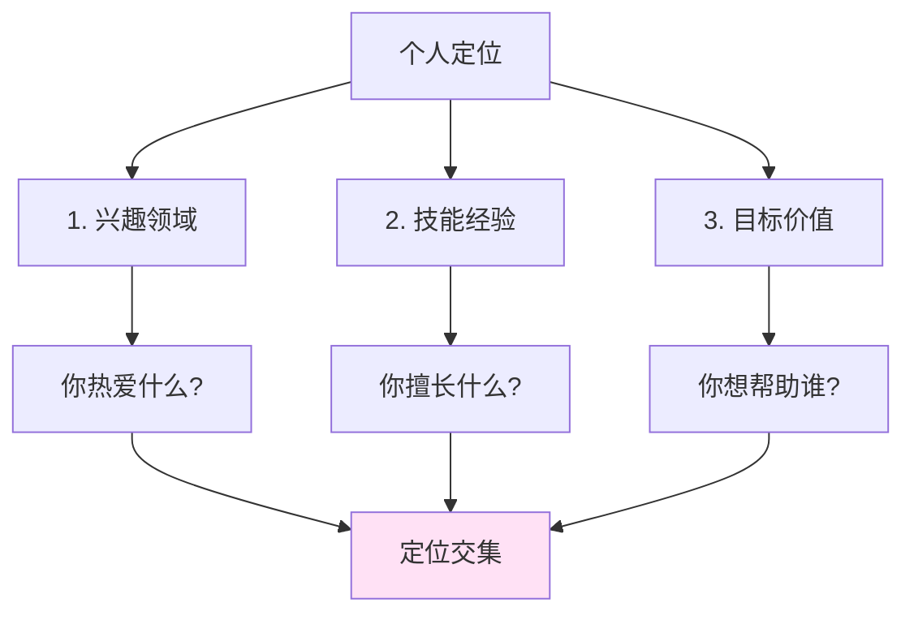

> [!quote] 核心观点
> **最赚钱的细分市场就是你自己。**
> 
> 不要试图迎合市场，而要创造属于你的市场。

## 为什么定位是第一步

很多人陷入困境：
- "我应该做什么？"
- "我的细分市场是什么？"
- "我没有独特的优势怎么办？"

这些问题的根源是：**试图模仿别人的成功路径。**

> [!important] 真相
> 你不需要选择一个"利润最高的细分市场"。
> 你需要的是：**围绕你自己建立领域**。

## 🎯 个人定位的核心框架

### 传统定位 vs 个人定位

| 传统定位 | 个人定位 |
|----------|----------|
| 选择一个细分市场 | **你就是细分市场** |
| 研究目标客户 | **你就是目标客户** |
| 差异化竞争 | **没有竞争，因为没人能复制你** |
| 专注一个领域 | **整合多元兴趣** |

> [!tip] 关键洞察
> 在传统商业中，你需要选择细分市场。
> 在创作者经济中，**你就是你的品牌，你就是你的细分市场**。

## 💡 找到你的定位：3个维度

### 维度1: 兴趣领域 (Passion)
> **你愿意无偿花时间的事情**

问自己：
- 我在业余时间研究什么？
- 我会主动分享什么话题？
- 什么让我感到兴奋和好奇？

### 维度2: 技能经验 (Skill)
> **你已经解决过的问题**

问自己：
- 我克服过什么困难？
- 别人经常向我请教什么？
- 我比普通人做得更好的是什么？

### 维度3: 目标价值 (Purpose)
> **你想要的生活和影响**

问自己：
- 我想过怎样的生活？
- 我想帮助什么样的人？
- 5年后我希望成为谁？

## 🎯 实战练习：定位画布

> [!success] 花20分钟完成这个练习
> 
> ### 步骤1: 列出原材料
> 
> **兴趣清单** (至少10个)
> - 例如：写作、编程、设计、心理学、哲学、健身...
> 
> **技能清单** (至少10个)
> - 例如：解决过的问题、掌握的工具、克服的困难...
> 
> **目标清单** (至少5个)
> - 例如：想要的生活方式、想帮助的人群、想创造的影响...
> 
> ### 步骤2: 找到交集
> 
> **我的独特组合是：**
> - 兴趣A + 兴趣B + 技能C = 独特定位
> 
> **例如：**
> - 编程 + 知识管理 + 帮助创作者 = "为创作者打造知识工具"
> - 写作 + 心理学 + 个人成长 = "用心理学指导个人成长"
> 
> ### 步骤3: 用一句话表达
> 
> **我的定位是：**
> 
> > 我是 ____________（你的身份）
> > 帮助 ____________（目标人群）
> > 通过 ____________（你的方法）
> > 实现 ____________（他们的目标）

## 🌟 案例分析：我的定位演变

### 第一阶段：模糊的"程序员"
❌ **问题**：
- 太宽泛，没有特色
- 竞争激烈，难以脱颖而出
- 不知道为谁服务

### 第二阶段："帮助创作者的开发者"
✅ **改进**：
- 缩小了范围
- 有了目标人群
- 但还不够独特

### 第三阶段："为知识工作者打造工具的创造者"
✅✅ **最终定位**：
> 我是知识工具创造者，
> 帮助使用 Obsidian 的创作者，
> 通过 MDFriday 和插件，
> 轻松将笔记转化为精美的知识网站。

**为什么这个定位有效？**
- ✅ 整合了我的兴趣（编程 + 知识管理 + 创作）
- ✅ 基于我自己的需求（我就是目标用户）
- ✅ 有明确的价值主张
- ✅ 没有直接竞争者（独特组合）

## 💡 定位的3个层次

### 层次1: 技能定位（初级）
> "我是一个 X"

例如：
- "我是程序员"
- "我是设计师"
- "我是作家"

❌ **问题**：太宽泛，容易被替代

---

### 层次2: 问题定位（中级）
> "我帮助 X 解决 Y"

例如：
- "我帮助创业者搭建网站"
- "我帮助作者提升写作技能"
- "我帮助焦虑者获得平静"

✅ **更好**：有了目标人群和问题

---

### 层次3: 转变定位（高级）
> "我帮助 X 从 A 转变到 B"

例如：
- "我帮助有想法但不懂技术的创作者，将知识转化为精美的网站"
- "我帮助困在朝九晚五的职场人，过渡到自由的一人公司"
- "我帮助有内容但没流量的创作者，建立持续增长的内容系统"

✅✅ **最佳**：清晰的前后对比，强烈的吸引力

## 🚫 定位的常见误区

### 误区1: 必须选择一个狭窄的细分市场
> [!warning] 真相
> 对于聪明人来说，"缩小市场份额"是糟糕的建议。
> 
> 你的兴趣和技能会随时间发展。**品牌应该是一个实现层级**，而不是一个固定的标签。

**建议**：
- 初期：可以从一个具体问题开始（验证市场）
- 中期：逐步扩展到相关领域
- 高级：建立个人垄断（多元兴趣的独特组合）

---

### 误区2: 我没有独特的东西
> [!warning] 真相
> 你的独特不是来自单一技能，而是来自**技能和经历的组合**。

**例如**：
- 编程 + 心理学 = 帮助开发者心理健康
- 写作 + 金融 = 用故事讲清复杂的金融概念
- 设计 + 教育 = 创造更好的学习体验

**你的组合就是你的护城河。**

---

### 误区3: 我需要等到经验丰富了才能定位
> [!warning] 真相
> 学生最容易从**比他们领先一两步的人**那里学习。

**你不需要成为终点的专家，你只需要：**
- 记录你的学习过程
- 分享你克服的困难
- 帮助比你落后一步的人

这就是"**公开成长法**"（Learning in Public）

---

### 误区4: 定位一旦确定就不能改变
> [!warning] 真相
> 定位是迭代的，不是固定的。

随着你的成长：
- 你的兴趣会深化
- 你的技能会扩展
- 你的定位会进化

**这不是"闪亮新事物综合症"，而是基于积累的调整。**

## 🎯 行动清单

> [!success] 完成这些练习，找到你的定位
> 
> - [ ] **兴趣审计**：列出10个你感兴趣的领域
> - [ ] **技能审计**：列出10个你解决过的问题
> - [ ] **目标审计**：写下你理想的生活和影响
> - [ ] **找交集**：从中找出2-3个可组合的元素
> - [ ] **写定位语句**：用"我帮助谁通过什么实现什么"的框架
> - [ ] **测试定位**：向5个人介绍，看他们是否听懂
> - [ ] **发布内容**：围绕定位创作第一篇内容

## 📊 定位验证清单

你的定位是否有效？问自己：

✅ **清晰性**：5秒内能让人理解你是谁、做什么
✅ **真实性**：是你真实的兴趣和经历，而非迎合
✅ **价值性**：明确你能帮助谁解决什么问题
✅ **独特性**：你的组合是独一无二的
✅ **可持续**：你愿意长期投入这个方向

## 🔗 相关资源

### 理论基础
- [[../../2.内容/DK/视频笔记/9|Dan Koe - 最赚钱的细分市场就是你]]
- [[../../2.内容/DK/视频笔记/21|Dan Koe - 缩小市场份额是糟糕的建议]]
- [[../../2.内容/DK/purpose-profit/05-deep-generalism|Purpose & Profit - 深度通才主义]]

### 下一步学习
- [[02-价值主张|价值主张]] - 定位明确后，学习如何表达价值
- [[03-目标受众|目标受众]] - 深入理解你的理想客户
- [[04-品牌故事|品牌故事]] - 用故事让定位更有吸引力

### 实战案例
- [[实战案例/我的品牌演变史|我的品牌演变史]] - 真实的定位迭代过程

---

## 🎯 记住

> [!quote] 最重要的一句话
> **你不需要选择一个细分市场，你就是细分市场。**
> 
> 不要试图成为"某个领域的专家"，
> 而要成为"唯一的你"。
> 
> 你的独特组合就是你的竞争力。

---

*下一章: [[02-价值主张|02. 价值主张 - 你能提供什么]]* 👉

*返回: [[index|品牌模块首页]]*
