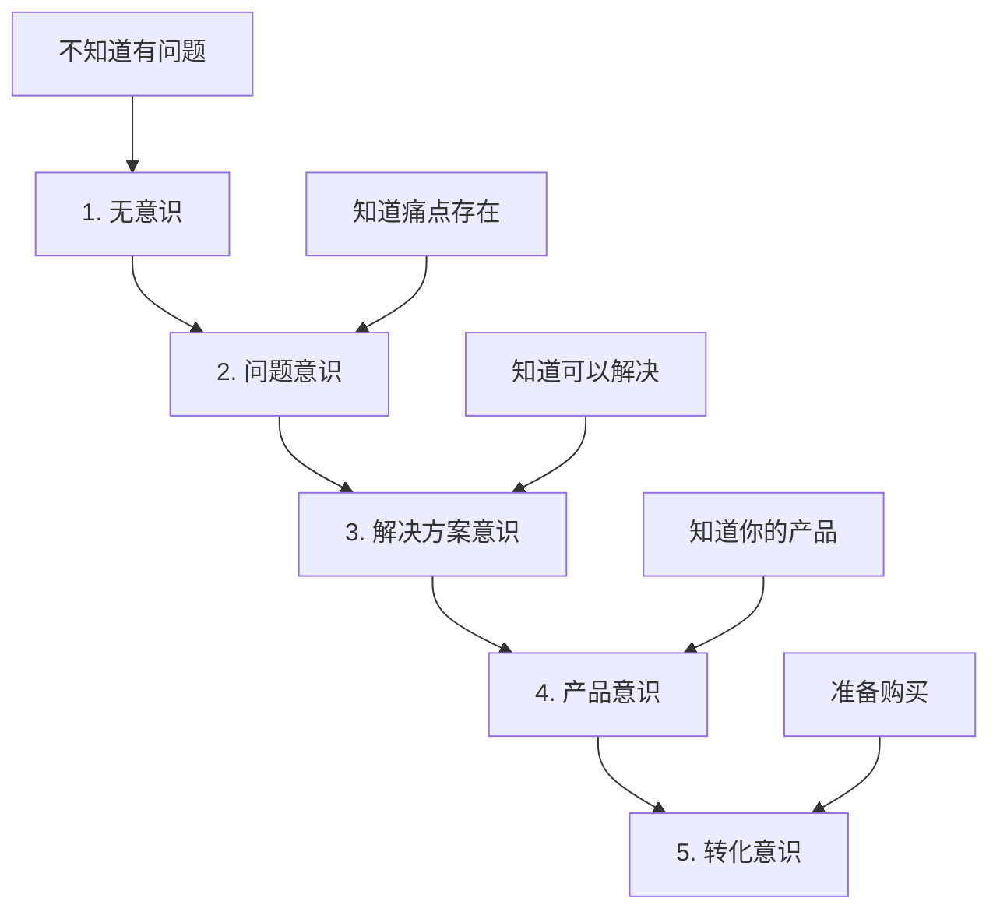

> [!quote] 核心观点
> **价值不是你提供的东西，而是你帮助客户实现的转变。**
> 
> 一个好的价值主张能让人在5秒内明白：你能帮我从哪里到哪里。

## 什么是价值主张

价值主张不是：
- ❌ "我提供咨询服务"
- ❌ "我是XX领域的专家"
- ❌ "我有10年经验"

价值主张是：
- ✅ "我帮助【谁】通过【方法】实现【结果】"
- ✅ 清晰的**转变承诺**
- ✅ 可衡量的**价值交付**

> [!important] 记住
> 客户不买产品，客户买**转变**。
> 他们不关心你是谁，他们关心**你能帮他们成为谁**。

## 🎯 价值创造框架

Dan Koe 提出的价值创造公式：

```
(意识 × 欲望) + 问题 + 独特机制 + 证明 + 保证 = 高感知价值产品
```

### 1. 意识 (Awareness)
> 他们知道问题的存在吗？

**受众意识的5个层级**：



> [!tip] 关键洞察
> 你的价值主张需要匹配受众的意识层级。
> 
> - 无意识者需要：**痛点教育**
> - 问题意识者需要：**解决方案框架**
> - 解决方案意识者需要：**你的独特方法**
> - 产品意识者需要：**社会证明和保证**

---

### 2. 欲望 (Desire)
> 他们有多想要解决这个问题？

**欲望 = 痛苦 × 紧迫性**

- 痛苦越大，欲望越强
- 紧迫性越高，行动越快

**提升欲望的方法**：
- 放大痛点的后果
- 展示理想状态的美好
- 制造时间紧迫感

---

### 3. 问题 (Problem)
> 你解决的核心问题是什么？

**好问题的特征**：
- ✅ **具体**：不是"提升效率"，而是"每天节省2小时重复劳动"
- ✅ **普遍**：不是只有你遇到，而是很多人都有
- ✅ **可验证**：解决前后有明显对比

---

### 4. 独特机制 (Unique Mechanism)
> 你的方法有什么不同？

这是你的**核心差异化**。

**示例**：
- ❌ 普通：我教你写作
- ✅ 独特：我用"主题树法"帮你建立永不枯竭的写作素材库

**找到你的独特机制**：
- 你的方法论
- 你的工具栈
- 你的框架模型
- 你的流程系统

---

### 5. 证明 (Proof)
> 凭什么相信你？

**社会证明的类型**：
- 案例研究（最强）
- 客户评价
- 数据结果
- 你的故事（最真实）

---

### 6. 保证 (Guarantee)
> 降低决策风险

**常见保证**：
- 退款保证
- 结果保证
- 时间保证
- 满意度保证

## 💡 撰写价值主张的公式

### 公式1: 问题-解决方案-结果
> 我帮助【谁】解决【问题】，实现【结果】

**示例**：
> 我帮助使用 Obsidian 的创作者，
> 解决笔记无法美观发布的问题，
> 实现像 Obsidian Publish 一样的精美知识网站。

---

### 公式2: 从-到转变
> 我帮助【谁】从【当前状态】到【理想状态】

**示例**：
> 我帮助困在朝九晚五的职场人，
> 从被动工作到主动创造，
> 建立自由的一人公司。

---

### 公式3: 方法-价值-时间
> 通过【独特方法】，在【时间内】帮你【实现价值】

**示例**：
> 通过 2+1+1 工作法，
> 在30天内帮你建立，
> 每天只需4小时的高效创作系统。

---

### 公式4: 不要-而要（对比框架）
> 不要【旧方式】，而要【新方式】

**示例**：
> 不要花几个月学复杂的建站技术，
> 而要用 MDFriday 在5分钟内发布你的知识网站。

## 🎯 实战练习：撰写你的价值主张

> [!success] 花30分钟完成这个练习
> 
> ### 步骤1: 回答核心问题
> 
> **1. 你的目标人群是谁？**
> （越具体越好）
> 
> _____________________
> 
> **2. 他们的核心痛点是什么？**
> （他们晚上睡不着觉的问题）
> 
> _____________________
> 
> **3. 他们的理想结果是什么？**
> （解决后的美好状态）
> 
> _____________________
> 
> **4. 你的独特方法是什么？**
> （你的做法与别人有何不同）
> 
> _____________________
> 
> **5. 你有什么证明？**
> （案例、数据、你的故事）
> 
> _____________________
> 
> ### 步骤2: 组合成价值主张
> 
> **版本1（问题-解决方案）：**
> 
> > 我帮助 _____________（谁）
> > 解决 _____________（问题）
> > 实现 _____________（结果）
> 
> **版本2（转变框架）：**
> 
> > 我帮助 _____________（谁）
> > 从 _____________（当前状态）
> > 到 _____________（理想状态）
> 
> **版本3（方法-价值）：**
> 
> > 通过 _____________（独特方法）
> > 在 _____________（时间内）
> > 帮你 _____________（实现价值）
> 
> ### 步骤3: 精简到一句话
> 
> **我的价值主张是：**
> 
> _____________________

## 🌟 案例分析：MDFriday 的价值主张演变

### 版本1.0（功能描述）❌
> "MDFriday 是一个将 Markdown 转为网站的服务"

**问题**：
- 只说了是什么，没说解决什么问题
- 没有目标人群
- 没有差异化

---

### 版本2.0（问题导向）✅
> "让 Obsidian 用户轻松发布精美的知识网站"

**改进**：
- 明确了目标人群（Obsidian 用户）
- 指出了核心价值（轻松发布）
- 但还不够有吸引力

---

### 版本3.0（转变承诺）✅✅
> "5分钟将你的 Obsidian 笔记
> 转变为像 Obsidian Publish 一样精美的知识网站
> 无需代码，无需配置"

**为什么这个版本更好**：
- ✅ 明确的时间承诺（5分钟）
- ✅ 清晰的对比（像 Obsidian Publish）
- ✅ 降低门槛（无需代码）
- ✅ 具体的转变（从笔记到网站）

## 💡 价值主张的3个层次

### 层次1: 功能价值（What）
> 产品是什么

例如：
- "一个笔记应用"
- "一个课程平台"
- "一个咨询服务"

❌ **太弱**：竞争对手也能这么说

---

### 层次2: 体验价值（How）
> 使用体验如何

例如：
- "简单易用的笔记应用"
- "互动性强的课程平台"
- "一对一的咨询服务"

✅ **更好**：开始有差异化

---

### 层次3: 转变价值（Why）
> 带来什么改变

例如：
- "让你的想法成为资产"
- "让学习成为习惯"
- "让你找到人生方向"

✅✅ **最强**：触及深层需求

## 🚫 价值主张的常见错误

### 错误1: 自说自话
❌ "我有10年经验，提供专业服务"

✅ 应该：聚焦客户利益
> "帮你避开我踩过的10年坑，直接获得结果"

---

### 错误2: 太宽泛
❌ "帮助你变得更好"

✅ 应该：具体可衡量
> "30天内建立每天写1000字的习惯"

---

### 错误3: 只讲方法不讲结果
❌ "我教你用 X 工具做 Y 事情"

✅ 应该：强调转变
> "用 X 工具让你从0到1建立知识系统"

---

### 错误4: 过度承诺
❌ "7天让你成为写作大师"

✅ 应该：真实可信
> "7天帮你建立持续写作的习惯"

## 🎯 价值主张测试清单

你的价值主张是否有效？检查这些：

- [ ] **清晰性**：5秒内能理解吗？
- [ ] **相关性**：目标人群会产生共鸣吗？
- [ ] **差异化**：与竞争对手有明显区别吗？
- [ ] **可信性**：有证明支撑吗？
- [ ] **吸引力**：让人想要了解更多吗？

## 🔗 相关资源

### 理论基础
- [[16|Dan Koe - 价值创造框架]]
- [[27|Dan Koe - 掌握说服力的四大框架]]
- [[09-value-creation|Purpose & Profit - 价值创造]]

### 相关章节
- [[01-个人定位|个人定位]] - 价值主张的基础
- [[03-目标受众|目标受众]] - 为谁创造价值
- [[04-品牌故事|品牌故事]] - 如何讲述价值

### 下一步
- [[03-目标受众|了解目标受众]] - 深入理解你为谁服务
- [[../../3.产品/01-产品设计|产品设计]] - 将价值主张转化为产品

---

## 🎯 记住

> [!quote] 核心原则
> **客户不买产品，客户买转变。**
> 
> 你的价值主张不是你多厉害，
> 而是你能帮他们变得多厉害。
> 
> 从 A 到 B 的桥梁，就是你的价值。

---

*下一章: [[03-目标受众|03. 目标受众 - 你为谁服务]]* 👉

*返回: [[1.一人公司/1.品牌/index|品牌模块首页]]*
