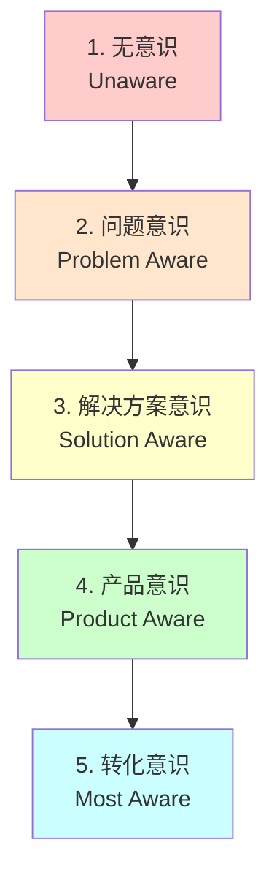
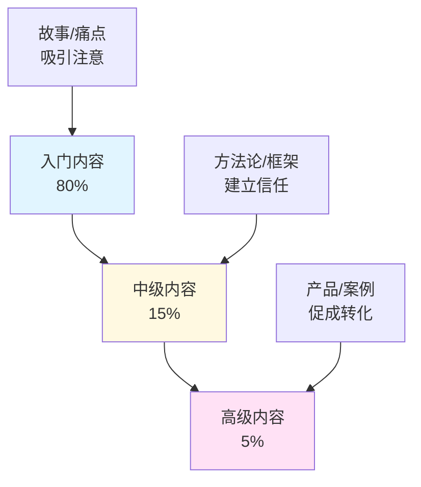

> [!quote] 核心观点
> **你就是你的客户化身。**
> 
> 最好的产品来自创始人自己的需求，最好的营销来自对自己的理解。

## 为什么理解受众如此重要

很多人认为："我的产品适合所有人"。

这是最大的错误。

> [!important] 真相
> **为所有人服务 = 为没有人服务**
> 
> 你需要一个清晰的目标受众，不是为了排除他人，
> 而是为了**用他们的语言说话，解决他们的问题**。

## 🎯 一人公司的受众策略

### 传统市场研究 vs 创作者方法

| 传统方法 | 创作者方法 |
|----------|------------|
| 市场调研 | **你就是你的客户** |
| 用户访谈 | **回顾你的经历** |
| 数据分析 | **观察你的转变** |
| 细分市场 | **你就是细分市场** |

> [!tip] 关键洞察
> 在一人公司中，最有效的受众定位是：
> 
> **你就是你的客户化身，你就是你的品牌，你就是你的细分市场。**
> 
> 你要服务的人，就是**3-5年前的你**。

## 💡 受众意识的5个层级

理解受众的关键是理解他们的**意识层级**。

### 层级1: 无意识 (Unaware)
**特征**: 不知道有问题存在

**他们的想法**:
- "一切都还好"
- "没什么需要改变的"

**你的内容策略**:
- ✅ 讲故事唤醒痛点
- ✅ 描绘理想状态的美好
- ✅ 制造对比和反差
- ❌ 不要直接推销

**内容示例**:
> "你是否也有这样的时刻：明明很努力，却总觉得在原地打转？"

---

### 层级2: 问题意识 (Problem Aware)
**特征**: 知道痛点，但不知道怎么解决

**他们的想法**:
- "我确实有这个问题"
- "不知道该怎么办"

**你的内容策略**:
- ✅ 深入剖析问题
- ✅ 提供解决方向
- ✅ 建立专业性
- ❌ 还不要直接卖产品

**内容示例**:
> "笔记越来越多，却越来越难找？这是因为缺少知识管理系统..."

---

### 层级3: 解决方案意识 (Solution Aware)
**特征**: 知道可以解决，在寻找方法

**他们的想法**:
- "我知道有解决方案"
- "哪种方法最适合我？"

**你的内容策略**:
- ✅ 介绍你的方法论
- ✅ 展示独特机制
- ✅ 提供价值对比
- ❌ 不要过度推销

**内容示例**:
> "市面上有很多笔记软件，但只有 Obsidian + MDFriday 能让你..."

---

### 层级4: 产品意识 (Product Aware)
**特征**: 知道你的产品，在评估是否购买

**他们的想法**:
- "这个产品看起来不错"
- "值得买吗？"
- "有什么保证？"

**你的内容策略**:
- ✅ 展示社会证明
- ✅ 提供案例研究
- ✅ 降低决策风险
- ✅ 明确行动号召

**内容示例**:
> "看看这些用户如何在一周内用 MDFriday 建立了知识网站..."

---

### 层级5: 转化意识 (Most Aware)
**特征**: 准备购买，只差最后一步

**他们的想法**:
- "我要买了"
- "现在买有优惠吗？"

**你的内容策略**:
- ✅ 简化购买流程
- ✅ 提供限时优惠
- ✅ 消除最后顾虑
- ✅ 立即行动号召

**内容示例**:
> "现在注册，立即获得30天免费试用..."

## 🎯 实战练习：创建你的受众画像

> [!success] 花30分钟深入了解你的受众
> 
> ### 第一部分：你就是你的客户
> 
> **回顾3-5年前的你：**
> 
> 1. **那时你遇到的最大困难是什么？**
>    
>    _____________________
> 
> 2. **你晚上睡不着觉想的是什么？**
>    
>    _____________________
> 
> 3. **你渴望什么样的转变？**
>    
>    _____________________
> 
> 4. **你尝试过哪些方法失败了？**
>    
>    _____________________
> 
> 5. **最终什么帮助你突破了？**
>    
>    _____________________
> 
> ### 第二部分：详细画像
> 
> **基本信息：**
> - 年龄段：_____
> - 职业：_____
> - 生活状态：_____
> 
> **核心痛点：**
> - 痛点1：_____
> - 痛点2：_____
> - 痛点3：_____
> 
> **理想状态：**
> - 目标1：_____
> - 目标2：_____
> - 目标3：_____
> 
> **当前障碍：**
> - 障碍1：_____
> - 障碍2：_____
> - 障碍3：_____
> 
> **意识层级：**
> - 主要在哪个层级？_____
> - 需要什么类型的内容？_____

## 🌟 案例分析：我的目标受众

### 画像1: 知识型创作者小李

**背景**:
- 30岁，内容创作者
- 使用 Obsidian 记录大量笔记
- 想分享知识但不懂技术

**痛点**:
- ❌ Obsidian 笔记无法美观地发布
- ❌ 学习建站技术太复杂耗时
- ❌ 现有方案要么贵要么复杂

**意识层级**: 解决方案意识
- 知道需要发布工具
- 在对比不同方案
- 关心性价比和易用性

**他需要的内容**:
- ✅ MDFriday vs 其他方案的对比
- ✅ 5分钟快速上手教程
- ✅ 其他用户的案例

**我如何帮助他**:
- 提供简单易用的发布工具
- 无需代码和复杂配置
- 5分钟即可上线

**这就是3年前的我！**

---

### 画像2: 程序员转型创作者小王

**背景**:
- 35岁，程序员
- 想做技术分享和内容创作
- 追求完美的工具和流程

**痛点**:
- ❌ 现有方案不够灵活
- ❌ 想要完全掌控网站
- ❌ 需要开源和可定制

**意识层级**: 产品意识
- 知道 MDFriday 存在
- 在评估是否符合需求
- 关心技术细节和扩展性

**他需要的内容**:
- ✅ 技术架构和原理
- ✅ 开源代码和文档
- ✅ 高级定制教程

**我如何帮助他**:
- 提供开源的 Quartz 主题
- 完整的技术文档
- 支持深度定制

**这也是我经历过的阶段！**

## 💡 理解受众的3个维度

### 维度1: 人口统计 (Demographics)
> 他们是谁

- 年龄、性别、职业
- 地理位置
- 收入水平

**作用**: 基础了解，但**不是最重要的**

---

### 维度2: 心理特征 (Psychographics)
> 他们在意什么

- 价值观、信念
- 兴趣、爱好
- 生活方式

**作用**: 更深入的理解，**很重要**

---

### 维度3: 行为模式 (Behavioral)
> 他们如何行动

- 购买习惯
- 内容消费习惯
- 决策模式

**作用**: 最实用的洞察，**最重要**

> [!tip] 重点
> 对一人公司来说，**心理特征和行为模式**比人口统计重要得多。
> 
> 关注他们的**价值观、痛点、目标**，而不是年龄和性别。

## 🚫 受众定位的常见错误

### 错误1: 目标人群太宽泛
❌ "所有想提升效率的人"

✅ 应该：具体明确
> "使用 Obsidian 但不懂建站的创作者"

---

### 错误2: 基于假设而非事实
❌ "我觉得用户需要这个功能"

✅ 应该：基于真实反馈
> "10个用户中有8个提到了这个痛点"

---

### 错误3: 忽视意识层级
❌ "对所有人讲同样的内容"

✅ 应该：针对不同层级
> "80%的内容给前3个层级，20%给后2个"

---

### 错误4: 试图服务所有人
❌ "我的产品适合所有人"

✅ 应该：聚焦核心受众
> "我专注服务这一类人，做到最好"

## 🎯 内容策略：针对不同层级

> [!success] 内容分配建议
> 
> **80% 的内容：针对前3个层级**
> - 无意识
> - 问题意识  
> - 解决方案意识
> 
> **目的**: 吸引流量、建立信任、教育受众
> 
> **20% 的内容：针对后2个层级**
> - 产品意识
> - 转化意识
> 
> **目的**: 展示价值、促成转化

### 内容金字塔

## 🔗 相关资源

### 理论基础
- [[../../2.内容/DK/视频笔记/6|Dan Koe - 一人企业的四大支柱]]
- [[../../2.内容/DK/视频笔记/16|Dan Koe - 价值创造框架]]
- [[../../2.内容/DK/视频笔记/27|Dan Koe - 掌握说服力]]

### 相关章节
- [[01-个人定位|个人定位]] - 你是谁
- [[02-价值主张|价值主张]] - 你提供什么
- [[04-品牌故事|品牌故事]] - 如何打动受众

### 下一步
- [[04-品牌故事|学习讲故事]] - 用故事打动受众
- [[../../2.内容/01-内容策略|内容策略]] - 创作针对受众的内容

---

## 🎯 记住

> [!quote] 核心原则
> **你就是你的客户化身。**
> 
> 最好的受众研究，就是理解3-5年前的自己：
> - 你的困惑
> - 你的渴望
> - 你的转变
> 
> 你要服务的人，就是曾经的你。

---

*下一章: [[04-品牌故事|04. 品牌故事 - 为什么选择你]]* 👉

*返回: [[index|品牌模块首页]]*
