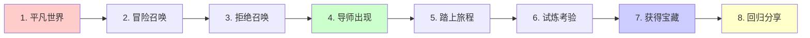

> [!quote] 核心观点
> **事实告诉，故事销售。**
> 
> 人们不记得你说了什么，但会记得你让他们感受到了什么。

## 为什么故事如此强大

在信息泛滥的时代：
- 数据容易被忘记
- 理论让人困倦
- 但**故事让人记住**

> [!important] 故事的力量
> - ✅ **情感连接**: 让人产生共鸣
> - ✅ **记忆深刻**: 比数据更容易记住
> - ✅ **传播力强**: 人们喜欢分享故事
> - ✅ **建立信任**: 真实的故事最有说服力

**你的品牌需要一个故事，而不只是一个说明书。**

## 🎯 英雄之旅框架

最强大的故事结构来自约瑟夫·坎贝尔的"英雄之旅"。

### 在个人品牌中应用

#### 1. 平凡世界 (Ordinary World)
**你的起点**

> "两年前，我是一个困在朝九晚五的程序员..."

**作用**: 让受众看到自己
**关键**: 真实、具体、有共鸣

---

#### 2. 冒险召唤 (Call to Adventure)
**转折点**

> "直到有一天，我意识到这不是我想要的生活..."

**作用**: 制造冲突和张力
**关键**: 展示痛点或觉醒时刻

---

#### 3. 拒绝召唤 (Refusal)
**内心挣扎**

> "但我害怕，担心失败，不敢迈出第一步..."

**作用**: 展示脆弱和真实
**关键**: 让人看到你也是普通人

---

#### 4. 导师出现 (Meeting the Mentor)
**获得帮助**

> "然后我遇到了 Dan Koe 的理念，学到了一人公司的方法..."

**作用**: 引入解决方案
**关键**: 你遇到的转变契机

---

#### 5. 踏上旅程 (Crossing the Threshold)
**开始行动**

> "我辞职了，开始打造自己的产品..."

**作用**: 展示勇气和决心
**关键**: 具体的行动

---

#### 6. 试炼考验 (Tests, Allies, Enemies)
**克服困难**

> "过程很艰难，失败了很多次，但我坚持了下来..."

**作用**: 展示过程的真实性
**关键**: 失败和学习

---

#### 7. 获得宝藏 (Reward)
**取得成果**

> "现在我每天只工作4小时，却比以前赚得更多，更重要的是获得了自由..."

**作用**: 展示转变结果
**关键**: 可量化的改变

---

#### 8. 回归分享 (Return with Elixir)
**帮助他人**

> "现在我想分享这段旅程，帮助更多人实现同样的转变..."

**作用**: 说明你的使命
**关键**: 为什么要创建这个品牌/产品

## 💡 品牌故事的3个层次

### 层次1: 起源故事 (Origin Story)
> 你为什么开始

**回答的问题**:
- 你是如何走到今天的？
- 为什么做这件事？
- 什么事件改变了你？

**示例框架**:
> "我曾经 ___________（困境）
> 直到有一天 ___________（转折）
> 然后我发现 ___________（方法）
> 现在我想帮助 ___________（使命）"

---

### 层次2: 转变故事 (Transformation Story)
> 你如何改变

**回答的问题**:
- 你从哪里到了哪里？
- 你克服了什么困难？
- 你学到了什么？

**示例框架**:
> "以前的我 ___________（旧状态）
> 我尝试了 ___________（失败的方法）
> 直到我发现 ___________（突破）
> 现在我 ___________（新状态）"

---

### 层次3: 愿景故事 (Vision Story)
> 你要去哪里

**回答的问题**:
- 你的长期目标是什么？
- 你想创造什么影响？
- 你邀请他人加入什么旅程？

**示例框架**:
> "我相信 ___________（核心信念）
> 我想创造一个 ___________（理想未来）
> 在这里，___________（价值观）
> 加入我一起 ___________（邀请）"

## 🎯 实战练习：撰写你的品牌故事

> [!success] 用英雄之旅框架写下你的故事
> 
> ### 第一部分：过去（起点）
> 
> **1. 你的平凡世界是什么样的？**
> （具体描述你的起点状态）
> 
> _____________________
> 
> **2. 你遇到了什么问题或召唤？**
> （什么让你意识到需要改变）
> 
> _____________________
> 
> **3. 你的内心挣扎是什么？**
> （你的恐惧、顾虑、障碍）
> 
> _____________________
> 
> ### 第二部分：转变（过程）
> 
> **4. 什么帮助你迈出第一步？**
> （导师、书籍、事件）
> 
> _____________________
> 
> **5. 你采取了什么行动？**
> （具体的第一步）
> 
> _____________________
> 
> **6. 你遇到了哪些挑战？**
> （失败、困难、学习）
> 
> _____________________
> 
> ### 第三部分：现在（结果）
> 
> **7. 你获得了什么转变？**
> （具体的、可量化的改变）
> 
> _____________________
> 
> **8. 你为什么要分享这段旅程？**
> （你的使命和愿景）
> 
> _____________________
> 
> ### 第四部分：组合成故事
> 
> **用150-200字写下完整的故事：**
> 
> _____________________

## 🌟 案例分析：我的品牌故事

### 完整版本

> **两年前，我是一个困在朝九晚五的程序员。**
> 
> 每天写着别人规划的代码，虽然收入不错，但总觉得生活缺少了什么。我有很多想法，记了大量笔记，但它们都躺在 Obsidian 里，无法分享给世界。
> 
> **我想建立个人网站，但现有方案要么太贵，要么太复杂。**
> 
> 作为程序员，我知道这不应该那么难。我开始研究 Quartz、Obsidian 插件，想要找到一个完美的解决方案。
> 
> **但我发现，市面上没有一个工具能满足我的需求：**
> - 像 Obsidian Publish 一样美观
> - 无需复杂的技术配置
> - 价格合理
> - 完全掌控自己的内容
> 
> **于是我决定自己创造一个。**
> 
> 从 2025 年11月开始，我边学习 Dan Koe 的一人公司理念，边开发 MDFriday。失败了无数次，推翻重来了很多版本。
> 
> **2026年1月，MDFriday 正式发布。**
> 
> 现在，任何使用 Obsidian 的人都可以在5分钟内发布自己的知识网站。不需要代码，不需要配置，只需要专注于内容创作。
> 
> **这就是 MDFriday 的起源故事。**
> 
> 我创造了我自己需要的工具，现在我想分享给和我有同样需求的人。因为我相信，每个人的知识都值得被看见，而技术不应该成为分享的障碍。

### 精简版本（用于社交媒体）

> 两年前，我是个有很多想法的程序员，但笔记都躺在 Obsidian 里。
> 
> 我想建网站分享，但现有方案要么贵要么复杂。
> 
> 所以我创造了 MDFriday — 5分钟把 Obsidian 笔记变成精美网站。
> 
> 我造了我需要的工具，现在想分享给你。

## 💡 好故事的6个要素

### 1. 真实性 (Authenticity)
> 真实的故事最有力量

- ✅ 分享真实的挣扎
- ✅ 展示脆弱的一面
- ✅ 承认失败和错误
- ❌ 不要编造或夸大

---

### 2. 具体性 (Specificity)
> 细节让故事可信

- ✅ 具体的时间、地点、人物
- ✅ 可感知的细节
- ✅ 真实的数据
- ❌ 不要抽象和空泛

---

### 3. 共鸣性 (Relatability)
> 让读者看到自己

- ✅ 描述普遍的情感
- ✅ 展示常见的困境
- ✅ 使用"我们"而非"我"
- ❌ 不要过度炫耀

---

### 4. 冲突性 (Conflict)
> 没有冲突就没有故事

- ✅ 展示挑战和障碍
- ✅ 制造张力和悬念
- ✅ 描述内心挣扎
- ❌ 不要一帆风顺

---

### 5. 转变性 (Transformation)
> 展示前后对比

- ✅ 明确的起点和终点
- ✅ 可量化的改变
- ✅ 情感和状态的对比
- ❌ 不要只讲过程

---

### 6. 使命性 (Purpose)
> 说明为什么重要

- ✅ 表达核心信念
- ✅ 说明更大的意义
- ✅ 邀请他人加入
- ❌ 不要只关注自己

## 🚫 品牌故事的常见错误

### 错误1: 过于完美
❌ "我从来没有失败过，一切都很顺利"

✅ 应该：展示真实的挣扎
> "我失败了很多次，这是我学到的..."

---

### 错误2: 过度自我
❌ "我多么厉害，我的成就..."

✅ 应该：聚焦受众
> "如果你也经历过这些，我想告诉你..."

---

### 错误3: 缺乏具体性
❌ "我经历了很多困难"

✅ 应该：具体生动
> "我连续3个月每天工作16小时，却只有2个付费用户..."

---

### 错误4: 没有情感
❌ "然后我做了A，又做了B，结果得到了C"

✅ 应该：带入情感
> "那天晚上我坐在电脑前，怀疑自己是否做了正确的选择..."

## 🎯 故事的3种表达形式

### 形式1: 长篇故事（关于页面）
**长度**: 500-1000字
**场景**: 网站关于页面、邮件介绍
**目的**: 完整展示品牌理念

---

### 形式2: 中篇故事（文章/邮件）
**长度**: 200-500字
**场景**: 博客文章开头、邮件内容
**目的**: 建立连接和信任

---

### 形式3: 短篇故事（社交媒体）
**长度**: 50-150字
**场景**: 推文、朋友圈、简介
**目的**: 快速抓住注意力

> [!tip] 建议
> 先写完整版本，然后根据不同场景精简。
> 保持核心信息不变，调整长度和细节。

## 🔗 相关资源

### 理论基础
- [[12|Dan Koe - 真实内容创作]]
- [[27|Dan Koe - 掌握说服力]]
- [[08-your-lifes-work|Purpose & Profit - 你的人生工作]]

### 相关章节
- [[01-个人定位|个人定位]] - 故事的基础
- [[02-价值主张|价值主张]] - 故事要传达的价值
- [[03-目标受众|目标受众]] - 故事要打动的人

### 实战案例
- [[实战案例/我的品牌演变史|我的品牌演变史]] - 完整的故事案例

### 下一步
- [[../../2.内容/02-写作系统|写作系统]] - 学习讲故事的技巧
- [[../../2.内容/04-社交媒体运营|社交媒体运营]] - 在不同平台讲故事

---

## 🎯 记住

> [!quote] 核心原则
> **事实告诉，故事销售。**
> 
> 你的品牌不是一份说明书，而是一段旅程。
> 
> 人们不会记得你的功能列表，
> 但会记得你的故事让他们感受到了什么。
> 
> 真实的故事，最有力量。

---

*恭喜！你已完成品牌模块的所有章节 🎉*

*下一个模块: [[../../2.内容/index|02. 内容 - 你说什么]]* 👉

*返回: [[1.一人公司/1.品牌/index|品牌模块首页]]*
