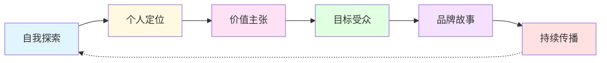

> [!quote] 品牌的本质
> **品牌不是 Logo，不是配色，而是人们对你的感知和信任。**
> 
> 在一人公司中，你就是品牌，品牌就是你的目标、承诺和独特价值。

## 为什么品牌是一切的基础

没有品牌，你只是一个"提供服务的人"。
有了品牌，你成为"某个领域的专家"、"值得信赖的向导"。

> [!important] 品牌的力量
> - 让客户主动找到你，而不是你去推销
> - 建立信任，降低决策成本
> - 提升产品溢价能力
> - 形成长期的护城河

## 🎯 本模块内容

### [[01-个人定位|01. 个人定位]] - 找到你的立足点

> **最赚钱的细分市场就是你自己**

在这一章，你将学会：
- 如何发现你的独特价值
- 为什么"你就是你的细分市场"
- 如何用定位画布找到方向
- 真实案例：我的定位演变史

👉 [[01-个人定位|开始学习个人定位]]

---

### [[02-价值主张|02. 价值主张]] - 你能提供什么

> **一句话说清楚：你帮谁解决什么问题**

在这一章，你将学会：
- 价值创造框架的应用
- 如何提炼你的核心价值
- 撰写有吸引力的价值主张
- 真实案例：MDFriday 的价值主张

👉 [[02-价值主张|开始学习价值主张]]

---

### [[03-目标受众|03. 目标受众]] - 你为谁服务

> **你就是你的客户化身**

在这一章，你将学会：
- 如何理解你的理想受众
- 受众意识的五个层级
- 创建详细的受众画像
- 真实案例：我的受众分析

👉 [[03-目标受众|开始学习目标受众]]

---

### [[04-品牌故事|04. 品牌故事]] - 为什么选择你

> **故事是最强大的营销工具**

在这一章，你将学会：
- 英雄之旅框架的应用
- 如何讲述转变故事
- 让品牌故事引发共鸣
- 真实案例：我的一人公司故事

👉 [[04-品牌故事|开始学习品牌故事]]

---

## 🎯 实战案例

真实的品牌打造过程，包括成功和失败的经验：

### [[实战案例/我的品牌演变史|我的品牌演变史]]
从模糊的"程序员"到清晰的"知识工具创造者"的完整过程

### [[实战案例/MDFriday品牌打造|MDFriday 品牌打造]]
如何为一个新产品建立品牌认知

---

## 📊 品牌构建流程

## 💡 核心原则

> [!tip] 记住这些原则
> 
> **1. 真实性 > 完美性**
> 不要试图迎合所有人，做真实的自己才能吸引对的人。
> 
> **2. 清晰性 > 创意性**
> 让人5秒内明白你是谁、做什么，比华丽的辞藻重要得多。
> 
> **3. 一致性 > 爆发性**
> 品牌是长期积累的结果，保持一致比偶尔刷屏更重要。
> 
> **4. 你就是细分市场**
> 不要模仿别人，你的独特经历就是最好的差异化。

## 🎯 快速开始

> [!success] 3个立即可以做的事情
> 
> - [ ] 用一句话写下：我帮助【谁】通过【方法】实现【结果】
> - [ ] 列出3个让你与众不同的经历或技能组合
> - [ ] 写下100字的"为什么我开始做这件事"

## 🔗 相关资源

### 理论基础
- [[9|Dan Koe - 最赚钱的细分市场就是你]]
- [[12|Dan Koe - 真实内容创作]]
- [[01-introduction|Purpose & Profit - 引言]]

### 其他模块
- [[../2.内容/index|内容模块]] - 学习如何传播你的品牌
- [[../3.产品/index|产品模块]] - 将品牌转化为产品
- [[../4.系统/index|系统模块]] - 系统化品牌建设

---

## 🚀 下一步

> [!info] 推荐学习路径
> 1. 先完成 [[01-个人定位|个人定位]]，找到你的方向
> 2. 然后明确 [[02-价值主张|价值主张]]，知道你的价值
> 3. 接着了解 [[03-目标受众|目标受众]]，知道为谁服务
> 4. 最后讲好 [[04-品牌故事|品牌故事]]，让人记住你

**品牌不是一天建成的，但可以从今天开始。**

👉 [[01-个人定位|现在就开始：找到你的定位]]

---

*返回: [[../index|一人公司实战笔记首页]]*
