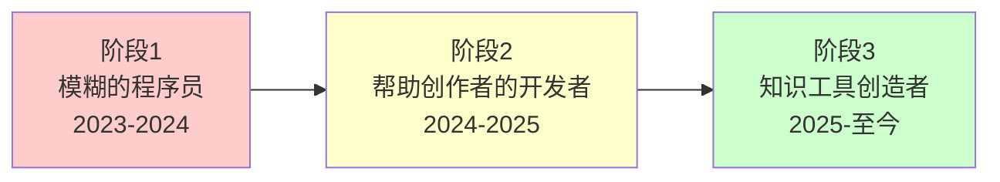

> [!info] 案例说明
> 这是我从模糊的"程序员"到清晰的"知识工具创造者"的完整品牌演变过程。
> 
> 包括每个阶段的思考、失败、调整和突破。

## 概览：三个阶段的演变

---

## 🔴 阶段1: 模糊的"程序员" (2023-2024)

### 当时的定位

> "我是一个程序员，擅长全栈开发。"

### 存在的问题

❌ **太宽泛**
- 市场上有千万个程序员
- 没有任何差异化
- 无法脱颖而出

❌ **没有目标人群**
- 不知道为谁服务
- 不知道解决什么问题
- 只是"接活"的心态

❌ **缺乏独特价值**
- 只是技能的提供者
- 容易被替代
- 价格战竞争

### 真实困境

> **那段时间的我：**
> 
> - 有技术能力，但不知道做什么
> - 看到别人的成功，但不知道自己的方向
> - 想创业，但没有清晰的定位
> - 做了一些项目，但都半途而废

### 转折点

2024年中，我遇到了 Dan Koe 的内容。

他的一句话点醒了我：

> **"最赚钱的细分市场就是你自己"**

我开始思考：
- 我到底是谁？
- 我的独特组合是什么？
- 我真正想帮助谁？

---

## 🟡 阶段2: "帮助创作者的开发者" (2024-2025)

### 新的定位

> "我是一个开发者，帮助内容创作者解决技术问题。"

### 改进之处

✅ **有了目标人群**
- 创作者（而非所有人）
- 有技术痛点的人
- 想要工具支持的人

✅ **开始关注价值**
- 不只是写代码
- 而是解决问题
- 帮助他们创作

✅ **有了方向感**
- 知道要服务谁
- 知道要做什么类型的产品
- 开始积累相关经验

### 但仍然不够

⚠️ **还是太宽**
- "创作者"范围太大
- "技术问题"太笼统
- 还没有独特的切入点

⚠️ **缺乏个人特色**
- 市场上很多"帮创作者的开发者"
- 我的独特性在哪里？
- 为什么选择我而不是别人？

### 实践与探索

在这个阶段，我：

1. **深入创作者社群**
   - 加入 Obsidian 社区
   - 了解创作者的真实需求
   - 发现知识管理的痛点

2. **开始使用 Obsidian**
   - 自己成为重度用户
   - 体验笔记管理的挑战
   - 发现发布的障碍

3. **学习 Dan Koe 的理念**
   - 完整学习了33个视频
   - 记录详细笔记
   - 实践一人公司模式

### 关键发现

我发现：
- 我自己就是目标用户
- 我遇到的问题很多人也遇到
- 我的需求就是市场需求

这让我进入了第三阶段。

---

## 🟢 阶段3: "知识工具创造者" (2025-至今)

### 最终定位

> **"我是知识工具创造者，**
> **帮助使用 Obsidian 的创作者，**
> **通过 MDFriday 和插件，**
> **轻松将笔记转化为精美的知识网站。"**

### 为什么这个定位有效

✅ **极度具体**
- 不是所有创作者，是"Obsidian 用户"
- 不是所有技术问题，是"笔记发布"
- 不是泛泛的工具，是"MDFriday"

✅ **基于真实需求**
- 我自己就是 Obsidian 用户
- 我遇到过同样的困境
- 我知道解决方案的价值

✅ **独特的组合**
- 技术能力（开发）
- 使用经验（用户）
- 内容理解（创作者）
- 知识管理（方法论）

✅ **清晰的价值主张**
- 从笔记到网站（转变）
- 5分钟上线（速度）
- 无需代码（门槛）
- 精美呈现（品质）

### 品牌的核心元素

#### 1. 身份
**知识工具创造者**
- 不只是开发者
- 不只是创作者
- 是两者的结合

#### 2. 目标人群
**使用 Obsidian 的创作者**
- 有内容
- 想分享
- 不懂技术

#### 3. 核心问题
**笔记无法美观发布**
- 现有方案太贵
- 现有方案太复杂
- 想要完全掌控

#### 4. 独特解决方案
**MDFriday + Plugin Friday**
- 简单（5分钟）
- 美观（像 Obsidian Publish）
- 开放（Quartz 主题）
- 可控（自己的内容）

#### 5. 更深层的使命
**让技术不成为分享的障碍**
- 每个人的知识都值得被看见
- 工具应该服务于创作
- 降低分享的门槛

### 具体实践

基于这个定位，我：

1. **产品开发**
   - 开发 MDFriday 服务
   - 创建 Obsidian Plugin Friday
   - 定制 Quartz 主题

2. **内容创作**
   - 记录 Dan Koe 笔记
   - 分享开发过程
   - 写实战教程

3. **社群运营**
   - 在 Obsidian 社区活跃
   - 帮助用户解决问题
   - 收集真实反馈

4. **品牌传播**
   - 用自己的工具发布内容
   - 展示真实案例
   - 讲述品牌故事

---

## 💡 从演变中学到的经验

### 经验1: 定位是迭代出来的

> [!tip] 不要等到想清楚了才开始
> 
> 我的定位经历了3个阶段，每个阶段都在实践中不断调整。
> 
> **边做边想，边想边做。**

---

### 经验2: 你就是你的细分市场

> [!tip] 最好的定位来自你自己
> 
> 当我意识到"我就是目标用户"时，一切都变清晰了。
> 
> **解决自己的问题，就是最好的产品。**

---

### 经验3: 具体性创造差异化

> [!tip] 越具体越有力量
> 
> 从"程序员"到"帮助 Obsidian 用户发布笔记的创造者"，
> 每一次具体化都让我更独特。
> 
> **宁可精准触达100人，不要模糊触达10000人。**

---

### 经验4: 整合创造独特性

> [!tip] 你的组合就是护城河
> 
> 我不是最好的开发者，也不是最好的创作者，
> 但这个组合是独特的。
> 
> **技术 + 内容 + 知识管理 = 我的独特定位**

---

### 经验5: 真实性胜过完美性

> [!tip] 分享真实的过程
> 
> 我不假装自己是专家，我分享真实的探索过程。
> 这反而让更多人产生共鸣。
> 
> **真实的故事，最有力量。**

---

## 🎯 当前的品牌框架

### 我的定位一句话

> 我是知识工具创造者，帮助 Obsidian 用户5分钟发布精美知识网站。

### 我的价值主张

> 不要花几个月学复杂的建站技术，
> 用 MDFriday 在5分钟内发布你的知识网站，
> 像 Obsidian Publish 一样精美。

### 我的目标受众

> 使用 Obsidian 的创作者
> - 有内容想分享
> - 不懂技术或不想折腾
> - 想要美观且可控的网站

### 我的品牌故事

> 两年前，我是个有很多想法的程序员，
> 但笔记都躺在 Obsidian 里无法分享。
> 
> 我想建网站，但现有方案要么贵要么复杂。
> 
> 所以我创造了 MDFriday — 
> 5分钟把 Obsidian 笔记变成精美网站。
> 
> 我造了我需要的工具，现在想分享给你。

---

## 📊 演变对比

| 维度 | 阶段1 | 阶段2 | 阶段3 |
|------|-------|-------|-------|
| **身份** | 程序员 | 帮创作者的开发者 | 知识工具创造者 |
| **人群** | 不明确 | 创作者 | Obsidian 用户 |
| **问题** | 不明确 | 技术问题 | 笔记发布难题 |
| **方案** | 写代码 | 开发工具 | MDFriday 生态 |
| **独特性** | 无 | 弱 | **强** |
| **清晰度** | ❌ | ⚠️ | ✅ |

---

## 🚀 下一步的演进

品牌不是静止的，它会随着我的成长继续演进。

### 短期（6个月内）
- 完善 MDFriday 功能
- 扩大用户案例
- 建立社群

### 中期（1-2年）
- 从工具到平台
- 从个人到团队
- 从产品到生态

### 长期（3-5年）
- 成为知识分享领域的标杆
- 帮助10000+创作者发布内容
- 创建可持续的知识经济

---

## 🔗 相关资源

### 相关章节
- [[../01-个人定位|个人定位]] - 定位的理论框架
- [[../02-价值主张|价值主张]] - 如何表达价值
- [[../03-目标受众|目标受众]] - 理解你的用户
- [[../04-品牌故事|品牌故事]] - 讲述你的旅程

### 理论基础
- [[../../2.内容/DK/视频笔记/9|Dan Koe - 最赚钱的细分市场就是你]]
- [[../../2.内容/DK/视频笔记/21|Dan Koe - 缩小市场份额是糟糕的建议]]

---

## 🎯 给你的启示

> [!success] 如果你也在寻找定位
> 
> **1. 不要等到想清楚了才开始**
> - 边做边想，在实践中调整
> 
> **2. 回到你自己**
> - 你的经历就是你的资产
> - 你的困境就是他人的困境
> 
> **3. 越具体越好**
> - 不要害怕缩小范围
> - 精准比宽泛更有力量
> 
> **4. 整合你的独特组合**
> - 技能A + 技能B + 经历C = 你的独特定位
> 
> **5. 保持真实**
> - 分享真实的过程和挣扎
> - 真实比完美更吸引人

---

*返回: [[../index|品牌模块首页]]*
*继续探索: [[MDFriday品牌打造|MDFriday 品牌打造案例]]*
