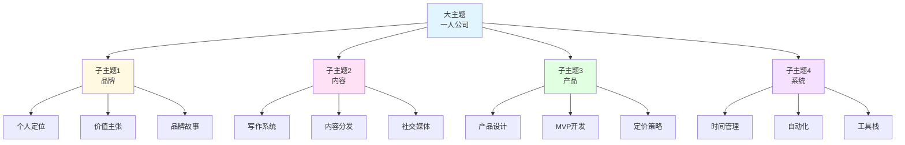
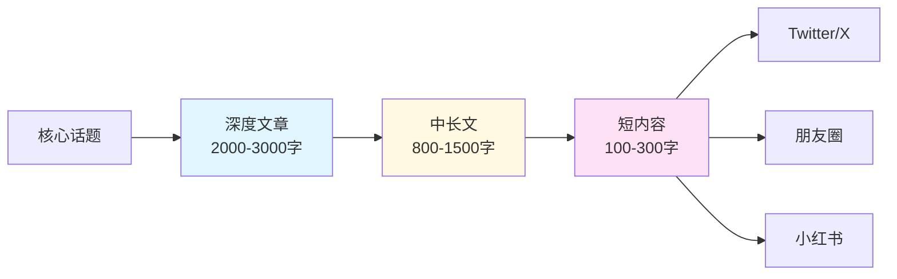

> [!quote] 核心观点
> **内容不是灵感的产物，而是系统的输出。**
> 
> 持续创作的秘密不是等待灵感，而是建立内容系统。

## 为什么需要内容策略

很多人的内容创作困境：
- "不知道写什么"
- "写一篇就没素材了"
- "每次都要从零开始"
- "内容质量不稳定"

> [!important] 问题根源
> **没有系统，只能靠灵感。**
> 
> 灵感是不可持续的，系统才是。

## 🎯 主题树法：建立内容体系

Dan Koe 的主题树法（Topic Tree）是最强大的内容规划工具。



### 第一步：确定大主题

**你的大主题应该是：**
- 你的核心领域
- 你的目标受众关心的
- 你能长期深耕的

**示例**：
- 一人公司
- 知识管理
- 个人成长
- 健康生活
- 财务自由

**我的大主题**：一人公司实战

---

### 第二步：拆解子主题

**每个大主题拆解成3-5个子主题**

使用 Dan Koe 的框架：
1. **品牌** - 你是谁
2. **内容** - 你说什么
3. **产品** - 你提供什么
4. **系统** - 你如何运转

**或者用永恒市场框架**：
1. **健康** - Health
2. **财富** - Wealth
3. **关系** - Relationships
4. **幸福** - Happiness

---

### 第三步：展开具体话题

**每个子主题拆解成10-20个具体话题**

**示例：品牌子主题**
```
1. 个人定位
2. 价值主张
3. 目标受众
4. 品牌故事
5. 差异化优势
6. 品牌视觉
7. 品牌声音
8. 社交媒体形象
9. 个人网站
10. 品牌一致性
...
```

**每个话题可以写3-10篇文章**
- 入门级
- 进阶级
- 实战案例
- 常见错误
- 工具推荐

---

### 第四步：构建内容矩阵



**内容金字塔**：
- **1篇深度文章** → 
- **3篇中长文** → 
- **10-15条短内容**

## 💡 实战练习：建立你的主题树

> [!success] 花60分钟完成主题规划
> 
> ### 步骤1：确定大主题
> 
> **我的核心领域是：**
> 
> _____________________
> 
> **为什么选择这个？**
> - 我有经验吗？_____
> - 我有热情吗？_____
> - 有市场需求吗？_____
> - 能长期做吗？_____
> 
> ### 步骤2：拆解子主题
> 
> **4个主要子主题：**
> 
> 1. _____________________
> 2. _____________________
> 3. _____________________
> 4. _____________________
> 
> ### 步骤3：展开话题（选一个子主题）
> 
> **子主题：** _____
> 
> **10个具体话题：**
> 1. _____
> 2. _____
> 3. _____
> 4. _____
> 5. _____
> 6. _____
> 7. _____
> 8. _____
> 9. _____
> 10. _____
> 
> ### 步骤4：规划第一批内容
> 
> **本周要创作的3个话题：**
> 1. _____（入门级）
> 2. _____（实战案例）
> 3. _____（常见错误）

## 🎯 内容金字塔策略

### 层级1：入门内容（80%）

**目标**：吸引流量，建立认知

**特点**：
- 解决常见问题
- 降低理解门槛
- 引发共鸣
- 易于传播

**内容类型**：
- 清单类（"10个XX方法"）
- 对比类（"XX vs YY"）
- 入门指南（"如何开始XX"）
- 常见错误（"5个常犯的错误"）

**示例标题**：
- "一人公司新手常犯的5个错误"
- "如何在30天内找到你的定位"
- "写作 vs 视频：哪个更适合你？"

---

### 层级2：中级内容（15%）

**目标**：建立专业性，培养信任

**特点**：
- 系统化方法论
- 深入分析
- 实战案例
- 需要一定基础

**内容类型**：
- 框架模型（"XX框架详解"）
- 案例分析（"我如何做到XX"）
- 深度教程（"完整的XX流程"）
- 工具评测（"XX工具深度测评"）

**示例标题**：
- "我的内容创作系统完整拆解"
- "从0到1建立个人品牌的完整路径"
- "如何设计你的第一个数字产品"

---

### 层级3：高级内容（5%）

**目标**：展示深度，促成转化

**特点**：
- 战略思考
- 深度洞察
- 长期价值
- 引导产品

**内容类型**：
- 深度思考（"关于XX的思考"）
- 年度总结（"我的XX年回顾"）
- 理念阐述（"为什么我相信XX"）
- 产品介绍（"我的XX产品"）

**示例标题**：
- "一人公司的哲学：自由与责任"
- "我的2025：从程序员到创造者"
- "为什么我创造了MDFriday"

## 🌟 案例分析：我的内容策略

### 主题树结构

```
一人公司实战
├── 品牌（25%）
│   ├── 个人定位
│   ├── 价值主张
│   ├── 目标受众
│   └── 品牌故事
├── 内容（35%）最多
│   ├── 写作系统
│   ├── 内容分发
│   ├── 社交媒体
│   └── 内容案例
├── 产品（25%）
│   ├── 产品设计
│   ├── MVP开发
│   ├── 产品迭代
│   └── 定价策略
└── 系统（15%）
    ├── 时间管理
    ├── 工具栈
    ├── 自动化
    └── 持续改进
```

---

### 内容分发策略

**每周产出**：
```
1篇深度文章（2000字）
  ↓
3篇中长文（800字）
  ↓
10-15条短内容
```

**具体流程**：

**周一**：
- 写深度文章（2小时）
- 主题：从主题树选择

**周二-周四**：
- 将深度文章拆解成3篇中文
- 每天30分钟

**周五**：
- 提炼10-15条短内容
- 准备下周素材

**周末**：
- 分发短内容
- 互动评论
- 收集反馈

---

### 内容日历示例

**第一周：品牌主题**
```
深度文章：《如何找到你的个人定位》
  ↓
中文1：《定位的3个常见错误》
中文2：《我的定位演变历程》
中文3：《定位练习：3个问题》
  ↓
短内容：
- "最赚钱的细分市场就是你自己"
- "不要模仿别人的成功路径"
- "你的独特组合就是护城河"
- ... 10条金句/观点
```

**第二周：内容主题**
```
深度文章：《建立持续创作的写作系统》
  ↓
中文1：《我的每日写作流程》
中文2：《如何克服写作障碍》
中文3：《5个写作工具推荐》
  ↓
短内容：
- "写作是思考的工具"
- "不要等灵感，建立系统"
- "每天写1000字的秘密"
- ... 10条技巧
```

## 💡 内容选题的4个方法

### 方法1：问题收集法

**来源**：
- 用户咨询的问题
- 社群讨论的话题
- 评论区的疑问
- 自己遇到的困难

**工具**：
- Notion数据库
- Apple Notes
- Obsidian

**示例**：
```
问题：如何开始写作？
 ↓
文章：《30天写作启动计划》
```

---

### 方法2：热点借势法

**监控**：
- 行业新闻
- 社交媒体热搜
- 竞品动态
- 技术更新

**原则**：
- 不追所有热点
- 只追与定位相关的
- 加入独特视角

**示例**：
```
热点：GPT-4 发布
 ↓
文章：《AI时代，一人公司的机会》
```

---

### 方法3：内容重组法

**策略**：
- 旧内容新角度
- 多篇内容合并
- 一篇内容拆分
- 不同格式转换

**示例**：
```
3篇品牌相关文章
 ↓
合并：《品牌建设完整指南》
```

---

### 方法4：系列内容法

**好处**：
- 降低选题压力
- 形成体系
- 提高期待感
- 便于后期产品化

**示例**：
```
《一人公司30天挑战》
Day 1: 找到定位
Day 2: 写价值主张
Day 3: 创建受众画像
...
Day 30: 发布第一个产品
```

## 🎯 内容策略检查清单

### 主题规划
- [ ] 确定了大主题
- [ ] 拆解了4个子主题
- [ ] 每个子主题有10+话题
- [ ] 建立了主题树文档

### 内容金字塔
- [ ] 80%入门内容（吸引流量）
- [ ] 15%中级内容（建立信任）
- [ ] 5%高级内容（展示深度）

### 内容日历
- [ ] 规划了4周内容
- [ ] 平衡了不同主题
- [ ] 设定了发布节奏
- [ ] 预留了灵活空间

### 素材库
- [ ] 建立了问题收集系统
- [ ] 记录了内容想法
- [ ] 收集了参考案例
- [ ] 整理了数据/引用

## 🚫 内容策略的常见错误

### 错误1：追求数量忽视质量
❌ "每天发10条内容"

✅ 正确做法：
> "每周1-2篇高质量内容，拆解成10-15条短内容"

---

### 错误2：没有主题体系
❌ "想到什么写什么"

✅ 正确做法：
> "建立主题树，系统化创作"

---

### 错误3：只写入门内容
❌ "只写10个XX、5个YY"

✅ 正确做法：
> "入门内容吸引流量，深度内容建立专业性"

---

### 错误4：不同平台内容一样
❌ "所有平台发同样的内容"

✅ 正确做法：
> "根据平台特点调整格式和风格"

---

### 错误5：没有内容复用
❌ "每条内容只用一次"

✅ 正确做法：
> "1篇深度文章 → 多篇中文 → 多条短内容"

## 🔗 相关资源

### 理论基础
- [[../DK/视频笔记/12|Dan Koe - 真实内容创作与主题树法]]
- [[../DK/视频笔记/19|Dan Koe - 写作的力量]]
- [[../DK/视频笔记/24|Dan Koe - 微教育商业模式]]

### 相关章节
- [[../../1.品牌/01-个人定位|个人定位]] - 内容的基础
- [[02-写作系统|写作系统]] - 如何创作内容
- [[03-内容分发|内容分发]] - 如何传播内容

---

## 🎯 记住

> [!quote] 核心原则
> **内容不是灵感的产物，而是系统的输出。**
> 
> 建立主题树，规划内容金字塔。
> 一次创作，多次使用。
> 系统化创作，持续化输出。
> 
> 你永远不会"没有素材"，
> 只会"没有系统"。

---

*下一章: [[02-写作系统|02. 写作系统 - 如何持续创作]]* 👉

*返回: [[1.一人公司/2.内容/index|内容模块首页]]*
