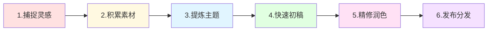

> [!quote] 核心观点
> **写作不是天赋，而是系统。**
> 
> 持续创作的秘密不是灵感，而是流程。

## 为什么写作如此重要

Dan Koe 说："写作是21世纪最重要的技能。"

> [!important] 写作的价值
> - **思考工具**：写作即思考，清晰表达=清晰思维
> - **学习工具**：写下来才能真正理解
> - **营销工具**：所有内容都始于文字
> - **收入工具**：写作可以直接变现

**写作是一切内容的基础：**
- 视频脚本
- 播客大纲
- 社交媒体帖子
- 邮件通讯
- 产品文案

## 🎯 从素材到成文的完整流程



## 💡 第一步：捕捉灵感

### 灵感无处不在

**来源**：
- 阅读时的思考
- 对话中的观点
- 日常生活的感悟
- 解决问题的经验
- 他人内容的启发

### 捕捉工具

**原则**：
> 手机永远在身边，Notes永远在手机上

**推荐工具**：
- **Apple Notes**：快速记录
- **Obsidian Quick Capture**：结构化
- **语音转文字**：想法流
- **截图保存**：视觉素材

**我的流程**：
```
灵感闪现
  ↓
立即记录到 Apple Notes
  ↓
每晚整理到 Obsidian
  ↓
按主题分类
```

---

### 灵感笔记模板

```markdown
# 灵感记录

**时间**：2026-02-28
**来源**：读书/对话/思考

## 核心观点
一句话总结

## 详细想法
展开描述

## 可能的应用
- 文章主题
- 案例素材
- 金句提炼

## 标签
#品牌 #写作 #实战
```

## 💡 第二步：积累素材

### 建立素材库

**素材类型**：

#### 1. 经验素材
- 你解决过的问题
- 你犯过的错误
- 你的突破时刻
- 你的实战案例

#### 2. 观察素材
- 用户的问题
- 社群的讨论
- 评论的疑问
- 行业的动态

#### 3. 学习素材
- 读书笔记
- 课程笔记
- 视频笔记（如Dan Koe）
- 播客笔记

#### 4. 引用素材
- 数据统计
- 研究报告
- 名人名言
- 案例故事

---

### 素材库结构（Obsidian）

```
📁 素材库/
├── 📁 经验/
│   ├── 成功案例/
│   ├── 失败教训/
│   └── 突破时刻/
├── 📁 观察/
│   ├── 用户问题/
│   ├── 市场趋势/
│   └── 竞品分析/
├── 📁 学习/
│   ├── 读书笔记/
│   ├── 课程笔记/
│   └── 视频笔记/
└── 📁 引用/
    ├── 数据/
    ├── 案例/
    └── 金句/
```

---

### 素材积累习惯

**每日**：
- [ ] 记录3个观察
- [ ] 收集1个案例
- [ ] 提炼1条金句

**每周**：
- [ ] 整理本周素材
- [ ] 补充细节和标签
- [ ] 关联相关笔记

## 💡 第三步：提炼主题

### 从素材到主题

**流程**：
```
100条素材
  ↓
发现重复出现的话题
  ↓
确定3-5个主题
  ↓
每个主题规划大纲
```

---

### 主题提炼练习

> [!success] 查看你的素材库
> 
> **步骤1：浏览素材**
> - 阅读近期积累的所有素材
> - 标记让你有感觉的
> 
> **步骤2：发现模式**
> - 哪些话题反复出现？
> - 哪些问题多次遇到？
> - 哪些想法相互关联？
> 
> **步骤3：提炼主题**
> - 给每个模式起个名字
> - 这就是你的文章主题
> 
> **步骤4：规划大纲**
> - 列出3-5个要点
> - 每个要点找2-3个素材支撑

---

### 好主题的标准

**清晰**：
- ✅ 一句话能说清楚
- ✅ 别人听得懂
- ✅ 有明确的价值承诺

**相关**：
- ✅ 目标受众关心
- ✅ 解决真实问题
- ✅ 有实用价值

**独特**：
- ✅ 有你的观点
- ✅ 有你的经历
- ✅ 有你的洞察

## 💡 第四步：快速初稿

### 2小时写作法

**核心原则**：
> 不要边写边改，先完成再完美

**流程**：

**00:00 - 00:15 (15分钟)：准备**
- 确定主题和大纲
- 收集相关素材
- 设定字数目标

**00:15 - 01:45 (90分钟)：快写**
- 关闭所有干扰
- 按大纲快速写作
- 不要回头修改
- 保持心流状态

**01:45 - 02:00 (15分钟)：休息**
- 离开屏幕
- 喝水/走动
- 让大脑休息

---

### 写作环境设置

**物理环境**：
- 安静的空间
- 舒适的座椅
- 充足的光线
- 水和零食

**数字环境**：
- 专注模式（勿扰）
- 关闭通知
- 关闭浏览器标签页
- 使用专注工具

**我的工具**：
- Obsidian（专注写作）
- Focus（番茄钟）
- Cold Turkey（屏蔽干扰）
- 白噪音/音乐

---

### 克服写作障碍

**问题1：不知道从哪里开始**

✅ 解决方案：
- 先写大纲
- 从最容易的部分写起
- 允许写"垃圾"初稿

---

**问题2：写着写着卡住了**

✅ 解决方案：
- 跳过这部分，继续写下一部分
- 写"待补充"，留个标记
- 换个角度重新开始

---

**问题3：总想着完美**

✅ 解决方案：
- 提醒自己：这只是初稿
- 设定时间限制（强制推进）
- 接受不完美

---

**问题4：被干扰打断**

✅ 解决方案：
- 提前告知家人/同事
- 使用勿扰模式
- 记录中断点，方便恢复

## 💡 第五步：精修润色

### 第二天再修改

> [!tip] 关键原则
> **写作和编辑是两个不同的思维模式**
> 
> 写完初稿后，至少等几小时（最好隔天）再修改

---

### 修改清单

#### 第一遍：结构检查

- [ ] 逻辑流畅吗？
- [ ] 论点清晰吗？
- [ ] 有足够支撑吗？
- [ ] 删除偏题内容
- [ ] 调整段落顺序

#### 第二遍：内容优化

- [ ] 增加具体案例
- [ ] 补充数据/引用
- [ ] 强化开头和结尾
- [ ] 添加小标题
- [ ] 插入过渡句

#### 第三遍：文字润色

- [ ] 删除废话
- [ ] 简化长句
- [ ] 替换重复词
- [ ] 优化表达
- [ ] 检查语法错误

#### 第四遍：格式美化

- [ ] 添加小标题
- [ ] 调整段落长度
- [ ] 使用列表
- [ ] 加粗重点
- [ ] 添加引用框

---

### 好文章的特征

**开头**：
- 5秒内抓住注意力
- 明确价值承诺
- 引发好奇或共鸣

**正文**：
- 结构清晰
- 逻辑连贯
- 案例丰富
- 易于阅读（短段落）

**结尾**：
- 总结要点
- 行动号召
- 引导下一步

## 🌟 案例分析：我的写作流程

### 真实案例：写一篇关于"产品定价"的文章

**Day 1 - 周一（素材积累）**
```
9:00 - 9:30
- 回顾笔记中关于定价的素材
- 重读 Dan Koe 相关视频笔记
- 浏览 MDFriday 定价调整记录

收集到的素材：
- 我的定价演变（$4.9 → $9.9）
- 用户对涨价的反应
- 定价心理学原理
- 竞品定价分析
```

**Day 2 - 周二（提炼主题）**
```
14:00 - 14:30
确定主题：《定价策略：为价值定价》

大纲：
1. 为什么定价重要
2. 价值定价 vs 成本定价
3. 定价心理学
4. 我的定价演变
5. 如何为产品定价
```

**Day 3 - 周三（快速初稿）**
```
早上 9:00 - 11:00（2小时专注写作）

环境设置：
- Obsidian 专注模式
- 手机静音
- 关闭浏览器
- 戴上耳机（白噪音）

写作过程：
09:00 - 09:15  准备和大纲细化
09:15 - 10:45  快速写作（不回头）
10:45 - 11:00  休息

产出：初稿 2,500 字
质量：粗糙但完整
```

**Day 4 - 周四（精修润色）**
```
下午 15:00 - 17:00

第一遍（30分钟）：
- 调整结构
- 删除重复
- 补充遗漏

第二遍（30分钟）：
- 增加案例
- 添加数据
- 强化论点

第三遍（30分钟）：
- 文字润色
- 简化表达
- 修正语法

第四遍（30分钟）：
- 格式优化
- 添加小标题
- 插入引用框
- 最后检查

产出：定稿 3,200 字
```

**Day 5 - 周五（发布分发）**
```
- 添加 frontmatter
- 检查链接
- 发布到 Obsidian vault
- 同步到 MDFriday 网站
```

---

### 时间分配总结

```
素材积累：30分钟
主题提炼：30分钟
快速初稿：2小时
精修润色：2小时
发布分发：30分钟
───────────────
总计：5.5小时 → 一篇3000字深度文章
```

**效率提升关键**：
- 素材库降低了60%时间
- 快速初稿避免了完美主义陷阱
- 延迟修改提升了编辑质量

## 💡 建立每日写作习惯

### 21天写作挑战

**目标**：养成每天写作的习惯

**规则**：
- 每天至少写500字
- 不求质量，只求完成
- 连续21天不间断

**示例计划**：

**第1周：自由写作**
- 写任何想写的
- 不发布，只练习
- 目标：建立习惯

**第2周：主题写作**
- 从主题树选话题
- 写给自己看
- 目标：结构化思考

**第3周：公开写作**
- 选最好的3篇发布
- 获取反馈
- 目标：克服恐惧

---

### 写作习惯设计

**触发器**：
- 时间触发（每天早上9点）
- 地点触发（固定的咖啡馆）
- 行为触发（喝完咖啡后）

**仪式感**：
- 固定的开场音乐
- 固定的写作位置
- 固定的工具设置

**奖励**：
- 完成后喝杯好咖啡
- 记录在习惯追踪器
- 每周回顾进步

## 🚫 写作的常见错误

### 错误1：等待灵感
❌ "等有灵感了再写"

✅ 正确做法：
> "建立系统，定时写作"

---

### 错误2：边写边改
❌ "写一句改一句"

✅ 正确做法：
> "快速初稿，延迟修改"

---

### 错误3：追求完美
❌ "这段话不够好，重写"

✅ 正确做法：
> "先完成，再完美"

---

### 错误4：没有系统
❌ "想到什么写什么"

✅ 正确做法：
> "素材库 → 主题 → 大纲 → 成文"

---

### 错误5：孤立写作
❌ "只写不读不学"

✅ 正确做法：
> "输入（阅读学习） + 输出（写作）"

## 🎯 写作系统检查清单

### 基础设施
- [ ] 有灵感捕捉工具
- [ ] 有素材库系统
- [ ] 有主题树
- [ ] 有写作模板

### 写作环境
- [ ] 有专注的空间
- [ ] 有防干扰措施
- [ ] 有固定的时间
- [ ] 有合适的工具

### 写作流程
- [ ] 每天捕捉灵感
- [ ] 每周积累素材
- [ ] 每周提炼主题
- [ ] 每周完成初稿
- [ ] 隔天精修润色

### 习惯培养
- [ ] 设定了固定时间
- [ ] 设置了触发器
- [ ] 记录写作进度
- [ ] 有奖励机制

## 🔗 相关资源

### 理论基础
- [[../DK/视频笔记/19|Dan Koe - 写作：每天两小时赚取80万美元的技能]]
- [[../DK/视频笔记/12|Dan Koe - 真实内容创作]]
- [[../DK/视频笔记/27|Dan Koe - 掌握说服力]]

### 相关章节
- [[01-内容策略|内容策略]] - 写什么
- [[03-内容分发|内容分发]] - 如何传播
- [[../../4.系统/01-时间管理|时间管理]] - 如何安排写作时间

### 实战案例
- [[实战案例/Obsidian写作工作流|我的完整写作工作流]]

---

## 🎯 记住

> [!quote] 核心原则
> **写作不是天赋，而是系统。**
> 
> 不要等待灵感，建立流程。
> 不要追求完美，先完成再完善。
> 不要孤立写作，结合阅读学习。
> 
> 写作是思考的工具，
> 系统化写作是持续创作的秘密。

---

*下一章: [[03-内容分发|03. 内容分发 - 让内容发挥最大价值]]* 👉

*返回: [[1.一人公司/2.内容/index|内容模块首页]]*
