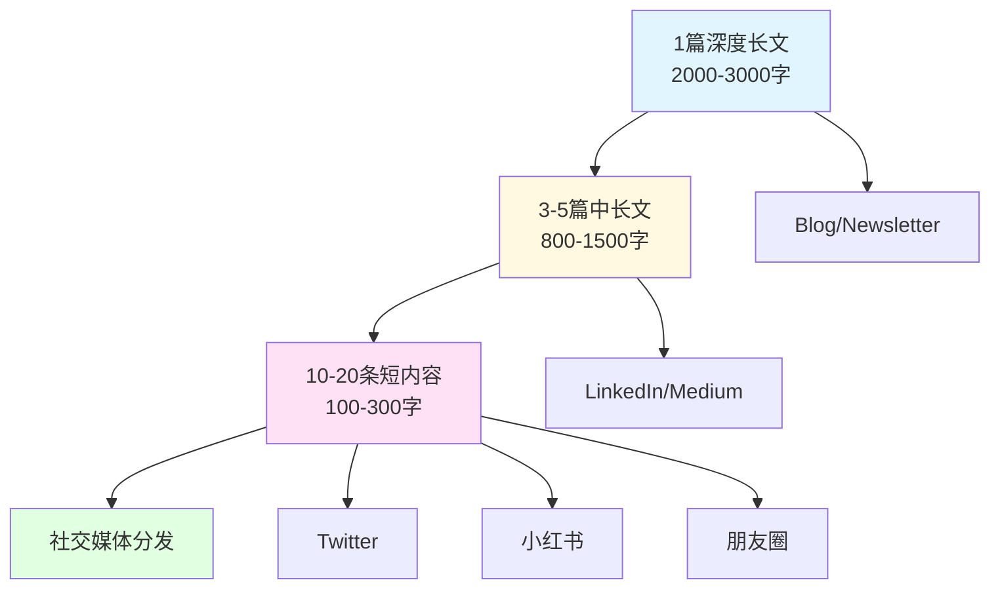

> [!quote] 核心观点
> **一次创作，多次使用。**
> 
> 好的内容分发系统让你的创作效率提升10倍。

## 为什么需要内容分发策略

很多创作者的困境：
- 写了很多内容，但传播不广
- 每个平台都要重新创作，太累
- 不知道在哪个平台发布
- 内容只用一次就浪费了

> [!important] 核心问题
> **没有分发系统，创作价值只发挥了10%。**

**好的分发策略 = 创作价值 × 10**

## 🎯 内容分发金字塔



### 层级1：深度长文（核心资产）

**特点**：
- 2000-3000字
- 系统化内容
- 长期价值
- 可产品化

**发布渠道**：
- 个人博客/网站
- Email Newsletter
- Medium/Substack

**目的**：
- 建立专业性
- 积累长期资产
- SEO流量
- 转化产品/服务

---

### 层级2：中长文（扩散传播）

**特点**：
- 800-1500字
- 聚焦单一话题
- 实用价值
- 易于传播

**发布渠道**：
- LinkedIn
- 公众号
- 知乎
- 即刻

**目的**：
- 扩大影响力
- 引流到长文
- 建立可信度

---

### 层级3：短内容（吸引流量）

**特点**：
- 100-300字
- 一个观点/金句
- 快速消费
- 高传播性

**发布渠道**：
- Twitter/X
- 小红书
- 朋友圈
- LinkedIn (短帖)

**目的**：
- 吸引注意力
- 测试想法
- 引流到中长文
- 日常曝光

## 💡 从长文到短内容的拆解

### 实战案例：一篇文章的完整分发

**原文**：《产品定价策略：为价值定价》（3000字）

---

#### 第一步：提炼核心观点

从3000字文章中提炼：
- 3-5个核心论点
- 10个金句
- 5个案例/数据
- 3个实用技巧

**示例**：
```
核心论点：
1. 定价是价值表达，不是成本加成
2. 10倍价值规则
3. 价格影响客户质量
4. 定价心理学
5. 我的定价演变

金句：
1. "定价不是成本加成，而是价值的表达"
2. "你的定价决定了你服务什么样的客户"
3. "低价吸引低质量客户"
...
```

---

#### 第二步：拆解成中长文

**中长文1：《定价的3个常见错误》**（1000字）
```
从原文中提取：
- 错误1：定价太低
- 错误2：成本定价
- 错误3：不敢涨价
+ 每个错误的案例
+ 正确做法
```

**中长文2：《我的定价演变：从$4.9到$9.9》**（800字）
```
从原文中提取：
- MDFriday 定价历程
- 每次调整的原因
- 数据和结果
- 学到的教训
```

**中长文3：《如何为产品定价：实用清单》**（1200字）
```
从原文中提取：
- 计算客户价值
- 设置价格锚点
- 价格阶梯设计
- 测试与优化
```

---

#### 第三步：拆解成短内容

**Twitter/X帖子（15条）**：

```
1. 定价不是成本加成，而是价值的表达。

你收费$100，不是因为成本是$100，
而是因为你帮客户创造了$1000价值。

定价的秘密：10倍价值规则。

---

2. 很多人定价太低，不是因为谦虚，
而是因为害怕。

害怕没人买单。
害怕被拒绝。
害怕不够好。

但真相是：定价太低更危险。

---

3. 低价吸引什么人？

要求多的人。
抱怨多的人。
付费意愿低的人。

高价吸引什么人？

重视价值的人。
认真对待的人。
愿意长期合作的人。

价格筛选客户。

---

4. 我的 MDFriday 定价演变：

V1: $4.9/月
- 用户多，抱怨多
- 流失率25%
- 不可持续

V2: $9.9/月
- 用户质量提升
- 流失率降到12%
- MRR翻倍

定价不是越低越好。

---

5. 如何为产品定价？

第一步：计算客户价值
- 节省的时间 × 时薪
- 增加的收入
- 避免的损失

第二步：收取10%
- 价值$1000 → 定价$99
- 价值$10000 → 定价$999

第三步：测试调整

---

... 继续10条
```

**小红书帖子（5条图文）**：

```
标题：《定价太低？你可能犯了这3个错误》

图1：封面 + 标题
图2：错误1 - 成本定价
图3：错误2 - 害怕涨价
图4：错误3 - 没有价格阶梯
图5：正确做法 + 行动号召

---

标题：《我把产品从$4.9涨到$9.9后发生了什么》

图1：前后对比数据
图2：用户质量变化
图3：收入变化
图4：学到的教训
图5：给你的建议
```

**朋友圈/即刻（每天1条）**：

```
Day 1: 分享金句
Day 2: 分享数据
Day 3: 分享案例
Day 4: 分享错误
Day 5: 分享工具
...
```

## 🎯 平台特点与策略

### Twitter/X

**特点**：
- 280字符限制
- 快速消费
- 传播性强
- 注重观点

**策略**：
- 发布金句和观点
- 用Thread展开论述
- 每天2-3条
- 高峰时段发布

**内容类型**：
- 一句话观点
- 数据/统计
- 反常识
- 个人故事（串推）

---

### LinkedIn

**特点**：
- 专业人群
- 长文友好
- B2B导向
- 重视价值

**策略**：
- 深度见解
- 行业分析
- 案例研究
- 每周2-3篇

**内容类型**：
- 职场经验
- 商业洞察
- 个人成长
- 行业趋势

---

### 小红书

**特点**：
- 图文为主
- 年轻用户
- 生活化内容
- 搜索流量

**策略**：
- 精美排版
- 实用干货
- 个人经历
- SEO优化标题

**内容类型**：
- 工具推荐
- 方法论
- 避坑指南
- Before/After对比

---

### 公众号

**特点**：
- 私域流量
- 长文深度
- 推送触达
- 变现容易

**策略**：
- 每周1-2篇
- 深度内容
- 系列专题
- 引导关注

**内容类型**：
- 深度教程
- 系列文章
- 案例拆解
- 产品介绍

---

### Email Newsletter

**特点**：
- 最私密
- 打开率高
- 转化率高
- 长期价值

**策略**：
- 每周固定发送
- 提供独家价值
- 建立深度连接
- 引导产品

**内容类型**：
- 每周精选
- 深度思考
- 独家分享
- 产品更新

## 💡 内容分发工作流

### 每周分发流程

**周一：创作深度长文**
```
9:00 - 11:00
- 写作长文（2000-3000字）
- 主题从内容策略选择
- 发布到个人网站
- 发送Email Newsletter
```

**周二：拆解中长文1**
```
9:00 - 10:00
- 从长文提取第一个主题
- 写成800-1500字
- 发布到LinkedIn
```

**周三：拆解中长文2**
```
9:00 - 10:00
- 从长文提取第二个主题
- 写成800-1500字
- 发布到知乎/公众号
```

**周四：拆解短内容**
```
9:00 - 10:30
- 提取10-15个金句/观点
- 设计小红书图文（3-5张）
- 排期发布
```

**周五：分发与互动**
```
全天
- Twitter: 发布3条短内容
- LinkedIn: 互动评论
- 小红书: 发布图文
- 回复评论和私信
```

**周末：复盘与规划**
```
- 查看数据
- 收集反馈
- 调整策略
- 规划下周内容
```

---

### 内容复用矩阵

| 原始内容 | 可拆解为 | 发布平台 |
|---------|---------|---------|
| 1篇3000字长文 | → 3篇中长文 | LinkedIn/知乎/公众号 |
|  | → 10条Twitter | Twitter/X |
|  | → 5张小红书图文 | 小红书 |
|  | → 15条朋友圈 | 微信朋友圈 |
|  | → 1期Newsletter | Email |
|  | → 1个短视频脚本 | 抖音/视频号 |

**效率提升**：
- 1次创作 → 35+次曝光
- 触达不同平台用户
- 延长内容生命周期

## 🌟 案例分析：我的分发系统

### 一个月的内容分发

**Week 1: 品牌主题**
```
深度长文：《如何找到你的个人定位》
  ↓
LinkedIn: 《定位的3个常见错误》
知乎: 《我的定位演变历程》
公众号: 《定位练习：找到你的独特价值》
  ↓
Twitter: 15条观点
小红书: 5张图文
朋友圈: 7天每天1条
```

**Week 2: 内容主题**
```
深度长文：《建立持续创作的写作系统》
  ↓
3篇中长文
15条短内容
```

**Week 3: 产品主题**
```
深度长文：《7天MVP开发法》
  ↓
3篇中长文
15条短内容
```

**Week 4: 系统主题**
```
深度长文：《我的一天工作流》
  ↓
3篇中长文
15条短内容
```

---

### 分发效果数据

**投入**：
- 每周2小时写长文
- 每周3小时拆解分发
- 总计：5小时/周

**产出**：
- 4篇深度长文/月
- 12篇中长文/月
- 60条短内容/月

**触达**：
- 网站访问：5,000+/月
- 社交媒体曝光：50,000+/月
- Email打开率：40%
- 新增关注：200+/月

**转化**：
- 产品试用：50+/月
- 付费转化：10+/月
- 咨询预约：5+/月

**ROI**：
- 时间投入：20小时/月
- 获得价值：远超单独创作

## 🚫 内容分发的常见错误

### 错误1：所有平台发相同内容
❌ "复制粘贴到所有平台"

✅ 正确做法：
> "根据平台特点调整格式和风格"

**示例**：
- Twitter: 精简到280字
- LinkedIn: 扩展加案例
- 小红书: 设计图文排版

---

### 错误2：不做任何调整
❌ "3000字长文直接发Twitter"

✅ 正确做法：
> "提取核心观点，适配平台"

---

### 错误3：一次性发完
❌ "今天把所有平台都发了"

✅ 正确做法：
> "分散在一周内持续发布"

---

### 错误4：忽视数据
❌ "发完就不管了"

✅ 正确做法：
> "追踪数据，优化策略"

---

### 错误5：没有CTA
❌ "只发内容，不引导行动"

✅ 正确做法：
> "每篇内容都有明确的下一步"

## 🎯 内容分发检查清单

### 长文发布
- [ ] 发布到个人网站
- [ ] 发送Email Newsletter
- [ ] 更新到 Obsidian vault
- [ ] 同步到 MDFriday

### 中长文拆解
- [ ] 提取3个主题
- [ ] 写成独立文章
- [ ] 发布到2-3个平台
- [ ] 添加内部链接

### 短内容拆解
- [ ] 提取10+观点/金句
- [ ] 设计小红书图文
- [ ] 排期Twitter发布
- [ ] 准备朋友圈素材

### 分发执行
- [ ] 按计划发布
- [ ] 及时互动回复
- [ ] 记录数据
- [ ] 每周复盘

## 🔗 相关资源

### 理论基础
- [[../DK/视频笔记/24|Dan Koe - 微教育企业的未来]]
- [[../DK/视频笔记/29|Dan Koe - 智能创作者如何增长]]

### 相关章节
- [[01-内容策略|内容策略]] - 创作什么内容
- [[02-写作系统|写作系统]] - 如何创作内容
- [[04-社交媒体运营|社交媒体运营]] - 平台运营技巧

---

## 🎯 记住

> [!quote] 核心原则
> **一次创作，多次使用。**
> 
> 好的分发系统让创作价值提升10倍。
> 
> 从长文到短内容，系统化拆解。
> 根据平台特点，优化呈现形式。
> 持续发布，数据驱动优化。
> 
> 内容的价值不在创作，而在传播。

---

*下一章: [[04-社交媒体运营|04. 社交媒体运营 - 在哪里发声]]* 👉

*返回: [[index|内容模块首页]]*
