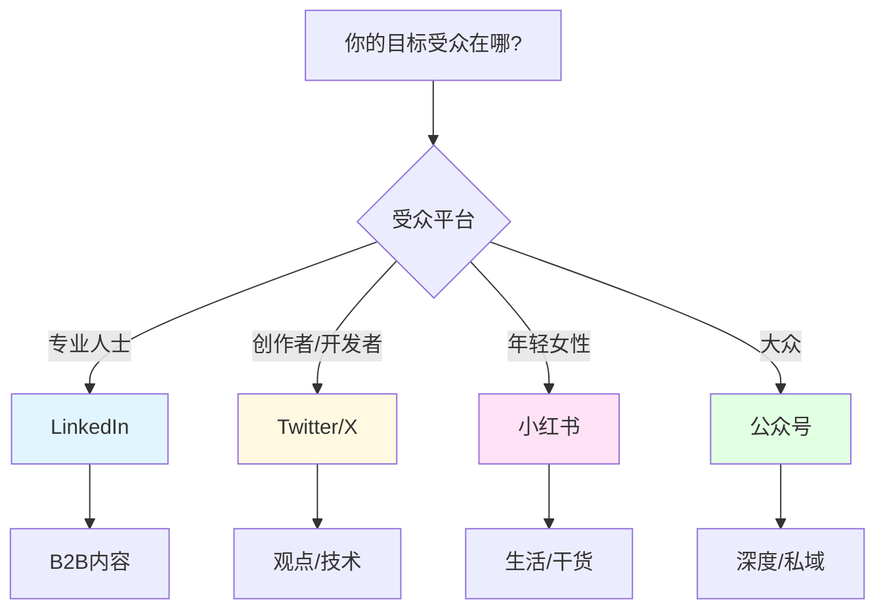

> [!quote] 核心观点
> **社交媒体不是虚荣指标，而是连接和信任的工具。**
> 
> 选对平台，找对人,建立真实连接。

## 为什么需要社交媒体

很多人对社交媒体的误解：
- "我不喜欢社交媒体"
- "刷抖音是浪费时间"
- "我不想成为网红"

> [!important] 重新认识社交媒体
> **社交媒体 = 互联网的前端**
> 
> 如果你想做一人公司，你需要：
> - 被人看见（流量）
> - 建立信任（内容）
> - 产生连接（关系）
> 
> 社交媒体是实现这些的工具。

## 🎯 选择适合你的平台

### 不要在所有平台

**错误想法**：
- "我要在所有平台都有账号"
- "哪个平台火就去哪个"

**正确思维**：
> **专注1-2个主平台 + 1-2个辅助平台**

---

### 平台选择矩阵



### 主流平台对比

| 平台 | 适合人群 | 内容类型 | 优势 | 劣势 |
|------|---------|---------|------|------|
| **Twitter/X** | 创作者/技术 | 观点/讨论 | 传播快/国际化 | 流量不稳定 |
| **LinkedIn** | 职场/B2B | 专业内容 | 高质量受众 | 增长慢 |
| **小红书** | 年轻女性 | 图文/生活 | SEO好/转化高 | 审核严 |
| **公众号** | 全人群 | 深度长文 | 私域/变现好 | 打开率下降 |
| **知乎** | 求知者 | 问答/深度 | SEO好/长尾 | 商业化弱 |
| **即刻** | 互联网从业者 | 动态/分享 | 氛围好/精准 | 用户少 |

---

### 我的平台选择

**主平台：Twitter/X**
- 目标受众：创作者、开发者
- 内容：观点、方法、案例
- 频率：每天2-3条
- 目标：建立影响力

**辅助平台1：LinkedIn**
- 目标受众：专业人士
- 内容：深度见解、案例
- 频率：每周2-3篇
- 目标：B2B连接

**辅助平台2：小红书**
- 目标受众：工具使用者
- 内容：教程、工具评测
- 频率：每周2篇
- 目标：产品转化

**私域平台：Email Newsletter**
- 最核心的受众
- 每周1篇深度内容
- 最高转化率

## 💡 30天社交媒体启动计划

### Week 1: 设置与定位

**Day 1-2：账号设置**
- [ ] 选择1-2个主平台
- [ ] 完善个人资料
- [ ] 写清晰的bio
- [ ] 添加头像和封面

**Bio模板**：
```
[你是谁] | [你做什么] | [你帮助谁]

示例：
知识工具创造者 | MDFriday 开发者 | 
帮助 Obsidian 用户5分钟发布精美网站

🔗 网站链接
📧 Newsletter链接
```

**Day 3-4：研究与学习**
- [ ] 找到10个对标账号
- [ ] 分析他们的内容策略
- [ ] 记录他们的风格特点
- [ ] 学习他们的互动方式

**Day 5-7：规划内容**
- [ ] 确定内容主题
- [ ] 准备第一周内容
- [ ] 设计发布节奏
- [ ] 准备素材库

---

### Week 2: 持续发布

**每天任务**：
- [ ] 发布1-2条内容
- [ ] 评论5-10个相关帖子
- [ ] 回复所有评论
- [ ] 关注3-5个相关账号

**内容类型**：
- 个人故事
- 学习心得
- 实用技巧
- 观点分享

**互动策略**：
- 真诚评论（不是"很棒"）
- 提出问题
- 分享经验
- 建立连接

---

### Week 3: 建立联系

**目标**：
- 找到同行/同学阶段的创作者
- 建立互助关系
- 互相支持

**方法**：
- 参加Twitter Spaces
- 加入相关Discord/社群
- 私信真诚互动
- 分享彼此内容

---

### Week 4: 优化迭代

**复盘分析**：
- [ ] 哪类内容表现最好？
- [ ] 什么时间发布效果好？
- [ ] 哪些话题引发讨论？
- [ ] 增长了多少关注者？

**优化方向**：
- 聚焦高表现内容
- 调整发布时间
- 深化互动策略
- 建立发布系统

## 🎯 高效内容创作技巧

### Twitter/X 内容框架

#### 1. 观点式
```
[大胆观点]

[为什么这么说]

[例子/数据支撑]

[行动建议]
```

**示例**：
```
定价不是成本加成，而是价值的表达。

很多人定价$100，是因为成本$80+利润$20。
这是错误的。

正确的定价：
客户获得$1000价值 → 收费$99（10%）

你的产品帮客户节省/赚到多少钱？
那就是你的定价基础。
```

---

#### 2. 故事式
```
[开场：时间+情境]

[冲突/问题]

[转折]

[结果/教训]
```

**示例**：
```
2年前的今天，我辞掉了程序员工作。

当时的我：
- 害怕失败
- 担心收入
- 不知道方向

今天的我：
- 每天工作4小时
- 收入是之前的2倍
- 完全的时间自由

最大的教训：
不要等准备好了才开始。
开始了，就会准备好。
```

---

#### 3. 清单式
```
[吸引眼球的数字]

1. 第一点
2. 第二点
3. 第三点

[总结/行动]
```

**示例**：
```
一人公司必备的5个工具：

1. Obsidian - 知识管理
2. MDFriday - 内容发布
3. Stripe - 收款
4. ConvertKit - 邮件
5. Calendly - 预约

第1和第2组合，就是完整的内容系统。
```

---

#### 4. 对比式
```
❌ 错误做法

✅ 正确做法

[为什么区别很重要]
```

**示例**：
```
建立一人公司：

❌ 等想法完美了再开始
✅ 有60%把握就行动

❌ 追求所有功能
✅ 只做核心功能

❌ 等用户自己来
✅ 主动去找用户

完美是进步的敌人。
```

### LinkedIn 内容框架

#### 长文结构
```
[开头钩子 - 引发共鸣]

[背景故事]

[核心观点1]
- 展开说明
- 案例支撑

[核心观点2]
- 展开说明
- 案例支撑

[核心观点3]
- 展开说明
- 案例支撑

[总结 + 行动号召]
```

---

### 小红书内容框架

#### 图文设计

**封面（图1）**：
- 吸引眼球的标题
- 简洁的配图
- 视觉冲击力

**内容（图2-5）**：
- 每张图一个要点
- 大字清晰
- 配色统一
- 留白舒适

**结尾（最后一张）**：
- 总结要点
- 行动号召
- 引导关注

**文案**：
```
[emoji] 吸引人的标题

[3-5行开场]
引起共鸣/制造好奇

[主体内容]
分点说明，每点配emoji

[结尾]
总结 + 互动问题

---
#标签1 #标签2 #标签3
```

## 💡 增长策略

### 策略1：内容为王

> **好内容自带流量**

**什么是好内容？**
- 有用（解决问题）
- 有趣（引发共鸣）
- 有料（提供价值）

**持续产出**：
- 建立内容日历
- 批量创作
- 定时发布

---

### 策略2：互动为本

> **社交媒体=社交+媒体**

**主动互动**：
- 每天评论10条
- 真诚的、有价值的评论
- 不是"很棒👍"

**回复所有评论**：
- 24小时内回复
- 认真回答问题
- 感谢支持
- 建立连接

---

### 策略3：建立部落

> **找到同行者，一起成长**

**什么是部落？**
- 相似阶段的创作者
- 互相支持
- 共同成长

**如何建立？**
1. 找到10-20个同阶段创作者
2. 主动互动他们的内容
3. 私信真诚交流
4. 建立小群互助

**部落的力量**：
- 互相分享内容
- 交流经验
- 情感支持
- 抱团取暖

---

### 策略4：一致性

> **持续出现在受众视野中**

**发布节奏**：
- Twitter: 每天2-3条
- LinkedIn: 每周2-3篇
- 小红书: 每周2篇
- Newsletter: 每周1篇

**不要间断**：
- 算法喜欢活跃账号
- 受众会忘记你
- 一致性建立信任

---

### 策略5：数据驱动

> **不看数据=盲目飞行**

**关注指标**：
- 曝光量
- 互动率
- 点击率
- 关注增长

**优化策略**：
- 什么内容表现好？
- 什么时间发布好？
- 什么话题受欢迎？

## 🌟 案例：我的30天成长

### 起点（Day 0）
```
Twitter: 50 关注者
LinkedIn: 200 连接
Newsletter: 0 订阅者
```

### Day 1-7
```
每天发布：
- 2条Twitter
- 1篇LinkedIn（周3篇）
- 评论10条
- 回复所有评论

增长：
Twitter: 50 → 80 (+60%)
LinkedIn: 200 → 250 (+25%)
```

### Day 8-14
```
内容优化：
- 发现故事式内容表现最好
- 调整为60%故事 + 40%观点

建立部落：
- 找到15个同阶段创作者
- 建立互助小群
- 互相转发内容

增长：
Twitter: 80 → 150 (+88%)
LinkedIn: 250 → 320 (+28%)
```

### Day 15-21
```
深化互动：
- 参加2次Twitter Spaces
- 发起讨论话题
- 私信深度交流

增长：
Twitter: 150 → 250 (+67%)
LinkedIn: 320 → 410 (+28%)
Newsletter: 0 → 50
```

### Day 22-30
```
系统化运营：
- 建立内容日历
- 批量创作内容
- 定时发布

增长：
Twitter: 250 → 400 (+60%)
LinkedIn: 410 → 520 (+27%)
Newsletter: 50 → 120 (+140%)
```

### 30天总结
```
Twitter: 50 → 400 (8倍)
LinkedIn: 200 → 520 (2.6倍)
Newsletter: 0 → 120

关键经验：
1. 一致性 > 完美性
2. 互动 > 单向发布
3. 真诚 > 套路技巧
4. 部落 > 单打独斗
```

## 🚫 社交媒体的常见错误

### 错误1：只发不互动
❌ "我只管发内容"

✅ 正确做法：
> "发布 + 互动 = 完整的社交媒体"

---

### 错误2：追逐虚荣指标
❌ "我要10万粉丝"

✅ 正确做法：
> "我要1000个真正的粉丝"

**真正的粉丝**：
- 看你的内容
- 与你互动
- 会购买产品

---

### 错误3：模仿别人
❌ "XX这么发火了，我也这么发"

✅ 正确做法：
> "学习策略，保持自己的声音"

---

### 错误4：不够真实
❌ "只展示成功，不展示过程"

✅ 正确做法：
> "分享真实的旅程，包括失败"

---

### 错误5：没有耐心
❌ "发了一周没涨粉，放弃了"

✅ 正确做法：
> "至少坚持3个月再看效果"

## 🎯 社交媒体检查清单

### 账号设置
- [ ] 清晰的bio
- [ ] 专业的头像
- [ ] 统一的视觉风格
- [ ] 链接到网站/产品

### 内容策略
- [ ] 确定内容主题
- [ ] 建立内容日历
- [ ] 准备素材库
- [ ] 设计内容模板

### 发布节奏
- [ ] 主平台每天发布
- [ ] 辅助平台每周发布
- [ ] 固定时间发布
- [ ] 保持一致性

### 互动增长
- [ ] 每天主动评论
- [ ] 及时回复评论
- [ ] 建立创作者部落
- [ ] 参与社群活动

### 数据分析
- [ ] 每周查看数据
- [ ] 记录表现好的内容
- [ ] 优化内容策略
- [ ] 调整发布时间

## 🔗 相关资源

### 理论基础
- [[../DK/视频笔记/29|Dan Koe - 智能创作者如何增长受众]]
- [[../DK/视频笔记/32|Dan Koe - 领先99%个人品牌的秘诀]]
- [[../DK/视频笔记/11|Dan Koe - 非功利型人脉建立]]

### 相关章节
- [[01-内容策略|内容策略]] - 创作什么内容
- [[02-写作系统|写作系统]] - 如何创作
- [[03-内容分发|内容分发]] - 分发策略

---

## 🎯 记住

> [!quote] 核心原则
> **社交媒体不是虚荣指标，而是连接工具。**
> 
> 选对平台，找对人，建立真实连接。
> 
> 一致性 > 完美性
> 互动 > 单向发布
> 真诚 > 套路技巧
> 部落 > 单打独斗
> 
> 社交媒体是马拉松，不是百米冲刺。

---

*恭喜！你已完成内容模块 🎉*

*下一模块: [[../../4.系统/index|04. 系统 - 你如何运转]]* 👉

*返回: [[1.一人公司/2.内容/index|内容模块首页]]*
