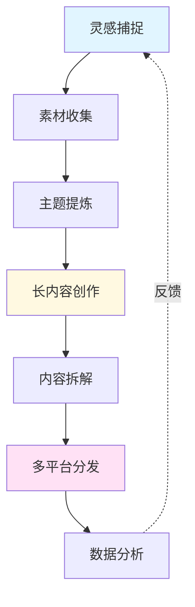

> [!quote] 内容的本质
> **内容不是自我表达，而是价值传递。**
> 
> 在一人公司中，内容是你建立信任、展示专业性、吸引客户的核心手段。

## 为什么内容是一人公司的命脉

在注意力稀缺的时代，**持续输出有价值的内容**是最强大的竞争优势。

> [!important] 内容的三大作用
> - **吸引 (Attract)**: 让陌生人发现你
> - **教育 (Educate)**: 建立专业性和信任
> - **转化 (Convert)**: 将受众变为客户

没有内容，你就是隐形的。
有了内容，你就有了24/7为你工作的销售员。

## 🎯 本模块内容

### [[01-内容策略|01. 内容策略]] - 写什么、怎么写

> **主题树法：从兴趣到内容体系**

在这一章，你将学会：
- 如何使用主题树法建立内容体系
- 内容金字塔：入门→中级→高级
- 如何规划内容日历
- 真实案例：我的内容矩阵

👉 [[01-内容策略|开始学习内容策略]]

---

### [[02-写作系统|02. 写作系统]] - 如何持续创作

> **写作是思考的工具，系统是持续的保障**

在这一章，你将学会：
- 建立每日写作习惯
- 从素材收集到成文的完整流程
- 如何克服写作障碍
- 真实案例：我的写作系统

👉 [[02-写作系统|开始学习写作系统]]

---

### [[03-内容分发|03. 内容分发]] - 让内容发挥最大价值

> **一次创作，多平台分发**

在这一章，你将学会：
- 长内容到短内容的拆解方法
- 邮件列表的建设和运营
- 设计高效的分发矩阵
- 真实案例：我的分发流程

👉 [[03-内容分发|开始学习内容分发]]

---

### [[04-社交媒体运营|04. 社交媒体运营]] - 在哪里发声

> **选对平台，持续输出**

在这一章，你将学会：
- 如何选择适合你的平台
- 不同平台的内容策略
- 互动与社群建设技巧
- 真实案例：30天内容挑战

👉 [[04-社交媒体运营|开始学习社交媒体运营]]

---

## 🎯 实战案例

真实的内容创作过程，包括工具、流程和经验：

### [[实战案例/Obsidian写作工作流|Obsidian 写作工作流]]
从想法捕捉到最终发布的完整流程

### [[实战案例/每日内容创作流程|每日内容创作流程]]
2小时高效创作法的实战应用

### [[实战案例/视频笔记到文章的转化|视频笔记到文章的转化]]
如何将 Dan Koe 视频笔记转化为原创文章

---

## 📊 内容创作流程

## 💡 核心原则

> [!tip] 内容创作的黄金法则
> 
> **1. 真实 > 专业**
> 分享真实的学习过程比假装专家更有吸引力。
> 
> **2. 价值 > 数量**
> 一篇深度好文胜过十篇浅薄的快餐内容。
> 
> **3. 系统 > 灵感**
> 不依赖灵感，建立可持续的创作系统。
> 
> **4. 长期 > 短期**
> 内容是复利游戏，坚持比爆款更重要。

## 🎯 短内容 vs 长内容

| 特性 | 短内容 | 长内容 |
|------|--------|--------|
| **形式** | 推文、短视频、图片 | 文章、视频、播客 |
| **作用** | 吸引注意力 | 建立信任和权威 |
| **转化** | 低 | 高 |
| **时效** | 短 | 长 |
| **策略** | 大量测试，快速迭代 | 精心打磨，长期价值 |

> [!success] 最佳实践
> **短内容吸引流量，长内容建立信任**
> 
> 理想的策略是：每周1-2篇长内容作为核心，拆解成10-20条短内容分发。

## 📝 写作技巧速查

### 好标题的4U原则
- **Urgent (紧迫性)**: 为什么现在要读
- **Unique (独特性)**: 与其他内容的区别
- **Ultra-specific (超具体)**: 明确的价值承诺
- **Useful (有用性)**: 能解决什么问题

### 开头的钩子公式
1. **问题式**: "你是否也遇到过这样的困境..."
2. **故事式**: "去年的这个时候，我..."
3. **数据式**: "95%的人都不知道..."
4. **反常识**: "你一直以为的X其实是错的..."

### 结尾的行动号召
- 明确告诉读者下一步该做什么
- 降低行动门槛
- 提供即时价值

## 🚀 快速开始

> [!success] 7天内容启动计划
> 
> **Day 1-2**: 建立内容主题库
> - [ ] 列出10个你能讲的话题
> - [ ] 为每个话题写3个子主题
> 
> **Day 3-4**: 创作第一篇长内容
> - [ ] 选择一个你最有感触的话题
> - [ ] 写一篇1000字的文章
> 
> **Day 5-6**: 拆解并分发
> - [ ] 将文章拆成10条短内容
> - [ ] 在至少一个平台发布
> 
> **Day 7**: 复盘与调整
> - [ ] 记录数据和反馈
> - [ ] 调整下周计划

## 🔗 相关资源

### 理论基础
- [[DK/视频笔记/19|Dan Koe - 写作：每天两小时赚取80万美元的技能]]
- [[DK/视频笔记/24|Dan Koe - 微教育企业的未来]]
- [[DK/视频笔记/27|Dan Koe - 掌握说服力的四大框架]]

### 内容案例
- [[DK/视频笔记/_index|33个Dan Koe视频笔记]] - 学习大师如何创作
- [[DK/purpose-profit/_index|Purpose & Profit 系列]] - 深度内容示例

### 其他模块
- [[../1.品牌/index|品牌模块]] - 内容的基础是清晰的品牌
- [[../3.产品/index|产品模块]] - 内容的最终目的是转化
- [[../4.系统/index|系统模块]] - 系统化内容创作流程

---

## 🎯 下一步

> [!info] 推荐学习路径
> 1. 先规划 [[01-内容策略|内容策略]]，知道写什么
> 2. 然后建立 [[02-写作系统|写作系统]]，知道怎么写
> 3. 接着设计 [[03-内容分发|分发策略]]，让内容发挥价值
> 4. 最后掌握 [[04-社交媒体运营|平台运营]]，扩大影响力

**不要等到准备好了才开始写，写本身就是最好的准备。**

👉 [[01-内容策略|现在就开始：规划你的内容策略]]

---

*返回: [[../index|一人公司实战笔记首页]]*
