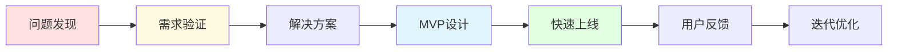

> [!quote] 核心观点
> **最好的产品来自你自己的需求。**
> 
> 不要创造需求，要发现需求。你遇到的问题，就是市场的机会。

## 为什么产品设计是第一步

很多人的失败不是因为执行不够好，而是从一开始就做错了产品。

> [!important] 常见错误
> - ❌ 闭门造车，没有验证需求
> - ❌ 追求完美，迟迟不上线
> - ❌ 功能堆砌，偏离核心价值
> - ❌ 解决假想的问题，而非真实痛点

**好的产品设计，从发现真实问题开始。**

## 🎯 产品设计的核心框架

## 💡 第一步：问题发现

### 好问题的3个特征

#### 1. 你自己遇到过
> **最好的产品来自创始人自己的需求**

**为什么？**
- ✅ 你深刻理解痛点
- ✅ 你就是目标用户
- ✅ 你知道什么才是真正的解决方案

**示例**：
- Dropbox：创始人需要在不同电脑间同步文件
- Notion：创始人想要一个完美的笔记工具
- MDFriday：我需要将 Obsidian 笔记发布为网站

---

#### 2. 很多人也遇到
> **个人需求 × 普遍性 = 市场机会**

**如何验证普遍性？**
- 在社群/论坛搜索相关问题
- 看有多少人在抱怨
- 观察现有解决方案的用户数
- 问问身边的人是否也遇到

**危险信号**：
- ❌ 只有你一个人有这个问题
- ❌ 别人听不懂你在说什么
- ❌ 市场上完全没有类似产品（可能是伪需求）

---

#### 3. 现有方案不够好
> **有痛点 + 无满意解决方案 = 机会**

**常见的"不够好"：**
- 太贵（价格门槛）
- 太复杂（使用门槛）
- 太慢（效率问题）
- 不够美（体验问题）
- 不够灵活（功能限制）

**示例：MDFriday 发现的机会**
- Obsidian Publish：太贵（$8/月起）
- 自建 Quartz：太复杂（需要技术）
- 其他方案：不够美观或不够灵活

## 🎯 实战练习：找到你的产品机会

> [!success] 花30分钟完成这个练习
> 
> ### 第一部分：问题清单
> 
> **列出你在过去一年遇到的10个问题：**
> 
> 1. _____________________
> 2. _____________________
> 3. _____________________
> 4. _____________________
> 5. _____________________
> 6. _____________________
> 7. _____________________
> 8. _____________________
> 9. _____________________
> 10. _____________________
> 
> ### 第二部分：问题评估
> 
> **选择最有潜力的3个问题，评估：**
> 
> **问题1：**
> - 问题描述：_____
> - 痛苦程度（1-10）：_____
> - 遇到频率：_____
> - 我的解决方案：_____
> - 市场上的方案：_____
> - 为什么不够好：_____
> 
> **问题2：**
> （同上）
> 
> **问题3：**
> （同上）
> 
> ### 第三部分：选择最佳机会
> 
> **哪个问题最值得解决？**
> 
> 考虑因素：
> - [ ] 痛苦程度足够高
> - [ ] 很多人也遇到
> - [ ] 我有能力解决
> - [ ] 现有方案不够好
> - [ ] 我愿意长期投入
> 
> **我的选择是：** _____________________

## 💡 第二步：需求验证

在投入大量时间开发前，**先验证需求是否真实存在**。

### 5个快速验证方法

#### 方法1: 问卷调查
**适用场景**：初步了解市场

**步骤**：
1. 设计5-10个问题
2. 在社群/社交媒体发布
3. 收集至少50个回复
4. 分析痛点和需求

**关键问题**：
- 你遇到过XX问题吗？
- 你尝试过哪些解决方案？
- 你最不满意什么？
- 你愿意为解决方案付费吗？

---

#### 方法2: 深度访谈
**适用场景**：深入理解用户

**步骤**：
1. 找到5-10个目标用户
2. 进行30分钟访谈
3. 记录他们的真实困境
4. 了解他们的使用场景

**关键技巧**：
- 问"为什么"5次，挖掘根本需求
- 让他们讲故事，而非回答是/否
- 观察他们的情绪反应

---

#### 方法3: 落地页测试
**适用场景**：验证付费意愿

**步骤**：
1. 创建简单的产品介绍页
2. 放上"立即购买"或"预订"按钮
3. 投放小额广告（$50-100）
4. 看转化率

**判断标准**：
- 点击率 >2%：有兴趣
- 转化率 >1%：愿意付费
- 有人问详情：真实需求

---

#### 方法4: 最小手动版
**适用场景**：快速验证可行性

**步骤**：
1. 在没有产品的情况下提供服务
2. 手动完成用户需要的结果
3. 收集反馈
4. 看是否有复购

**示例**：
- 还没开发自动化工具？先手动帮用户做
- 还没写完整课程？先做一对一咨询
- 还没搭建平台？先用邮件/表格管理

---

#### 方法5: 社群观察
**适用场景**：发现真实需求

**步骤**：
1. 加入目标用户的社群
2. 观察他们讨论什么问题
3. 看哪些问题反复出现
4. 注意他们的表达方式（用词）

**关键信号**：
- "有没有XX工具？"
- "XX方案太贵/复杂了"
- "我想要XX功能"
- "为什么没有人做XX？"

## 🎯 第三步：设计最小可行报价 (MVP Offer)

### 什么是 MVP Offer

> **最小可行报价 = 能解决核心问题的最简方案**

**特点**：
- 聚焦一个核心价值
- 可以在1周内上线
- 价格在 $500-$1000
- 手动交付也可以

### 三种 MVP Offer 类型

#### 类型1: 服务型 MVP
**适合**：还没产品，但有专业知识

**示例**：
- 4次咨询通话（每次1小时）
- 价格：$1000
- 交付：行动计划 + 答疑

**优势**：
- 快速启动
- 深入理解用户
- 积累案例

---

#### 类型2: 迷你产品 MVP
**适合**：能快速创建的小工具/资源

**示例**：
- Notion 模板
- 检查清单
- 脚本工具
- 电子书/指南

**特点**：
- 价格：$10-$50
- 交付：立即下载
- 规模：可复制售卖

---

#### 类型3: 体验课程 MVP
**适合**：想做教育产品

**示例**：
- 5天邮件课程
- 2小时工作坊
- 1个模块的完整课程

**价格**：$100-$300

## 🌟 案例分析：MDFriday 的产品设计

### 问题发现

**我遇到的问题**：
> 我用 Obsidian 记录了大量笔记，想分享给他人，
> 但 Obsidian Publish 太贵（$8/月），
> 自己搭建 Quartz 又太复杂（需要懂 Git、Node.js 等）。

**验证普遍性**：
- 在 Obsidian 社区搜索"publish"
- 发现大量用户有同样需求
- 很多人在寻找替代方案

**现有方案的问题**：
- Obsidian Publish：$8-20/月，太贵
- 自建 Quartz：需要技术，配置复杂
- 其他方案：不够美观或功能受限

---

### 需求验证

**方法1：社群观察**
- 在 Reddit、Discord 看到大量讨论
- 关键词："affordable publish"、"Quartz alternative"

**方法2：直接询问**
- 在社群发帖询问
- 收到50+条回复表示有需求

**方法3：竞品分析**
- Obsidian Publish 有数千付费用户
- 证明市场存在且愿意付费

---

### MVP 设计

**第一版 MVP（2025年11月）**：
- 功能：将 Obsidian 笔记转为简单网站
- 技术：基于 Quartz，但简化配置
- 交付：手动帮用户部署
- 价格：免费测试

**学到的经验**：
- ✅ 需求真实存在
- ✅ 简化配置是关键
- ⚠️ 手动部署不可持续
- ⚠️ 需要自动化

**第二版迭代（2025年12月）**：
- 增加：自动化部署
- 增加：更美观的主题
- 增加：配置向导
- 定价：$9.9/月

**验证成功**：
- 第一周10个付费用户
- 用户留存率 >80%
- 持续收到功能请求

## 💡 产品设计的核心原则

### 原则1: 解决真实问题
> [!tip] 最佳实践
> **从你自己的需求出发**
> 
> 你遇到的问题 = 你的目标用户遇到的问题

---

### 原则2: 从小开始
> [!tip] 最佳实践
> **先做能在1周内上线的版本**
> 
> 不要追求完美，先验证需求

---

### 原则3: 聚焦核心价值
> [!tip] 最佳实践
> **只解决一个核心问题**
> 
> 其他功能都可以等，核心价值必须清晰

---

### 原则4: 快速验证
> [!tip] 最佳实践
> **在投入大量时间前，先确认有人买单**
> 
> 用最小成本测试市场

---

### 原则5: 边做边学
> [!tip] 最佳实践
> **通过真实用户反馈迭代**
> 
> 不要猜测，要观察和询问

## 🚫 产品设计的常见错误

### 错误1: 功能堆砌
❌ "我要做一个包含100个功能的完美产品"

✅ 应该：
> "我只解决一个核心问题，做到极致"

---

### 错误2: 闭门造车
❌ "我知道用户需要什么，不用问他们"

✅ 应该：
> "让我先跟10个潜在用户聊聊"

---

### 错误3: 过早优化
❌ "我要先把技术架构设计完美"

✅ 应该：
> "先用最简单的方法实现，能用就行"

---

### 错误4: 追求完美
❌ "等所有功能都完善了再发布"

✅ 应该：
> "能解决核心问题就发布，然后迭代"

---

### 错误5: 没有定价
❌ "先做出来，以后再考虑怎么收费"

✅ 应该：
> "在设计阶段就确定价值和定价"

## 🎯 产品设计检查清单

在开始开发前，问自己这些问题：

### 问题验证
- [ ] 我自己遇到过这个问题吗？
- [ ] 这个问题足够痛吗？
- [ ] 其他人也有同样的问题吗？
- [ ] 我跟至少10个潜在用户聊过吗？

### 解决方案
- [ ] 现有方案有什么不足？
- [ ] 我的方案哪里更好？
- [ ] 我能用最简单的方式解决吗？
- [ ] 我能在1周内做出MVP吗？

### 商业可行性
- [ ] 有人愿意为此付费吗？
- [ ] 定价能覆盖成本并盈利吗？
- [ ] 我能持续提供这个产品/服务吗？
- [ ] 这是我愿意长期投入的方向吗？

### 竞争优势
- [ ] 我的独特优势是什么？
- [ ] 为什么用户选择我而不是竞品？
- [ ] 我的解决方案可以规模化吗？

## 🔗 相关资源

### 理论基础
- [[7|Dan Koe - 盈利与最小可行报价]]
- [[16|Dan Koe - 价值创造框架]]
- [[33|Dan Koe - 打造第一个盈利产品]]

### 相关章节
- [[../../1.品牌/02-价值主张|价值主张]] - 产品的价值定位
- [[02-MVP开发|MVP开发]] - 快速实现想法
- [[04-定价策略|定价策略]] - 为产品定价

### 下一步
- [[02-MVP开发|开始开发MVP]] - 将想法变为现实
- [[03-产品迭代|学习迭代]] - 基于反馈改进

---

## 🎯 记住

> [!quote] 核心原则
> **最好的产品来自你自己的需求。**
> 
> 不要创造需求，要发现需求。
> 不要追求完美，要快速验证。
> 不要闭门造车，要倾听用户。
> 
> 从小开始，持续迭代。

---

*下一章: [[02-MVP开发|02. MVP开发 - 快速上线验证想法]]* 👉

*返回: [[1.一人公司/3.产品/index|产品模块首页]]*
