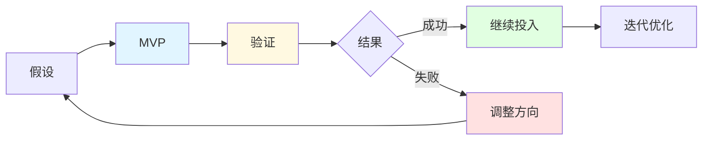
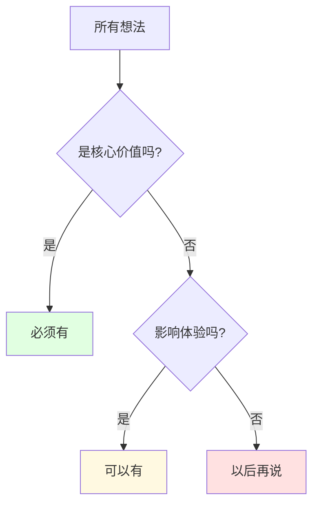

> [!quote] 核心观点
> **完成比完美更重要。**
> 
> MVP 不是产品的缩水版，而是用最小成本验证核心假设的实验。

## 什么是 MVP

### MVP ≠ 半成品

很多人误解了 MVP（Minimum Viable Product，最小可行产品）：

❌ **错误理解**：
- "功能不全的产品"
- "质量很差的原型"
- "临时凑合的东西"

✅ **正确理解**：
> **MVP = 能验证核心假设的最小版本**

### MVP 的真正目的



> [!important] MVP 的三大目标
> 1. **验证需求**：确认用户真的需要这个
> 2. **测试方案**：确认你的解决方案有效
> 3. **获取反馈**：了解用户真实的想法

## 🎯 7天 MVP 开发法

### 准备阶段（Day 0）

**明确核心假设**

回答三个问题：
1. 用户的核心痛点是什么？
2. 我的解决方案是什么？
3. 用户为什么会选择我？

**示例：MDFriday**
- 痛点：Obsidian 用户想发布笔记但门槛高
- 方案：5分钟自动化发布
- 优势：简单 + 美观 + 便宜

---

### Day 1-2：核心功能开发

> [!tip] 只做一件事
> **聚焦能解决核心痛点的最小功能**

**问自己**：
- 什么功能是必须的？
- 没有什么功能用户就不会买单？
- 什么可以后面再加？

**优先级排序**：



**MDFriday V1 的选择**：

✅ **必须有（Day 1-2）**：
- 连接 Obsidian 仓库
- 转换 Markdown 为网页
- 自动部署到服务器
- 基本的样式

⚠️ **可以有（V2再加）**：
- 自定义域名
- 评论功能
- 数据分析

❌ **以后再说**：
- 多人协作
- API 接口
- 移动端 App

---

### Day 3-4：用户界面

> [!tip] 简单但可用
> **不需要漂亮，但要清晰**

**关键原则**：
- 功能 > 美观
- 清晰 > 华丽
- 可用 > 完美

**必备元素**：
1. 清晰的价值主张
2. 简单的操作流程
3. 明确的行动号召
4. 基本的引导说明

**可以用的快速方案**：
- 使用现成的 UI 框架（Tailwind、Bootstrap）
- 复制别人的布局（合法的借鉴）
- 用 Notion/Carrd 快速搭建落地页

---

### Day 5：测试与修复

> [!tip] 自己先用一遍
> **假装你是第一次使用**

**测试清单**：
- [ ] 核心功能能正常工作
- [ ] 没有明显的 bug
- [ ] 操作流程清晰
- [ ] 能完成核心任务
- [ ] 加载速度可以接受

**不要追求**：
- ❌ 零 bug（不可能）
- ❌ 所有边缘情况（以后再说）
- ❌ 性能极致优化（够用就行）

---

### Day 6：准备发布材料

> [!tip] 说清楚你的产品
> **让人5秒内明白你在做什么**

**必备材料**：

**1. 产品介绍页**
- 一句话价值主张
- 3个核心功能
- 使用截图/演示视频
- 定价
- 行动号召（试用/购买）

**2. 快速入门指南**
- 3-5个步骤
- 配图说明
- 预期结果

**3. FAQ**
- 10个最可能被问的问题
- 清晰的回答

---

### Day 7：发布与推广

> [!tip] 小范围发布
> **先给最有可能感兴趣的人**

**发布渠道（优先级排序）**：

1. **你的邮件列表**（如果有）
2. **相关社群**
   - Reddit 相关 subreddit
   - Discord/Slack 社群
   - Facebook 群组
3. **社交媒体**
   - Twitter/X
   - LinkedIn
   - 小红书/即刻
4. **产品发布平台**
   - Product Hunt
   - Hacker News

**发布文案模板**：

```markdown
嘿，我做了个XX工具 [产品名]

**背景**：
我之前遇到XX问题，试了现有方案都不太满意...

**解决方案**：
所以我做了[产品名]，可以帮你[核心价值]

**特点**：
- 特点1
- 特点2
- 特点3

**现在可以试用**：[链接]

期待你的反馈！🙏
```

## 💡 三种 MVP 实现策略

### 策略1：手动 MVP（无代码）

**适合**：服务型产品，还不确定需求

**方法**：
- 用现有工具组合
- 手动完成核心流程
- 用表格/文档管理

**示例**：
- **咨询服务**：Calendly 预约 + Zoom 通话 + Google Docs 交付
- **课程产品**：Notion 写内容 + Gumroad 收费 + 邮件发送
- **社群产品**：Discord/微信群 + 飞书文档

**优势**：
- ✅ 0 技术门槛
- ✅ 24小时上线
- ✅ 灵活调整

**劣势**：
- ⚠️ 无法规模化
- ⚠️ 耗时手动操作

---

### 策略2：拼接 MVP（低代码）

**适合**：需要一些自动化的产品

**方法**：
- 用 No-code 工具快速搭建
- 集成现有服务
- 最小化自己开发

**工具推荐**：
- **落地页**：Carrd, Notion, Webflow
- **支付**：Stripe, Gumroad, Lemon Squeezy
- **自动化**：Zapier, Make.com
- **邮件**：ConvertKit, Mailchimp
- **表单**：Typeform, Tally

**示例流程**：
```
Typeform收集需求 
→ Zapier自动化 
→ Google Sheets记录 
→ 邮件通知 
→ 手动处理
```

**优势**：
- ✅ 快速上线
- ✅ 一定自动化
- ✅ 成本可控

---

### 策略3：编码 MVP（技术开发）

**适合**：技术产品，需要定制功能

**方法**：
- 选最熟悉的技术栈
- 用现成的框架/库
- 避免重复造轮子

**快速开发原则**：

1. **用最熟悉的技术**
   - 不要学新技术
   - 用你最擅长的

2. **站在巨人肩膀上**
   - 用成熟的框架
   - 用开源组件
   - 复制可复用的代码

3. **数据库从简**
   - SQLite 足够用
   - 不要过度设计
   - 能跑就行

4. **部署要简单**
   - 一键部署（Vercel, Netlify）
   - 不要自己运维
   - 先用免费方案

**示例技术选择**：
```
前端：React + Tailwind
后端：Next.js API Routes
数据库：Supabase (PostgreSQL)
部署：Vercel
支付：Stripe
```

## 🌟 案例分析：MDFriday MVP 开发

### 7天开发记录

**Day 1-2：核心功能**
```
✅ 读取 Obsidian 仓库
✅ 解析 Markdown 文件
✅ 转换为 HTML
✅ 应用基础样式
```

**遇到的问题**：
- Obsidian 的 Wiki 链接格式特殊
- 图片路径需要处理
- Frontmatter 解析

**解决方案**：
- 用现成的 Markdown 解析库
- 写简单的路径转换函数
- 先支持基本语法，复杂的V2再说

---

**Day 3-4：用户界面**
```
✅ 简单的控制面板
✅ 连接仓库的引导
✅ 一键部署按钮
✅ 基本的设置页面
```

**设计原则**：
- 参考 Vercel 的简洁风格
- 用 Tailwind 快速搭建
- 功能 > 美观

---

**Day 5：测试**
```
✅ 自己部署10个测试网站
✅ 邀请5个朋友试用
✅ 修复发现的明显bug
```

**发现的问题**：
- 大文件上传会超时
- 某些特殊字符报错
- 样式在移动端有问题

**处理方式**：
- 严重bug立即修复
- 不影响使用的记录下来
- 一些边缘情况V2处理

---

**Day 6：准备材料**
```
✅ 写产品介绍页
✅ 录制演示视频（5分钟）
✅ 写快速入门指南
✅ 准备10个FAQ
```

---

**Day 7：发布**
```
✅ 在 Obsidian 论坛发布
✅ Reddit r/ObsidianMD 发帖
✅ Twitter 发布
✅ 朋友圈/微信群分享
```

**第一天成绩**：
- 访问：200+
- 注册：30
- 付费：3
- 反馈：50+条

### 学到的经验

> [!success] 成功经验
> 
> **1. 聚焦核心价值**
> 只做"Obsidian → 网站"这一件事，做到极致
> 
> **2. 快速验证**
> 7天上线，立即知道市场反应
> 
> **3. 真实用户 > 完美产品**
> 3个付费用户的反馈 > 我自己想象的100个功能
> 
> **4. 迭代比规划重要**
> 根据反馈快速调整，而不是按预设计划

> [!warning] 踩过的坑
> 
> **1. 想太多，做太少**
> 最初列了50个功能，实际只做了5个核心的
> 
> **2. 过度优化**
> 花了半天优化一个界面，但用户根本不在意
> 
> **3. 没有测试边缘情况**
> 上线后发现特殊文件名会报错
> 
> **4. 定价太低**
> 最初定$4.9，后来发现应该定$9.9

## 🚫 MVP 开发的常见错误

### 错误1：追求完美
❌ "等我把所有功能都做完美了再发布"

✅ 正确做法：
> "能解决核心问题就发布，然后根据反馈迭代"

**真相**：
- 你永远不会觉得"准备好了"
- 用户会告诉你什么最重要
- 早期用户会原谅不完美

---

### 错误2：功能太多
❌ "我要做一个什么都有的产品"

✅ 正确做法：
> "只做一个核心功能，做到最好"

**标准**：
- 用户能在5分钟内理解产品
- 能在10分钟内完成核心任务
- 有明确的"哇，这个有用"时刻

---

### 错误3：自己的假设 > 用户反馈
❌ "我知道用户需要什么，不用问他们"

✅ 正确做法：
> "让用户告诉我他们需要什么"

**建议**：
- 上线第一周疯狂收集反馈
- 每个用户都尽量深度沟通
- 记录他们的原话（用词很重要）

---

### 错误4：技术过度设计
❌ "我要用最新最酷的技术栈"

✅ 正确做法：
> "用最熟悉最稳定的技术"

**原则**：
- 不要在 MVP 阶段学新技术
- 不要过度设计架构
- 能跑起来 > 技术先进

---

### 错误5：没有推广计划
❌ "做出来了，用户自然会来"

✅ 正确做法：
> "在开发前就想好去哪里找第一批用户"

**建议**：
- Day 0 就列出10个推广渠道
- 在开发过程中预热（分享进度）
- 上线当天立即推广

## 🎯 MVP 开发检查清单

### 开发前
- [ ] 明确核心假设
- [ ] 确定必须功能（≤5个）
- [ ] 选择实现方式（手动/拼接/编码）
- [ ] 设定7天deadline
- [ ] 准备推广渠道

### 开发中
- [ ] 每天有进展
- [ ] 聚焦核心功能
- [ ] 不做额外功能
- [ ] 简单但可用

### 发布前
- [ ] 自己测试过
- [ ] 找2-3人试用
- [ ] 修复明显bug
- [ ] 准备介绍材料
- [ ] 准备收集反馈的方式

### 发布后
- [ ] 多渠道推广
- [ ] 积极收集反馈
- [ ] 快速回复用户
- [ ] 记录所有建议
- [ ] 规划下一步迭代

## 🔗 相关资源

### 理论基础
- [[../../2.内容/DK/视频笔记/31|Dan Koe - 从$0到$10K]]
- [[../../2.内容/DK/视频笔记/33|Dan Koe - 打造第一个盈利产品]]

### 相关章节
- [[01-产品设计|产品设计]] - MVP的基础
- [[03-产品迭代|产品迭代]] - MVP之后做什么
- [[04-定价策略|定价策略]] - 如何定价

### 实战案例
- [[实战案例/MDFriday开发历程|MDFriday完整开发历程]]

---

## 🎯 记住

> [!quote] 核心原则
> **完成比完美更重要。**
> 
> MVP不是产品的缩水版，
> 而是用最小成本验证假设的实验。
> 
> 7天上线，立即获取反馈，
> 然后快速迭代。
> 
> 真实用户的反馈 > 你的想象。

---

*下一章: [[03-产品迭代|03. 产品迭代 - 基于反馈持续改进]]* 👉

*返回: [[index|产品模块首页]]*
