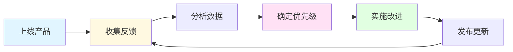
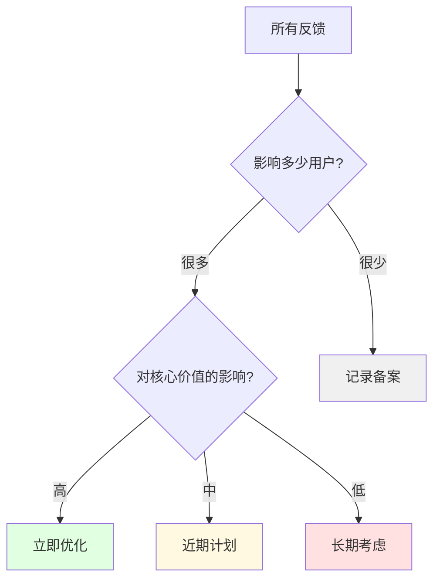

> [!quote] 核心观点
> **产品不是做出来的，是迭代出来的。**
> 
> 第一个版本永远不会完美，但每一次迭代都让它更好。

## 为什么迭代如此重要

很多人的产品失败不是因为起点不好，而是因为**不会迭代**。

> [!important] 常见错误
> - ❌ MVP 上线后就不管了
> - ❌ 按自己的想法加功能
> - ❌ 被用户的要求牵着走
> - ❌ 不知道什么该改什么不该改

**好的迭代 = 有方向的持续改进**

## 🎯 产品迭代的循环



> [!tip] 迭代的节奏
> - **快速迭代**：每周小更新
> - **中期迭代**：每月大功能
> - **长期迭代**：每季度战略调整

## 💡 第一步：收集反馈

### 五种反馈来源

#### 1. 直接对话（最有价值）

**方法**：
- 安排30分钟用户访谈
- 观察他们使用产品
- 问开放式问题

**关键问题**：
```
1. 你最初是因为什么使用这个产品？
2. 你最常用哪个功能？
3. 有什么让你困惑或不满意的地方？
4. 如果有魔法棒，你会让产品变成什么样？
5. 你会推荐给朋友吗？为什么？
```

**技巧**：
- 问"为什么"至少3次
- 让他们讲故事而非回答是/否
- 观察他们的情绪和停顿

---

#### 2. 问卷调查（规模化收集）

**什么时候发**：
- 用户使用7天后
- 付费用户每月一次
- 大更新后

**核心问题**：
- NPS：你会推荐给朋友吗？（0-10分）
- 满意度：整体满意度？（1-5星）
- 功能优先级：你最希望我们加什么功能？

**工具**：
- Typeform
- Google Forms
- Tally

---

#### 3. 使用数据（客观真相）

**关键指标**：

**参与度指标**：
- DAU/MAU（日活/月活）
- 使用频率
- 功能使用率
- 停留时长

**转化指标**：
- 注册转化率
- 付费转化率
- 流失率
- 续费率

**用户行为**：
- 最常用的功能
- 卡在哪里（跳出点）
- 完成率

**工具**：
- Google Analytics
- Mixpanel
- Hotjar（热力图）

---

#### 4. 支持请求（痛点发现器）

**来源**：
- 客服消息
- 邮件咨询
- 社交媒体评论
- 社群讨论

**分类追踪**：
```
📊 问题统计：
- Bug报告：35%
- 功能请求：40%
- 使用疑问：20%
- 其他：5%
```

**每周复盘**：
- 哪些问题重复出现？
- 哪些功能被频繁问到？
- 哪些操作让人困惑？

---

#### 5. 竞品分析（外部视角）

**观察内容**：
- 竞品新增了什么功能？
- 用户对竞品的评价？
- 市场趋势是什么？

**渠道**：
- Product Hunt 评论
- Reddit 讨论
- App Store / Chrome Store 评价
- 社交媒体

## 🎯 第二步：分析与优先级

### 反馈分类框架



### 优先级矩阵

| | 影响大 | 影响小 |
|---|---|---|
| **用户多** | 🔥 立即做 | ⚠️ 近期做 |
| **用户少** | 💡 评估后决定 | 📝 记录备案 |

### 决策标准

**立即做（本周）**：
- ✅ 影响核心功能的bug
- ✅ 大量用户遇到的问题
- ✅ 严重影响体验的卡点

**近期做（本月）**：
- ✅ 高频请求的功能
- ✅ 提升转化率的优化
- ✅ 降低流失率的改进

**长期做（本季度）**：
- ✅ 战略性新功能
- ✅ 技术债务重构
- ✅ 大的体验升级

**不做**：
- ❌ 只有个别用户需要
- ❌ 偏离核心价值
- ❌ 维护成本过高

## 💡 第三步：实施改进

### 改进的四种类型

#### 类型1：修复Bug

**标准**：
- 严重bug：24小时内修复
- 中等bug：1周内修复
- 小bug：下次更新一起修

**沟通**：
- 收到反馈立即回复
- 修复后主动告知
- 说明原因和解决方案

---

#### 类型2：体验优化

**常见场景**：
- 操作流程简化
- 提示文案改进
- 加载速度优化
- 界面布局调整

**原则**：
- 减少步骤
- 降低认知负担
- 提供即时反馈
- 容错性设计

---

#### 类型3：功能增加

**判断标准**：
```
新功能 = 用户价值 - 复杂度成本

用户价值 = 需求强度 × 用户数量
复杂度成本 = 开发时间 + 维护成本 + 学习成本
```

**发布策略**：
- 先给部分用户测试（Beta）
- 收集反馈后全量发布
- 提供教程和引导

---

#### 类型4：功能删除

**什么时候删除功能**：
- 使用率 <5%
- 维护成本高
- 与核心价值不符
- 有更好的替代方案

**如何删除**：
- 提前通知用户（至少1个月）
- 提供替代方案
- 导出数据的方式
- 保持透明沟通

## 🌟 案例分析：MDFriday 的迭代历程

### V1.0 → V1.1 (第一个月)

**收集到的反馈**：
```
高频问题：
1. "图片链接总是404" - 15人反馈
2. "能支持自定义域名吗" - 12人请求
3. "Wikilink不生效" - 10人报告
4. "能不能加评论功能" - 8人建议
5. "部署太慢了" - 6人抱怨
```

**数据洞察**：
```
转化漏斗：
访问 → 注册: 15% (正常)
注册 → 连接仓库: 80% (好)
连接仓库 → 部署成功: 40% (❌ 太低！)
部署成功 → 付费: 20% (正常)

问题发现：
- 很多人部署失败
- 主要是图片路径和链接问题
```

**优先级决策**：

🔥 **立即修复**：
1. 图片链接404 → 影响核心功能
2. Wikilink不生效 → Obsidian用户核心需求
3. 部署失败率高 → 影响转化

⚠️ **近期添加**：
1. 自定义域名 → 高频请求，影响专业性
2. 部署速度优化 → 影响体验

📝 **暂不做**：
1. 评论功能 → 偏离核心价值（发布笔记）

**实施结果**：
```
V1.1 更新内容：
✅ 修复图片路径问题
✅ 完善 Wikilink 支持
✅ 添加部署诊断工具
✅ 支持自定义域名
✅ 优化部署速度（5分钟 → 2分钟）

效果：
- 部署成功率: 40% → 75%
- 付费转化率: 8% → 12%
- 用户满意度: 3.5 → 4.2星
```

---

### V1.1 → V2.0 (第二个月)

**新的洞察**：
```
用户访谈发现：
- 多数用户只用基本功能
- 很多人不知道有高级功能
- 希望有更多主题选择
- 想要SEO优化
```

**战略思考**：
> 与其加更多功能，不如：
> 1. 把核心功能做到极致
> 2. 提供更多主题选择
> 3. 优化SEO（帮用户获得流量）

**V2.0 重点**：
```
✅ 3个新主题（不同风格）
✅ 完整的SEO优化
✅ 更快的加载速度
✅ 移动端体验优化
✅ 更好的文档和教程

不做（有意识的放弃）：
❌ 多人协作
❌ 评论系统
❌ 数据分析
（这些偏离"简单发布笔记"的核心）
```

**效果**：
- 月活用户: 200 → 500
- 付费用户: 30 → 80
- 流失率: 15% → 8%
- NPS: 40 → 60

---

### 迭代中学到的教训

> [!success] 成功经验
> 
> **1. 数据 + 访谈 = 完整画面**
> 数据告诉你"什么"，访谈告诉你"为什么"
> 
> **2. 修复 > 新功能**
> 把已有功能做好，胜过加新功能
> 
> **3. 学会说"不"**
> 很多功能请求不符合核心价值，要敢于拒绝
> 
> **4. 保持简单**
> 每次更新都问：这会让产品更简单还是更复杂？

> [!warning] 踩过的坑
> 
> **1. 被用户要求牵着走**
> 早期什么都想加，结果产品越来越复杂
> 
> **2. 过度优化不重要的东西**
> 花一周优化了一个<5%用户用的功能
> 
> **3. 更新太频繁**
> 每天小更新让用户感到不稳定
> 
> **4. 沟通不够**
> 修复了问题但没告诉用户，他们不知道

## 🚫 产品迭代的常见错误

### 错误1：按自己的想法迭代
❌ "我觉得应该加这个功能"

✅ 正确做法：
> "10个用户中有8个提到了这个需求"

---

### 错误2：什么都想做
❌ "用户要的功能我们都加"

✅ 正确做法：
> "我们只做符合核心价值的功能"

---

### 错误3：迭代太慢
❌ "等积累够多问题再一起更新"

✅ 正确做法：
> "每周小更新，每月大更新"

---

### 错误4：只看数据不看人
❌ "数据显示XX功能使用率低，删掉"

✅ 正确做法：
> "先问问为什么使用率低，再决定"

---

### 错误5：不敢删除功能
❌ "加过的功能不能删"

✅ 正确做法：
> "对核心价值没帮助的功能要敢于删除"

## 🎯 迭代决策框架

### 问自己5个问题

在决定是否实施某个改进前：

**1. 这符合产品的核心价值吗？**
- 如果不符合，直接拒绝

**2. 有多少用户受益？**
- <5%：不做
- 5-20%：评估
- >20%：优先考虑

**3. 实施成本是多少？**
- 开发时间
- 维护成本
- 学习成本（用户）

**4. 对其他功能的影响？**
- 会让产品更复杂吗？
- 会影响性能吗？
- 会让其他功能更难用吗？

**5. 不做会怎样？**
- 用户会流失吗？
- 有替代方案吗？
- 可以延后吗？

### 何时坚持，何时放弃

**坚持的信号**：
- ✅ 用户在增长
- ✅ 核心指标在改善
- ✅ 用户愿意付费
- ✅ 反馈积极正面
- ✅ 你还有热情

**放弃/转向的信号**：
- ❌ 用户不增长或流失加速
- ❌ 核心指标持续恶化
- ❌ 没人愿意付费
- ❌ 负面反馈多于正面
- ❌ 你失去了热情

> [!tip] 关键原则
> **给产品足够的时间成长，但也要知道何时止损。**
> 
> 一般规则：
> - 3个月看趋势
> - 6个月看验证
> - 12个月做决定

## 🔗 相关资源

### 理论基础
- [[../../2.内容/DK/视频笔记/26|Dan Koe - 从零到一百万]]
- [[../../2.内容/DK/视频笔记/31|Dan Koe - 从$0到$10K]]

### 相关章节
- [[01-产品设计|产品设计]] - 确保方向正确
- [[02-MVP开发|MVP开发]] - 迭代的起点
- [[04-定价策略|定价策略]] - 迭代定价

### 实战案例
- [[实战案例/MDFriday开发历程|MDFriday 迭代全记录]]

---

## 🎯 记住

> [!quote] 核心原则
> **产品不是做出来的，是迭代出来的。**
> 
> 倾听用户，但保持方向。
> 快速行动，但深思熟虑。
> 勇于尝试，也敢于放弃。
> 
> 每一次迭代都是在雕琢你的作品。

---

*下一章: [[04-定价策略|04. 定价策略 - 为价值定价]]* 👉

*返回: [[index|产品模块首页]]*
