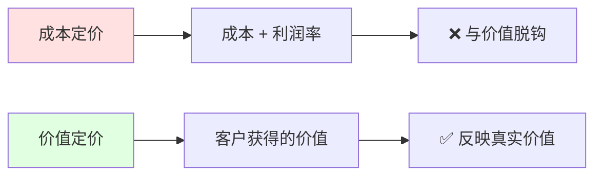

> [!quote] 核心观点
> **定价不是成本加成，而是价值的表达。**
> 
> 你收费的高低，决定了你服务什么样的客户，也决定了你能提供什么样的价值。

## 为什么定价如此重要

定价不只是一个数字，它影响：

> [!important] 定价的四大影响
> - **收入结构**：10个$100客户 vs 1个$1000客户
> - **客户质量**：价格筛选了客户类型
> - **产品定位**：低价=普通，高价=专业
> - **心理预期**：价格影响感知价值

**很多人的产品失败，不是因为产品不好，而是定价太低。**

## 🎯 定价的核心原则

### 原则1：价值定价 vs 成本定价



#### 成本定价（错误）
```
产品定价 = 成本 × (1 + 利润率%)

例如：
开发成本 $1000
希望利润 50%
→ 定价 $1500
```

**问题**：
- ❌ 忽略了客户价值
- ❌ 限制了收入上限
- ❌ 陷入价格战

---

#### 价值定价（正确）
```
产品定价 = 客户获得的价值 × 感知系数

例如：
帮客户节省20小时/月
时薪$50
→ 价值$1000/月
→ 定价$99/月（10%价值）
```

**优势**：
- ✅ 与价值挂钩
- ✅ 定价天花板高
- ✅ 吸引对的客户

### 原则2：10倍价值规则

> [!tip] 黄金法则
> **你的产品应该提供至少10倍于定价的价值**

**为什么是10倍？**
- 让客户觉得"超值"
- 降低购买决策门槛
- 提供续费/推荐的动力

**示例**：
- 定价$99 → 提供≥$990价值
- 定价$999 → 提供≥$9990价值

**如何计算价值？**
- 节省的时间 × 时薪
- 增加的收入
- 避免的损失
- 获得的结果

---

### 原则3：锚点定价

**心理学原理**：
人们通过比较来判断价格是否合理

**三个锚点**：

1. **内部锚点**（产品阶梯）
```
基础版：$29/月
专业版：$99/月  ← 大多数人选这个
企业版：$299/月
```

2. **外部锚点**（竞品对比）
```
竞品A：$199/月
我们：$99/月  ← 性价比高
```

3. **替代成本锚点**
```
雇一个人：$3000/月
我们的工具：$99/月  ← 便宜30倍
```

## 💡 三种定价模型

### 模型1：一次性付费

**适合**：
- 数字产品（电子书、模板、课程）
- 一次性服务（咨询、设计）
- 小工具/插件

**优势**：
- ✅ 无续费摩擦
- ✅ 客户决策简单
- ✅ 快速回本

**劣势**：
- ⚠️ 需要持续获客
- ⚠️ 收入不稳定
- ⚠️ 难以预测

**定价范围**：
- 小产品：$9-$49
- 中型产品：$49-$299
- 大型产品/服务：$299-$2999+

**示例**：
```
Notion 模板：$29
完整课程：$297
品牌咨询：$2000
```

---

### 模型2：订阅付费

**适合**：
- SaaS 工具
- 会员内容
- 持续服务

**优势**：
- ✅ 可预测收入（MRR）
- ✅ 长期客户价值高
- ✅ 复利增长

**劣势**：
- ⚠️ 需要持续提供价值
- ⚠️ 流失率影响大
- ⚠️ 启动慢

**定价范围**：
- 个人工具：$5-$29/月
- 专业工具：$29-$99/月
- 企业工具：$99-$999+/月

**关键指标**：
```
MRR (月经常性收入) = 付费用户数 × 平均客单价
LTV (客户终身价值) = ARPU × 平均留存月数
LTV/CAC > 3 (健康)
```

---

### 模型3：混合模型

**策略1：Freemium（免费增值）**
```
免费版：基础功能
付费版：高级功能 $X/月
```

**适合**：
- 需要大量用户基数
- 网络效应产品
- 低边际成本产品

**挑战**：
- 免费转付费率通常 <5%
- 需要大量流量

---

**策略2：免费试用**
```
14天免费试用
然后 $X/月
```

**适合**：
- 需要体验才能感受价值
- 高客单价产品

**要点**：
- 试用期收集信用卡信息（转化率高）
- 还是不收集（注册率高）

---

**策略3：一次性 + 订阅**
```
买断：$X（终身访问）
订阅：$Y/月（持续更新）
```

**示例**：
```
买断版：$299（终身使用）
订阅版：$29/月（持续更新+支持）
```

## 🎯 实战练习：为你的产品定价

> [!success] 花30分钟完成定价练习
> 
> ### 第一步：计算客户价值
> 
> **你的产品帮客户：**
> 
> □ 节省时间：___小时/月 × $___/小时 = $___
> □ 增加收入：$___/月
> □ 避免损失：$___
> □ 其他价值：$___
> 
> **总价值** = $___/月
> 
> ### 第二步：确定价值比例
> 
> **你想收取价值的多少比例？**
> - B2C产品：通常5-10%
> - B2B产品：通常10-30%
> - 高价值服务：可达50%+
> 
> 总价值 $___ × ___% = $___
> 
> ### 第三步：设置锚点
> 
> **竞品定价：**
> - 竞品A：$___
> - 竞品B：$___
> - 替代方案：$___
> 
> **你的定位：**
> □ 低价（竞品的50-70%）
> □ 中价（竞品的80-120%）
> □ 高价（竞品的150%+）
> 
> ### 第四步：设计价格阶梯
> 
> **基础版：**
> - 功能：___
> - 定价：$___
> - 目标：___（新手/个人）
> 
> **专业版：**（大多数人选择）
> - 功能：___
> - 定价：$___
> - 目标：___（专业人士）
> 
> **企业版：**
> - 功能：___
> - 定价：$___
> - 目标：___（团队/企业）
> 
> ### 第五步：测试与验证
> 
> **初始定价：** $___
> **测试方式：** ___
> **调整标准：** ___

## 🌟 案例分析：MDFriday 的定价演变

### V1.0：定价太低（$4.9/月）

**思路**：
> "我要比 Obsidian Publish ($8/月) 便宜，
> 这样大家会选择我"

**实际情况**：
- ❌ 吸引了大量"价格敏感"用户
- ❌ 要求多、抱怨多、付费意愿低
- ❌ 收入无法覆盖成本
- ❌ 被认为"不专业"

**数据**：
```
用户数：100
付费率：8%
MRR：$400
流失率：25%/月
客户满意度：3.2/5
```

---

### V1.5：涨价到$9.9/月

**思路**：
> "提供的价值远超$4.9，
> 应该定价更合理"

**变化**：
- ✅ 流失了一些"薅羊毛"用户（好事）
- ✅ 吸引了更认真的用户
- ✅ 客户质量明显提升
- ✅ 抱怨减少，建议增多

**数据**：
```
用户数：80（减少）
付费率：12%（提升）
MRR：$950（翻倍+）
流失率：12%/月（降低）
客户满意度：4.1/5（提升）
```

---

### V2.0：引入价格阶梯

**策略**：
```
个人版：$9.9/月
  - 1个网站
  - 基础主题
  - 社群支持

专业版：$29/月  ← 推荐
  - 无限网站
  - 所有主题
  - 自定义域名
  - 优先支持

团队版：$99/月
  - 所有专业版功能
  - 团队协作
  - 专属客户成功经理
  - 定制需求
```

**心理学设计**：
- 个人版：让决策门槛低
- 专业版：最好的性价比（70%选择）
- 团队版：锚点（让专业版显得便宜）

**效果**：
```
个人版：20%
专业版：70%  ← 大部分人
团队版：10%

平均客单价：$27.9
MRR：$2,000+
用户LTV提升3倍
```

---

### 学到的教训

> [!success] 定价洞察
> 
> **1. 定价不是越低越好**
> 低价吸引低质量客户，高价筛选对的人
> 
> **2. 价格影响感知**
> $9.9比$4.9"专业"得多，即使功能一样
> 
> **3. 价格阶梯是魔法**
> 给用户选择，大多数人会选中间档
> 
> **4. 敢于涨价**
> 如果提供了更多价值，客户会接受涨价

> [!warning] 定价错误
> 
> **1. 一开始定价太保守**
> 担心贵了没人买，其实低价更危险
> 
> **2. 没有测试不同价格**
> 应该早点做A/B测试
> 
> **3. 忽视客户终身价值**
> 只看月付，没算LTV
> 
> **4. 害怕流失用户**
> 有些用户流失是好事（低价值客户）

## 💡 定价心理学技巧

### 技巧1：奇数定价
```
$99 vs $100
$9.9 vs $10

心理感觉差很多，实际差很少
```

---

### 技巧2：价值包装
```
❌ "$99/月"
✅ "$99/月 = 每天$3.3
   = 一杯咖啡的钱
   = 每天节省2小时
   = 价值$100/天"
```

---

### 技巧3：对比展示
```
雇一个助理：$3000/月
我们的工具：$99/月
↓
节省：$2901/月 (96.7%)
```

---

### 技巧4：限时优惠
```
原价：$49
早鸟价：$29 (限前100名)

制造紧迫感
```

但要注意：
- ⚠️ 不要经常打折（贬值品牌）
- ⚠️ 折扣要有合理理由
- ⚠️ 不要永久"限时"优惠

---

### 技巧5：按年付折扣
```
月付：$29/月 = $348/年
年付：$290/年 (节省$58)

好处：
- 现金流更好
- 降低流失率
- 提升LTV
```

## 🚫 定价的常见错误

### 错误1：害怕涨价
❌ "涨价会流失客户"

✅ 正确思维：
> "提供了更多价值，合理涨价。
> 真正的客户会理解，
> 流失的是本来就不合适的。"

**涨价的正确方式**：
1. 提前通知（至少1个月）
2. 说明原因（新功能、成本、价值）
3. 老用户锁定原价（可选）
4. 提供更高价值

---

### 错误2：定价太低
❌ "先定低价获取用户，以后再涨"

✅ 正确思维：
> "一开始定合理价格，
> 吸引对的客户。"

**为什么低价危险**：
- 吸引"占便宜"心态用户
- 难以提供高质量服务
- 后期涨价困难
- 品牌定位低端

---

### 错误3：只有一个价格
❌ "所有人都付$X"

✅ 正确思维：
> "提供多个选择，
> 让不同需求的人找到合适的。"

**价格阶梯的好处**：
- 降低入门门槛
- 增加客单价
- 服务不同需求

---

### 错误4：按成本定价
❌ "成本$X，所以定价$X × 1.5"

✅ 正确思维：
> "客户获得$Y价值，
> 所以定价$Y × 10%"

---

### 错误5：不敢收费
❌ "先免费，有用户再说"

✅ 正确思维：
> "付费是最好的验证，
> 愿意付费才是真需求。"

**免费的代价**：
- 吸引不认真的用户
- 无法验证真实需求
- 难以转为付费
- 没有收入支持运营

## 🎯 定价决策清单

### 定价前问自己：

**价值相关**：
- [ ] 客户能获得多少价值？
- [ ] 这个价值如何量化？
- [ ] 我的定价是价值的多少比例？

**竞争相关**：
- [ ] 竞品如何定价？
- [ ] 我的优势在哪里？
- [ ] 为什么客户会付这个价？

**商业相关**：
- [ ] 这个价格能覆盖成本吗？
- [ ] 这个价格能支持增长吗？
- [ ] 客户终身价值是多少？

**心理相关**：
- [ ] 价格传递什么定位？
- [ ] 会吸引什么样的客户？
- [ ] 有价格阶梯吗？

## 🔗 相关资源

### 理论基础
- [[../../2.内容/DK/视频笔记/16|Dan Koe - 价值创造框架]]
- [[../../2.内容/DK/视频笔记/26|Dan Koe - 从零到一百万]]
- [[../../2.内容/DK/视频笔记/33|Dan Koe - 打造盈利产品]]

### 相关章节
- [[../../1.品牌/02-价值主张|价值主张]] - 定价的基础
- [[01-产品设计|产品设计]] - 设计值得定价的产品
- [[03-产品迭代|产品迭代]] - 根据反馈调整定价

---

## 🎯 记住

> [!quote] 核心原则
> **定价不是成本加成，而是价值的表达。**
> 
> 你的定价决定了：
> - 你服务什么样的客户
> - 你能提供什么样的价值
> - 你能建立什么样的业务
> 
> 不要害怕定高价，
> 要害怕提供不了相应的价值。
> 
> 10倍价值，合理定价。

---

*恭喜！你已完成产品模块 🎉*

*下一模块: [[../../4.系统/index|04. 系统 - 你如何运转]]* 👉

*返回: [[index|产品模块首页]]*
