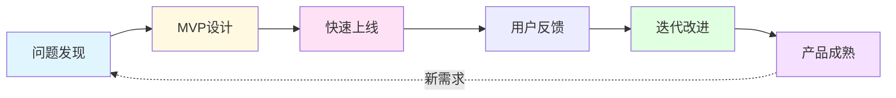
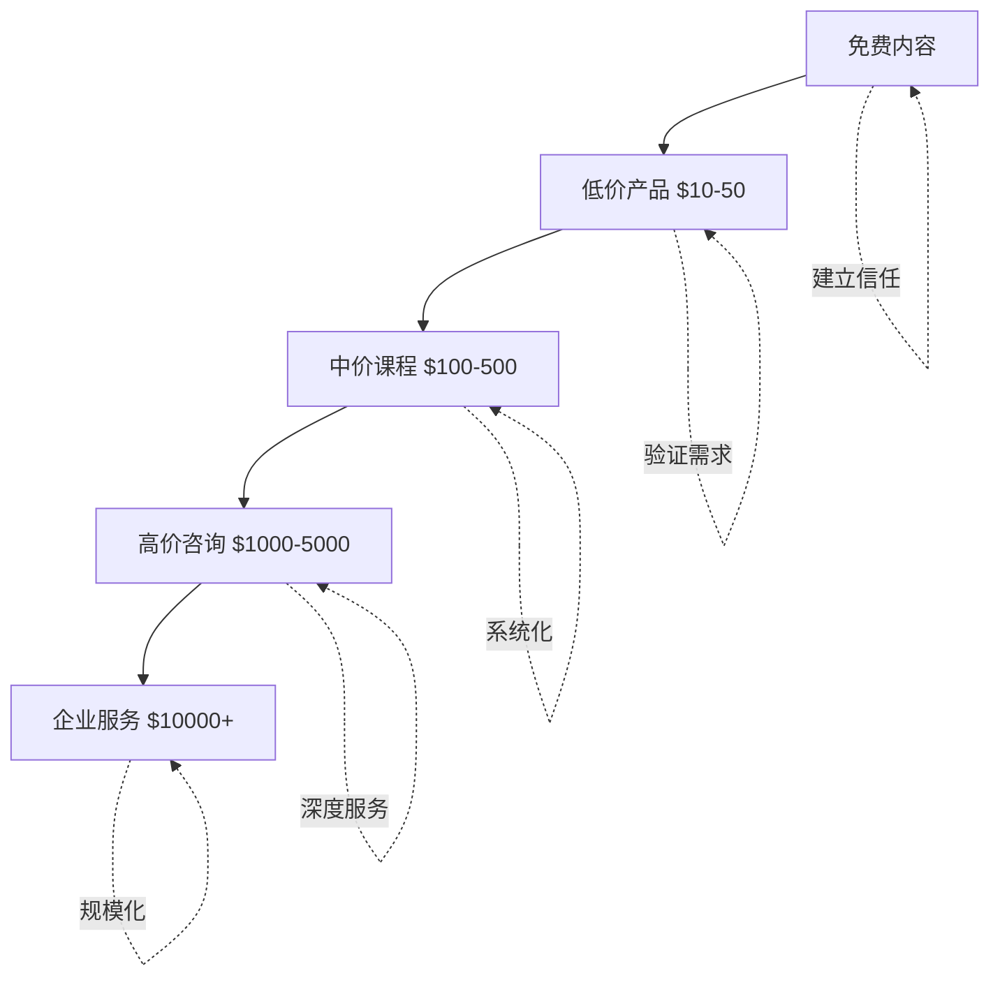

> [!quote] 产品的本质
> **产品不是你创造的东西，而是帮助别人从A到B的系统。**
> 
> 在一人公司中，产品是你价值的系统化，是时间的杠杆，是收入的引擎。

## 为什么产品是收入的核心

有了品牌和内容，你获得了关注和信任。
但只有产品，才能将信任转化为收入。

> [!important] 产品的三大价值
> - **创造收入**: 将你的时间和专业知识打包售卖
> - **验证价值**: 有人愿意付费才证明价值存在
> - **形成杠杆**: 一次创造，多次销售

从出卖时间到出售系统，这是一人公司的核心转变。

## 🎯 本模块内容

### [[01-产品设计|01. 产品设计]] - 设计值得打造的产品

> **找到值得解决的问题**

在这一章，你将学会：
- 如何发现值得解决的问题
- 最小可行报价 (MVP Offer) 的设计
- 产品验证的5个步骤
- 真实案例：MDFriday 的产品设计

👉 [[01-产品设计|开始学习产品设计]]

---

### [[02-MVP开发|02. MVP开发]] - 快速上线验证想法

> **完成比完美更重要**

在这一章，你将学会：
- 如何在一周内发布MVP
- 快速获取早期用户反馈
- 避免过度开发的陷阱
- 真实案例：7天MVP挑战实录

👉 [[02-MVP开发|开始学习MVP开发]]

---

### [[03-产品迭代|03. 产品迭代]] - 基于反馈持续改进

> **倾听用户，快速迭代**

在这一章，你将学会：
- 如何收集和分析用户反馈
- 版本管理与更新策略
- 何时坚持，何时放弃
- 真实案例：MDFriday 的迭代历程

👉 [[03-产品迭代|开始学习产品迭代]]

---

### [[04-定价策略|04. 定价策略]] - 为价值定价

> **定价是价值的表达，不是成本的计算**

在这一章，你将学会：
- 价值定价 vs 成本定价
- 如何克服收费的心理障碍
- 产品阶梯定价策略
- 真实案例：我的定价演变

👉 [[04-定价策略|开始学习定价策略]]

---

## 🎯 实战案例

真实的产品开发过程，包括成功和失败的教训：

### [[实战案例/MDFriday开发历程|MDFriday 开发历程]]
从想法到产品的完整旅程

### [[实战案例/Obsidian-Plugin-Friday|Obsidian Plugin Friday 开发实录]]
如何开发一个 Obsidian 插件

### [[实战案例/Quartz主题定制|Quartz 主题定制经验]]
如何打造符合用户需求的主题

---

## 📊 产品演进路径

## 💡 产品阶梯

从低门槛到高价值，构建完整的产品体系：

> [!tip] 阶梯策略
> - **免费内容**: 吸引流量，建立信任
> - **低价产品**: 降低门槛，验证需求
> - **中价课程**: 系统化方法，主要收入来源
> - **高价咨询**: 深度服务，高利润
> - **企业服务**: 规模化，长期价值

## 🎯 三种产品类型

### 1. 服务型产品 (Service)
**特点**: 出售你的时间和专业知识
- 咨询 (Consulting)
- 辅导 (Coaching)
- 代劳 (Done-for-you)

**优势**: 快速启动，验证市场
**劣势**: 时间有限，难以规模化

> [!example] 示例
> - 4次咨询通话，收费 $1000
> - 品牌策略咨询，收费 $2000
> - 网站搭建服务，收费 $3000

---

### 2. 数字产品 (Digital Product)
**特点**: 一次创造，多次销售
- 电子书 (eBook)
- 在线课程 (Course)
- 模板/工具 (Template/Tool)

**优势**: 可规模化，被动收入
**劣势**: 需要前期投入

> [!example] 示例
> - Notion 模板，收费 $29
> - 写作课程，收费 $297
> - Obsidian 主题，收费 $49

---

### 3. 软件产品 (Software)
**特点**: 技术驱动，持续订阅
- SaaS 工具
- 插件/扩展
- 应用程序

**优势**: 高价值，可持续
**劣势**: 技术门槛高，维护成本高

> [!example] 示例
> - MDFriday 服务，月付 $9.9
> - Obsidian Plugin，免费+打赏
> - 自动化工具，年付 $99

## 💡 核心原则

> [!tip] 产品设计的黄金法则
> 
> **1. 解决真实问题**
> 不要创造需求，要发现需求。最好的产品来自你自己遇到的问题。
> 
> **2. 快速验证**
> 用最小成本验证想法，不要闭门造车。
> 
> **3. 持续迭代**
> 没有完美的1.0，只有不断改进的过程。
> 
> **4. 先卖后做**
> 在投入大量时间前，先确认有人愿意付费。

## 🎯 最小可行报价 (MVP Offer)

> [!success] 第一个产品的设计原则
> 
> **目标**: 在一周内上线，价格 $500-$1000
> 
> **服务型 MVP**:
> - 4次 1小时的咨询通话
> - 聚焦一个具体问题
> - 交付简单的行动计划
> 
> **产品型 MVP**:
> - 解决一个小而具体的问题
> - 3-5页的指南/模板
> - 可以在周末完成
> 
> **关键**: 不求完美，但要有用

## 🚀 快速开始

> [!success] 30天产品启动计划
> 
> **Week 1: 问题发现**
> - [ ] 列出你解决过的10个问题
> - [ ] 在社群/社交媒体询问他人的痛点
> - [ ] 选择1个你能解决且别人愿意付费的问题
> 
> **Week 2: MVP设计**
> - [ ] 写下：我帮助【谁】通过【方法】实现【结果】
> - [ ] 设计最简单的解决方案
> - [ ] 定价 $500-$1000
> 
> **Week 3: 快速上线**
> - [ ] 创建简单的落地页/说明文档
> - [ ] 向10个人介绍你的产品
> - [ ] 获得至少1个付费客户
> 
> **Week 4: 交付与迭代**
> - [ ] 交付产品/服务
> - [ ] 收集详细反馈
> - [ ] 优化产品描述和流程

## 🔗 相关资源

### 理论基础
- [[7|Dan Koe - 盈利与最小可行报价]]
- [[16|Dan Koe - 价值创造框架]]
- [[33|Dan Koe - 打造第一个盈利产品]]

### 实战指南
- [[31|Dan Koe - 从$0到$10K]]
- [[26|Dan Koe - 从零到一百万]]

### 其他模块
- [[../1.品牌/index|品牌模块]] - 产品的基础是清晰的定位
- [[../2.内容/index|内容模块]] - 内容是产品的营销工具
- [[../4.系统/index|系统模块]] - 系统化产品开发流程

---

## 🎯 下一步

> [!info] 推荐学习路径
> 1. 先完成 [[01-产品设计|产品设计]]，找到值得做的方向
> 2. 然后进行 [[02-MVP开发|MVP开发]]，快速验证想法
> 3. 接着掌握 [[03-产品迭代|产品迭代]]，持续改进
> 4. 最后学习 [[04-定价策略|定价策略]]，为价值定价

**不要等到产品完美才上线，上线本身就是最好的完善。**

👉 [[01-产品设计|现在就开始：设计你的第一个产品]]

---

*返回: [[../index|一人公司实战笔记首页]]*
