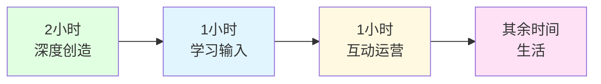

> [!quote] 核心观点
> **时间管理的本质是能量管理和优先级管理。**
> 
> 不是更多时间，而是更好地使用时间。

## 为什么需要时间管理

一人公司的困境：
- "事情太多，做不完"
- "每天很忙，但没成果"
- "时间都去哪了？"
- "感觉被工作追着跑"

> [!important] 问题根源
> **不是时间不够，而是没有系统。**
> 
> 没有优先级，什么都想做=什么都做不好。
> 没有节奏，一直工作=效率低下。

## 🎯 2+1+1 工作法则

Dan Koe 的核心时间管理框架：



### 2小时：深度创造

**做什么**：
- 写作/创作内容
- 产品开发
- 重要策略思考
- 核心任务

**为什么只2小时**：
- 真正的深度工作很耗能量
- 质量 > 数量
- 2小时专注 > 8小时分心

**何时进行**：
- 能量最高的时段
- 通常是早晨
- 无干扰环境

**如何执行**：
- 关闭所有通知
- 番茄钟（2×50分钟）
- 不查邮件/消息
- 进入心流状态

---

### 1小时：学习输入

**做什么**：
- 阅读文章/书籍
- 观看教程/课程
- 研究竞品
- 积累素材

**为什么重要**：
- 输入决定输出质量
- 持续学习 = 持续成长
- 积累素材库

**何时进行**：
- 下午或晚上
- 不需要最高能量
- 可以相对轻松

**如何执行**：
- 主动学习（带着问题）
- 记笔记（Obsidian）
- 关联已有知识
- 思考如何应用

---

### 1小时：互动运营

**做什么**：
- 回复评论/消息
- 社交媒体互动
- 查看数据分析
- 社群运营

**为什么必要**：
- 建立连接
- 获取反馈
- 维护关系
- 市场洞察

**何时进行**：
- 能量较低时段
- 可以碎片化
- 午休后/晚上

**如何执行**：
- 批量处理
- 设置时间限制
- 真诚互动
- 不被带跑

---

### 其余时间：生活

**做什么**：
- 运动健身
- 家人朋友
- 兴趣爱好
- 休息放空

**为什么重要**：
- 补充能量
- 保持灵感
- 可持续发展
- 这才是目的

## 💡 理想工作日设计

### 我的工作日（示例）

```mermaid
gantt
    title 理想的一天
    dateFormat HH:mm
    section 早晨
    起床仪式    :06:00, 30m
    深度工作1   :06:30, 90m
    休息       :08:00, 15m
    深度工作2   :08:15, 45m
    section 上午
    运动/散步   :09:00, 60m
    section 午间
    午餐       :10:00, 60m
    休息/午睡   :11:00, 30m
    section 下午
    学习输入    :11:30, 60m
    互动运营    :12:30, 60m
    杂事处理    :13:30, 30m
    section 晚上
    自由时间    :14:00, 180m
    晚餐家庭    :17:00, 120m
    放松娱乐    :19:00, 120m
    睡前仪式    :21:00, 30m
```



**时间分配**：
```
深度工作：2.25小时 (早上6:30-9:00)
学习输入：1小时 (下午11:30-12:30)
互动运营：1小时 (下午12:30-13:30)
运动：1小时
其他：自由安排

总工作时间：~4.5小时
剩余时间：生活
```

---

### 能量曲线

```
能量值
100%|     ╱━━━╲
    |   ╱       ╲
 75%| ╱           ╲━━━╲
    |╱                  ╲
 50%|                    ╲━━╲
    |                         ╲
 25%|                          ━━╲__
    |________________________________
     6   8  10  12  14  16  18  20  22 时间

高能量时段：6:00-9:00   → 深度工作
中能量时段：10:00-14:00 → 学习/互动
低能量时段：14:00后     → 生活/休息
```

**根据能量安排任务**：
- 🔴 高能量 → 创造性工作
- 🟡 中能量 → 学习和沟通
- 🟢 低能量 → 休息和娱乐

## 🎯 实战练习：设计你的理想日

> [!success] 花30分钟设计你的工作日
> 
> ### 第一步：了解你的能量曲线
> 
> **记录一周的能量变化：**
> - 什么时间你精力最好？
> - 什么时间你容易困倦？
> - 什么时间你创造力最强？
> 
> **我的高能量时段：** _____
> 
> ### 第二步：确定核心任务
> 
> **深度工作（2小时）：**
> - 任务1：_____
> - 任务2：_____
> - 时间：_____ (高能量时段)
> 
> **学习输入（1小时）：**
> - 内容：_____
> - 时间：_____ (中能量时段)
> 
> **互动运营（1小时）：**
> - 内容：_____
> - 时间：_____ (中低能量时段)
> 
> ### 第三步：设计时间块
> 
> **早晨（6:00-12:00）：**
> - _____
> - _____
> - _____
> 
> **下午（12:00-18:00）：**
> - _____
> - _____
> - _____
> 
> **晚上（18:00-22:00）：**
> - _____
> - _____
> - _____
> 
> ### 第四步：加入生活元素
> 
> **必须包含：**
> - [ ] 运动（至少30分钟）
> - [ ] 与家人的时间
> - [ ] 休息/放空的时间
> - [ ] 睡前仪式
> 
> ### 第五步：测试与调整
> 
> **试行一周，然后评估：**
> - 什么有效？
> - 什么需要调整？
> - 如何优化？

## 💡 时间管理的核心原则

### 原则1：深度工作 > 长时间工作

```
2小时专注 > 8小时分心
```

**深度工作的特征**：
- 单一任务
- 无干扰
- 完全投入
- 高质量产出

**如何进入深度工作**：
- 固定时间
- 固定地点
- 关闭通知
- 明确目标

---

### 原则2：时间块 > 待办清单

❌ **传统待办清单**：
```
□ 写文章
□ 回邮件
□ 做产品
□ 发社交媒体
...
```

**问题**：
- 没有时间分配
- 容易被打断
- 不知道什么时候做

✅ **时间块日历**：
```
9:00-11:00  深度工作：写文章
11:00-12:00 学习：读书笔记
12:00-13:00 互动：回复评论
14:00-15:00 运动
```

**优势**：
- 明确的时间承诺
- 减少决策疲劳
- 防止任务堆积

---

### 原则3：80/20法则

```
20%的活动 = 80%的结果
```

**识别你的20%**：
- 哪些任务影响最大？
- 哪些活动带来收入？
- 哪些工作创造长期价值？

**我的20%**：
- 深度内容创作
- 产品核心功能开发
- 用户深度沟通

**80%（可以少做或不做）**：
- 完美主义的修饰
- 不重要的会议
- 无效的社交媒体刷屏

---

### 原则4：能量管理 > 时间管理

```
管理能量，而非时间
```

**补充能量的方式**：
- 充足睡眠（7-8小时）
- 规律运动
- 健康饮食
- 定期休息
- 远离屏幕

**消耗能量的陷阱**：
- 多任务切换
- 持续被打断
- 情绪内耗
- 无意义会议

---

### 原则5：节奏 > 持续工作

```
冲刺 + 恢复 = 可持续
```

**番茄工作法**：
- 25分钟专注
- 5分钟休息
- 4个番茄后长休息15分钟

**我的节奏**：
- 90分钟深度工作
- 15分钟休息（散步/拉伸）
- 重复

**为什么需要休息**：
- 大脑需要整合信息
- 防止疲劳
- 保持创造力
- 可持续

## 🌟 案例：我的实际一天

### 早晨：高能量时段（6:00-9:00）

**6:00 - 6:30：起床仪式**
```
- 喝水
- 冥想5分钟
- 查看日程
- 设定今日目标
```

**6:30 - 8:00：深度工作1（90分钟）**
```
任务：写作深度文章
环境：
- Obsidian 专注模式
- 手机静音
- 关闭浏览器
- 戴上耳机（白噪音）

产出：1500-2000字初稿
```

**8:00 - 8:15：休息**
```
- 离开屏幕
- 喝水/咖啡
- 走动
- 眺望远方
```

**8:15 - 9:00：深度工作2（45分钟）**
```
任务：产品开发/优化
- 修复bug
- 开发新功能
- 或者继续写作

关键：仍然是深度专注
```

---

### 上午：中能量时段（9:00-12:00）

**9:00 - 10:00：运动**
```
- 跑步/健身
- 或者散步思考
- 补充能量
- 激发灵感
```

**10:00 - 11:00：午餐 + 休息**
```
- 健康午餐
- 不看屏幕
- 放松大脑
```

**11:00 - 11:30：午睡/冥想**
```
- 20-30分钟
- 恢复能量
- 为下午准备
```

---

### 下午：中低能量时段（11:30-14:00）

**11:30 - 12:30：学习输入**
```
- 阅读文章/书籍
- 观看教程
- 记录笔记到 Obsidian
- 积累素材
```

**12:30 - 13:30：互动运营**
```
批量处理：
- 回复Twitter评论
- 查看GitHub issues
- 回复用户邮件
- 社群互动

设定计时器，不超时
```

**13:30 - 14:00：杂事处理**
```
- 行政事务
- 账单
- 预约
- 其他琐事
```

---

### 晚上：自由时间（14:00-22:00）

**14:00 - 17:00：自由时间**
```
选项：
- 继续工作（如果有灵感）
- 阅读/学习
- 个人项目
- 或者完全休息

关键：灵活，不强制
```

**17:00 - 19:00：晚餐 + 家庭时间**
```
- 与家人共进晚餐
- 聊天交流
- 陪伴孩子
- 放松身心
```

**19:00 - 21:00：休闲娱乐**
```
- 看电影/剧集
- 玩游戏
- 阅读小说
- 散步

完全放松，不工作
```

**21:00 - 21:30：睡前仪式**
```
- 回顾今天
- 规划明天
- 冥想/拉伸
- 不看屏幕
```

**21:30 - 6:00：睡眠**
```
确保7-8小时优质睡眠
```

---

### 关键数据

**总工作时间**：~4.5小时
```
深度工作：2.25小时
学习输入：1小时
互动运营：1小时
杂事：0.5小时
```

**其他时间**：19.5小时
```
睡眠：8.5小时
运动：1小时
用餐：2小时
家庭：2小时
休息/娱乐：6小时
```

**效率秘密**：
- 高质量的4.5小时 > 低质量的12小时
- 充足休息 = 高效工作
- 生活本身就是目的

## 🚫 时间管理的常见错误

### 错误1：工作时间越长越好
❌ "我每天工作12小时"

✅ 正确思维：
> "我每天高效工作4小时，其余时间生活"

---

### 错误2：多任务处理
❌ "我可以边写作边回消息"

✅ 正确思维：
> "单一任务，深度专注"

---

### 错误3：没有休息
❌ "休息是浪费时间"

✅ 正确思维：
> "休息是投资，为下一轮工作充电"

---

### 错误4：随时待命
❌ "我24小时查看邮件和消息"

✅ 正确思维：
> "我有固定时间处理沟通，其他时间专注工作或生活"

---

### 错误5：忽视能量曲线
❌ "我什么时候都可以工作"

✅ 正确思维：
> "高能量时段做创造性工作，低能量时段做日常事务"

## 🎯 时间管理检查清单

### 每日
- [ ] 早晨设定3个核心任务
- [ ] 完成2小时深度工作
- [ ] 1小时学习输入
- [ ] 1小时互动运营
- [ ] 至少30分钟运动
- [ ] 晚上回顾与规划

### 每周
- [ ] 周日规划下周
- [ ] 时间块日历
- [ ] 回顾本周成果
- [ ] 调整下周节奏

### 每月
- [ ] 月度回顾
- [ ] 分析时间使用
- [ ] 识别时间黑洞
- [ ] 优化工作流程

## 🔗 相关资源

### 理论基础
- [[../../2.内容/DK/视频笔记/1|Dan Koe - 少工作，赚更多，享受生活]]
- [[../../2.内容/DK/视频笔记/26|Dan Koe - 科氏定律]]

### 相关章节
- [[02-工作流自动化|工作流自动化]] - 减少重复劳动
- [[03-工具栈选择|工具栈选择]] - 提升效率
- [[04-持续改进|持续改进]] - 优化系统

---

## 🎯 记住

> [!quote] 核心原则
> **时间管理的本质是能量管理和优先级管理。**
> 
> 2小时深度工作 > 8小时分心
> 时间块 > 待办清单
> 能量管理 > 时间管理
> 节奏 > 持续工作
> 
> 少工作，赚更多，享受生活。
> 这不是口号，而是系统。

---

*下一章: [[02-工作流自动化|02. 工作流自动化 - 让系统为你工作]]* 👉

*返回: [[index|系统模块首页]]*
