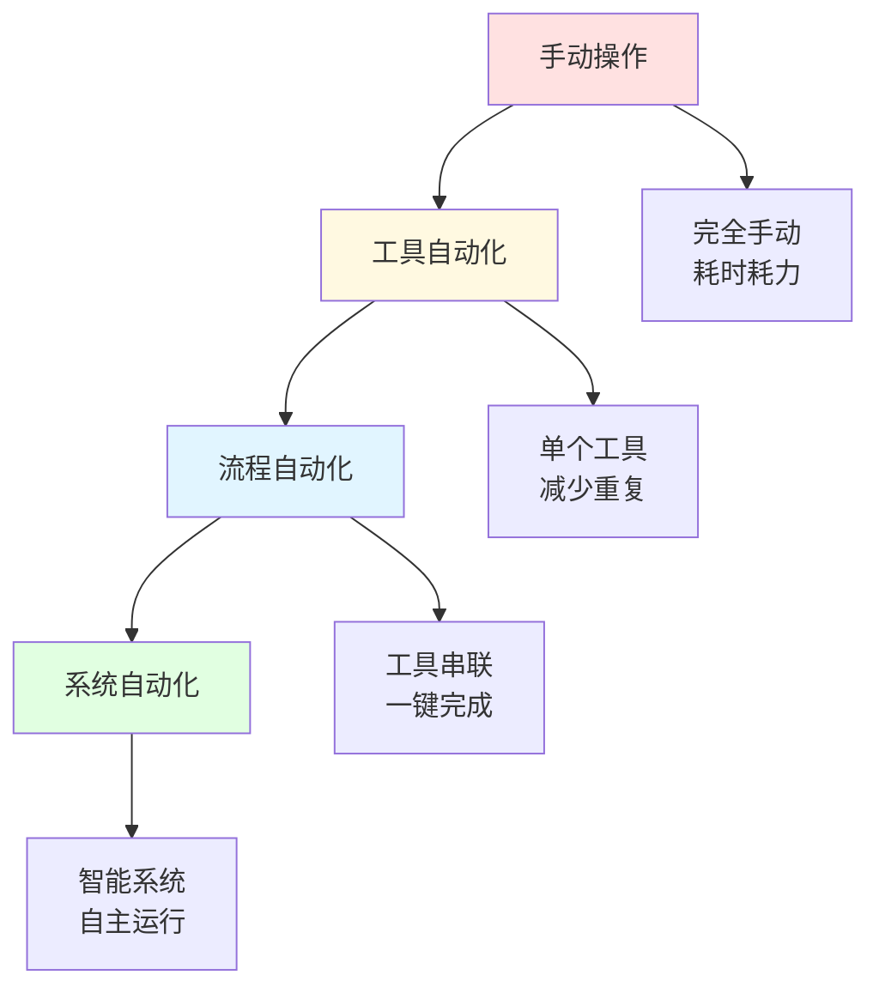
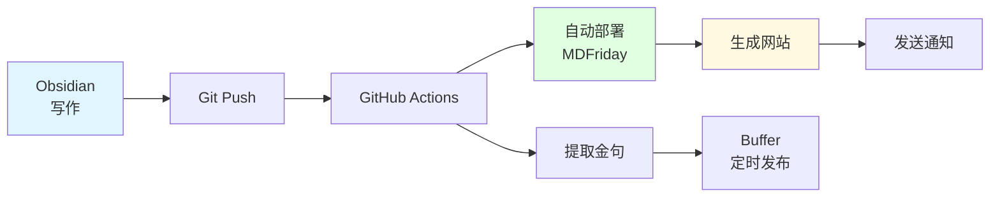
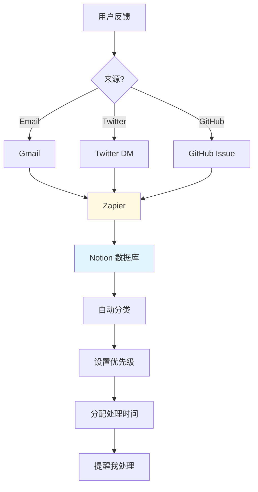
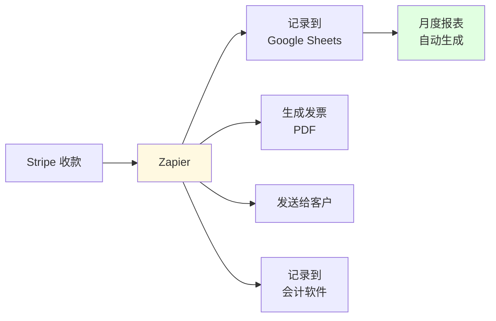

> [!quote] 核心观点
> **重复的事情自动化，重要的事情系统化。**
> 
> 自动化不是偷懒，而是把时间用在更有价值的事情上。

## 为什么需要工作流自动化

一人公司的时间陷阱：
- 每天重复相同的操作
- 在不同工具间复制粘贴
- 手动发布到多个平台
- 重复回答相同的问题

> [!important] 自动化的价值
> **节省的时间 = 可以创造价值的时间**
> 
> 如果一个任务：
> - 每天花费10分钟
> - 一年365天
> - = 60小时/年
> 
> 值得花2小时设置自动化！

## 🎯 自动化的三个层次



### 层次1：工具自动化

**定义**：使用单个工具的自动化功能

**示例**：
- 邮件自动分类（Gmail 过滤器）
- 定时发布（Buffer, Hootsuite）
- 自动备份（Time Machine, iCloud）
- 模板快速输入（TextExpander）

**适合**：
- 刚开始优化
- 简单重复任务
- 不需要工具间协作

---

### 层次2：流程自动化

**定义**：多个工具串联，形成自动化流程

**示例**：
```
新邮件 → 
Zapier触发 → 
添加到Notion → 
发送Slack通知 → 
自动回复确认
```

**适合**：
- 跨工具的重复流程
- 需要协调多个步骤
- 有明确的触发条件

---

### 层次3：系统自动化

**定义**：完整的自动化系统，智能决策和执行

**示例**：
```
写文章 → 
自动保存到Git → 
AI生成摘要 → 
自动发布到网站 → 
提取金句发Twitter → 
制作图文发小红书 → 
发送Newsletter → 
记录数据到分析系统
```

**适合**：
- 成熟的业务流程
- 高频重复的核心工作
- 值得投入开发时间

## 💡 值得自动化的10个场景

### 1. 内容发布流程

**手动流程**：
```
写文章 (Obsidian) →
复制到网站后台 →
格式调整 →
添加图片 →
SEO设置 →
发布 →
复制链接 →
分享到Twitter →
分享到LinkedIn →
发送Newsletter
```

**自动化后**：
```
写文章 (Obsidian) →
Git push →
[自动化系统]
  - 自动部署到网站
  - 生成社交媒体帖子
  - 排期发布
  - 发送Newsletter
  - 记录分析数据
```

**工具**：
- MDFriday (自动发布)
- Zapier (串联工具)
- Buffer (定时发布)

---

### 2. 社交媒体管理

**手动流程**：
```
每天登录5个平台 →
分别发布内容 →
回复评论 →
查看数据
```

**自动化后**：
```
批量创作内容 →
Buffer 统一管理 →
定时发布 →
集中回复 →
统一数据面板
```

**工具**：
- Buffer/Hootsuite (多平台管理)
- Zapier (自动化)
- Google Sheets (数据汇总)

---

### 3. 邮件管理

**手动流程**：
```
收到邮件 →
阅读 →
分类 →
回复 →
归档 →
添加到待办
```

**自动化后**：
```
收到邮件 →
[Gmail 过滤器]
  - 自动分类
  - 重要邮件标记
  - 垃圾邮件过滤
[Zapier]
  - 重要事项 → Notion
  - 客户咨询 → CRM
  - 发票 → 财务系统
```

---

### 4. 客户沟通

**手动流程**：
```
收到咨询 →
手动回复 →
解释产品 →
发送资料 →
跟进
```

**自动化后**：
```
收到咨询 →
[自动回复]
  - 欢迎消息
  - FAQ链接
  - 预约日历
[Zapier]
  - 添加到CRM
  - 标记跟进时间
  - 发送系列邮件
```

**工具**：
- 自动回复（Gmail）
- Calendly（预约）
- ConvertKit（邮件序列）

---

### 5. 数据收集与分析

**手动流程**：
```
登录Google Analytics →
登录Twitter Analytics →
登录Stripe →
手动记录数据 →
制作报表
```

**自动化后**：
```
[Zapier 定时任务]
每天自动抓取：
  - 网站数据
  - 社交媒体数据
  - 财务数据
汇总到 Google Sheets →
自动生成图表 →
每周发送报表
```

---

### 6. 文件管理

**手动流程**：
```
保存文件到本地 →
手动备份 →
整理分类 →
同步到云端
```

**自动化后**：
```
[自动化规则]
  - 自动备份（Time Machine）
  - 自动同步（iCloud/Dropbox）
  - 自动分类（Hazel规则）
  - 自动压缩旧文件
```

---

### 7. 任务管理

**手动流程**：
```
邮件中提到的任务 →
手动添加到待办 →
手动设置提醒 →
手动标记完成
```

**自动化后**：
```
[Zapier]
邮件中"TODO" →
自动创建任务（Notion）→
自动设置截止日期 →
自动发送提醒
```

---

### 8. 发票和收款

**手动流程**：
```
记录收入 →
手动开发票 →
跟进付款 →
记账
```

**自动化后**：
```
Stripe 收款 →
[自动化]
  - 自动生成发票
  - 自动发送给客户
  - 自动记录到财务表
  - 未付款自动提醒
```

---

### 9. 素材收集

**手动流程**：
```
看到好内容 →
复制链接 →
打开Notion →
手动粘贴 →
添加标签
```

**自动化后**：
```
浏览器插件一键保存 →
[自动化]
  - 自动提取标题
  - 自动添加日期
  - 自动分类
  - 自动添加到Obsidian
```

**工具**：
- Reader (阅读+保存)
- Readwise (自动同步到Obsidian)

---

### 10. 定期报告

**手动流程**：
```
每周手动统计数据 →
制作报告 →
发送给自己/团队
```

**自动化后**：
```
[定时任务]
每周自动：
  - 汇总数据
  - 生成报告
  - 发送邮件
```

## 🎯 我的自动化工作流

### 内容创作到发布



**步骤详解**：

1. **写作阶段**
   - 在 Obsidian 中写文章
   - 使用模板快速开始
   - 保存时自动添加时间戳

2. **发布阶段**
   - Git commit and push
   - GitHub Actions 自动触发
   - MDFriday 自动构建网站
   - 自动部署到服务器

3. **分发阶段**
   - 自动提取文章金句
   - 添加到 Buffer 队列
   - 定时发布到 Twitter
   - 发送到 Newsletter（手动确认）

4. **分析阶段**
   - 访问数据自动记录
   - 每周自动生成报表
   - 发送到邮箱

---

### 用户反馈处理



**自动化规则**：

1. **收集阶段**
   - 所有反馈汇总到 Notion
   - 自动添加时间戳
   - 自动添加来源标签

2. **分类阶段**
   - Bug → 高优先级
   - 功能请求 → 中优先级
   - 使用疑问 → 低优先级

3. **处理阶段**
   - 24小时内必须回复（自动提醒）
   - 解决后自动发送通知
   - 自动归档已处理

---

### 财务管理



## 💡 自动化工具推荐

### 核心自动化工具

#### 1. Zapier / Make.com
**用途**：连接不同工具，创建自动化流程

**常用场景**：
- 新邮件 → Notion
- 新付费用户 → 欢迎邮件
- 新博客文章 → 社交媒体
- 表单提交 → CRM

**定价**：
- Zapier: $19.99/月起
- Make.com: $9/月起（更便宜）

---

#### 2. GitHub Actions
**用途**：代码相关的自动化

**常用场景**：
- 代码提交 → 自动测试
- 内容更新 → 自动部署
- 定时任务 → 数据抓取
- 自动备份

**定价**：免费（有限额）

---

#### 3. IFTTT
**用途**：简单的if-this-then-that自动化

**常用场景**：
- 天气变化 → 提醒
- RSS更新 → 通知
- 发Twitter → 保存到Notion
- 地理位置 → 触发动作

**定价**：免费 / $2.5/月（Pro）

---

#### 4. Keyboard Maestro (Mac)
**用途**：本地自动化，快捷键操作

**常用场景**：
- 快速插入模板
- 批量处理文件
- 自动化系统操作
- 复杂的工作流

**定价**：$36 一次性

---

#### 5. Hazel (Mac)
**用途**：自动化文件管理

**常用场景**：
- 自动整理下载文件
- 自动重命名文件
- 自动移动到指定文件夹
- 自动删除旧文件

**定价**：$42 一次性

## 🚫 自动化的常见错误

### 错误1：过早优化
❌ "我要自动化所有事情"

✅ 正确做法：
> "先手动做3次，确认流程稳定后再自动化"

---

### 错误2：为了自动化而自动化
❌ "花3小时自动化一个每月花5分钟的任务"

✅ 正确做法：
> "计算ROI，优先自动化高频高耗时任务"

**ROI计算**：
```
节省时间 = 任务耗时 × 频率 × 时间
自动化值得 = 节省时间 > 设置时间 × 2
```

---

### 错误3：过度复杂
❌ "建立一个10步的自动化流程"

✅ 正确做法：
> "从简单开始，逐步优化"

---

### 错误4：不做备份
❌ "自动化系统出错，数据丢失"

✅ 正确做法：
> "重要数据多处备份，关键节点人工确认"

---

### 错误5：设置后不管
❌ "自动化了就不用管了"

✅ 正确做法：
> "定期检查，确保正常运行"

## 🎯 自动化实施清单

### 步骤1：识别重复任务（第1周）
- [ ] 记录一周的所有任务
- [ ] 标记重复性任务
- [ ] 计算每个任务的耗时
- [ ] 计算重复频率

### 步骤2：优先级排序（第2周）
- [ ] 计算ROI
- [ ] 选择前3个任务
- [ ] 确认自动化方案
- [ ] 评估工具成本

### 步骤3：实施自动化（第3周）
- [ ] 购买/安装工具
- [ ] 设置自动化流程
- [ ] 测试多次
- [ ] 记录文档

### 步骤4：监控优化（持续）
- [ ] 每周检查运行状况
- [ ] 记录出错情况
- [ ] 持续优化流程
- [ ] 复制到其他任务

## 🔗 相关资源

### 相关章节
- [[01-时间管理|时间管理]] - 识别值得自动化的任务
- [[03-工具栈选择|工具栈选择]] - 选择自动化工具
- [[04-持续改进|持续改进]] - 优化自动化流程

---

## 🎯 记住

> [!quote] 核心原则
> **重复的事情自动化，重要的事情系统化。**
> 
> 自动化不是目的，节省时间用于创造才是。
> 
> 先确认流程，再自动化。
> 计算ROI，避免过早优化。
> 从简单开始，持续迭代。
> 
> 让系统为你工作，你专注于创造价值。

---

*下一章: [[03-工具栈选择|03. 工具栈选择 - 选择合适的工具]]* 👉

*返回: [[1.一人公司/4.系统/index|系统模块首页]]*
