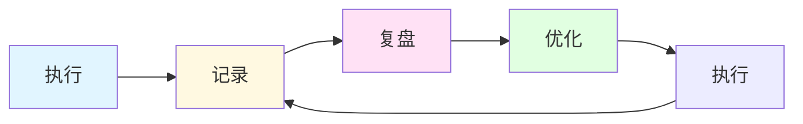
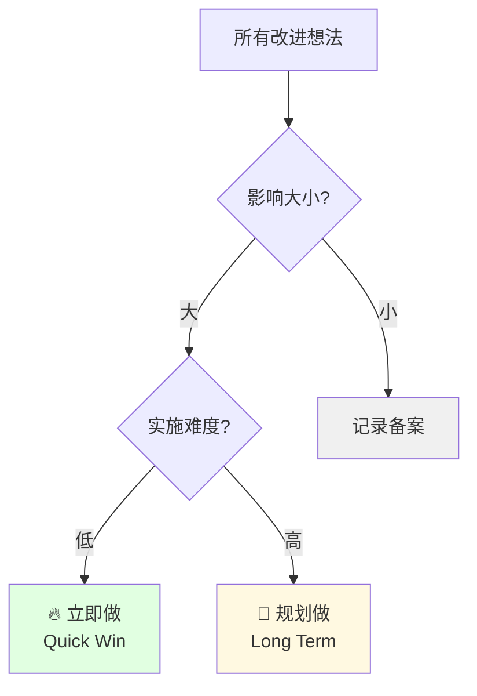

> [!quote] 核心观点
> **系统不是一成不变的，而是随你成长的。**
> 
> 没有完美的系统，只有持续改进的过程。

## 为什么需要持续改进

系统的生命周期：
- 新系统：兴奋、高效
- 3个月后：开始僵化
- 6个月后：成为负担
- 1年后：需要重构

> [!important] 系统的宿命
> **所有系统都会随时间退化**
> 
> - 需求变化了
> - 工具更新了
> - 你成长了
> - 环境不同了
> 
> 不改进 = 退步

## 🎯 持续改进的循环



### 循环1：每日复盘

**时间**：每天结束前10分钟

**问题**：
1. 今天完成了什么？
2. 什么进展顺利？
3. 遇到了什么阻碍？
4. 明天最重要的3件事？

**工具**：
- Obsidian Daily Note
- Apple Notes
- 简单的笔记本

**我的模板**：
```markdown
# 日复盘 - 2026-02-28

## ✅ 今日完成
- 深度工作：写完《持续改进》文章
- 学习输入：读书1小时
- 互动运营：回复20条评论

## 🎯 进展顺利
- 写作状态很好，2小时完成2500字
- 发现了新的选题角度

## 🚧 遇到阻碍
- 下午能量不足，效率低
- 被突然的消息打断两次

## 📝 明日最重要
1. 发布《持续改进》文章
2. 开始下一篇《实战案例》
3. 优化 MDFriday 一个功能

## 💡 改进想法
- 下午安排轻量任务
- 设置勿扰时段（上午9-11点）
```

---

### 循环2：每周复盘

**时间**：周日晚上30分钟

**问题**：
1. 本周目标完成情况？
2. 什么做得好？
3. 什么需要改进？
4. 下周重点是什么？

**指标回顾**：
- 工作时长
- 深度工作时长
- 内容产出
- 用户增长
- 收入情况

**我的模板**：
```markdown
# 周复盘 - Week 9, 2026

## 📊 本周数据
- 深度工作：10小时（目标10h）✅
- 文章产出：2篇（目标2篇）✅
- 社交媒体：15条（目标15条）✅
- 网站访问：1,200（↑15%）📈
- 新增用户：25（↑20%）📈
- MRR：$2,100（↑5%）📈

## 🎯 目标达成
- ✅ 完成品牌模块所有文章
- ✅ 发布 MDFriday V2.1
- ⚠️ 用户访谈完成3个（目标5个）

## 💪 做得好的
- 坚持每天深度工作2小时
- 内容质量有提升
- 自动化节省了3小时

## 🔧 需要改进
- 用户访谈优先级不够
- 社交媒体互动太少
- 周五下午效率低

## 📅 下周重点
1. 完成5个用户访谈
2. 开始内容模块文章
3. 增加社交媒体互动
4. 优化下午工作节奏

## 💡 系统优化
- [ ] 周三下午固定用户访谈时间
- [ ] 每天增加30分钟社交互动
- [ ] 周五只安排轻量任务
```

---

### 循环3：每月复盘

**时间**：月末1-2小时

**问题**：
1. 月度目标达成情况？
2. 最大的进步是什么？
3. 最大的挑战是什么？
4. 下月的重点方向？

**深度分析**：
- 时间使用分析
- 收入来源分析
- 用户增长分析
- 内容表现分析

**我的模板**：
```markdown
# 月复盘 - 2026年2月

## 📊 月度数据
| 指标 | 本月 | 上月 | 变化 |
|------|------|------|------|
| 工作时长 | 90h | 95h | ↓5% |
| 深度工作 | 40h | 35h | ↑14% |
| 文章产出 | 8篇 | 6篇 | ↑33% |
| 网站访问 | 5,000 | 4,200 | ↑19% |
| 付费用户 | 85 | 75 | ↑13% |
| MRR | $850 | $750 | ↑13% |

## 🎯 目标完成度
✅ 发布8篇高质量文章（目标8篇）
✅ MRR突破$800（目标$800）
✅ 完成产品V2.0（目标完成）
⚠️ 社群运营（目标50活跃，实际30）

## 💰 收入分析
- MDFriday订阅：$750（88%）
- 咨询服务：$100（12%）

增长动力：
- V2.0功能吸引新用户
- 内容营销见效
- 用户推荐增加

## 📈 最大进步
1. **深度工作时长提升**：通过优化日程，深度工作从35h→40h
2. **内容质量提升**：用户反馈更积极
3. **自动化**：节省5小时/周

## 🚧 最大挑战
1. **社群运营不足**：太专注产品和内容，忽视社群
2. **用户流失**：3个用户取消订阅
3. **精力管理**：月底明显疲惫

## 🔄 三个关键改进
1. **社群运营系统化**
   - 每周固定1小时社群时间
   - 发起主题讨论
   - 培养核心用户

2. **用户留存优化**
   - 主动联系流失风险用户
   - 优化新用户引导
   - 增加使用价值提示

3. **能量管理**
   - 每周固定休息日
   - 减少非必要会议
   - 增加运动时间

## 📅 下月重点
1. 社群运营系统化
2. 降低流失率到<5%
3. 完成内容模块所有文章
4. MRR突破$900
```

---

### 循环4：每季度复盘

**时间**：季度末半天

**问题**：
1. 季度目标达成情况？
2. 业务健康度如何？
3. 战略方向对吗？
4. 下季度的大方向？

**战略思考**：
- 产品方向
- 市场定位
- 收入模式
- 个人成长

**我的模板**：
```markdown
# Q1 2026 复盘

## 📊 季度数据

### 业务数据
| 指标 | Q1 | Q4 2025 | 增长 |
|------|-----|---------|------|
| MRR | $2,100 | $1,200 | +75% |
| 付费用户 | 210 | 120 | +75% |
| 流失率 | 8% | 12% | 改善 |
| NPS | 65 | 50 | +15 |

### 个人数据
- 工作总时长：260h
- 深度工作：120h（46%）
- 文章产出：24篇
- 代码提交：180次

## 🎯 目标完成度
✅ MRR $2,000（达成105%）
✅ 发布V2.0（完成）
✅ 写完品牌模块（完成）
⚠️ 建立社群（50%完成）

## 💪 三个最大成就
1. **MRR增长75%**：产品改进+内容营销
2. **建立完整的知识体系**：24篇文章
3. **工作生活平衡**：平均每天工作4小时

## 🚧 三个主要挑战
1. **规模化难题**：一个人精力有限
2. **竞品压力**：类似产品增多
3. **内容分发**：触达范围有限

## 🎓 关键学习
1. **专注 > 多元化**：聚焦核心产品，而非做很多东西
2. **内容是长期资产**：24篇文章持续带来流量
3. **用户>功能**：深度服务100人>浅度服务1000人

## 🔄 战略调整
1. **产品战略**
   - 专注 Obsidian 用户
   - 不追求大而全
   - 打磨核心体验

2. **内容战略**
   - 持续输出深度内容
   - 建立知识IP
   - 拓展分发渠道

3. **收入战略**
   - 增加客单价（新套餐）
   - 开发企业版
   - 保持简单定价

## 📅 Q2 目标
1. MRR $3,000（+43%）
2. 付费用户 300（+43%）
3. 完成内容+产品模块文章
4. 建立活跃社群（100人）
5. 发布V2.5
```

## 💡 改进的三个维度

### 维度1：效率改进

**识别浪费**：
- 哪些任务耗时长但价值低？
- 哪些环节可以自动化？
- 哪些工具可以淘汰？

**优化方向**：
- 自动化重复任务
- 简化复杂流程
- 删除无效环节

---

### 维度2：效果改进

**识别瓶颈**：
- 哪个指标没达标？
- 为什么没达标？
- 如何突破？

**优化方向**：
- 聚焦关键指标
- 测试新方法
- 持续迭代

---

### 维度3：体验改进

**识别问题**：
- 什么让你感到痛苦？
- 什么让你感到疲惫？
- 什么让你失去热情？

**优化方向**：
- 简化工作流
- 增加休息
- 找回乐趣

## 🎯 改进优先级矩阵



### 立即做（Quick Wins）
- 影响大
- 难度低
- 立即见效

**示例**：
- 设置勿扰时段
- 使用内容模板
- 批量处理邮件

---

### 规划做（Long Term）
- 影响大
- 难度高
- 需要时间

**示例**：
- 开发自动化系统
- 重构工作流程
- 学习新技能

---

### 记录备案（Backlog）
- 影响小
- 或者不确定

**做法**：
- 记录在 Notion
- 定期回顾
- 可能以后有用

## 🌟 案例：我的改进历程

### 改进1：深度工作时长提升

**问题发现**（Week 4）：
- 每天工作6小时
- 但深度工作只有1小时
- 大量时间在切换和杂事

**分析原因**：
- 没有固定的深度工作时间
- 消息打断太频繁
- 任务没有优先级

**改进措施**（Week 5开始）：
- ✅ 固定9-11点深度工作
- ✅ 手机静音，勿扰模式
- ✅ 时间块日历

**效果验证**（Week 8）：
- 深度工作：1h → 2.5h
- 工作总时长：6h → 4.5h
- 产出：提升50%

---

### 改进2：内容创作效率

**问题发现**（Month 2）：
- 写一篇文章要2天
- 经常卡住不知道写什么
- 质量不稳定

**分析原因**：
- 没有素材库
- 每次从零开始
- 没有写作流程

**改进措施**（Month 3开始）：
- ✅ 建立素材库（Obsidian）
- ✅ 使用主题树规划
- ✅ 标准化写作流程

**效果验证**（Month 4）：
- 写作时间：2天 → 5小时
- 选题时间：2小时 → 0
- 质量：更稳定

---

### 改进3：自动化发布

**问题发现**（Month 3）：
- 手动发布到多个平台
- 每篇文章花1小时分发
- 容易遗漏某个平台

**分析原因**：
- 没有自动化
- 手动操作太多
- 流程不清晰

**改进措施**（Month 4开始）：
- ✅ 开发MDFriday自动发布
- ✅ 使用Buffer管理社交媒体
- ✅ Zapier自动化流程

**效果验证**（Month 5）：
- 发布时间：1小时 → 10分钟
- 覆盖平台：3个 → 6个
- 出错率：降低

## 🚫 持续改进的常见错误

### 错误1：改太多
❌ "我要同时改进10个地方"

✅ 正确做法：
> "每次只改进1-2个最重要的"

---

### 错误2：改太快
❌ "这周改，下周又改"

✅ 正确做法：
> "给新系统至少2周适应期"

---

### 错误3：不记录
❌ "凭感觉觉得好像有改进"

✅ 正确做法：
> "记录数据，量化改进效果"

---

### 错误4：完美主义
❌ "等设计完美的系统再执行"

✅ 正确做法：
> "简单系统，快速迭代"

---

### 错误5：忘记初心
❌ "为了优化而优化"

✅ 正确做法：
> "记住目标：更自由的生活"

## 🎯 持续改进检查清单

### 每日
- [ ] 10分钟日复盘
- [ ] 记录改进想法
- [ ] 执行昨天的小改进

### 每周
- [ ] 30分钟周复盘
- [ ] 回顾本周数据
- [ ] 规划下周优化
- [ ] 执行1-2个小改进

### 每月
- [ ] 1-2小时月复盘
- [ ] 深度数据分析
- [ ] 识别最大瓶颈
- [ ] 规划下月重点改进

### 每季度
- [ ] 半天战略复盘
- [ ] 业务健康度检查
- [ ] 战略方向调整
- [ ] 设定下季度OKR

## 🔗 相关资源

### 相关章节
- [[01-时间管理|时间管理]] - 持续优化时间使用
- [[02-工作流自动化|工作流自动化]] - 持续自动化
- [[03-工具栈选择|工具栈选择]] - 持续优化工具

### 实战案例
- [[实战案例/我的一天工作流|完整的改进历程]]

---

## 🎯 记住

> [!quote] 核心原则
> **系统不是一成不变的，而是随你成长的。**
> 
> 没有完美的系统，只有持续改进的过程。
> 
> 每日小复盘 + 每周中复盘 + 每月深复盘。
> 识别瓶颈，优先改进，量化效果。
> 
> 改进的目的不是更忙，
> 而是更自由、更高效、更快乐。

---

*恭喜！你已完成全部四大模块 🎉*

*返回: [[1.一人公司/4.系统/index|系统模块首页]] | [[../index|一人公司实战笔记首页]]*
