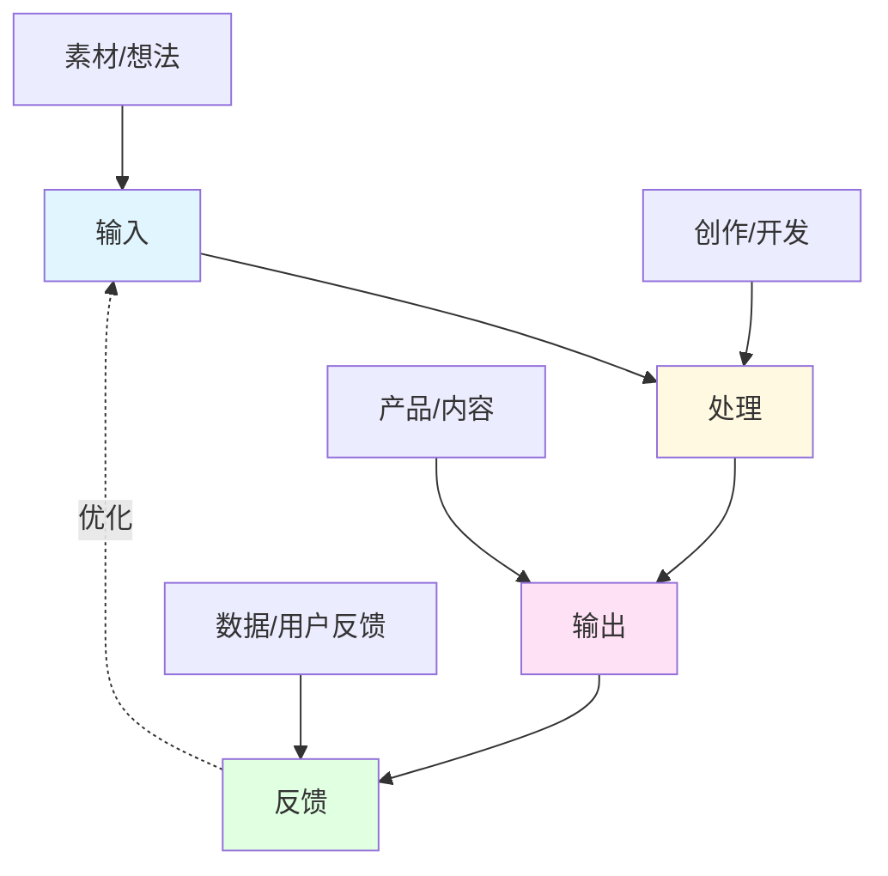
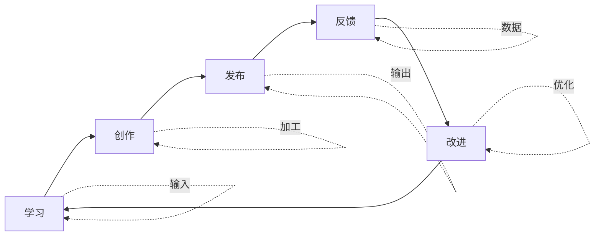

> [!quote] 系统的本质
> **系统不是限制自由，而是创造自由的基础。**
> 
> 在一人公司中，系统让你少工作、赚更多、享受生活。

## 为什么系统是可持续的关键

有了品牌、内容、产品，你开始运转。
但没有系统，你会很快陷入忙碌的陷阱。

> [!important] 系统的三大作用
> - **提升效率**: 用更少时间完成更多工作
> - **保证质量**: 标准化流程，减少失误
> - **实现自由**: 从日常琐事中解放出来

**"少工作，赚更多"的秘密就在系统。**

## 🎯 本模块内容

### [[01-时间管理|01. 时间管理]] - 设计你的理想工作日

> **时间是最宝贵的资源**

在这一章，你将学会：
- 2+1+1 工作法则
- 深度工作时段设计
- 能量管理 > 时间管理
- 真实案例：我的理想工作日

👉 [[01-时间管理|开始学习时间管理]]

---

### [[02-工作流自动化|02. 工作流自动化]] - 让系统为你工作

> **重复的事情自动化，重要的事情系统化**

在这一章，你将学会：
- 识别可自动化的环节
- 工具自动化 vs 流程自动化
- 如何减少重复劳动
- 真实案例：我的自动化工作流

👉 [[02-工作流自动化|开始学习工作流自动化]]

---

### [[03-工具栈选择|03. 工具栈选择]] - 选择合适的工具

> **工具服务于目标，而非目标服务于工具**

在这一章，你将学会：
- 选择工具的核心原则
- 我的完整工具栈介绍
- Obsidian + MDFriday 生态系统
- 真实案例：工具栈的演进

👉 [[03-工具栈选择|开始学习工具栈选择]]

---

### [[04-持续改进|04. 持续改进]] - 让系统不断进化

> **系统不是一成不变的，而是随你成长的**

在这一章，你将学会：
- 每周复盘系统
- 月度回顾与调整
- 如何避免系统僵化
- 真实案例：我的改进循环

👉 [[04-持续改进|开始学习持续改进]]

---

## 🎯 实战案例

真实的系统搭建过程，包括工具、流程和经验：

### [[实战案例/我的一天工作流|我的一天工作流]]
从早到晚的完整时间安排

### [[实战案例/Obsidian+MDFriday工作系统|Obsidian + MDFriday 工作系统]]
完整的知识管理和发布系统

### [[实战案例/从笔记到发布的完整流程|从笔记到发布的完整流程]]
端到端的内容生产线

---

## 📊 系统思维框架

## 💡 一人公司的工作流飞轮

> [!tip] 飞轮效应
> 每一次循环都会让系统更加高效：
> - 学习积累知识
> - 创作产生价值
> - 发布获得反馈
> - 反馈指导改进
> - 改进提升质量

## 🎯 2+1+1 工作法则

> [!success] 高效的一天
> 
> **2小时：深度创造**
> - 写作/开发/设计
> - 早上能量最高时
> - 关闭所有干扰
> 
> **1小时：学习输入**
> - 阅读/课程/研究
> - 为创作积累素材
> - 保持成长
> 
> **1小时：互动运营**
> - 回复评论/邮件
> - 社交媒体互动
> - 社群运营
> 
> **其余时间：生活**
> - 运动/休息/娱乐
> - 享受生活
> - 补充能量

## 🛠️ 我的工具栈

### 思考与创作
- **Obsidian**: 笔记、写作、知识管理
- **Excalidraw**: 视觉思考、流程图
- **Mermaid**: 图表绘制

### 开发与发布
- **VS Code**: 代码编辑
- **GitHub**: 版本控制、协作
- **MDFriday**: 知识网站发布

### 自动化与效率
- **Obsidian Plugin Friday**: 自动化发布
- **Quartz Theme**: 美观的知识网站
- **Alfred/Raycast**: 快速启动工具

### 沟通与协作
- **Email**: 邮件列表运营
- **Twitter/X**: 社交媒体
- **Discord**: 社群运营

> [!tip] 工具选择原则
> 1. **少而精**: 宁可精通少数工具，不要什么都尝试
> 2. **可组合**: 工具之间能协同工作
> 3. **可迁移**: 数据格式开放，随时可以迁移
> 4. **可持续**: 选择长期维护的工具

## 💡 核心原则

> [!tip] 系统设计的黄金法则
> 
> **1. 简单 > 复杂**
> 最好的系统是你能坚持使用的系统，不是最完美的系统。
> 
> **2. 灵活 > 僵化**
> 系统是为你服务的，不要成为系统的奴隶。
> 
> **3. 自动 > 手动**
> 能自动化的就自动化，把精力留给创造性工作。
> 
> **4. 迭代 > 完美**
> 从简单开始，根据使用反馈持续优化。

## 🎯 系统搭建的三个阶段

### 阶段1: 基础搭建 (第1-2周)
> [!info] 目标：建立最基本的工作流
> 
> - [ ] 选择核心工具（笔记、创作、发布）
> - [ ] 设计每日时间表
> - [ ] 建立内容创作流程
> - [ ] 设置基本的自动化

### 阶段2: 优化迭代 (第3-8周)
> [!info] 目标：发现瓶颈，持续改进
> 
> - [ ] 记录时间使用情况
> - [ ] 识别重复性工作
> - [ ] 增加自动化环节
> - [ ] 调整工作节奏

### 阶段3: 系统成熟 (第9周+)
> [!info] 目标：形成稳定高效的系统
> 
> - [ ] 系统运转顺畅
> - [ ] 每周工作4小时足以维持
> - [ ] 有时间探索新方向
> - [ ] 持续微调优化

## 🚀 快速开始

> [!success] 本周就能完成的系统搭建
> 
> **Day 1: 时间审计**
> - [ ] 记录你一天的时间使用
> - [ ] 标注哪些是创造性工作
> - [ ] 标注哪些是重复性工作
> 
> **Day 2-3: 设计理想工作日**
> - [ ] 确定你的能量高峰时段
> - [ ] 安排2小时深度工作块
> - [ ] 设计一天的理想节奏
> 
> **Day 4-5: 选择工具**
> - [ ] 选择笔记工具
> - [ ] 选择创作工具
> - [ ] 选择发布工具
> 
> **Day 6-7: 建立第一个流程**
> - [ ] 写下从想法到发布的步骤
> - [ ] 测试并优化
> - [ ] 记录标准操作流程 (SOP)

## 📊 效率指标

### 关注这些指标
- **深度工作时长**: 每天多少小时处于心流状态
- **内容产出**: 每周发布多少内容
- **自动化比例**: 多少工作被自动化
- **能量水平**: 每天结束时的精力状态

### 不要过度关注
- 工作总时长（质量 > 数量）
- 粉丝增长（价值 > 虚荣指标）
- 工具数量（精简 > 齐全）

## 🔗 相关资源

### 理论基础
- [[../2.内容/DK/视频笔记/1|Dan Koe - 一人商业模式的核心理念]]
- [[../2.内容/DK/视频笔记/25|Dan Koe - 一人商业模式完整指南]]
- [[../2.内容/DK/视频笔记/26|Dan Koe - 科氏定律]]

### 工具指南
- [[实战案例/Obsidian+MDFriday工作系统|完整工具栈介绍]]
- [[../2.内容/实战案例/Obsidian写作工作流|写作工作流]]

### 其他模块
- [[../1.品牌/index|品牌模块]] - 系统的目标是服务于品牌
- [[../2.内容/index|内容模块]] - 系统化内容创作
- [[../3.产品/index|产品模块]] - 系统化产品开发

---

## 🎯 下一步

> [!info] 推荐学习路径
> 1. 先优化 [[01-时间管理|时间管理]]，设计理想的一天
> 2. 然后建立 [[02-工作流自动化|自动化流程]]，减少重复劳动
> 3. 接着选择 [[03-工具栈选择|合适的工具]]，提升效率
> 4. 最后建立 [[04-持续改进|改进循环]]，让系统不断进化

**系统不是限制，而是自由的基础。**

👉 [[01-时间管理|现在就开始：设计你的理想工作日]]

---

*返回: [[../index|一人公司实战笔记首页]]*
