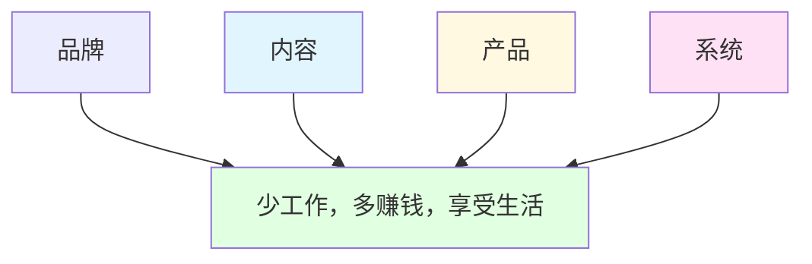
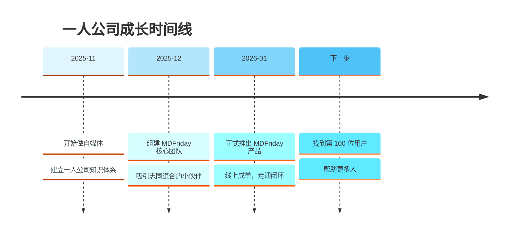

> [!quote] 核心理念
> **少工作，赚更多，享受生活** —— 这不是懒惰，而是通过系统化、自动化与优化实现的智慧生活方式。

## 欢迎来到一人公司实战笔记

这是一本**正在生长**的实战笔记，记录我从零开始打造一人公司的完整旅程。

这里没有理论空谈，只有**真实践行**。每一个方法都经过实战验证，每一次失败都转化为经验，每一步成长都完整记录。

## 🎯 这本笔记是什么

- **实战日志**: 记录我打造 MDFriday 产品和个人品牌的全过程
- **方法论总结**: 从 Dan Koe 等导师处学习并实践的方法体系
- **工作流分享**: 使用 Obsidian + MDFriday 搭建的完整工作系统
- **行动指南**: 每个理论都配有可执行的操作步骤

## 🏗️ 一人公司的四大支柱

一人公司不是单打独斗，而是通过**系统化思维**构建可持续的个人事业。它建立在四大支柱之上：

### 1. 品牌 (Brand) - 你是谁

> **品牌就是你的目标、定位和承诺**

- 找到你的[[1.品牌/01-个人定位|独特定位]]
- 明确你的[[1.品牌/02-价值主张|价值主张]]
- 了解你的[[1.品牌/03-目标受众|目标受众]]
- 讲述你的[[1.品牌/04-品牌故事|品牌故事]]

---

### 2. 内容 (Content) - 你说什么

> **内容是建立信任、展示专业性的载体**

- 建立内容[[2.内容/02-写作系统|创作系统]]
- 设计内容[[2.内容/03-内容分发|分发策略]]
- 持续输出有价值的内容
- 培养你的受众

---

### 3. 产品 (Product) - 你提供什么

> **产品是你解决问题的系统化方案**

- 设计[[3.产品/02-MVP开发|最小可行产品]](MVP)
- 快速验证市场需求
- 持续[[3.产品/03-产品迭代|迭代改进]]
- 建立[[3.产品/04-定价策略|产品阶梯]]

---

### 4. 系统 (System) - 你如何运转

> **系统让一切高效、可持续、可扩展**

- 设计你的[[4.系统/01-时间管理|理想工作日]]
- 建立[[4.系统/02-工作流自动化|自动化工作流]]
- 选择合适的[[4.系统/03-工具栈选择|工具栈]]
- 持续[[4.系统/04-持续改进|优化改进]]

## 🎯 如何使用这本笔记

### 如果你是新手

1. 从 [[1.品牌/01-个人定位|个人定位]] 开始，找到你的方向
2. 学习 [[2.内容/02-写作系统|建立写作系统]]，开始内容创作
3. 创建你的 [[3.产品/01-产品设计|第一个产品]]
4. 搭建 [[4.系统/03-工具栈选择|你的工具栈]]

### 如果你已经在路上

- 使用搜索功能找到你需要的主题
- 通过标签浏览相关内容
- 查看 [[实战案例]] 获取灵感
- 使用图谱发现知识之间的联系

### 如果你想快速行动

> [!tip] 快速启动清单
> - [ ] 完成 [[1.品牌/01-个人定位|个人定位]] 练习
> - [ ] 设置 [[2.内容/02-写作系统|每日写作习惯]]
> - [ ] 设计 [[3.产品/01-产品设计|MVP产品]]
> - [ ] 搭建 [[4.系统/03-工具栈选择|基础工具栈]]

## 🚀 我的一人公司旅程

## 💡 核心理念

基于 Dan Koe 的理论和我的实践，一人公司的核心理念是：

> [!important] 一人公司的本质
> - **商业是自我实现的载体**，而非仅仅赚钱的工具
> - **你就是你的细分市场**，最独特的价值来自你的经验和视角
> - **少工作，赚更多**，通过系统化而非时间堆砌
> - **内容即营销**，教育即销售
> - **产品即系统**，将你的方法打包成可复制的解决方案

## 🛠️ 我的工具栈

这套笔记本身就是我工作流的产物：

- **思考与写作**: Obsidian
- **知识管理**: Obsidian + 双向链接
- **网站发布**: MDFriday + Quartz 主题
- **自动化**: Obsidian Plugin Friday

👉 详细了解: [[4.系统/03-工具栈选择|我的完整工具栈]]

## 📚 相关资源

### 理论基础
- [[1.一人公司/5.大家/Dan Koe/视频笔记/_index|Dan Koe 视频笔记合集]] - 33个视频的完整总结
- [[1.一人公司/5.大家/Dan Koe/purpose-profit/_index|Purpose & Profit 笔记]] - 深度理论学习

### 实战案例
- [[MDFriday开发历程]] - 从想法到产品
- [[Obsidian工作流搭建]] - 完整的知识管理系统
- [[我的品牌演变史]] - 个人品牌的迭代过程

## 🎯 开始行动

> [!success] 现在就开始
> 不要等待完美的时机，不要等待完整的准备。
> 
> **选择一个模块，迈出第一步。**

- 如果不知道做什么 → [[1.品牌/01-个人定位|找到你的定位]]
- 如果不知道写什么 → [[2.内容/01-内容策略|建立内容策略]]
- 如果不知道卖什么 → [[3.产品/01-产品设计|设计你的产品]]
- 如果感觉太忙乱 → [[4.系统/01-时间管理|优化你的系统]]

---

> [!quote] 最后的话
> 一人公司不是孤岛，而是选择用自己的方式创造价值。
> 
> 这本笔记会持续更新，记录我的成长轨迹。
> 希望它也能帮助你找到属于自己的道路。
> 
> Let's build something meaningful. 🚀

---

*最后更新: 2026-02-28*
*作者: Wei Sun*
*工具: Obsidian + MDFriday*
