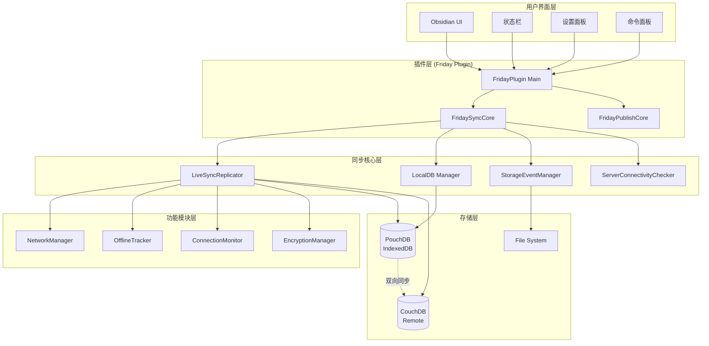
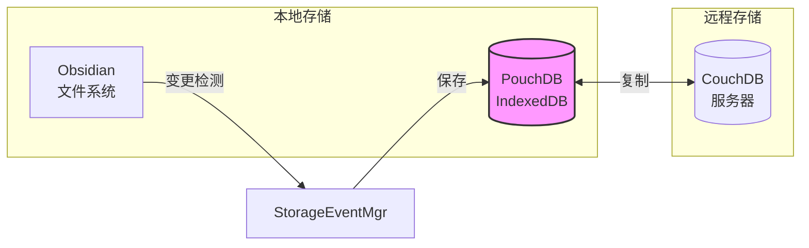
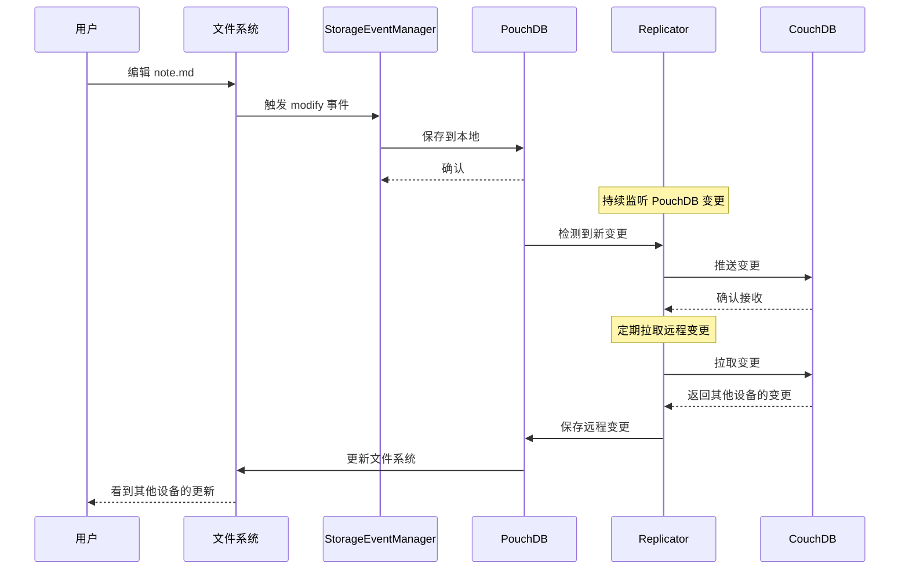
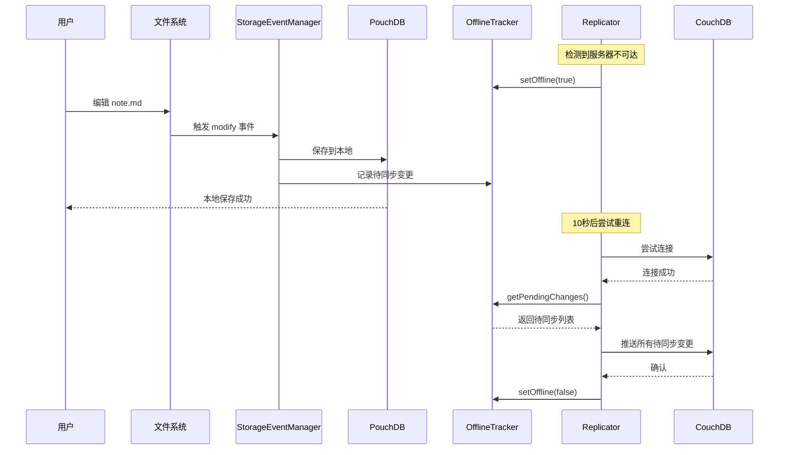
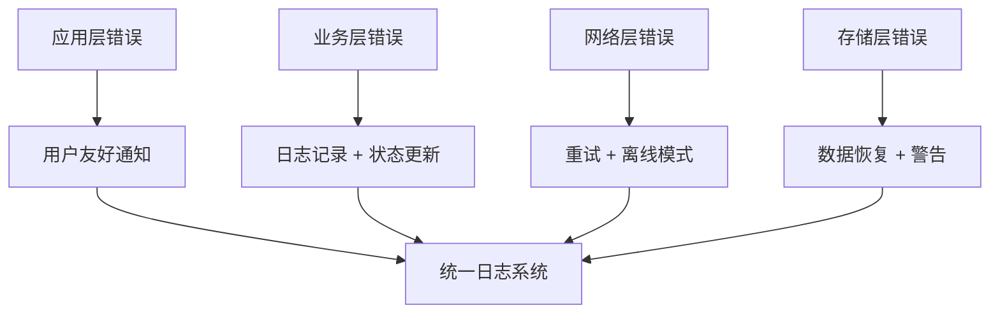
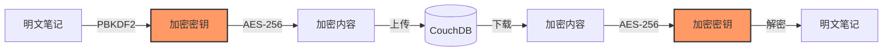

Friday 插件采用模块化、分层的架构设计，确保代码的可维护性、可扩展性和高性能。本文档提供对 Friday 核心架构的全面概览。

## 系统架构总览



## 分层架构

Friday 采用经典的分层架构，从上到下依次为：

### 1. 用户界面层 (Presentation Layer)

负责与用户交互，显示状态和接收命令。

| 组件 | 职责 | 文件路径 |
|------|------|---------|
| 设置面板 | 配置 License、服务器、加密等 | `src/ui/SettingTab.ts` |
| 状态栏 | 显示同步状态、点击触发同步 | `src/ui/StatusBar.ts` |
| 命令面板 | 提供快捷命令（同步、发布等） | `src/ui/Commands.ts` |
| 通知系统 | 显示成功/错误消息 | `src/ui/Notice.ts` |

> [!tip]
> UI 层不包含业务逻辑，所有逻辑都委托给下层。

### 2. 插件层 (Plugin Layer)

Friday 插件的主入口，协调各个子系统。

```typescript
export default class FridayPlugin extends Plugin {
    private syncCore: FridaySyncCore | null = null;
    private publishCore: FridayPublishCore | null = null;
    
    async onload() {
        // 初始化同步核心
        this.syncCore = new FridaySyncCore(this.app, this);
        await this.syncCore.initialize(config);
        
        // 初始化发布核心
        this.publishCore = new FridayPublishCore(this.app, this);
        
        // 注册 UI 组件
        this.registerStatusBar();
        this.registerCommands();
        this.registerSettings();
    }
}
```

**核心职责**:
- 插件生命周期管理
- 子系统初始化和协调
- 全局事件监听

### 3. 核心业务层 (Core Business Layer)

实现 Friday 的核心功能。

#### FridaySyncCore

同步功能的中枢，协调所有同步相关的组件。

```typescript
export class FridaySyncCore {
    private _replicator: LiveSyncCouchDBReplicator | null = null;
    private _localDB: FridayLocalDB | null = null;
    private _storageEventManager: FridayStorageEventManager | null = null;
    private _serverChecker: ServerConnectivityChecker | null = null;
    private _managers: FridayServiceHub | null = null;
    
    async startSync(continuous: boolean = true): Promise<boolean> {
        // 1️⃣ 检查服务器连接性
        const connectivity = await this._serverChecker?.checkConnectivity();
        
        // 2️⃣ 根据连接状态选择策略
        if (connectivity?.status === "REACHABLE") {
            // 在线模式
            await this.startOnlineSync();
        } else {
            // 离线模式
            await this.startOfflineMode();
        }
    }
}
```

**关键方法**:
- `initialize()`: 初始化所有子组件
- `startSync()`: 启动同步流程
- `stopSync()`: 停止同步
- `handleOfflineMode()`: 处理离线情况

#### FridayPublishCore

发布功能的核心（未来将详细实现）。

### 4. 功能模块层 (Feature Module Layer)

独立的、可复用的功能模块。

```
src/sync/features/
├── ServerConnectivity/      # 服务器连接性检查
├── NetworkEvents/            # 网络事件监听
├── ConnectionMonitor/        # 连接监控和重连
├── ConnectionFailure/        # 连接失败处理
└── OfflineTracker/           # 离线修改追踪
```

每个模块都是**自包含**的，可以独立测试和复用。

> [!example] 功能模块示例
> 
> `ServerConnectivity` 模块：
> - 输入：服务器配置
> - 输出：连接状态（REACHABLE/UNREACHABLE）
> - 无副作用：不修改全局状态
> - 可测试：可以 mock 网络请求

### 5. 存储层 (Data Layer)

负责数据的持久化和检索。



**关键组件**:

| 组件 | 技术 | 用途 |
|------|------|------|
| PouchDB | IndexedDB 封装 | 本地数据库，存储笔记和元数据 |
| CouchDB | 远程数据库 | 云端存储，多设备同步 |
| FileSystem | Obsidian Vault API | 用户可见的文件系统 |

## 数据流架构

### 正常同步流程



### 离线模式数据流



## 核心组件详解

### LiveSyncReplicator

复制器是同步功能的核心，负责在本地 PouchDB 和远程 CouchDB 之间同步数据。

```typescript
export class LiveSyncCouchDBReplicator extends LiveSyncAbstractReplicator {
    // 单次同步
    async openOneShotReplication(
        setting: RemoteDBSettings,
        showResult: boolean,
        syncMode: "sync" | "pullOnly" | "pushOnly"
    ): Promise<boolean> {
        // 1. 确保 PBKDF2 salt
        await this.ensurePBKDF2Salt(setting);
        
        // 2. 检查 salt 一致性
        await this.checkSaltConsistency(setting);
        
        // 3. 执行同步
        await this.performReplication(syncMode);
    }
    
    // 持续同步
    async openReplication(
        setting: RemoteDBSettings,
        keepAlive: boolean,
        showResult: boolean
    ): Promise<boolean> {
        // 启动双向实时同步
        this.startLiveReplication();
    }
}
```

**关键职责**:
- PBKDF2 盐值验证
- 数据库一致性检查
- 单次/持续同步
- 冲突解决

### FridayLocalDB

本地数据库管理器，封装 PouchDB 操作。

```typescript
export class FridayLocalDB {
    private db: PouchDB.Database;
    
    // 初始化数据库
    async initializeDatabase(
        vaultName: string,
        passphrase: string
    ): Promise<boolean> {
        this.db = new PouchDB(vaultName, {
            adapter: 'indexeddb',
            auto_compaction: true
        });
    }
    
    // CRUD 操作
    async get(id: string): Promise<Document | null>;
    async put(doc: Document): Promise<boolean>;
    async remove(doc: Document): Promise<boolean>;
    
    // 批量操作
    async bulkDocs(docs: Document[]): Promise<boolean>;
    
    // 查询
    async allDocs(options?: any): Promise<Document[]>;
    async query(filter: any): Promise<Document[]>;
}
```

### StorageEventManager

文件系统监听器，检测 Obsidian vault 中的文件变更。

```typescript
export class FridayStorageEventManager {
    private _isWatching = false;
    
    beginWatch() {
        this.app.vault.on('create', this.onFileCreate);
        this.app.vault.on('modify', this.onFileModify);
        this.app.vault.on('delete', this.onFileDelete);
        this.app.vault.on('rename', this.onFileRename);
        
        this._isWatching = true;
    }
    
    private async onFileModify(file: TFile) {
        // 读取文件内容
        const content = await this.app.vault.read(file);
        
        // 保存到 PouchDB
        await this.localDB.put({
            _id: file.path,
            content: content,
            mtime: file.stat.mtime
        });
    }
}
```

> [!warning] 防止循环更新
> 
> `StorageEventManager` 需要小心处理自己触发的文件变更，避免无限循环。

### ServerConnectivityChecker

详见 [[server-connectivity|服务器连接性检查]] 文档。

## 设计模式

Friday 采用了多种设计模式来提高代码质量：

### 1. 单例模式 (Singleton)

```typescript
export class FridaySyncCore {
    private static _instance: FridaySyncCore | null = null;
    
    static getInstance(app: App, plugin: Plugin): FridaySyncCore {
        if (!this._instance) {
            this._instance = new FridaySyncCore(app, plugin);
        }
        return this._instance;
    }
}
```

**用途**: 确保核心组件只有一个实例。

### 2. 观察者模式 (Observer)

```typescript
export class ReplicationStatus {
    private observers: Array<(status: SyncStatus) => void> = [];
    
    subscribe(callback: (status: SyncStatus) => void) {
        this.observers.push(callback);
    }
    
    notify(status: SyncStatus) {
        this.observers.forEach(cb => cb(status));
    }
}
```

**用途**: 状态变化通知（如同步状态更新）。

### 3. 策略模式 (Strategy)

```typescript
interface SyncStrategy {
    sync(): Promise<boolean>;
}

class OnlineSync implements SyncStrategy {
    async sync(): Promise<boolean> {
        // 在线同步逻辑
    }
}

class OfflineSync implements SyncStrategy {
    async sync(): Promise<boolean> {
        // 离线模式逻辑
    }
}

class SyncContext {
    private strategy: SyncStrategy;
    
    setStrategy(strategy: SyncStrategy) {
        this.strategy = strategy;
    }
    
    async executeSync(): Promise<boolean> {
        return await this.strategy.sync();
    }
}
```

**用途**: 根据网络状态选择不同的同步策略。

### 4. 工厂模式 (Factory)

```typescript
export class ReplicatorFactory {
    static createReplicator(
        type: 'couchdb' | 'memory',
        env: LiveSyncReplicatorEnv
    ): LiveSyncAbstractReplicator {
        switch (type) {
            case 'couchdb':
                return new LiveSyncCouchDBReplicator(env);
            case 'memory':
                return new LiveSyncMemoryReplicator(env);
            default:
                throw new Error(`Unknown replicator type: ${type}`);
        }
    }
}
```

**用途**: 创建不同类型的复制器。

### 5. 适配器模式 (Adapter)

```typescript
// Obsidian Vault API 适配器
export class VaultAdapter {
    constructor(private vault: Vault) {}
    
    // 统一的文件读取接口
    async readFile(path: string): Promise<string> {
        const file = this.vault.getAbstractFileByPath(path);
        if (file instanceof TFile) {
            return await this.vault.read(file);
        }
        throw new Error('File not found');
    }
}
```

**用途**: 封装 Obsidian API，便于测试和替换。

## 错误处理架构

Friday 采用分层的错误处理策略：



### 错误类型

```typescript
// 自定义错误类型
export class FridaySyncError extends Error {
    constructor(
        message: string,
        public code: string,
        public recoverable: boolean = true
    ) {
        super(message);
        this.name = 'FridaySyncError';
    }
}

// 具体错误
export class ServerUnreachableError extends FridaySyncError {
    constructor() {
        super('服务器不可达', 'SERVER_UNREACHABLE', true);
    }
}

export class EncryptionError extends FridaySyncError {
    constructor(message: string) {
        super(message, 'ENCRYPTION_ERROR', false);
    }
}
```

### 错误处理策略

```typescript
try {
    await this.syncOperation();
} catch (error) {
    if (error instanceof ServerUnreachableError) {
        // 可恢复错误 - 进入离线模式
        this.handleOfflineMode();
    } else if (error instanceof EncryptionError) {
        // 不可恢复错误 - 通知用户
        showNotice('加密错误: ' + error.message);
        this.setStatus('ERRORED');
    } else {
        // 未知错误 - 记录并通知
        Logger(error, LOG_LEVEL_ERROR);
        showNotice('未知错误，请查看日志');
    }
}
```

## 性能优化

### 1. 增量同步

只同步变更的部分，而不是整个数据库：

```typescript
// 使用 PouchDB 的 changes feed
this.db.changes({
    since: 'now',
    live: true,
    include_docs: true
}).on('change', (change) => {
    // 只处理变更的文档
    this.handleChange(change);
});
```

### 2. 节流和防抖

```typescript
import { debounce } from 'lodash-es';

export class FridayStorageEventManager {
    // 防抖：文件修改后 500ms 才保存
    private onFileModify = debounce(async (file: TFile) => {
        await this.saveToLocalDB(file);
    }, 500);
}
```

### 3. 批量操作

```typescript
// 批量保存文档，减少数据库事务
async saveBatch(files: TFile[]) {
    const docs = await Promise.all(
        files.map(f => this.fileToDocument(f))
    );
    await this.db.bulkDocs(docs);
}
```

### 4. 懒加载

```typescript
// 只在需要时初始化大型组件
private _publishCore: FridayPublishCore | null = null;

get publishCore(): FridayPublishCore {
    if (!this._publishCore) {
        this._publishCore = new FridayPublishCore(this.app, this.plugin);
    }
    return this._publishCore;
}
```

### 5. 连接池和缓存

```typescript
// 服务器连接性检查结果缓存 5 秒
private _lastCheckTime: number = 0;
private _lastStatus: ServerStatus = "UNKNOWN";
private _checkCooldown: number = 5000;

async checkConnectivity(): Promise<ServerStatus> {
    const now = Date.now();
    if (now - this._lastCheckTime < this._checkCooldown) {
        return this._lastStatus; // 返回缓存结果
    }
    // 执行实际检查
}
```

## 安全架构

### 1. 端到端加密



### 2. 密钥派生

```typescript
// 使用 PBKDF2 从密码派生密钥
async deriveKey(passphrase: string, salt: string): Promise<CryptoKey> {
    const encoder = new TextEncoder();
    const passphraseKey = await crypto.subtle.importKey(
        'raw',
        encoder.encode(passphrase),
        'PBKDF2',
        false,
        ['deriveBits', 'deriveKey']
    );
    
    return await crypto.subtle.deriveKey(
        {
            name: 'PBKDF2',
            salt: encoder.encode(salt),
            iterations: 100000,
            hash: 'SHA-256'
        },
        passphraseKey,
        { name: 'AES-GCM', length: 256 },
        true,
        ['encrypt', 'decrypt']
    );
}
```

### 3. 安全存储

```typescript
// 加密密码永不上传到服务器
// 只存储在本地（Obsidian 设置）
class EncryptionManager {
    private passphrase: string | null = null;
    
    // 从本地加载
    loadPassphrase(): string | null {
        return this.plugin.settings.encryptionPassphrase;
    }
    
    // 保存到本地
    savePassphrase(passphrase: string) {
        this.plugin.settings.encryptionPassphrase = passphrase;
        this.plugin.saveSettings();
    }
}
```

> [!danger] 安全警告
> 
> - 密码存储在本地的 Obsidian 设置文件中（未加密）
> - 不要在不信任的设备上使用
> - 定期更新密码

## 测试架构

### 单元测试

```typescript
// 使用 Jest 进行单元测试
describe('ServerConnectivityChecker', () => {
    it('should return REACHABLE when server responds', async () => {
        const checker = new ServerConnectivityChecker();
        const result = await checker.checkConnectivity(mockSettings);
        expect(result.status).toBe('REACHABLE');
    });
    
    it('should return UNREACHABLE when server is down', async () => {
        const checker = new ServerConnectivityChecker();
        fetchMock.mockReject(new Error('Connection failed'));
        const result = await checker.checkConnectivity(mockSettings);
        expect(result.status).toBe('UNREACHABLE');
    });
});
```

### 集成测试

```typescript
// 测试完整的同步流程
describe('Sync Flow Integration', () => {
    it('should sync file from device A to device B', async () => {
        const deviceA = createTestDevice('A');
        const deviceB = createTestDevice('B');
        
        // 设备 A 创建文件
        await deviceA.vault.create('test.md', 'Hello World');
        
        // 等待同步
        await wait(2000);
        
        // 设备 B 应该看到文件
        const file = await deviceB.vault.read('test.md');
        expect(file).toBe('Hello World');
    });
});
```

### E2E 测试

使用 Playwright 进行端到端测试：

```typescript
test('offline mode should save changes locally', async ({ page }) => {
    // 登录
    await page.goto('http://localhost:3000');
    await login(page);
    
    // 断网
    await page.context().setOffline(true);
    
    // 编辑文件
    await page.fill('#editor', 'Offline edit');
    
    // 恢复网络
    await page.context().setOffline(false);
    
    // 等待同步
    await page.waitForSelector('.sync-success');
    
    // 验证另一设备能看到
    await verifyOnOtherDevice('Offline edit');
});
```

## 监控和日志

### 日志系统

```typescript
export enum LogLevel {
    VERBOSE = 10,  // 详细调试信息
    INFO = 20,     // 一般信息
    NOTICE = 30,   // 用户可见通知
    WARN = 40,     // 警告
    ERROR = 50     // 错误
}

export function Logger(
    message: string,
    level: LogLevel = LogLevel.INFO,
    metadata?: any
) {
    const timestamp = new Date().toISOString();
    const prefix = `[Friday ${LogLevel[level]}]`;
    
    console.log(`${timestamp} ${prefix} ${message}`, metadata);
    
    // 发送到远程监控（如果配置）
    if (level >= LogLevel.ERROR) {
        sendToMonitoring(message, level, metadata);
    }
}
```

### 性能监控

```typescript
class PerformanceMonitor {
    measure(name: string, fn: () => Promise<any>): Promise<any> {
        const start = performance.now();
        return fn().finally(() => {
            const duration = performance.now() - start;
            Logger(`${name} took ${duration.toFixed(2)}ms`, LOG_LEVEL_VERBOSE);
        });
    }
}

// 使用
await perfMonitor.measure('sync', () => this.startSync());
```

## 可扩展性

Friday 设计时考虑了未来的扩展：

### 1. 插件系统（规划中）

```typescript
interface FridayPlugin {
    name: string;
    version: string;
    onLoad(): Promise<void>;
    onUnload(): Promise<void>;
}

class PluginManager {
    private plugins: Map<string, FridayPlugin> = new Map();
    
    async loadPlugin(plugin: FridayPlugin) {
        await plugin.onLoad();
        this.plugins.set(plugin.name, plugin);
    }
}
```

### 2. 存储后端抽象

```typescript
interface StorageBackend {
    save(id: string, content: string): Promise<void>;
    load(id: string): Promise<string>;
    sync(): Promise<void>;
}

class CouchDBBackend implements StorageBackend {
    // CouchDB 实现
}

class S3Backend implements StorageBackend {
    // S3 实现
}
```

### 3. 认证提供者

```typescript
interface AuthProvider {
    authenticate(credentials: any): Promise<AuthToken>;
    refresh(token: AuthToken): Promise<AuthToken>;
}

class LicenseAuthProvider implements AuthProvider {
    // License Key 认证
}

class OAuth2Provider implements AuthProvider {
    // OAuth2 认证
}
```

## 相关文档

- [[sync-internals|同步机制内部原理]]
- [[security-model|安全模型]]
- [[data-flow|数据流和存储架构]]
- [[server-connectivity|服务器连接性检查]]
- [[offline-mode|离线模式]]

## 技术栈

| 层次 | 技术 | 用途 |
|------|------|------|
| 前端框架 | Obsidian Plugin API | 插件开发 |
| UI 框架 | Preact / Svelte | 设置面板组件 |
| 状态管理 | RxJS | 响应式状态管理 |
| 本地数据库 | PouchDB | IndexedDB 封装 |
| 远程数据库 | CouchDB | 云端同步 |
| 加密 | Web Crypto API | 端到端加密 |
| 网络请求 | Fetch API | HTTP 请求 |
| 构建工具 | esbuild | 快速构建 |
| 测试框架 | Jest + Playwright | 单元和 E2E 测试 |
| 类型检查 | TypeScript | 类型安全 |
| 代码检查 | ESLint | 代码质量 |

## 开发指南

想要贡献代码或开发扩展？查看这些资源：

- [开发环境设置](./development-setup.md)
- [代码规范](./coding-standards.md)
- [提交指南](./contributing.md)
- [API 文档](./api-reference.md)

