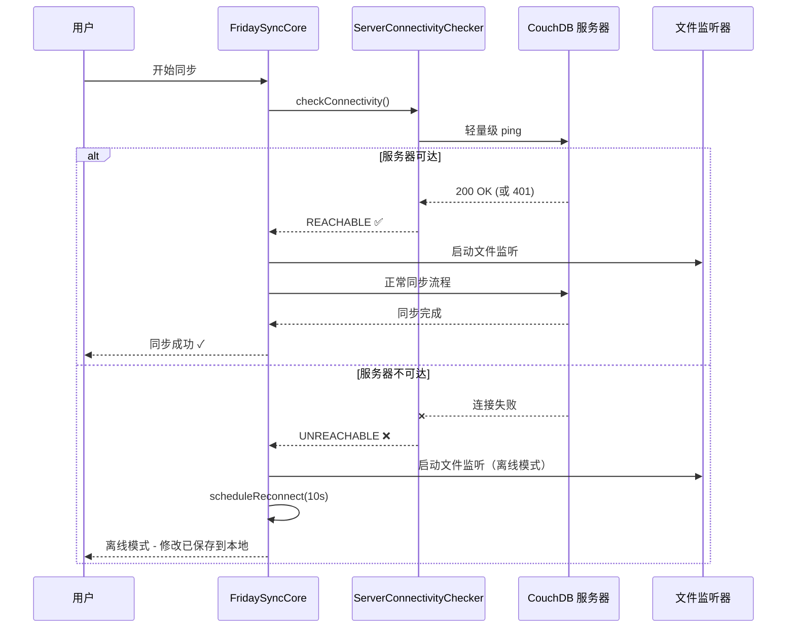

Friday 同步插件实现了智能的服务器连接性检查机制，能够在同步操作前验证服务器可达性，从而提供准确的错误归因和无缝的离线模式支持。

## 为什么需要连接性检查？

在没有预先检查服务器连接状态的情况下，同步失败可能会产生**误导性的错误消息**：

- ❌ 服务器不可达时显示"PBKDF2 加密失败"
- ❌ 网络问题被误判为"数据库已重置"
- ❌ 本地文件修改在离线时丢失
- ❌ 用户需要手动重启才能恢复同步

有了服务器连接性预检查，Friday 能够：

- ✅ 准确区分"服务器不可达"和"同步错误"
- ✅ 在离线时自动启用[[offline-mode|离线模式]]
- ✅ 始终保存本地文件修改到 PouchDB
- ✅ 自动调度重连，无需手动干预

> [!info]
> 这个功能参考了 Self-hosted LiveSync 的网络检查机制，并进行了增强，提供了更好的用户体验。

## 工作原理

### 同步流程架构



### 分层架构

Friday 的连接性检查采用清晰的分层架构：

```
┌─────────────────────────────────────────────────────────────────┐
│                     入口层 (Entry Point)                         │
│  - FridaySyncCore.startSync()                                   │
│  - 所有同步操作的唯一入口                                         │
└─────────────────────────────────────────────────────────────────┘
                              │
                              ▼
┌─────────────────────────────────────────────────────────────────┐
│              服务器连接性层 (Server Connectivity)                 │
│  - ServerConnectivityChecker.checkConnectivity()                │
│  - 轻量级 ping，在所有同步操作前执行                              │
│  - 为下游组件设置 serverReachable 状态                           │
└─────────────────────────────────────────────────────────────────┘
                              │
              ┌───────────────┴───────────────┐
              │                               │
        服务器可达                       服务器不可达
              │                               │
              ▼                               ▼
┌──────────────────────────┐    ┌──────────────────────────┐
│   正常同步流程            │    │   离线模式                │
│  - ensurePBKDF2Salt()    │    │  - startFileWatcher()    │
│  - checkSaltConsistency()│    │  - offlineTracker.on()   │
│  - openReplication()     │    │  - scheduleReconnect()   │
└──────────────────────────┘    └──────────────────────────┘
```

## 核心组件

### ServerConnectivityChecker

`ServerConnectivityChecker` 是一个独立的类，负责轻量级的服务器可达性检查。

#### 主要特性

| 特性 | 说明 |
|------|------|
| 轻量级检查 | 仅发送 GET 请求到服务器根路径 |
| 智能缓存 | 5 秒冷却时间，避免过度请求 |
| 超时控制 | 10 秒超时，防止长时间等待 |
| 状态追踪 | 维护 `REACHABLE`、`UNREACHABLE`、`UNKNOWN` 三种状态 |

#### 使用示例

```typescript
// 创建检查器实例
const checker = new ServerConnectivityChecker();

// 执行连接性检查（强制检查，忽略缓存）
const result = await checker.checkConnectivity(settings, true);

if (result.status === "REACHABLE") {
    console.log(`服务器可达，延迟: ${result.latency}ms`);
    // 继续正常同步流程
} else {
    console.log(`服务器不可达: ${result.error}`);
    // 进入离线模式
}
```

> [!tip]
> `checkConnectivity` 方法接受一个 `forceCheck` 参数。设置为 `true` 可以跳过缓存冷却，立即执行检查。这在关键操作（如开始同步）时很有用。

### 服务器状态枚举

```typescript
type ServerStatus = "REACHABLE" | "UNREACHABLE" | "UNKNOWN";
```

- **REACHABLE**: 服务器响应正常（包括 200 OK、401 Unauthorized、403 Forbidden）
- **UNREACHABLE**: 连接失败、超时或其他网络错误
- **UNKNOWN**: 尚未执行任何检查

> [!info]
> 为什么 401/403 也算作 `REACHABLE`？
> 
> 因为服务器已经响应了请求，只是认证失败。这说明服务器是在线的，问题出在认证配置上，而不是网络连接。

## 错误归因逻辑

在引入服务器连接性检查后，Friday 能够准确区分不同类型的错误：

### ensurePBKDF2Salt 错误处理

```typescript
async ensurePBKDF2Salt(
    setting: RemoteDBSettings,
    showMessage: boolean = false
): Promise<boolean> {
    try {
        const hash = await this.getReplicationPBKDF2Salt(setting);
        if (hash.length == 0) {
            throw new Error("PBKDF2 salt 为空");
        }
        return true;
    } catch (ex) {
        // 检查服务器状态，避免误导性错误消息
        const serverReachable = this.env.isServerReachable?.() ?? true;

        if (!serverReachable) {
            // 服务器不可达 - 这是网络问题，不是 PBKDF2 问题
            // 不显示误导性的 "PBKDF2 失败" 消息
            return false;
        }

        // 服务器可达但 PBKDF2 失败 - 这是真正的问题
        if (showMessage) {
            showNotice("无法获取 PBKDF2 salt");
        }
        return false;
    }
}
```

### 错误对比表

| 场景 | 之前的行为 | 现在的行为 |
|------|-----------|-----------|
| CouchDB 不可达 | ⚠️ ERRORED + "PBKDF2 失败" | ⏹️ NOT_CONNECTED + "服务器不可达" |
| 文件监听器 | ❌ 失败时不启动 | ✅ 始终启动 |
| 用户文件修改 | ❌ 未保存 | ✅ 保存到本地 PouchDB |
| 重新连接 | ❌ 需要手动重启 | ✅ 自动调度 |
| 真正的数据库重置 | ⚠️ 与网络错误混淆 | ✅ 清晰识别 |

## 离线模式支持

当检测到服务器不可达时，Friday 会自动进入[[offline-mode|离线模式]]。

### 离线模式特性

```typescript
private handleOfflineMode(errorMessage?: string): boolean {
    // 更新网络管理器状态
    this._managers?.networkManager.setServerReachable(false);
    this.setStatus("NOT_CONNECTED", "服务器不可达，离线模式");

    // 启动文件监听器 - 即使离线也保存修改
    this.startFileWatcherIfNeeded();

    // 启用离线追踪
    if (this._offlineTracker) {
        this._offlineTracker.setOffline(true);
    }

    // 调度重连（10 秒后）
    this._connectionMonitor?.scheduleReconnect(10000);

    // 显示用户友好的消息
    showNotice("无法连接到服务器。修改将保存到本地。");

    return false;
}
```

> [!success] 离线模式的好处
> 
> - **无数据丢失**: 所有修改都保存到本地 PouchDB
> - **无缝体验**: 用户可以继续工作，无需担心网络状态
> - **自动恢复**: 网络恢复后自动重连并同步
> - **透明反馈**: 清晰的状态指示和通知

### 文件监听器管理

Friday 确保文件监听器在**任何情况下**都会启动：

```typescript
private startFileWatcherIfNeeded(): void {
    if (this._storageEventManager && !this._fileWatcherStarted) {
        this._fileWatcherStarted = true;
        const WATCH_DELAY_MS = 1500;
        setTimeout(() => {
            if (this._storageEventManager) {
                this._storageEventManager.beginWatch();
                Logger("文件监听器已启动 - 本地修改将被保存");
            }
        }, WATCH_DELAY_MS);
    }
}
```

> [!warning] 避免重复启动
> 
> `_fileWatcherStarted` 标志防止文件监听器被多次启动，这可能导致事件重复处理和性能问题。

## 实现细节

### LiveSyncReplicatorEnv 接口扩展

为了让所有同步组件都能访问服务器状态，我们扩展了 `LiveSyncReplicatorEnv` 接口：

```typescript
export interface LiveSyncReplicatorEnv {
    // ... 现有接口成员 ...

    /**
     * 检查服务器是否可达（由 FridaySyncCore 提供）
     * 被复制器用于错误归因
     */
    isServerReachable?: () => boolean;
}
```

### FridaySyncCore 集成

`FridaySyncCore` 实现了这个接口，并提供服务器状态：

```typescript
export class FridaySyncCore implements LiveSyncReplicatorEnv {
    private _serverChecker: ServerConnectivityChecker | null = null;

    get isServerReachable(): boolean {
        return this._serverChecker?.isServerReachable ?? false;
    }

    async startSync(continuous: boolean = true): Promise<boolean> {
        // 步骤 1: 服务器连接性预检查
        const connectivityResult = await this._serverChecker?.checkConnectivity(
            this._settings,
            true  // 强制检查
        );

        if (connectivityResult?.status !== "REACHABLE") {
            // 进入离线模式
            return this.handleOfflineMode(connectivityResult?.error);
        }

        // 步骤 2-4: 继续正常同步流程
        // ...
    }
}
```

### 连接超时安全网

为了处理"卡在 STARTED 状态"的问题，Friday 实现了连接超时机制：

```typescript
private setupConnectionTimeout(): void {
    const CONNECTION_TIMEOUT_MS = 30000; // 30 秒
    setTimeout(() => {
        const status = this.replicationStat.value.syncStatus;
        if (status === "STARTED") {
            Logger("连接超时 - 状态停留在 STARTED");
            this.setStatus("NOT_CONNECTED", "连接超时");
            this._managers?.networkManager.setServerReachable(false);
            this._connectionMonitor?.scheduleReconnect(10000);
        }
    }, CONNECTION_TIMEOUT_MS);
}
```

> [!tip] 为什么需要超时检查？
> 
> 某些网络环境下，连接可能"挂起"而不是明确失败。超时机制确保用户不会无限期等待。

## 性能优化

### 冷却机制

为了避免过度频繁的服务器请求，`ServerConnectivityChecker` 实现了 5 秒冷却：

```typescript
async checkConnectivity(
    setting: RemoteDBSettings,
    forceCheck: boolean = false
): Promise<ConnectivityCheckResult> {
    const now = Date.now();
    
    // 检查冷却
    if (!forceCheck && now - this._lastCheckTime < this._checkCooldown) {
        return { status: this._lastStatus };
    }

    // 执行实际检查
    // ...
}
```

### 浏览器网络状态

在发送请求前，先检查 `navigator.onLine`：

```typescript
// 首先检查浏览器网络状态
if (!navigator.onLine) {
    this._lastStatus = "UNREACHABLE";
    return { status: "UNREACHABLE", error: "浏览器离线" };
}
```

> [!info]
> `navigator.onLine` 并不完全可靠（可能返回 `true` 而实际无网络），但它提供了一个快速的第一层检查。

## 国际化消息

Friday 为服务器连接性相关的消息提供了多语言支持：

### 英文 (en.json)

```json
{
    "fridaySync.error.cannotConnectServer": "Cannot connect to sync server. Your changes will be saved locally and synced when connection is restored.",
    "fridaySync.error.serverTimeout": "Connection to sync server timed out. Will retry automatically.",
    "fridaySync.status.offlineMode": "Offline mode - changes saved locally",
    "fridaySync.status.reconnecting": "Reconnecting to sync server..."
}
```

### 中文 (zh.json)

```json
{
    "fridaySync.error.cannotConnectServer": "无法连接同步服务器。您的修改将保存在本地，恢复连接后会自动同步。",
    "fridaySync.error.serverTimeout": "连接同步服务器超时。将自动重试。",
    "fridaySync.status.offlineMode": "离线模式 - 修改已保存到本地",
    "fridaySync.status.reconnecting": "正在重新连接同步服务器..."
}
```

## 调试和日志

### 日志级别

Friday 使用不同的日志级别记录连接性相关的事件：

```typescript
// 详细调试信息
Logger(`服务器连接性检查通过 (${latency}ms)`, LOG_LEVEL_VERBOSE);

// 一般信息
Logger("服务器不可达: 离线模式已启用", LOG_LEVEL_INFO);

// 用户可见通知
Logger("无法连接到服务器。修改将保存到本地。", LOG_LEVEL_NOTICE);
```

### 查看日志

要查看详细的连接性检查日志：

1. 打开 Obsidian 开发者控制台（`Ctrl+Shift+I` 或 `Cmd+Option+I`）
2. 过滤 "connectivity" 或 "server"
3. 查看详细的检查结果和延迟信息

> [!example] 日志示例
> 
> ```
> [Friday] 服务器连接性检查通过 (45ms)
> [Friday] 文件监听器已启动 - 本地修改将被保存
> [Friday] 同步状态: CONNECTED
> ```

## 最佳实践

### 对于用户

1. **保持网络稳定**: 虽然 Friday 支持离线模式，但稳定的网络连接能提供最佳体验
2. **留意状态指示**: 关注状态栏的同步图标，了解当前连接状态
3. **信任离线模式**: 离线时修改的文件会在重连后自动同步，无需担心

### 对于开发者

1. **使用 `isServerReachable`**: 在归因错误前，始终检查服务器状态
2. **提供清晰的消息**: 根据 `isServerReachable` 返回不同的错误消息
3. **优雅降级**: 设计功能时考虑离线场景
4. **测试离线场景**: 使用浏览器的网络限制功能测试离线行为

## 相关链接

- [[offline-mode|离线模式详解]]
- [[MDFriday/help/content/sync/encryption|加密密码管理]]
- [[reset|同步问题排查]]
- [[../../architecture/sync-internals|同步机制内部原理]]

## 技术参考

### 源代码文件

| 组件 | 文件路径 | 关键方法 |
|------|---------|---------|
| 服务器检查器 | `src/sync/features/ServerConnectivity/index.ts` | `checkConnectivity()`, `pingServer()` |
| 核心集成 | `src/sync/FridaySyncCore.ts` | `startSync()`, `handleOfflineMode()` |
| PBKDF2 检查 | `src/sync/core/replication/LiveSyncAbstractReplicator.ts` | `ensurePBKDF2Salt()` |
| 复制器 | `src/sync/core/replication/couchdb/LiveSyncReplicator.ts` | `openOneShotReplication()` |

### 实现参考

这个功能的设计参考了以下项目：

- [Self-hosted LiveSync](https://github.com/vrtmrz/obsidian-livesync) - 网络检查和离线模式的灵感来源
- [CouchDB Replication Protocol](https://docs.couchdb.org/en/stable/replication/protocol.html) - 复制协议规范

