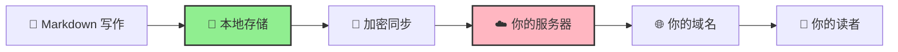
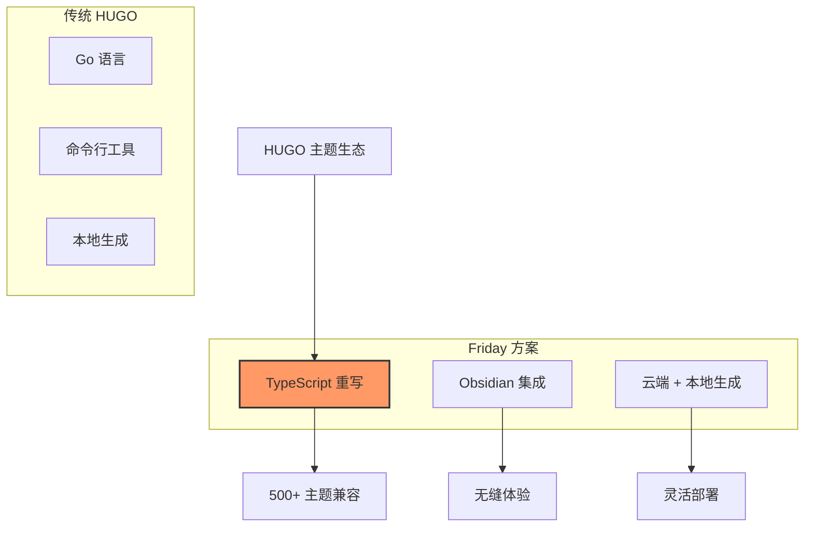
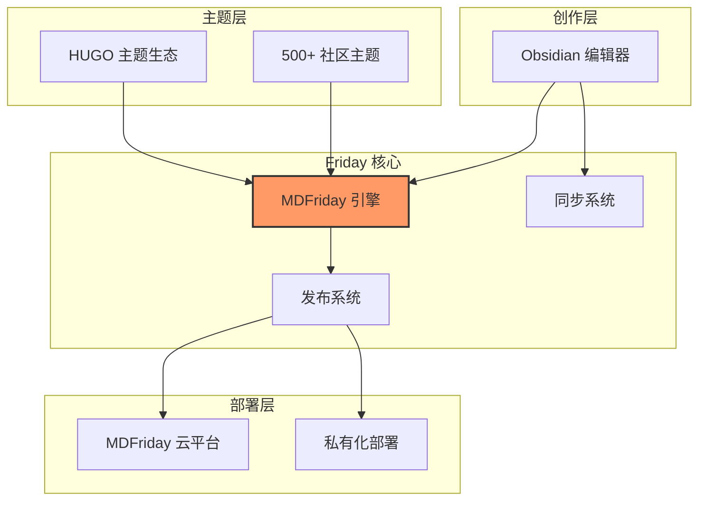
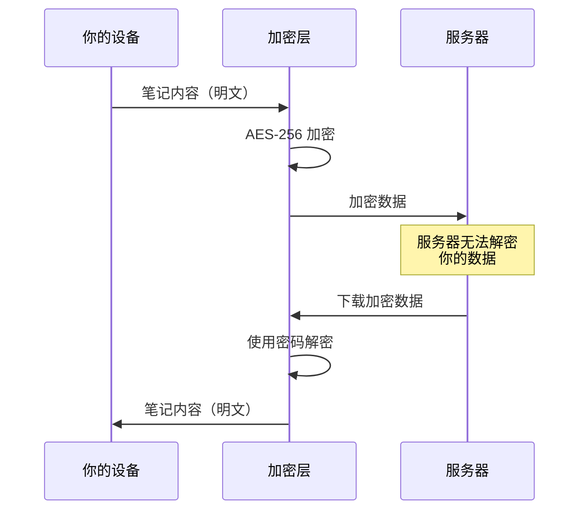

> [!quote] 你是创作者，也是拥有者
> 
> **Friday 是一个面向知识创作者的「内容编译器与发布平台」，  
> 让一篇 Markdown 成为可部署的网站、演示文稿、文档与品牌资产。**

## 🌟 为什么选择 Friday？

### 一份内容，多种形式

用 Markdown 写作，Friday 帮你制作成：

- 📝 **个人博客** - 分享想法和见解
- 📚 **知识文档** - 构建专业知识库
- 🎨 **作品集** - 展示创作成果
- 💼 **个人简历** - 打造专业形象
- 🎬 **演示文稿** - 创建精美 PPT
- 🚀 **产品官网** - 发布产品信息
- 🏢 **企业站点** - 建立公司品牌

### 你是创作者，也是拥有者



**核心理念**：
- ✅ 数据存储在你的设备上
- ✅ 服务器可以自己搭建
- ✅ 域名属于你自己
- ✅ 内容完全由你控制

## 🎯 核心功能

### 1. 安全同步

多设备间安全同步你的笔记，采用军事级加密。

**特性**：
- 🔒 [[sync/encryption|端到端加密]]（AES-256-GCM）
- 🌐 [[sync/offline-mode|离线模式]] - 断网也能工作
- ⚡ 增量同步 - 只同步变更部分
- 🔄 实时同步 - 修改自动推送
- 🤖 [[sync/server-connectivity|智能连接管理]] - 自动重连

了解更多：[[sync/intro|同步功能介绍]]

### 2. 站点发布

将 Markdown 转换为精美的网站，一键部署。

**发布方式**：

| 方式                                | 适用场景  | 特点   |                         |
| --------------------------------- | ----- | ---- | ----------------------- |
| [[publish/quick-share\|快速分享]]     | 快速分享  | 临时分享 | 一键生成链接                  |
| [[publish/subdomain\|二级域名]]       | 二级域名  | 个人站点 | `yourname.mdfriday.com` |
| [[publish/custom-domain\|自定义域名]]  | 自定义域名 | 专业站点 | `notes.yourdomain.com`  |
| [[publish/enterprise-domain企业域名]] | 企业域名  | 企业官网 | `yourdomain.com`        |

### 3. 海量主题生态

Friday 完全重写了 HUGO 的核心代码（使用 TypeScript），因此能够**快速适配 HUGO 主题生态**。

> [!success] 背靠 HUGO 社区
> 
> HUGO 是世界上最流行的静态网站生成器，拥有 **500+ 精美主题** 和活跃的社区。
> 
> Friday 让你无需学习 HUGO，就能享受这个强大的生态系统！

**主题类型**：

- 📚 [[themes/wiki|知识库]] - 如 Obsidian Publish
- 📖 [[themes/document|文档]] - 如 GitBook
- ✍️ [[themes/blog|博客]] - 如 Medium
- 🎨 [[themes/portfolio|作品集]] - 展示创意
- 💼 [[themes/resume|简历]] - 专业形象
- 🎬 [[themes/ppt|PPT]] - 演示文稿
- 🚀 [[themes/landing|产品官网]] - 单页营销
- 🏢 [[themes/enterprise|企业站]] - 公司门户

浏览所有主题：[[themes/community|社区主题库]]

## 🏗️ 技术架构

### 创新：TS 重写 HUGO 核心



**优势**：

| 特性 | 传统 HUGO | Friday |
|------|----------|--------|
| 学习曲线 | 需学习 HUGO | 零学习成本 |
| 编辑器 | 任意编辑器 | Obsidian 原生 |
| 主题生态 | 500+ | 完全兼容 |
| 预览方式 | 本地命令行 | [[publish/preview|可视化预览]] |
| 部署方式 | 手动/CI | [[publish/quick-share|一键发布]] |
| 协作 | Git | [[sync/intro|实时同步]] |

### 架构图



了解更多：[[architecture/overview|架构详解]]


## 🔐 安全与隐私

### 本地优先

```
┌─────────────────────────────────────┐
│       你的数据始终在本地              │
│                                     │
│  📁 Obsidian Vault (文件系统)       │
│  💾 PouchDB (浏览器数据库)          │
│                                     │
│  云端/私有服务器仅用于同步和发布     │
└─────────────────────────────────────┘
```

### 端到端加密



**安全保证**：
- ✅ 密码只存储在本地
- ✅ 服务器看不到明文
- ✅ 符合 GDPR 标准

了解更多：[[sync/encryption|加密详解]] • [[architecture/security-model|安全模型]]

### 开源贡献

Friday 基于优秀的开源项目：

- [Self-hosted LiveSync](https://github.com/vrtmrz/obsidian-livesync) - 同步核心
- [HUGO](https://gohugo.io/) - 主题生态
- [PouchDB](https://pouchdb.com/) - 本地数据库

我们也回馈社区，部分代码已开源。

## 📄 法律信息

- [使用条款](https://mdfriday.com/terms)
- [隐私政策](https://mdfriday.com/privacy)
- [数据处理协议](https://mdfriday.com/dpa)

**你是创作者，也是拥有者。开始创作吧！🚀**
