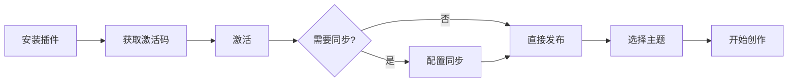

欢迎使用 Friday！本指南将在 5 分钟内帮你完成安装、激活和首次使用。

## 📦 步骤 1：安装 Friday 插件

### 方法 1：从 Obsidian 社区插件安装（推荐）

1. 打开 Obsidian
2. 进入 **设置 → 第三方插件**
3. 关闭"安全模式"（如果未关闭）
4. 点击 **浏览**
5. 搜索 "Friday"
6. 点击 **安装**
7. 安装完成后，点击 **启用**

### 方法 2：手动安装

1. 从官方下载[最新版本](https://app.mdfriday.com/api/uploads/friday-latest.zip) ， 解压可得到 `main.js`，`manifest.json` 和 `style.css` 这三个文件。
2. 将解压文件复制到 vault 的 `.obsidian/plugins/mdfriday/` 目录下，如果 mdfriday 不存在，则需要新建。
3. 在 Obsidian 中重新加载插件
4. 在第三方插件列表中启用 Friday

> [!info] 版本要求
> - Obsidian: v1.10.0 或更高版本
> - Friday: 最新稳定版本

## 🎫 步骤 2：获取激活码

### 购买渠道

**国内用户**：
- 🛒 [淘宝购买]([淘宝购买](https://item.taobao.com/item.htm?id=1021681636191&mi_id=0000TP6GHQep6drq4_kU9DP4zK01apQ5i_06dEQlgeN7KZI&skuId=6196046574887&spm=a21xtw.29178619.0.0&xxc=shop))（推荐）
- [套餐介绍](https://mdfriday.com/zh/pricing.html)
- [获取体验码](https://mdfriday.com/zh/tiyan.html)

## 🔐 步骤 3：激活 License

详细步骤请查看：[[license/activation|激活指南]]

## 🔄 步骤 4：配置同步（可选）

如果你需要多设备同步，按照以下步骤配置：

### 第一台设备

详细步骤：[[sync/settings#第一台设备设置|第一台设备设置]]

1. 激活后，系统会自动生成**加密密码**
2. **务必保存加密密码**（丢失无法恢复！只能重置，获取新的加密密码。）
3. 点击"上传本地到云端"
4. 等待上传完成

> [!danger] 极其重要！
> **请立即保存加密密码！**
> 
> 保存方式：
> - 使用密码管理器（推荐）
> - 写在纸上妥善保管
> - 发送到自己的邮箱

### 第二台设备

详细步骤：[[sync/settings#第二台设备设置|第二台设备设置]]

1. 在新设备上安装并启用 Friday
2. 输入相同的激活码
3. 输入之前保存的**加密密码**
4. 点击"从云端下载"

## 🚀 步骤 5：发布第一篇笔记

### 方法 1：快速分享（最简单）

1. 打开任意笔记
2. 点击笔记右上角互联网图标，会自动构建预览，并帮助选中**Friday: 快速分享**
3. 点击右侧功能栏里的**发布**按钮，获得公开访问链接

详细说明：[[publish/quick-share|快速分享指南]]

### 方法 2：使用二级域名

1. 在 Friday 设置中配置二级域名
2. 选择喜欢的[[themes/community|主题]]
3. 点击发布
4. 访问 `yourname.mdfriday.com`

详细说明：[[publish/subdomain|二级域名发布]]

### 方法 3：使用自定义域名

1. 准备你自己的域名
2. 在 DNS 中添加 A 记录，指向 `103.207.68.156`
3. 在 Friday 设置中输入自己的域名，并检验 DNS 是否生效
4. DNS 生效后，点击添加域名，等待 HTTPS 证书签发
5. 点击 HTTPS 按钮查看证书签发状态，通常需要 1～2 分钟
6. 证书准备好后，就可以在发布的时候选择自定义域名进行发布了

详细说明：[[publish/custom-domain|自定义域名]]

## 📚 学习路径

### 新手路径

**推荐顺序**：

1. ✅ 完成本快速开始指南
2. 📖 阅读 [[friday|关于 Friday]]
3. 🔧 配置 [[sync/settings|同步设置]]
4. 🚀 尝试 [[publish/quick-share|快速分享]]
5. 🎨 浏览 [[themes/community|主题库]]

### 进阶用户

如果你已经熟悉基础功能：

1. 🏗️ 了解 [[architecture/overview|架构设计]]
2. 🔍 深入 [[sync/server-connectivity|服务器连接管理]]
3. 🛠️ 掌握 [[sync/offline-mode|离线模式]]
4. 💼 探索 [[publish/enterprise-domain|企业域名]]
5. 🏢 考虑 [[license/custom|私有化部署]]

## 🎉 开始创作！

配置完成后，你就可以：

1. 📝 **自由创作**：写笔记、文章、知识库
2. 🔄 **自动同步**：修改自动同步到所有设备
3. 🌐 **一键发布**：随时分享你的内容
4. 🛡️ **安心使用**：端到端加密保护隐私

> [!success] 欢迎来到 Friday！
> 
> 如果你喜欢 Friday，欢迎：
> - ⭐ 在 GitHub 给我们一个星标
> - 💬 加入 Discord 社区交流
> - 📝 分享你的使用心得
