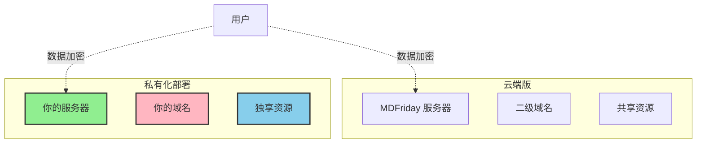
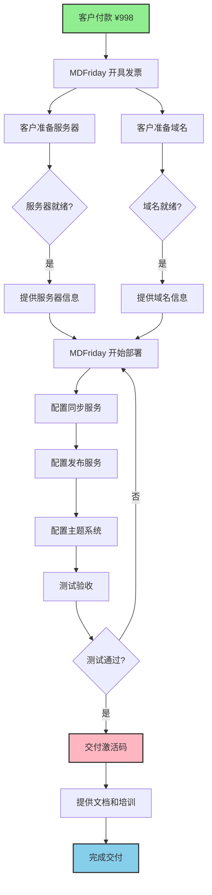

Friday 私有化部署让你完全掌控数据和服务，适合企业、团队和重视数据主权的个人用户。

## 🏢 为什么选择私有化部署？

### 完全掌控

**核心优势**：

| 特性 | 云端版 | 私有化部署 |
|------|--------|----------|
| 数据存储 | MDFriday 服务器 | ✅ 你的服务器 |
| 域名 | 二级域名 | ✅ 根域名 + 子域名 |
| 品牌 | Friday Logo | ✅ 去 Logo |
| 控制权 | 端到端加密 | ✅ 完全自主 |
| 激活码 | 1 个 | ✅ 20 个 |
| 价格 | $8/月 | ✅ ¥998 买断 |

### 适用场景

> [!success] 适合以下用户
> 
> - 🏢 **企业用户**：需要数据自主可控
> - 👥 **团队**：多人协作，统一管理
> - 🔐 **隐私敏感**：对数据隐私有高要求
> - 💼 **专业创作者**：打造个人品牌
> - 🏫 **教育机构**：学校、培训机构
> - 🔧 **技术爱好者**：喜欢折腾技术

## 📦 交付物清单

### 1. 完整后台服务

**MDFriday 完整后台系统**，包括：

#### 同步服务
- ✅ 自定义同步空间
- ✅ 用户管理
- ✅ 空间配额管理
- ✅ 数据备份

#### 发布服务
- ✅ 站点构建引擎（TS 重写的 HUGO）
- ✅ 域名管理
- ✅ SSL 证书自动配置
- ✅ CDN 加速

#### 主题系统
- ✅ 所有创作者主题
- ✅ 所有免费社区主题
- ✅ 主题管理面板
- ✅ 去除 Friday Logo

### 2. 20 个激活码

**激活码分配**：

| 类型 | 数量 | 权限 |
|------|------|------|
| 企业账号 | 1 个 | 根域名 + 自定义同步空间 |
| 常规账号 | 19 个 | 子域名 + 自定义同步空间 |

**企业账号特权**：
- ✅ 可发布到根域名（如 `yourdomain.com`）
- ✅ 更大的存储空间
- ✅ 优先技术支持
- ✅ 自定义品牌

**常规账号权限**：
- ✅ 可发布到子域名（如 `notes.yourdomain.com`）
- ✅ 标准存储空间
- ✅ 所有核心功能

> [!tip] 激活码用途
> 20 个激活码可以：
> - 分享给家人、朋友
> - 分配给团队成员
> - 用于不同项目
> - 灵活调整分配

### 3. 升级服务

**免费升级服务**：
- ✅ 免费三次后端升级
- ✅ 升级由 MDFriday 团队执行
- ✅ 包含数据迁移和测试
- ✅ 保证服务连续性

**自助升级**：
- ✅ 详细的自助升级文档
- ✅ 升级脚本和工具
- ✅ 版本检查和回滚
- ✅ 技术支持群

## 💰 价格与支付

### 价格方案

> [!success] 早鸟价
> 
> **¥998** （原价 ¥2,998）
> 
> - 买断制，无月费
> - 包含所有功能
> - 20 个激活码
> - 免费 3 次升级

### 性价比分析

**vs 云端版**：

| 对比项 | 云端版（年付） | 私有化部署 |
|-------|--------------|----------|
| 1 年费用 | $96 × 20 = $1,920 | ¥998 |
| 2 年费用 | $3,840 | ¥998 |
| 3 年费用 | $5,760 | ¥998 |
| 域名 | 二级域名 | 根域名 |
| Logo | 有 | 无 |

> [!tip] 回本计算
> 如果你有 20 人团队或家庭，使用云端版：
> - 每年费用：$96 × 20 = $1,920 ≈ ¥13,000
> - **2 个月即可回本！**

### 发票

- ✅ 可开具增值税发票（普通发票）
- ✅ 类别：技术服务类
- ✅ 企业或个人均可

## 🔧 技术要求

### 服务器要求

**最低配置**：

| 项目 | 要求 |
|------|------|
| 操作系统 | Ubuntu 22.04 LTS |
| CPU | 2 核 |
| 内存 | 2 GB |
| 存储 | 20 GB SSD |
| 带宽 | 1 Mbps |

> [!tip] 服务器购买建议
> 
> **阿里云**（推荐）：
> - 轻量应用服务器
> - 99 元/年起
> - 香港/新加坡节点无需备案
> 
> **腾讯云**：
> - 标准型 S5
> - 价格优惠
> - 国内需备案

### 域名要求

**域名注册**：
- ✅ 要求腾讯云 DNSPod

**DNS 要求**：
- ✅ 目前仅支持腾讯云 DNSPod
- ✅ 需要 API Token 权限
- ✅ 自动配置 DNS 记录

**备案要求**：
- 国内服务器：需要备案
- 香港/海外服务器：无需备案

> [!info] 为什么仅支持 DNSPod？
> 
> 目前我们优先支持 DNSPod（腾讯云），因为：
> - DNS API 稳定可靠
> - 自动 SSL 证书配置
> - 域名管理方便
> 
> 其他 DNS 提供商支持正在开发中。

### 网络要求

- ✅ 服务器需要公网 IP
- ✅ 开放 80/443 端口
- ✅ 支持 SSL 证书
- ✅ 建议配置 CDN

## 📋 交付流程

### 完整流程图

---

**你的数据，你的服务器，你的域名。完全掌控！🏢**
