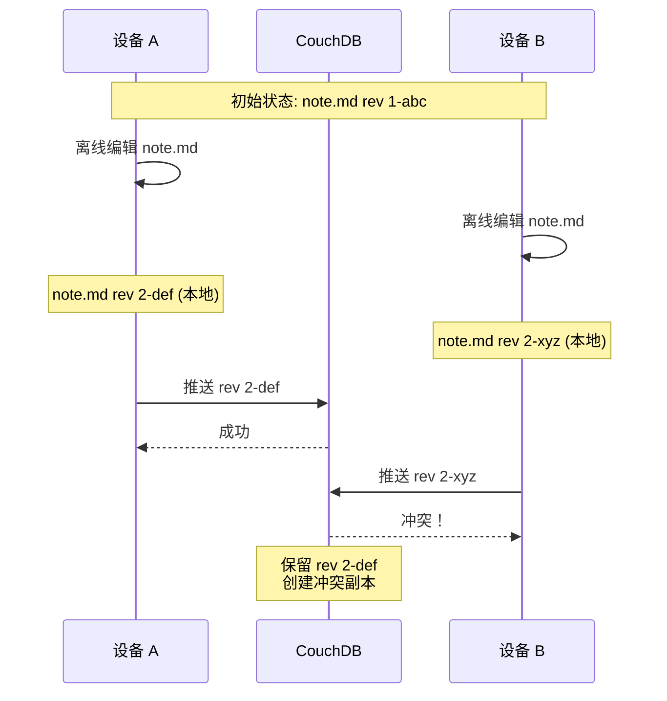

## 冲突文件

**症状**: 出现 `filename (conflict YYYY-MM-DD).md` 文件

**原因**: 多台设备同时修改了同一文件（特别是在[[offline-mode|离线模式]]下）

**冲突如何产生**:



**解决冲突**:

1. **手动合并**（推荐）
   - 打开原文件和冲突文件
   - 比较内容
   - 手动合并有价值的修改
   - 删除冲突文件

2. **使用合并工具**
   ```bash
   # 使用 diff 工具
   diff note.md "note (conflict 2026-02-10).md"
   
   # 或使用图形化工具（如 Beyond Compare、WinMerge）
   ```

3. **选择一个版本**
   - 决定保留哪个版本
   - 删除另一个

> [!tip] 预防冲突
> 
> - 尽量不要在多设备同时离线编辑同一文件
> - 频繁连接网络，让设备同步
> - 使用不同的文件名称前缀（如 `deviceA-note.md`、`deviceB-note.md`）

