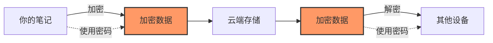
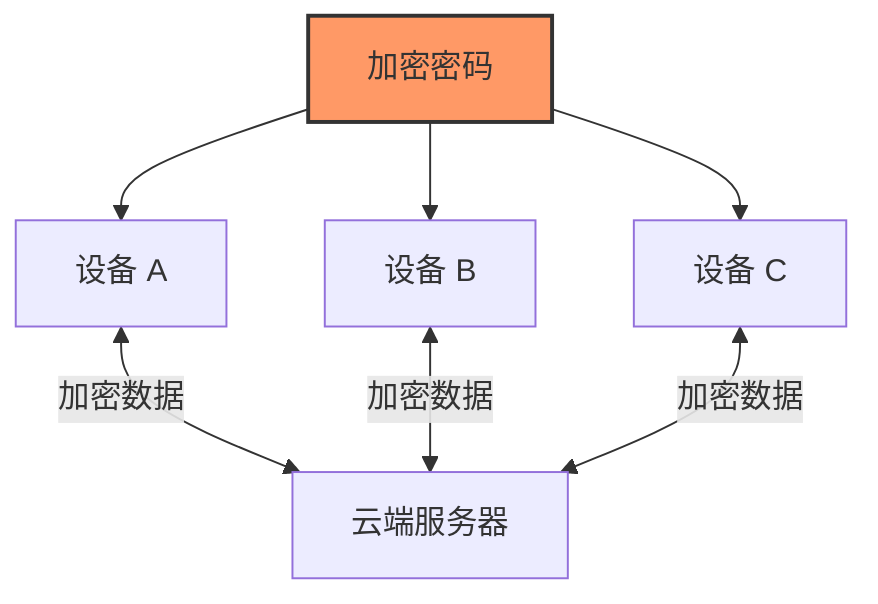

加密密码是 Friday 同步中最重要的安全凭证。本文解释它的作用和注意事项。

## 🔐 什么是加密密码？

加密密码是一个 **24 位的随机字符串**，在你首次激活 License 时自动生成。

示例格式：

```
Ab3Cd5Ef7Gh9Ij1Kl3Mn5Op7
```

## 🛡️ 它的作用

### 端到端加密



| 阶段 | 说明 |
|------|------|
| 加密 | 笔记在上传前使用你的密码加密 |
| 存储 | 云端只存储加密后的数据 |
| 解密 | 下载时使用密码解密 |

### 安全保证

- **服务器无法查看**：即使服务器被攻破，攻击者也无法读取你的笔记
- **只有你能解密**：密码只存储在你的设备上，从不上传
- **强加密**：使用业界标准的加密算法（AES-256-GCM）

## ⚠️ 为什么必须保存它

> [!danger] 密码丢失 = 数据丢失
> 
> 加密密码从不上传到服务器或存储在云端。  
> 如果你丢失了密码，**没有任何方法可以恢复你的云端数据**。

这是端到端加密的代价：

| 传统同步 | Friday 同步 |
|----------|-------------|
| 服务商可以重置你的密码 | ✅ 只有你能访问数据 |
| 服务商可以看到你的数据 | ✅ 服务商无法查看内容 |
| 安全性依赖服务商 | ✅ 安全性由你掌控 |

## 💾 如何安全保存

### 密码管理器（最推荐）

使用 1Password、Bitwarden、KeePass 等：

**步骤**：
1. 创建一个新条目，命名为 "Friday 加密密码"
2. 将密码粘贴到密码字段
3. 保存并同步到其他设备

**优势**：
- ✅ 加密存储
- ✅ 多设备访问
- ✅ 不会丢失
- ✅ 安全性高

> [!tip] 推荐的密码管理器
> 
> - **1Password** - 功能完善，易用
> - **Bitwarden** - 开源免费
> - **KeePass** - 完全离线
> - **LastPass** - 老牌产品

## 👀 如何查看当前密码

如果你已经激活但忘记保存：

1. 打开 **设置 → Friday**
2. 找到「安全」区域
3. 点击「加密密码」旁边的 **显示密码** 按钮
4. 复制并保存到安全的地方

> [!warning] 重要提醒
> 
> 密码只在你的设备上可见。如果你更换设备或重装 Obsidian，你需要之前保存的密码。

## ❓ 常见问题

### Q：能更改加密密码吗？

**A**：目前不支持直接更改。

如果确实需要更改：
1. 导出/备份所有数据到本地
2. 重置同步
3. 使用新密码重新上传

> [!tip] 建议
> 除非密码泄露或丢失，否则不建议进行重置操作，因为这会影响其它设备的同步，其它设备也需要跟着修改。

### Q：所有设备的密码一样吗？

**A**：是的！

所有设备使用 **相同的加密密码**，这样它们才能互相解密数据。



### Q：密码会过期吗？

**A**：不会。

加密密码没有过期日期。只要你的 License 有效，密码就能使用。

### Q：可以分享密码吗？

**A**：技术上可以，但不推荐。

分享密码意味着：
- ✅ 对方可以访问你的所有笔记
- ✅ 对方可以修改你的笔记
- ⚠️ 对方可以看到你的私密内容

只在以下情况考虑：
- 团队协作
- 家庭成员
- 完全信任的人

### Q：忘记密码但有已同步的设备？

**A**：可以找回！

在任何一台已同步的设备上：
1. 打开 Friday 设置
2. 查看「加密密码」
3. 点击「显示」
4. **立即保存！**

## 🛡️ 安全最佳实践

### 保存策略

> [!success] 推荐的三层保护
> 
> 1. **主要保存**：密码管理器（日常使用）
> 2. **备份保存**：加密笔记或文件（备用）
> 3. **离线保存**：纸质备份（最后保险）

### 安全原则

1. ✅ 激活后 **立即** 保存密码
2. ✅ 使用密码管理器
3. ✅ 做一个离线备份（纸质）
4. ✅ 不要和 License Key 放在同一个地方
5. ❌ 不要分享给不信任的人
6. ❌ 不要保存在未加密的地方
7. ❌ 不要只保存在一个地方

## 📝 总结

> [!quote] 记住三点
> 
> 1. **立即保存** - 激活后第一时间保存
> 2. **多处备份** - 至少两个地方保存
> 3. **安全存储** - 使用加密的方式保存

**你的数据安全，由你的密码保护！🔐**
