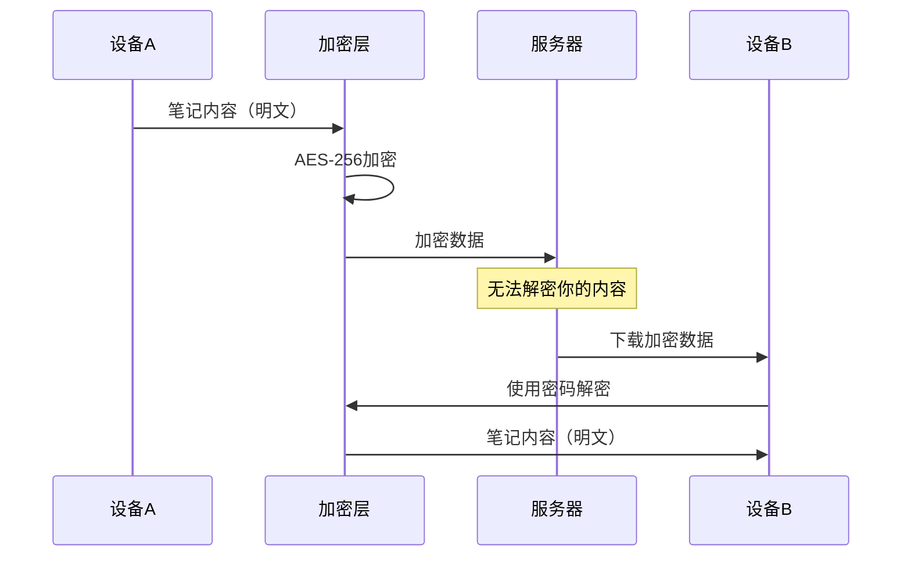
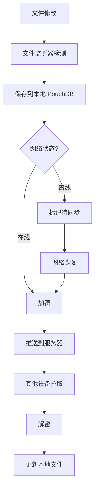
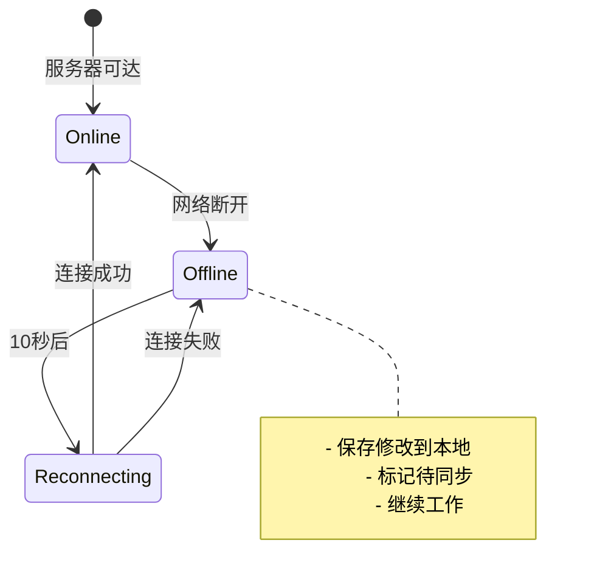

Friday 的同步功能让你的笔记在多设备之间安全、实时地同步，采用端到端加密保护你的隐私。

## 🌟 核心特性

### 端到端加密



**安全保证**：
- 🔒 AES-256-GCM 加密算法
- 🔑 PBKDF2 密钥派生（100,000 次迭代）
- 🛡️ 密码只存储在本地，从不上传
- ✅ 即使服务器被攻破，数据也安全

了解更多：[[sync/encryption|加密详解]]

### 多设备同步

支持所有 Obsidian 支持的平台：

| 平台 | 状态 | 说明 |
|------|------|------|
| 💻 Windows | ✅ | |
| 🍎 macOS | ✅ | |
| 🐧 Linux | ✅ | |
| 📱 iOS | ✅ | Obsidian Mobile |
| 🤖 Android | ✅ | Obsidian Mobile |

**同步方式**：
- ⚡ 实时同步 - 修改自动推送
- 📶 增量同步 - 只同步变更部分
- 🔄 双向同步 - 所有设备保持一致

### 离线模式

网络断开也能继续工作，详见：[[offline-mode|离线模式详解]]

**特性**：
- ✅ 自动检测网络状态
- ✅ 离线修改保存到本地
- ✅ 网络恢复后自动同步
- ✅ [[server-connectivity|智能重连机制]]

### 本地优先

```
┌─────────────────────────────────────┐
│       你的数据始终在本地              │
│                                     │
│  📁 Obsidian Vault (文件系统)       │
│  💾 PouchDB (浏览器数据库)          │
│                                     │
│  云端/私有服务器仅用于同步           │
└─────────────────────────────────────┘
```

**优势**：
- 💨 即时访问，无需等待网络
- 🛡️ 数据掌握在自己手中
- 📴 离线也能正常工作
- 🔄 云端仅用于多设备同步

## 🚀 快速开始

### 第一台设备设置

详细步骤：[[settings#第一台设备设置|第一台设备设置]]

**简要步骤**：

1. [[../license/activation|激活 License]]
2. 系统自动生成加密密码
3. **保存加密密码**（重要！）
4. 点击"上传本地到云端"
5. 等待上传完成

> [!danger] 极其重要！
> 加密密码是解密数据的唯一凭证，丢失后**无法恢复**！
> 
> 请保存到：
> - 密码管理器（推荐）
> - 写在纸上妥善保管
> - 发送到自己的邮箱

### 第二台设备设置

详细步骤：[[settings#第二台设备设置|第二台设备设置]]

**简要步骤**：

1. 安装并启用 Friday
2. 输入相同的激活码
3. 输入之前保存的加密密码
4. 点击"从云端下载"
5. 等待下载完成

## 🔧 工作原理

### 同步流程



### 技术架构

Friday 基于成熟的开源技术：

| 组件 | 技术 | 用途 |
|------|------|------|
| 本地数据库 | PouchDB | 存储和索引 |
| 远程数据库 | CouchDB | 云端同步 |
| 加密 | Web Crypto API | 端到端加密 |
| 同步核心 | Self-hosted LiveSync | 复制协议 |

了解更多：[[../architecture/overview|架构详解]]

## ⚙️ 同步设置

详细配置请查看：[[settings|同步设置详解]]

### 基础设置

在 **设置 → Friday → 同步** 中：

| 设置项 | 默认值 | 说明 |
|-------|--------|------|
| 自动同步 | 开启 | 文件修改后自动同步 |
| 同步间隔 | 实时 | 检测变更的频率 |
| 离线模式 | 自动 | 网络断开时自动启用 |

### 高级设置

| 设置项 | 默认值 | 说明 |
|-------|--------|------|
| 重连间隔 | 10秒 | 离线后多久尝试重连 |
| 连接超时 | 30秒 | 连接服务器的超时时间 |
| 详细日志 | 关闭 | 仅在调试时开启 |
| 冲突处理 | 自动 | 冲突文件处理方式 |

## 🔐 安全与隐私

### 加密机制

详见：[[sync/encryption|加密详解]]

**加密流程**：

1. 用户设置加密密码
2. 使用 PBKDF2 派生密钥
3. 使用 AES-256-GCM 加密数据
4. 上传加密后的数据
5. 其他设备下载并解密

**密钥管理**：
- ✅ 密钥只存储在本地
- ✅ 每个设备独立存储
- ✅ 定期更新 salt

### 隐私保护

- ✅ 服务器无法查看你的内容
- ✅ 符合 GDPR 标准
- ✅ 不收集个人信息
- ✅ 数据可随时导出

### 私有化部署

如果你需要完全掌控数据：

- 部署在你自己的服务器
- 使用你自己的域名
- 完全自主可控

了解更多：[[../license/custom|私有化部署]]

## 🌐 智能连接管理

Friday 实现了智能的连接管理机制，详见：[[server-connectivity|服务器连接性检查]]

### 特性

- ✅ **自动检测**：定期检查服务器状态
- ✅ **准确归因**：区分网络问题和同步错误
- ✅ **自动重连**：网络恢复后自动连接
- ✅ **连接缓存**：避免频繁检查

### 连接状态

| 状态 | 图标 | 说明 |
|------|------|------|
| CONNECTED | ✓ | 已连接，正常同步 |
| STARTED | ↻ | 正在连接 |
| NOT_CONNECTED | ⏸ | [[offline-mode\|离线模式]] |
| ERRORED | ⚠ | 发生错误 |
| PAUSED | ⏹ | 已暂停 |

## 📴 离线模式

详细说明：[[offline-mode|离线模式详解]]

### 工作方式



### 离线能做什么

✅ **完全可用**：
- 创建和编辑笔记
- 删除和重命名文件
- 插入附件
- 本地搜索

⏸️ **暂时不可用**：
- 实时同步到云端
- 从其他设备拉取
- 发布笔记

## ❓ 常见问题

### 同步速度慢？

**可能原因**：
- 网络速度慢
- 文件数量多
- 大型附件

**解决方案**：
- 使用更快的网络
- 压缩图片附件
- 首次同步需要时间，后续会快

### 出现冲突文件？

**原因**：
- 多台设备同时编辑同一文件
- 特别是在离线模式下

**处理方式**：
1. 打开原文件和冲突文件
2. 比较内容
3. 手动合并有价值的修改
4. 删除冲突文件

**预防措施**：
- 尽量不要同时编辑
- 频繁连接网络
- 使用不同的文件名

### 忘记加密密码？

> [!danger] 无法恢复
> 加密密码丢失后，云端数据**无法恢复**。

**如果还有已配置的设备**：
1. 在设置中查看密码
2. 立即保存

**如果完全丢失**：
1. 使用本地数据重新上传
2. 获得新的加密密码
3. 在所有设备重新配置

更多问题请查看故障排查文档（即将推出）。

## 📊 同步统计

在 Friday 设置中可以查看：

- 📈 同步状态
- 💾 存储用量
- 📱 已激活设备列表
- 🕐 最近同步时间
- 📊 同步历史

## 🔗 相关文档

- [[settings|同步设置详解]]
- [[sync/encryption|加密详解]]
- [[server-connectivity|服务器连接管理]]
- [[offline-mode|离线模式]]
- [[../license/activation|License 激活]]
- [[../license/custom|私有化部署]]
- [[../architecture/overview|架构详解]]

## 🎯 下一步

- 📖 阅读 [[settings|同步设置详解]]
- 🔐 了解 [[sync/encryption|加密机制]]
- 🌐 探索 [[offline-mode|离线模式]]
- 🚀 开始 [[../publish/quick-share|发布笔记]]

**开始享受无缝的多设备创作体验！📱💻🎉**

