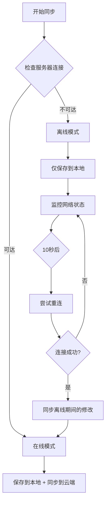
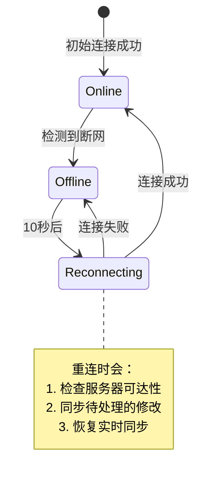

Friday 的离线模式让你能够在没有网络连接的情况下继续工作，所有修改都会被安全保存，并在恢复连接后自动同步。

## 什么是离线模式？

离线模式是 Friday 的一个核心特性，它确保：

- ✅ **零数据丢失**: 所有文件修改都保存到本地数据库
- ✅ **无缝体验**: 无需手动操作，自动启用和退出
- ✅ **自动恢复**: 网络恢复后自动重连并同步
- ✅ **状态透明**: 清晰的提示让你知道当前状态

> [!tip]
> 离线模式不是你需要"开启"的设置 - 当 Friday 检测到服务器不可达时，它会自动启用。

## 工作原理

### 自动检测和切换



### 本地优先架构

Friday 采用"本地优先"的设计理念：

```
┌─────────────────────────────────────────┐
│         用户编辑文件                      │
└─────────────────────────────────────────┘
                  │
                  ▼
┌─────────────────────────────────────────┐
│      文件监听器检测到变更                  │
└─────────────────────────────────────────┘
                  │
                  ▼
┌─────────────────────────────────────────┐
│    立即保存到本地 PouchDB（IndexedDB）    │
│    ✓ 无需网络                            │
│    ✓ 即时完成                            │
└─────────────────────────────────────────┘
                  │
          ┌───────┴───────┐
          │               │
      在线模式         离线模式
          │               │
          ▼               ▼
    同步到云端        标记为待同步
          │               │
          └───────┬───────┘
                  ▼
          网络恢复后同步
```

> [!info] 为什么选择本地优先？
> 
> 传统的云同步工具在网络不可用时可能丢失数据。Friday 确保你的修改**首先**保存在本地，然后才考虑上传到云端。

## 离线模式下的功能

### ✅ 完全可用的功能

在离线模式下，以下功能正常工作：

| 功能 | 说明 |
|------|------|
| 📝 创建笔记 | 新笔记保存到本地，稍后同步 |
| ✏️ 编辑笔记 | 所有修改立即保存到本地数据库 |
| 🗑️ 删除笔记 | 删除操作记录在本地，稍后同步 |
| 📁 重命名/移动 | 文件操作保存在本地 |
| 🔍 本地搜索 | 搜索本地已下载的内容 |
| 📎 插入附件 | 附件保存在本地，稍后同步 |

### ⏸️ 暂时不可用的功能

以下功能需要网络连接：

- ☁️ 实时同步到云端
- 📥 从其他设备拉取最新更改
- 🌐 发布笔记到互联网
- 🔄 冲突解决（需要服务器数据）

> [!warning] 关于冲突
> 
> 如果你在多台设备上同时离线编辑同一文件，恢复连接后可能产生冲突。Friday 会智能处理这些冲突，但建议避免同时离线编辑相同内容。

## 自动重连机制

当检测到服务器不可达时，Friday 会自动调度重连：

### 重连策略



### 重连行为

- **第一次尝试**: 10 秒后
- **后续尝试**: 每隔 10 秒
- **成功后**: 立即同步所有待处理的修改
- **失败后**: 继续调度下一次尝试

## 状态指示

Friday 通过多种方式指示当前的连接状态：

### 状态栏图标

| 图标 | 状态 | 说明 |
|------|------|------|
| ✓ | CONNECTED | 已连接，正常同步中 |
| ↻ | STARTED | 正在连接服务器 |
| ⏸ | NOT_CONNECTED | 离线模式 - 修改保存到本地 |
| ⚠ | ERRORED | 发生错误 |
| ⏹ | PAUSED | 同步已暂停 |

### 通知消息

进入离线模式时，你会看到：

> 💡 无法连接同步服务器。您的修改将保存在本地，恢复连接后会自动同步。

恢复连接时，你会看到：

> ✅ 已重新连接到同步服务器。正在同步离线期间的修改...

## 实际使用场景

### 场景 1: 飞行中工作

```
1. 登机前，你的笔记已经完全同步
2. 进入飞行模式
3. Friday 检测到离线，自动启用离线模式
4. 你在飞行中编辑了 10 篇笔记
5. 所有修改保存在本地 PouchDB
6. 落地后重新连接 WiFi
7. Friday 自动重连并同步这 10 篇笔记
8. 其他设备上也能看到更新
```

> [!success]
> 整个过程无需任何手动操作！

### 场景 2: 咖啡馆网络不稳定

```
1. 在咖啡馆连接到公共 WiFi
2. 开始编辑笔记
3. WiFi 突然断开
4. Friday 检测到断网，切换到离线模式
5. 你继续编辑（可能都没注意到断网）
6. 几分钟后 WiFi 恢复
7. Friday 自动重连并同步修改
```

> [!tip]
> 即使网络频繁波动，你也能流畅工作，无需担心数据丢失。

### 场景 3: 地铁中记录灵感

```
1. 在地铁中（无网络）
2. 突然有灵感，打开 Obsidian
3. Friday 已经处于离线模式
4. 快速记录想法，创建新笔记
5. 到达目的地，连接到 WiFi
6. Friday 自动上传新笔记
```

## 数据一致性保证

### PouchDB 的作用

Friday 使用 [PouchDB](https://pouchdb.com/) 作为本地数据库：

```
用户文件系统        PouchDB (IndexedDB)       CouchDB 服务器
     │                      │                        │
     │   文件修改            │                        │
     ├─────────────────────>│                        │
     │                      │   在线时同步             │
     │                      ├───────────────────────>│
     │                      │                        │
     │                      │   服务器不可达时        │
     │   继续修改            │   仅保存到本地          │
     ├─────────────────────>│                        │
     │                      │                        │
     │                      │   网络恢复后            │
     │                      ├───────────────────────>│
```

### 冲突解决

当多台设备同时离线修改同一文件时，可能产生冲突。Friday 采用以下策略：

1. **时间戳优先**: 保留最新的修改
2. **冲突副本**: 创建冲突版本供用户选择
3. **智能合并**: 对于某些类型的修改，尝试自动合并

> [!example] 冲突解决示例
> 
> **情况**: 你在笔记本和手机上同时离线编辑 `project.md`
> 
> **笔记本**: 添加了"第三章"
> **手机**: 添加了"附录 A"
> 
> **恢复连接后**:
> - Friday 检测到冲突
> - 创建 `project.md` (最新版本) 和 `project (冲突 2026-02-10).md`
> - 你可以手动合并两个版本


## 故障排查

### 问题 1: 离线修改没有同步

**症状**: 网络恢复后，离线期间的修改没有出现在其他设备上

**可能原因**:
- 离线追踪未启用
- 重连失败但你没注意到
- 本地数据库损坏

**解决方案**:
1. 检查状态栏图标，确认已重连
2. 手动触发同步（点击状态栏图标）
3. 检查开发者控制台的错误信息
4. 如果问题持续，尝试[[reset|重置云端数据]]

### 问题 2: 频繁在线/离线切换

**症状**: 状态栏图标频繁在"已连接"和"离线"之间切换

**可能原因**:
- 网络连接不稳定
- 服务器响应慢
- 服务器配置问题

**解决方案**:
1. 检查网络连接质量
2. 增加连接超时时间
3. 检查 CouchDB 服务器日志
4. 考虑切换到更稳定的网络或服务器

### 问题 3: 离线模式下创建的文件有重复

**症状**: 恢复连接后，同一文件出现多个副本

**可能原因**:
- 多台设备同时离线创建了同名文件
- 时间戳同步问题

**解决方案**:
1. 手动比对和合并重复文件
2. 确保所有设备的系统时间正确
3. 使用唯一的文件名（如包含时间戳）

## 最佳实践

1. **信任离线模式**: 不要因为看到"离线模式"就停止工作
2. **保持设备时间准确**: 有助于冲突解决
3. **定期连接网络**: 虽然可以长期离线，但定期同步更安全
4. **留意冲突通知**: 及时处理冲突文件


> [!info]
> 这些功能还在规划中，可能会在未来的版本中实现。

