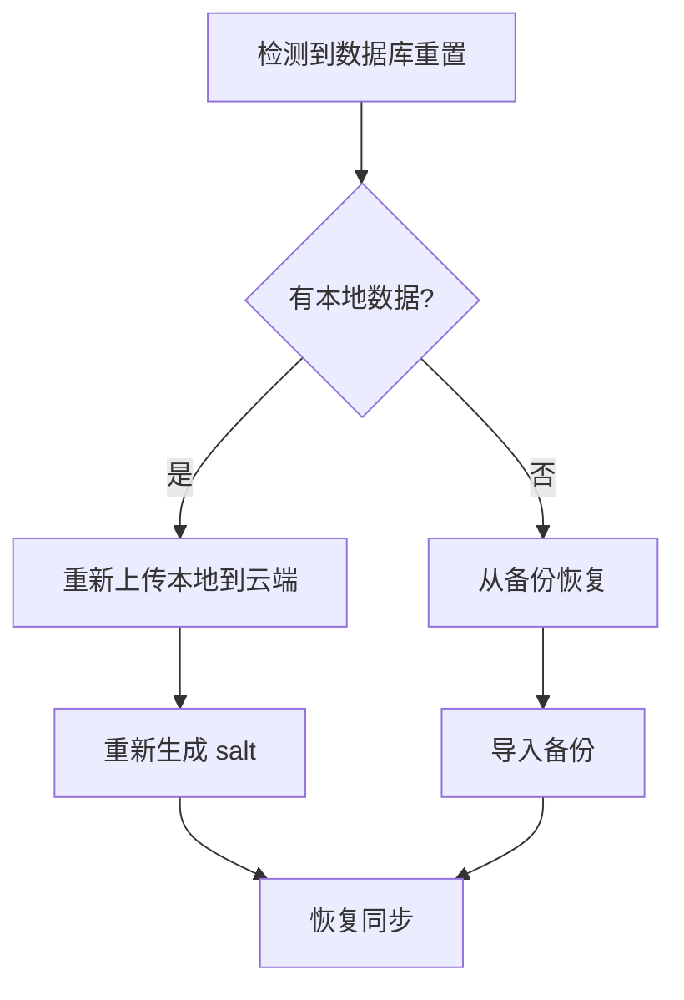

如果因为密码丢失，或者是想重新开始。
可以通过重置云端数据，来达到目的。

## 操作步骤

进入设置页面，找到重置数据栏，输入 `RESET` 字样，点击`重置云端数据`按钮，进行重置。

> [!danger] 重置会影响所有设备
> 
> 重置后，**新的加密密码会生成**

![[reset.png]]

## 子设备想重新同步

如果你（或其他人）重置了云端数据：

1. 服务器端的 `_local/salt` 文档凭证会丢失
2. Friday 无法验证 PBKDF2 salt，也就是无法正常打开被加密的文档，因为锁的钥匙换了
3. 需要重新初始化

**恢复步骤**:

> [!info] 拉取策略
> 
> 重新从云端拉取数据，只会拉取云端最新数据。
> 本地数据会在修改后上传，并不会上传所有本地数据。
> 所以建议新建仓库进行同步。
> 
> 因为**重新生成了加密密码**，所以从云端拉取数据前，请输入新的密码。

