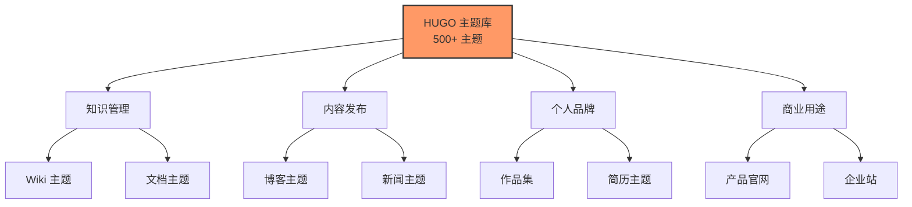

Friday 完全重写了 HUGO 的核心代码（使用 TypeScript），因此能够**快速适配 HUGO 主题生态**，让你可以直接挑选 **500+ HUGO 主题**。

## 🌟 为什么选择 HUGO 主题生态？

### 背靠成熟社区

HUGO 是世界上最流行的静态网站生成器之一：

| 特性           | 数据       |
| ------------ | -------- |
| GitHub Stars | 86.5k+ ⭐ |
| 主题数量         | 500+ 🎨  |
| 社区活跃度        | 非常高 📈   |
| 文档完善度        | 极佳 📚    |
| 更新频率         | 持续维护 🔄  |

> [!success] Friday 的创新
> 
> Friday 使用 TypeScript 完全重写了 HUGO 核心，让你能够：
> - ✅ 在 Obsidian 中直接使用 HUGO 主题
> - ✅ 无需学习 HUGO 命令行
> - ✅ 可视化预览和发布
> - ✅ 享受 500+ 主题生态

## 🎨 主题分类

### 按用途分类

### 自定义主题

Friday 支持自定义主题样式：

**基础自定义**（所有用户）：
- 🎨 配色方案
- 📝 字体选择
- 🖼️ Logo 和 Favicon
- 📋 站点信息

**高级自定义**（Pro 用户）：
- 💻 自定义 CSS
- 📄 修改模板
- 🔧 配置文件
- 🎯 高级功能

## 📊 主题对比

### Friday vs HUGO 原生

| 特性 | HUGO 原生 | Friday |
|------|----------|--------|
| 主题数量 | 500+ | 500+ |
| 学习曲线 | 陡峭 | 平缓 |
| 使用方式 | 命令行 | 可视化 |
| 预览方式 | 本地服务器 | [[../publish/preview\|一键预览]] |
| 编辑器 | 任意 | Obsidian 原生 |
| 发布方式 | 手动/CI | [[../publish/quick-share\|一键发布]] |

### Friday 的优势

> [!success] 零学习成本
> 
> 不需要学习 HUGO：
> - ❌ 无需学习命令行
> - ❌ 无需配置文件
> - ❌ 无需手动部署
> 
> 只需在 Obsidian 中：
> - ✅ 写 Markdown
> - ✅ 选主题
> - ✅ 一键发布

## 🔍 主题搜索

### 按关键词搜索

在 Friday 主题库中，你可以：

- 🔍 搜索主题名称
- 🏷️ 按标签筛选
- 📊 按热度排序
- ⭐ 按评分排序
- 📅 按更新时间排序

### 推荐算法

Friday 会根据你的：

- 📝 笔记类型
- 🎨 使用场景
- 👀 浏览历史
- ⭐ 收藏记录

推荐适合你的主题。

## 🎓 主题使用指南

### 选择主题的建议

> [!tip] 如何选择主题？
> 
> **考虑因素**：
> 1. **内容类型**：博客？文档？作品集？
> 2. **目标受众**：技术人员？普通读者？客户？
> 3. **品牌形象**：专业？创意？简约？
> 4. **功能需求**：搜索？评论？多语言？
> 
> **建议**：
> - 先用默认主题熟悉流程
> - 再尝试不同风格的主题
> - 最后选定最合适的

### 常见主题类型对比

| 类型 | 优势 | 劣势 | 适合场景 |
|------|------|------|---------|
| Wiki | 导航清晰 | 较传统 | 知识库、团队文档 |
| Blog | 时间线明确 | 内容更新频繁 | 个人博客、新闻 |
| Doc | 结构化强 | 灵活性低 | 产品文档、手册 |
| Portfolio | 视觉冲击强 | 内容承载少 | 设计作品、摄影 |
| Landing | 转化率高 | 信息密度大 | 产品推广、营销 |

## 🌐 主题生态

### HUGO 社区资源

**官方资源**：
- 📖 [HUGO 官方文档](https://gohugo.io/documentation/)
- 🎨 [HUGO 主题市场](https://themes.gohugo.io/)
- 💬 [HUGO 论坛](https://discourse.gohugo.io/)
- 📺 [视频教程](https://www.youtube.com/results?search_query=hugo+tutorial)

**第三方资源**：
- 🎓 教程和博客文章
- 🛠️ 主题开发工具
- 📦 插件和扩展
- 👥 开发者社区

### Friday 社区

**主题分享**：
- [[showcases/awesome|优秀案例展示]]
- 用户自定义主题
- 主题使用技巧
- 最佳实践分享

## 💡 主题定制服务

### 自助定制

**免费**（所有用户）：
- 基础配色
- 字体选择
- Logo 替换
- 基本信息

**Pro**（付费用户）：
- 自定义 CSS
- 模板修改
- 高级配置
- 技术支持

### 专业定制

如果需要深度定制：

- 🎨 **主题设计**：¥2,000 起
- 💻 **主题开发**：¥5,000 起
- 🔧 **功能开发**：面议
- 📞 **联系**：design@mdfriday.com

## 📈 主题趋势

### 2026 年流行趋势

1. **极简主义**
   - 更少的视觉元素
   - 专注于内容本身
   - 快速加载

2. **暗色模式**
   - 自动切换
   - 保护视力
   - 节省电量

3. **响应式设计**
   - 完美适配所有设备
   - 触屏优化
   - PWA 支持

4. **可访问性**
   - 无障碍设计
   - 语义化 HTML
   - 键盘导航

## ❓ 常见问题

### Q: 所有 HUGO 主题都支持吗？

**A**: 大部分支持！

- ✅ 95% 的 HUGO 主题可直接使用
- ⚠️ 少数需要特殊配置
- 🔧 我们持续增加兼容性

### Q: 可以使用第三方主题吗？

**A**: 可以！

1. 从 HUGO 主题市场下载
2. 上传到 Friday
3. 应用主题

或联系我们帮助适配。

### Q: 主题可以切换吗？

**A**: 随时可以！

- 不影响内容
- 保留所有数据
- 即时生效

### Q: 主题更新如何处理？

**A**: 自动更新！

- 主题开发者更新后
- Friday 自动同步
- 你的站点自动使用最新版

## 🔗 相关文档

- [[wiki|Wiki 主题详解]]
- [[blog|博客主题详解]]
- [[document|文档主题详解]]
- [[portfolio|作品集主题]]
- [[../publish/preview|本地预览]]
- [[../publish/quick-share|快速发布]]
- [[../friday|关于 Friday]]

## 🎉 开始使用

> [!success] 立即体验
> 
> 1. [[../get-started|安装 Friday]]
> 2. [[../license/activation|激活 License]]
> 3. 浏览主题库
> 4. [[../publish/quick-share|发布第一篇]]

**500+ 主题等你探索！开始创作吧！🎨✨**

