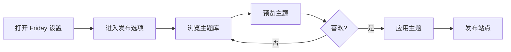

## 🛠️ 如何使用主题

### 在 Friday 中选择主题

**步骤**：

1. **浏览主题**
   - 打开 **设置 → Friday → 发布**
   - 点击"浏览主题"
   - 按类别筛选

2. **预览主题**
   - 点击主题卡片
   - 查看演示站点
   - 了解主题特点

3. **应用主题**
   - 点击"使用此主题"
   - [[publish/preview|本地预览]]效果
   - 满意后发布

