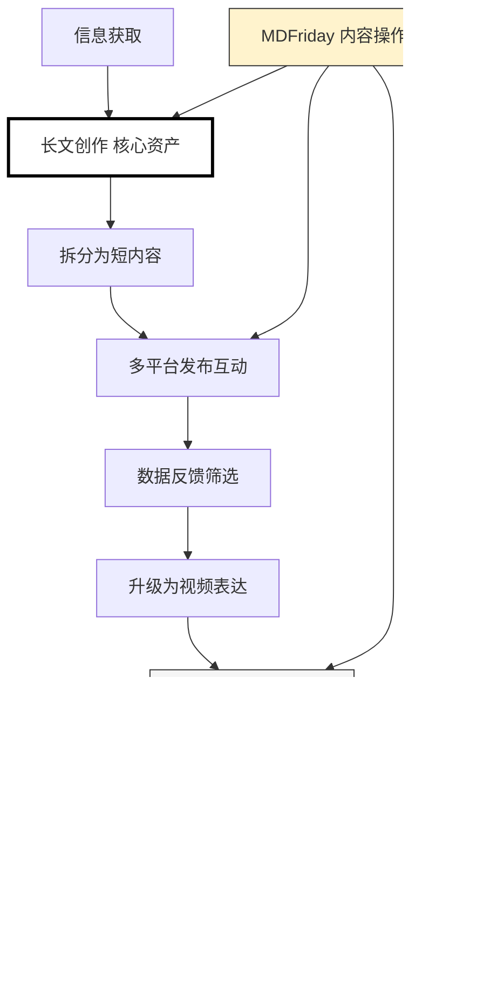

MDFriday 是一人公司内容操作系统。

```mermaid
flowchart TB  
  
A[少工作 多赚钱 享受生活]  
  
B[品牌定位 一人公司 系统思维]  
  
C1[信息获取]  
C2[长文创作 核心资产]  
C3[拆分为短内容]  
C4[多平台发布互动]  
C5[数据反馈筛选]  
C6[升级为视频表达]  
C7[沉淀为网站 电子书]  
  
P[MDFriday 内容操作系统]  
  
%% 主结构  
B --> A  
C1 --> C2 --> C3 --> C4 --> C5 --> C6 --> C7  
C7 --> B  
  
%% 产品嵌入  
P --> C2  
P --> C4  
P --> C7  
  
%% 颜色定义  
style A fill:#e1ffe1,stroke:#333,stroke-width:1px  
style B fill:#e1f5ff,stroke:#333,stroke-width:1px  
style C2 fill:#ffffff,stroke:#000,stroke-width:3px  
style C7 fill:#f5f5f5,stroke:#333,stroke-width:1px  
style P fill:#fff3cd,stroke:#333,stroke-width:1px
```