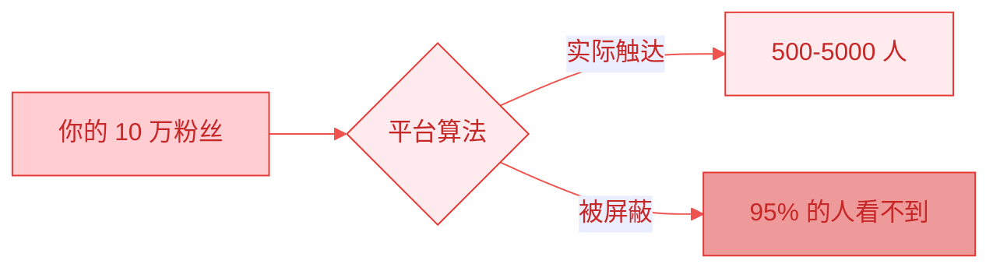
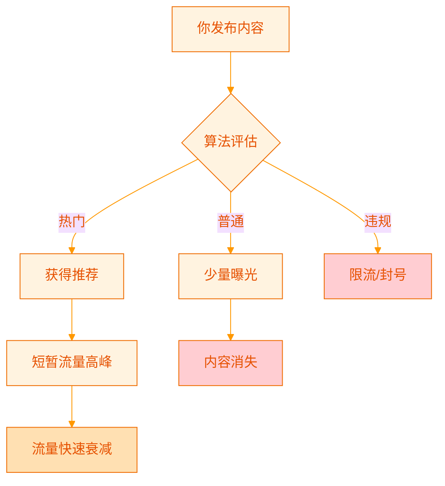
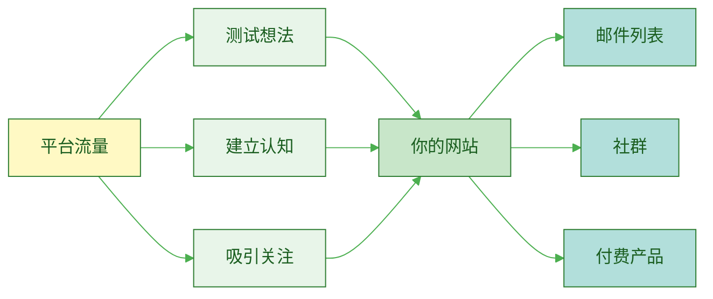
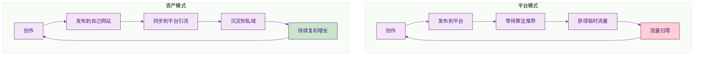

> [!quote] Dan Koe 的核心洞察
> "个人品牌是新的简历，是最具普适性的流量来源，不可复制，也不会过时。"
> ——来自 [[3. MDFriday 实战记录/03.网站/Dan Koe/视频笔记/15|最赚钱的商业模式]]

## 平台流量的幻觉

很多创作者有一个误区：**认为在某个平台上拥有 10 万粉丝，就拥有了 10 万用户**。

实际情况是：

> [!danger] 真相
> 你在平台上的粉丝，**不是你的用户，而是平台的用户**。
> 
> 你只是平台的**内容供应商**，帮平台吸引用户、留住用户。

## 平台的本质是什么？

### 平台的商业模式

平台（微信公众号、知乎、小红书、B站等）的商业模式非常清晰：

| 角色 | 创作者 | 平台 | 用户 |
|-----|--------|------|------|
| **提供** | 内容 | 分发渠道 | 注意力 |
| **获得** | 流量（有限） | 广告收入 | 免费内容 |
| **控制权** | ❌ 无 | ✅ 完全控制 | ❌ 无 |

> [!warning] 关键问题
> **平台控制了三个最重要的东西：**
> 1. **分发权**：决定你的内容能被谁看到
> 2. **数据权**：你看不到用户的真实联系方式
> 3. **规则权**：随时可以改变算法和政策

### 算法的残酷真相

参考 [[3. MDFriday 实战记录/03.网站/Dan Koe/视频笔记/14|一人商业的未来]]，传统平台的问题在于：

**算法的目标不是帮你成功，而是让用户留在平台更久。**

## 真实案例：平台的不确定性

### 案例 1：算法调整

> [!example] 某公众号创作者
> - 2022 年：平均阅读量 5000+
> - 2023 年：算法调整后，阅读量降到 500
> - 原因：平台推视频号，削弱图文推荐
> - 结果：辛苦积累的影响力，一夜归零

### 案例 2：规则变化

> [!example] 某知乎大V
> - 拥有 50 万粉丝
> - 因"违规"被封号
> - 申诉无果
> - 多年积累，瞬间清零

### 案例 3：平台倒闭

> [!example] 曾经的明星平台
> - 新浪微博的衰落
> - 人人网的消失
> - 字节跳音的不确定性
> 
> **问题：当平台不在了，你的内容和粉丝在哪里？**

## 流量的两种形态

理解流量的本质，关键在于区分**借来的流量**和**自己的流量**：

### 借来的流量（平台流量）

| 特征 | 说明 |
|-----|------|
| **所有权** | ❌ 平台拥有用户数据 |
| **稳定性** | ❌ 随时可能消失 |
| **可控性** | ❌ 算法决定一切 |
| **成本** | ✅ 免费（但你是产品） |
| **触达率** | ❌ 5-20%（持续下降） |

### 自己的流量（私域流量）

| 特征 | 说明 |
|-----|------|
| **所有权** | ✅ 你拥有用户联系方式 |
| **稳定性** | ✅ 不受平台影响 |
| **可控性** | ✅ 你决定分发策略 |
| **成本** | ⚠️ 需要建设成本 |
| **触达率** | ✅ 接近 100% |

> [!success] 核心策略
> **不要只做平台的内容供应商，要成为拥有自己流量池的创作者。**

## 平台流量的正确姿势

### 平台的作用

平台不是没有价值，而是要**正确理解它的作用**：

> [!tip] 正确策略
> **平台是漏斗的顶端（获客渠道），但不是你的资产基地。**
> 
> - ✅ 用平台测试内容
> - ✅ 用平台建立初步信任
> - ✅ 用平台引流到自己的阵地
> - ❌ 不要把所有鸡蛋放在平台的篮子里

### 从平台到资产的转化路径

参考 [[3. MDFriday 实战记录/03.网站/Dan Koe/视频笔记/29|智能创作者如何从零增长受众]]：

| 阶段 | 平台作用 | 你的行动 | 目标 |
|-----|---------|---------|------|
| **1. 吸引** | 发布短内容 | 提供价值 | 让人认识你 |
| **2. 筛选** | 持续输出 | 展示专业性 | 让人信任你 |
| **3. 转化** | 引导行动 | 提供诱饵 | 让人加入你的私域 |
| **4. 深化** | 停止依赖 | 在私域深度服务 | 建立长期关系 |

> [!example] 具体操作
> 
> **短内容末尾加上：**
> - "想了解完整方法论，访问我的网站 xxx"
> - "加入我的邮件列表，获取深度内容"
> - "进入我的知识星球/社群，一起交流"

## 为什么必须拥有自己的阵地？

### 对比分析

### 长期价值对比

| 维度 | 纯平台模式 | 资产模式 |
|-----|----------|---------|
| **1 年后** | 可能有流量 | 开始积累 |
| **3 年后** | 依然不稳定 | 初步资产 |
| **5 年后** | 可能归零 | 复利显现 |
| **10 年后** | 需要重来 | 指数增长 |

> [!quote] 核心认知
> "你在平台上的努力，是在给平台打工。
> 
> 你在自己阵地上的积累，才是在给未来投资。"

## 行动建议

### 立即行动

> [!check] 第一步：建立自己的数字资产
> 
> 1. **注册域名**：选择一个代表你的域名
> 2. **搭建网站**：使用 [[2. 一人公司实操手册/02.MDFriday 使用指南/|MDFriday]] 快速建站
> 3. **开始写作**：在自己的网站上发布原创内容
> 4. **同步分发**：将内容同步到各平台引流

> [!check] 第二步：建立私域流量池
> 
> 1. **邮件列表**：这是最重要的私域资产（参考 [[3. MDFriday 实战记录/03.网站/Dan Koe/视频笔记/29|智能创作者如何从零增长受众]]）
> 2. **社群**：微信群/Discord/知识星球
> 3. **RSS 订阅**：让读者订阅你的更新

> [!check] 第三步：改变创作流程
> 
> **旧流程**：在平台创作 → 发布 → 等待推荐
> 
> **新流程**：
> 1. 在自己网站创作（永久存储）
> 2. 同步到平台（引流工具）
> 3. 引导读者回到自己阵地
> 4. 在私域深度服务

## 总结

> [!important] 三个核心认知
> 
> 1. **平台流量不是你的资产**
>    - 你只是借用了平台的分发能力
>    - 算法和规则随时会变
>    
> 2. **必须建立自己的阵地**
>    - 个人网站 = 你的数字房地产
>    - 私域流量 = 你的真实用户
>    
> 3. **平台是手段，不是目的**
>    - 用平台获客
>    - 在私域留存
>    - 在资产上变现

### 下一步

继续阅读：
- [[b.内容消耗型 vs 内容资产型|内容消耗型 vs 内容资产型]]
- [[c.重复劳动的陷阱|重复劳动的陷阱]]
- [[../03.一人公司的底层模型/a.品牌内容产品系统|品牌内容产品系统]]

---

**记住：你不是在为平台创作，你是在为自己建立长期资产。**
