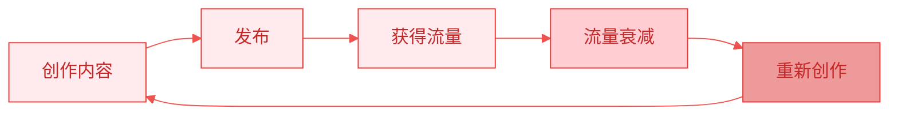
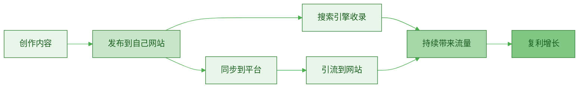
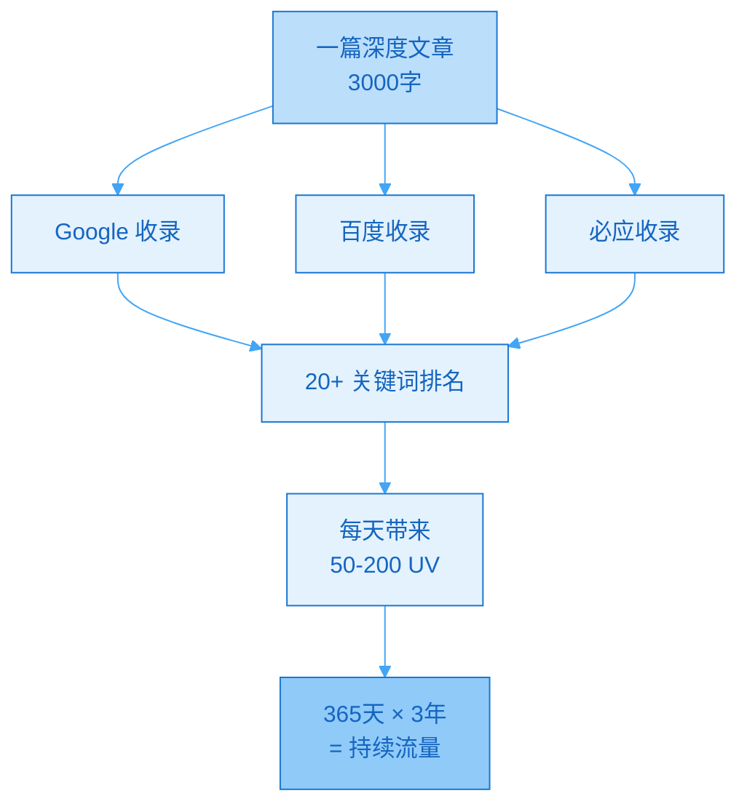
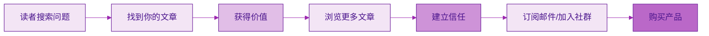
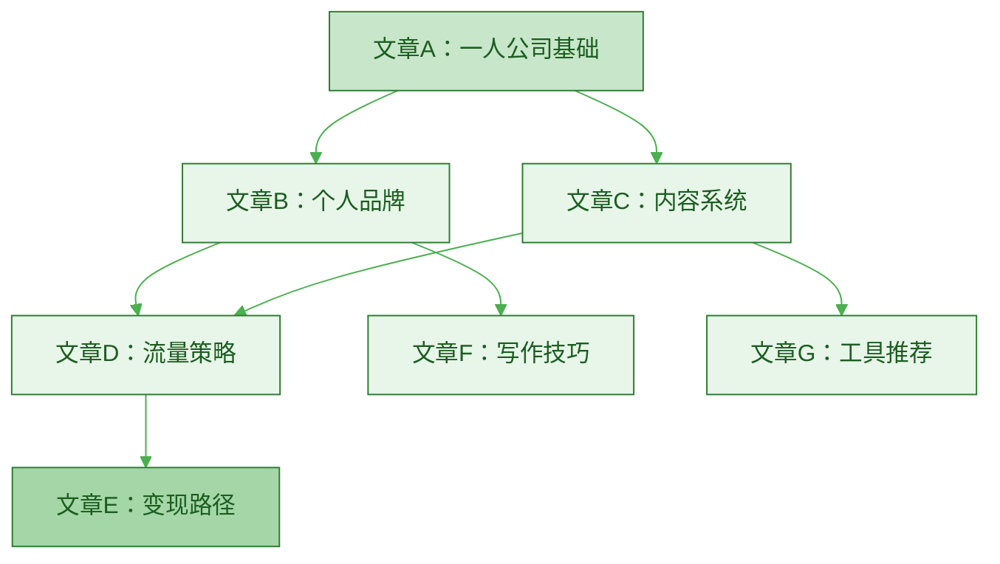
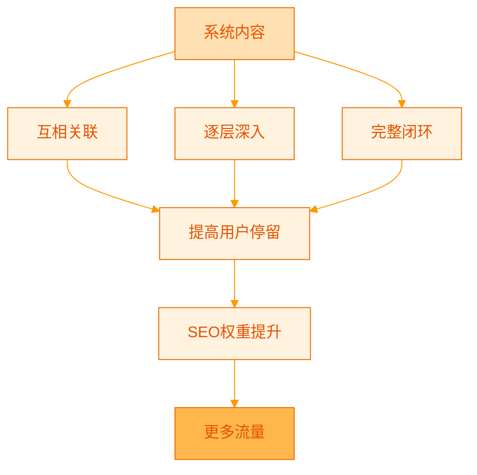
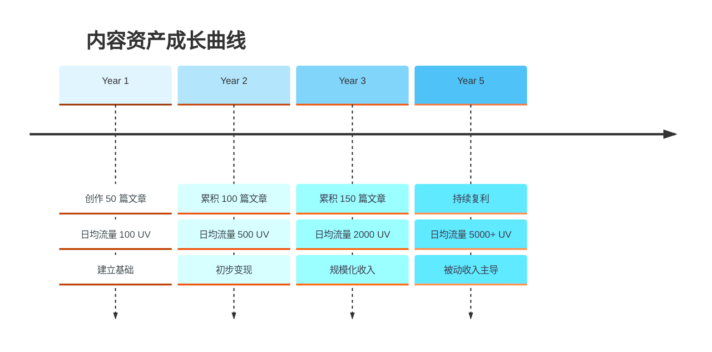

> [!quote] Dan Koe 的智慧
> "真正的'最快路径'是选择**最长的道路并坚持走完**，而不是频繁尝试不同的短线策略。"
> ——来自 [[3. MDFriday 实战记录/03.网站/Dan Koe/视频笔记/15|最赚钱的商业模式]]

## 两种截然不同的创作模式

很多创作者每天都很忙，但一年后发现：**没有积累任何资产**。

问题出在哪里？

他们做的是**内容消耗型创作**，而不是**内容资产型创作**。

### 什么是内容消耗型？



> [!danger] 消耗型内容的特征
> 
> - ✅ **短期有效**：发布时有流量
> - ❌ **快速衰减**：几天后就消失
> - ❌ **无法积累**：不产生复利
> - ❌ **依赖算法**：完全受平台控制
> - ❌ **重复劳动**：停止创作就停止收入

### 什么是内容资产型？



> [!success] 资产型内容的特征
> 
> - ✅ **长期有效**：几年后仍带来流量
> - ✅ **持续增值**：时间越久价值越大
> - ✅ **产生复利**：老内容持续引流
> - ✅ **你控制**：不受平台限制
> - ✅ **睡后收入**：停止创作仍有收益

## 对比分析

### 时间价值曲线


### 详细对比

| 维度 | 内容消耗型 | 内容资产型 |
|-----|----------|----------|
| **创作平台** | 社交平台（微信、知乎、小红书） | 自己的网站 + 平台分发 |
| **内容形式** | 短视频、热点追踪、碎片化 | 深度长文、系统知识、永恒话题 |
| **流量来源** | 算法推荐 | 搜索引擎 + 算法 + 直接访问 |
| **流量峰值** | 发布后 24-72 小时 | 发布后 3-12 个月 |
| **生命周期** | 3-7 天 | 3-5 年甚至更长 |
| **收益模式** | 持续劳动换取收入 | 一次创作持续收益 |
| **1 年后价值** | 归零 | 开始显现 |
| **5 年后价值** | 需要重来 | 指数增长 |
| **可否转让** | 不可（平台资产） | 可以（你的资产） |

## 真实案例对比

### 案例 1：纯平台创作者（消耗型）

> [!example] 小红书博主 A
> 
> **模式**：每天发 3 条小红书笔记
> 
> **1 年后数据**：
> - 粉丝：5 万
> - 月收入：广告 + 带货 = 1 万
> - 每月工作量：90 篇内容
> - **问题**：停止发布，收入立即归零
> 
> **5 年后**：
> - 算法改变，流量下降 80%
> - 必须持续高强度创作
> - 身心疲惫，考虑转行

### 案例 2：网站 + 平台创作者（资产型）

> [!example] 独立博主 B
> 
> **模式**：每周 1 篇深度文章发布到网站，再同步到平台
> 
> **1 年后数据**：
> - 网站流量：日均 500 UV（主要来自搜索引擎）
> - 邮件订阅：2000 人
> - 月收入：课程 + 咨询 = 1.5 万
> - 每月工作量：4 篇深度文章
> 
> **5 年后**：
> - 网站流量：日均 5000 UV
> - 200+ 篇文章持续带来流量
> - 月收入：10 万+（产品 + 服务）
> - **可以**减少创作，专注产品化
> - 网站本身可估值 100 万+

## 为什么资产型内容更有价值？

### 1. 搜索引擎的长尾流量

参考 [[3. MDFriday 实战记录/03.网站/Dan Koe/视频笔记/14|一人商业的未来]]，深度内容能够：



> [!tip] 长尾流量的威力
> 
> - 一篇优质文章可以获得 20-50 个关键词排名
> - 每个关键词每天带来 2-10 次搜索
> - 累积起来，一篇文章每天可带来 50-200 次访问
> - **持续 3-5 年，甚至更久**

### 2. 信任的复利效应



> [!success] 信任建立路径
> 
> 当一个陌生人通过搜索引擎找到你的文章：
> 1. 第一篇文章解决了他的问题 → **有用**
> 2. 浏览更多文章发现都很深入 → **专业**
> 3. 看到你持续输出了 100+ 篇 → **可信**
> 4. 自然愿意加入你的私域 → **转化**

### 3. 内容之间的链接效应

资产型内容可以相互关联，形成**知识网络**：



> [!tip] 网络效应
> 
> - 读者从一篇文章进入
> - 通过内部链接发现更多相关内容
> - 平均停留时间增加
> - 跳出率降低
> - 搜索引擎给予更高权重
> - **形成正向循环**

## 如何从消耗型转向资产型？

### 思维转变

> [!important] 三个关键转变
> 
> 1. **从追热点到创造常青内容**
>    - ❌ "2026年最新XX技巧"
>    - ✅ "XX的底层逻辑和系统方法"
> 
> 2. **从平台优先到网站优先**
>    - ❌ 先在小红书写，再考虑是否搬运
>    - ✅ 先在自己网站发布，再同步到平台引流
> 
> 3. **从碎片化到系统化**
>    - ❌ 今天写A，明天写B，后天写C（无关联）
>    - ✅ 围绕主题建立系统的知识库（相互关联）

### 内容策略调整

| 维度 | 消耗型做法 | 资产型做法 |
|-----|----------|----------|
| **选题** | 追热点、蹭流量 | 永恒话题、系统知识 |
| **深度** | 500-800 字，浅尝辄止 | 2000-5000 字，深入本质 |
| **发布** | 只发平台 | 先发网站，再同步平台 |
| **优化** | 发完就不管 | 持续更新和优化 |
| **关联** | 孤立的单篇 | 相互链接的网络 |
| **SEO** | 不考虑 | 重视标题和关键词 |

### 具体操作步骤

> [!check] 第一步：建立内容主题库
> 
> 参考 [[3. MDFriday 实战记录/03.网站/Dan Koe/视频笔记/12|真实内容创作]]，用**主题树法**组织内容：
> 
> 1. 确定 3-5 个核心主题
> 2. 每个主题下规划 20-30 篇文章
> 3. 设计文章之间的关联关系

**示例：一人公司主题树**

```
一人公司
├── 认知篇（10篇）
│   ├── 为什么要做一人公司
│   ├── 一人公司的底层模型
│   └── ...
├── 内容篇（15篇）
│   ├── 长文创作
│   ├── 内容复用
│   └── ...
├── 系统篇（12篇）
│   ├── 工具系统
│   ├── 自动化
│   └── ...
└── 变现篇（10篇）
    ├── 产品化
    ├── 定价策略
    └── ...
```

> [!check] 第二步：改变创作流程
> 
> **旧流程**：想到什么写什么 → 发到平台 → 等待推荐
> 
> **新流程**：
> 1. **策划**：从主题库选择一个话题
> 2. **深度创作**：写 2000-4000 字深度文章
> 3. **SEO 优化**：优化标题、关键词、内部链接
> 4. **发布网站**：先发到自己网站
> 5. **同步平台**：将文章改编成平台风格，引流回网站
> 6. **持续优化**：根据反馈更新文章

> [!check] 第三步：建立再利用系统
> 
> 一篇 3000 字文章可以变成：
> 
> - ✅ 网站的深度文章（原始版本）
> - ✅ 10 条微博/推特（提炼观点）
> - ✅ 3 篇小红书笔记（视觉化呈现）
> - ✅ 1 条知乎回答（问答格式）
> - ✅ 1 期音频（朗读+延伸）
> - ✅ 1 个视频脚本（加案例）
> - ✅ 1 份 PDF 电子书（多篇合集）

## 资产型内容的创作原则

### 1. 写永恒的内容

> [!tip] 什么是永恒内容？
> 
> **3 年后仍然有价值的内容。**
> 
> - ❌ "2026年最新XX技巧"
> - ✅ "XX的底层逻辑"
> 
> - ❌ "最近火爆的XX工具"
> - ✅ "如何选择适合自己的XX工具"
> 
> - ❌ "XX平台最新算法"
> - ✅ "内容传播的底层原理"

### 2. 写深度的内容

参考 [[3. MDFriday 实战记录/03.网站/Dan Koe/视频笔记/14|一人商业的未来]]：

> [!quote] Dan Koe 的建议
> "不要满足于肤浅的自助建议，而是要追求真理，从**根源上解决问题**。"

**深度内容的特征**：
- 解释"为什么"，不只是"怎么做"
- 提供系统方法，不只是零散技巧
- 连接底层原理，不只是表面现象

### 3. 写系统的内容



## 从 0 开始建立内容资产

### 第一个月：基础建设

> [!check] Week 1-2：搭建阵地
> - [ ] 注册域名
> - [ ] 使用 [[2. 一人公司实操手册/02.MDFriday 使用指南/|MDFriday]] 建站
> - [ ] 设计网站结构
> - [ ] 选择主题模板

> [!check] Week 3-4：开始创作
> - [ ] 写第一篇深度文章（2000+ 字）
> - [ ] 发布到网站
> - [ ] 同步到 2-3 个平台
> - [ ] 收集反馈

### 前 6 个月：密集建设期

| 月份 | 目标 | 具体行动 |
|-----|------|---------|
| **1-2月** | 基础内容 | 每周 1 篇，共 8 篇文章 |
| **3-4月** | 扩展主题 | 每周 1-2 篇，共 12 篇文章 |
| **5-6月** | 系统化 | 建立内部链接，形成知识网络 |

**6 个月后预期**：
- ✅ 20-25 篇深度文章
- ✅ 开始有搜索引擎流量
- ✅ 建立初步权威性

### 1-3 年：复利显现期



## 常见问题

### Q1：资产型内容需要更多时间，值得吗？

> [!success] 答案：绝对值得
> 
> **短期对比**：
> - 消耗型：每天 2 小时，写 3 条短内容
> - 资产型：每周 6 小时，写 1 篇深度文章
> 
> **长期对比**（3 年后）：
> - 消耗型：3000+ 条内容，价值归零
> - 资产型：150 篇文章，持续带来流量和收入
> 
> **时间投入几乎相同，但回报天差地别。**

### Q2：我的行业变化快，能写永恒内容吗？

> [!tip] 聚焦底层逻辑
> 
> - ❌ 不写：具体工具的操作步骤
> - ✅ 要写：选择工具的思考框架
> 
> - ❌ 不写：当前的最佳实践
> - ✅ 要写：判断最佳实践的标准
> 
> **底层原理不变，表面形式会变。**

### Q3：我现在是纯平台创作者，如何转型？

> [!check] 渐进式转型
> 
> **第 1-2 月**：保持原创作，同时建站
> **第 3-4 月**：新内容先发网站，再发平台
> **第 5-6 月**：开始优化网站内容
> **第 7-12 月**：逐步减少平台投入，专注资产建设
> 
> **不要突然停止平台，而是逐步过渡。**

## 行动清单

> [!important] 立即开始
> 
> **今天就做的 3 件事**：
> 
> 1. **制定内容主题库**
>    - 列出你的 3-5 个核心主题
>    - 每个主题下列 10 个潜在文章标题
> 
> 2. **注册域名并建站**
>    - 选择一个代表你的域名
>    - 使用 MDFriday 快速搭建
> 
> 3. **写第一篇深度文章**
>    - 选择一个你最擅长的话题
>    - 写 2000+ 字的深度内容
>    - 发布到你的网站

## 总结

> [!quote] 核心认知
> "在平台创作是消耗时间，在自己阵地创作是积累资产。
> 
> 一个是线性增长，一个是指数增长。
> 
> 选择权在你手里。"

### 关键对比

| | 消耗型 | 资产型 |
|--|--------|--------|
| **思维** | 短期流量 | 长期资产 |
| **阵地** | 平台 | 自己网站 |
| **内容** | 碎片化 | 系统化 |
| **价值** | 快速衰减 | 持续增长 |
| **结果** | 重复劳动 | 复利收入 |

### 下一步阅读

- [[c.重复劳动的陷阱|重复劳动的陷阱]]
- [[../03.一人公司的底层模型/a.品牌内容产品系统|品牌内容产品系统]]
- [[../04.内容就是资产/b.长文作为知识数据库|长文作为知识数据库]]

---

**选择决定命运。今天就开始建立你的内容资产。**
