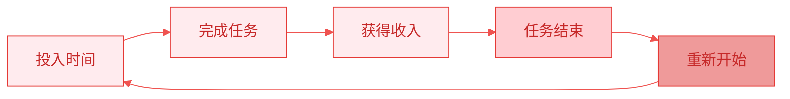
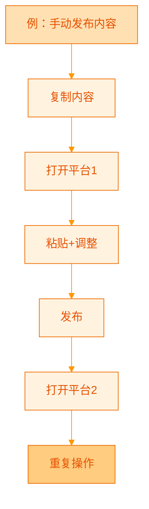
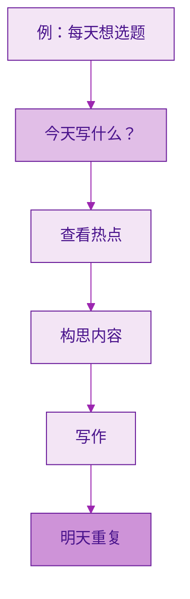
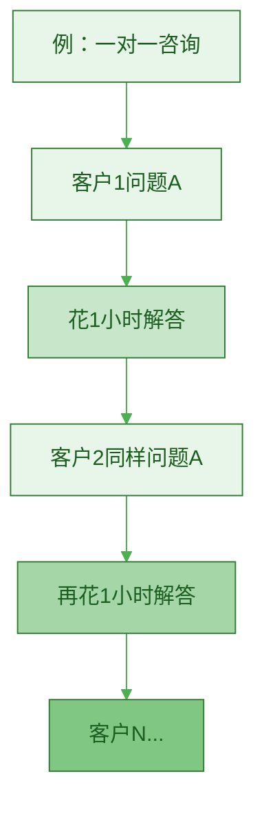
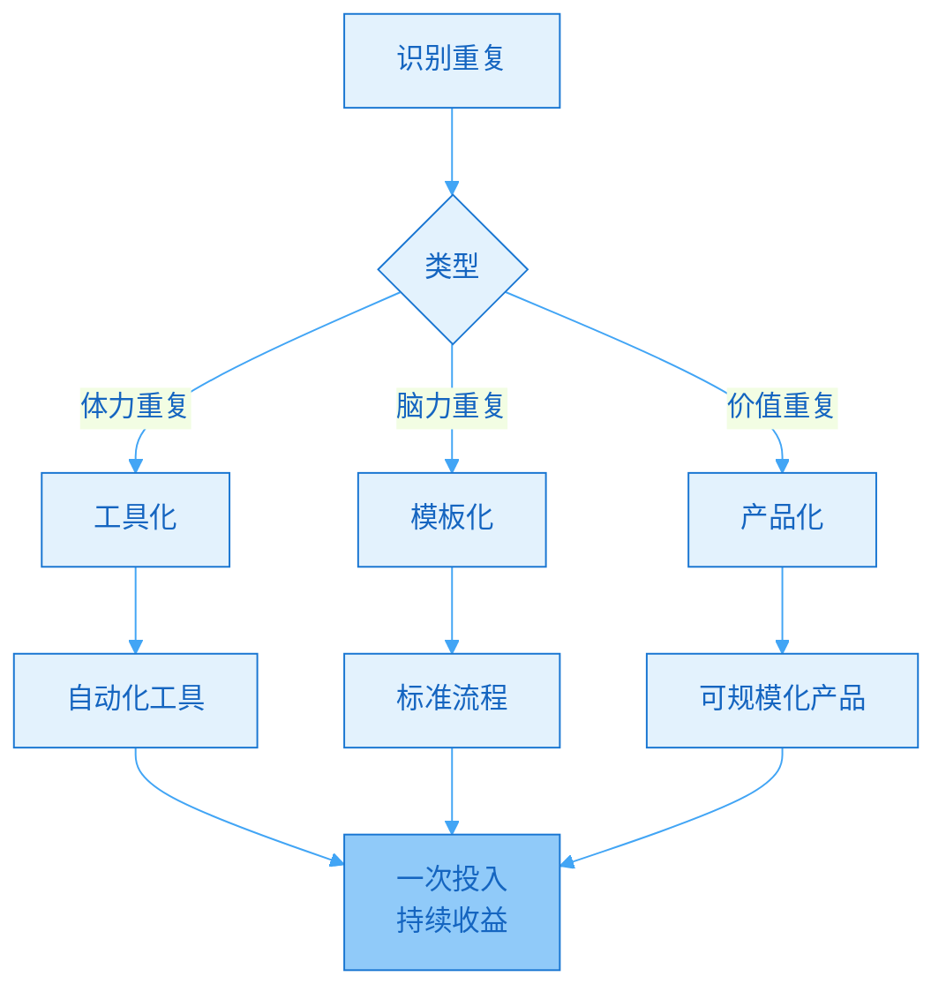
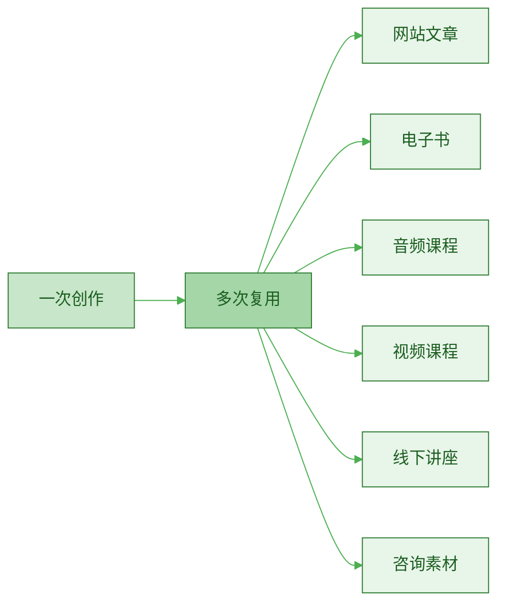
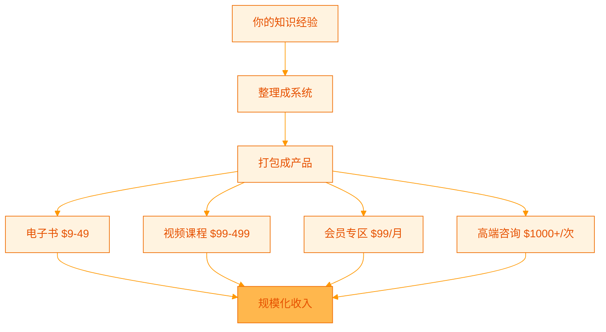

> [!quote] Dan Koe 的洞察
> "当挑战停止存在时，这种稳定性会滋生自满，导致**心理熵**（无聊和焦虑），最终让生命失去目的、意义和成就感。"
> ——来自 [[3. MDFriday 实战记录/03.网站/Dan Koe/purpose-profit/00-summary|核心思想总结]]

## 你是在创造，还是在重复？

很多人每天忙碌 8 小时，一年后却发现：

> [!danger] 残酷的真相
> - ❌ 没有积累可复用的资产
> - ❌ 停止劳动就停止收入
> - ❌ 工作量没有减少反而增加
> - ❌ 感到疲惫但看不到终点

**问题不在于你不够努力，而在于你陷入了"重复劳动"的陷阱。**

## 什么是重复劳动？

### 定义

> [!warning] 重复劳动的特征
> 
> 1. **线性关系**：收入 = 时间 × 单价
> 2. **无法积累**：每次都要从头开始
> 3. **不可复用**：过去的成果无法为未来节省时间
> 4. **无法规模化**：增加收入只能增加工作时间
> 5. **被动收入为零**：停止工作就停止收入

### 常见的重复劳动陷阱

| 场景 | 重复劳动表现 | 问题 |
|-----|------------|------|
| **内容创作** | 每天写3条微博/小红书 | 每条都要重新构思，无法复用 |
| **自由职业** | 接一个单子做一次 | 每次从零开始，无积累 |
| **咨询服务** | 一对一解答相同问题 | 同样的话说100遍 |
| **课程教学** | 线下一对一授课 | 时间换钱，无法规模化 |
| **社群运营** | 手动回复每个人 | 重复回答FAQ |

## 重复劳动的三个层次

### 第一层：体力重复

**特征**：机械性操作，可以自动化但没有自动化

**例子**：
- 手动复制粘贴到各个平台
- 手动修改图片尺寸
- 手动回复重复的问题

> [!tip] 解决方案
> **工具化 + 自动化**
> 
> 参考 [[../14.内容操作系统的构建/b.发布自动化|发布自动化]]，使用工具实现一键发布。

### 第二层：脑力重复

**特征**：每次都要重新思考，没有系统支撑

**例子**：
- 每天临时想选题
- 每次咨询都要重新组织语言
- 每个项目都要重新规划流程

> [!tip] 解决方案
> **模板化 + 系统化**
> 
> - 建立内容主题库
> - 制作咨询手册
> - 设计标准流程

### 第三层：价值重复

**特征**：价值无法规模化，卖一次时间一次

**例子**：
- 100个人问相同问题，回答100次
- 同样的内容讲给10个学生，讲10次
- 每个客户都要定制方案（其实80%相同）

> [!tip] 解决方案
> **产品化 + 规模化**
> 
> - 一对一 → 一对多
> - 定制服务 → 标准产品
> - 时间换钱 → 产品换钱

## 重复劳动的代价

### 1. 时间成本

> [!example] 案例：内容创作者 A
> 
> **每天工作流程**：
> - 8:00-9:00：想今天写什么
> - 9:00-10:00：写第一篇小红书
> - 10:00-11:00：写第二篇小红书
> - 11:00-12:00：写第三篇小红书
> - 14:00-15:00：手动发布到各平台
> - 15:00-17:00：回复评论
> 
> **每天工作：7 小时**
> **每月工作：210 小时**
> **每年工作：2520 小时**
> 
> **一年后**：
> - 创作了 1000+ 条内容
> - 但无一能持续带来价值
> - 停止创作，一切归零

### 2. 机会成本

当你陷入重复劳动时，你失去了：

| 失去的机会 | 说明 |
|----------|------|
| **学习新技能** | 没时间学习更高价值的技能 |
| **开发产品** | 没时间做可规模化的产品 |
| **建立系统** | 没时间搭建自动化系统 |
| **战略思考** | 没时间思考长期方向 |
| **个人生活** | 没时间陪伴家人、运动、休息 |

> [!danger] 恶性循环
> 
> 重复劳动 → 没时间优化 → 更多重复劳动 → 更忙碌 → 更没时间 → ...

### 3. 心理成本

参考 [[3. MDFriday 实战记录/03.网站/Dan Koe/purpose-profit/00-summary|核心思想总结]]：

> [!quote] 心理熵
> "工作是**不愉快**的，是**生存机制**，占据了三分之一的生命并耗尽了享受其他时间的精力。这种生活状态让人感到**压力、不知所措和焦虑**。"

**重复劳动导致的心理问题**：
- 😫 **疲惫**：每天做同样的事情
- 😰 **焦虑**：看不到增长和未来
- 😔 **无意义感**：感觉只是机器的一部分
- 😡 **愤怒**：努力却没有回报
- 😢 **绝望**：看不到改变的可能

## 如何跳出重复劳动陷阱？

### 核心思维转变

> [!important] 从"出卖时间"到"创造资产"
> 
> | 思维 | 出卖时间 | 创造资产 |
> |-----|---------|---------|
> | **目标** | 完成任务 | 建立系统 |
> | **方式** | 每次都做 | 做一次，复用N次 |
> | **收入** | 线性 | 指数 |
> | **时间** | 越来越忙 | 越来越自由 |
> | **价值** | 当下 | 长期复利 |

### 三步转型法

#### 第一步：识别重复

> [!check] 自查清单
> 
> 问自己这些问题：
> 
> 1. **我最常做的 3 件事是什么？**
> 2. **哪些事情我每天/每周都在重复？**
> 3. **哪些问题我已经回答了 10 次以上？**
> 4. **哪些工作流程是固定的？**
> 5. **如果我休息一周，收入会归零吗？**
> 
> 如果答案是"是"，说明你在重复劳动。

#### 第二步：系统化重复

把重复的事情变成**可复用的系统**：

**具体方法**：

| 重复类型 | 解决方案 | 工具/方法 |
|---------|---------|----------|
| **体力重复** | 自动化 | 使用 [[2. 一人公司实操手册/02.MDFriday 使用指南/|MDFriday]] 一键发布 |
| **脑力重复** | 模板化 | 建立内容主题库、话术库 |
| **价值重复** | 产品化 | 制作课程、电子书、会员内容 |

#### 第三步：构建可复用资产

参考 [[3. MDFriday 实战记录/03.网站/Dan Koe/视频笔记/11|自我变现]]，核心是：

> [!success] 把经验变成产品
> 
> **从"我做"到"别人跟着做"**
> 
> 1. **记录**：把你的方法记录下来
> 2. **提炼**：总结成系统流程
> 3. **打包**：变成可交付的产品
> 4. **规模化**：卖给 N 个人

## 具体案例：如何破局

### 案例 1：从一对一到一对多

> [!example] 咨询师 B 的转型
> 
> **Before（重复劳动）**：
> - 一对一咨询，每小时 500 元
> - 每周 20 小时咨询
> - 月收入：4 万
> - 问题：时间卖完了，无法增长
> 
> **After（系统化）**：
> 
> **第一步**：记录最常见的 10 个问题
> - 发现 80% 的咨询都在问相同的问题
> 
> **第二步**：制作标准化内容
> - 写成 10 篇深度文章（FAQ）
> - 录制 10 个视频讲解
> - 整理成电子手册
> 
> **第三步**：产品化
> - 基础问题 → 免费内容（引流）
> - 进阶问题 → 会员专区（99元/月）
> - 定制问题 → 高端咨询（2000元/小时）
> 
> **结果（6 个月后）**：
> - 会员 200 人 × 99元 = 2 万/月（被动收入）
> - 高端咨询 5 小时/周 × 2000元 = 4 万/月
> - 总收入 6 万/月
> - **工作时间从 80 小时/月降到 20 小时/月**

### 案例 2：从手动到自动

> [!example] 内容创作者 C 的转型
> 
> **Before（重复劳动）**：
> - 每天手动发布到 5 个平台
> - 每个平台格式不同，需要调整
> - 每天花费 2 小时在发布上
> 
> **After（自动化）**：
> 
> **第一步**：内容流程改造
> - 在 MDFriday 用 Markdown 写作
> - 建立个人网站作为内容中心
> 
> **第二步**：自动化发布
> - 使用 MDFriday 一键发布到网站
> - 设置 RSS 自动同步
> - 使用自动化工具分发到平台
> 
> **结果**：
> - 发布时间从 2 小时降到 10 分钟
> - 每天节省 1.5 小时
> - **一年节省 547 小时（23 天）**

### 案例 3：从内容到资产

> [!example] 博主 D 的转型
> 
> **Before（消耗型）**：
> - 每天写 3 条微博，追热点
> - 当天有流量，第二天归零
> - 一年写了 1000 条，但无积累
> 
> **After（资产型）**：
> 
> **第一步**：战略调整
> - 每周写 1 篇深度文章（3000 字）
> - 发布到自己网站
> - 同步到平台引流
> 
> **第二步**：系统建设
> - 建立主题库，内容互相关联
> - 优化 SEO，获取搜索流量
> - 设置转化路径
> 
> **结果（2 年后）**：
> - 100 篇深度文章
> - 日均搜索流量 2000 UV
> - **老文章持续带来流量，形成复利**
> - 课程月销售 5 万+

## 构建可复用资产的方法

### 1. 内容资产化

> [!tip] 核心原则
> **一次创作，N 次使用**
> 
> 参考 [[../07.长文高效复用/a.3000字到10条短内容|3000字到10条短内容]]

### 2. 流程模板化

把重复的工作流程变成**标准操作程序（SOP）**：

| 场景 | 模板化内容 |
|-----|----------|
| **写作** | 文章模板、大纲模板、标题公式 |
| **咨询** | 诊断清单、解决方案库、交付模板 |
| **运营** | 自动回复、FAQ手册、欢迎流程 |
| **销售** | 话术模板、方案模板、跟进流程 |

### 3. 知识产品化

参考 [[../11.内容产品化路径/a.电子书|电子书]]和[[../11.内容产品化路径/d.课程|课程]]：

## 行动指南

### 第一周：诊断阶段

> [!check] 任务清单
> 
> - [ ] 记录一周的工作内容（精确到小时）
> - [ ] 标注哪些是重复性工作
> - [ ] 计算重复劳动占比
> - [ ] 列出最常回答的 10 个问题
> - [ ] 识别可以自动化/模板化的环节

### 第二周：优化阶段

> [!check] 任务清单
> 
> - [ ] 选择 1-2 个最耗时的重复劳动
> - [ ] 设计解决方案（自动化/模板化/产品化）
> - [ ] 实施第一个优化
> - [ ] 测量效果（节省多少时间）

### 第一个月：系统化阶段

> [!check] 任务清单
> 
> - [ ] 建立内容主题库
> - [ ] 制作 3-5 个常用模板
> - [ ] 搭建自动化工具链
> - [ ] 开始内容资产化（写深度文章）
> - [ ] 规划第一个产品

### 第一季度：产品化阶段

> [!check] 任务清单
> 
> - [ ] 完成第一个最小可行产品（MVP）
> - [ ] 测试市场反应
> - [ ] 收集反馈并迭代
> - [ ] 建立销售流程
> - [ ] 实现第一笔被动收入

## 常见误区

### 误区 1："我的工作无法系统化"

> [!warning] 真相
> **几乎所有工作都有可系统化的部分。**
> 
> - 咨询：80% 是相同问题
> - 设计：80% 是重复元素
> - 写作：80% 是固定结构
> - 编程：80% 是模式复用
> 
> **找到那 80%，系统化它。**

### 误区 2："系统化会失去灵活性"

> [!tip] 平衡之道
> **标准化基础，定制化高端**
> 
> - 基础服务：标准化（低价/规模化）
> - 高端服务：定制化（高价/小规模）
> 
> **不是二选一，而是组合拳。**

### 误区 3："我没时间搞系统化"

> [!important] 时间投资
> **系统化本身需要时间投入，但会换来指数级回报。**
> 
> **第一个月**：投入 20 小时搭建系统
> **第二个月**：节省 10 小时
> **第三个月**：节省 20 小时
> **第四个月**：节省 30 小时
> ...
> 
> **一年后**：节省 300+ 小时
> 
> **你是想一直重复劳动，还是投资一次换来长期自由？**

## 总结

> [!quote] 核心认知
> "你不是机器，不应该做机器的工作。
> 
> 你应该花时间做只有人能做的事：
> - 创造
> - 思考
> - 连接
> - 决策
> 
> 把重复的事情变成系统，把系统变成资产。"

### 重复劳动 vs 创造资产

| | 重复劳动 | 创造资产 |
|--|---------|---------|
| **思维** | 完成任务 | 建立系统 |
| **时间** | 线性投入 | 一次投入，持续收益 |
| **收入** | 时间 × 单价 | 资产 × 规模 |
| **成长** | 原地踏步 | 指数增长 |
| **自由** | 越来越忙 | 越来越自由 |
| **价值** | 当下 | 复利 |

### 行动起来

> [!success] 今天就开始
> 
> **3 个立即行动**：
> 
> 1. **识别你最大的重复劳动**
>    - 今天花时间最多的重复性工作是什么？
> 
> 2. **设计一个小优化**
>    - 如何用工具/模板减少 50% 时间？
> 
> 3. **开始内容资产化**
>    - 写一篇可以复用的深度文章
>    - 而不是 10 条碎片化内容

### 下一步阅读

- [[../03.一人公司的底层模型/a.品牌内容产品系统|品牌内容产品系统]]
- [[../13.效率就是结构化/b.自动化与流程固化|自动化与流程固化]]
- [[../14.内容操作系统的构建/a.多设备同步写作|多设备同步写作]]

---

**停止重复，开始创造。你的时间值得更好的使用方式。**
