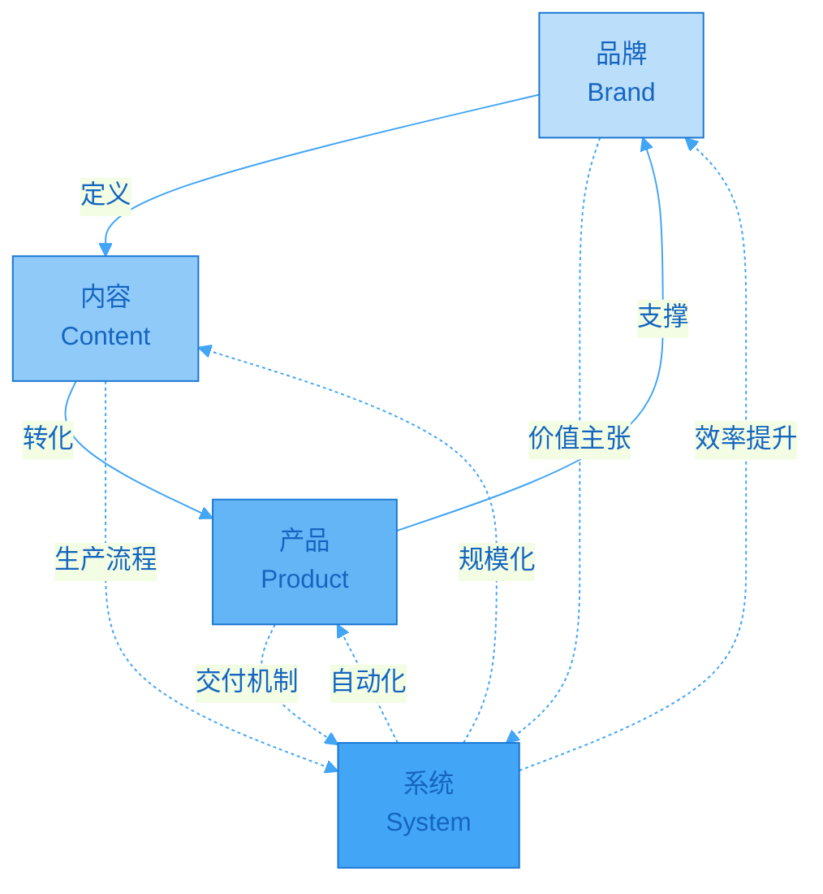
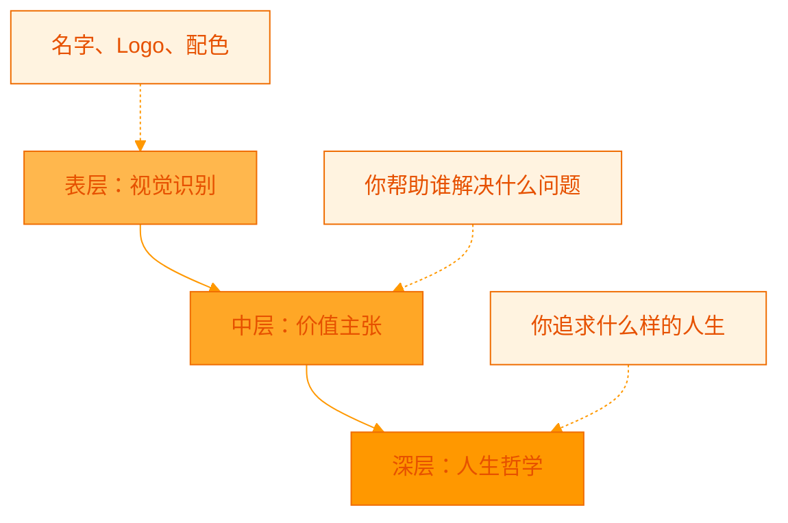
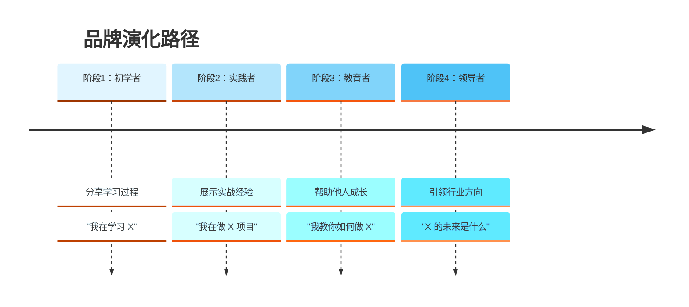
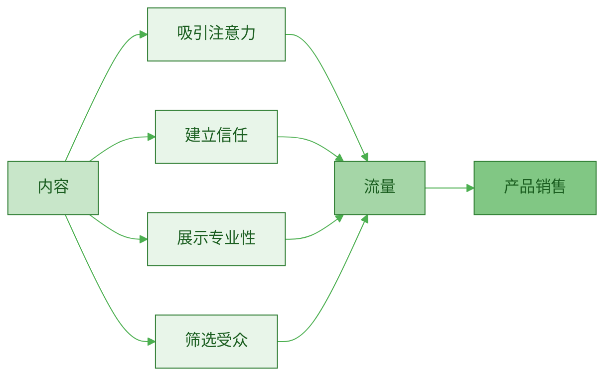
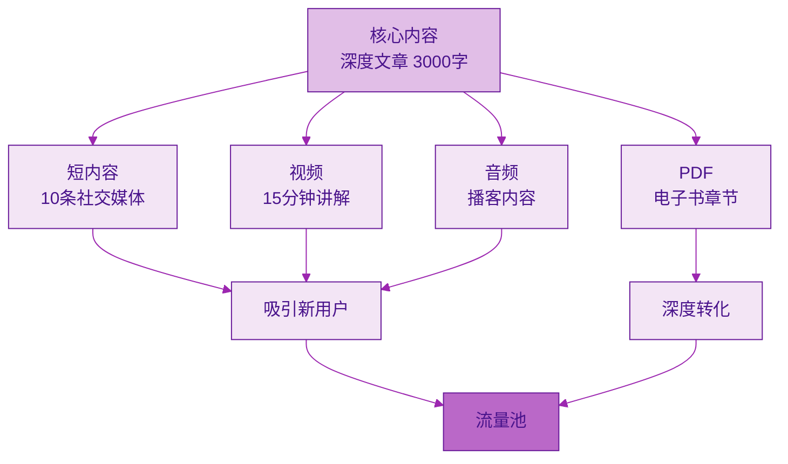
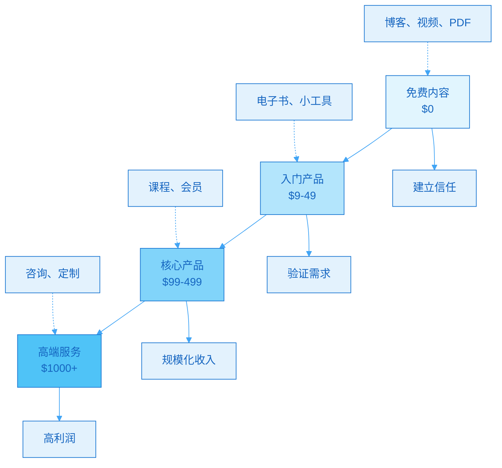
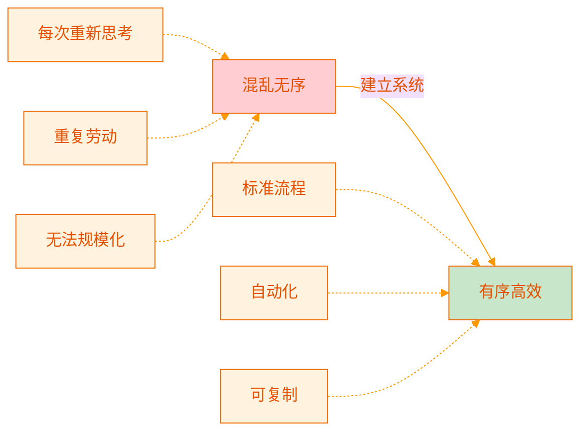
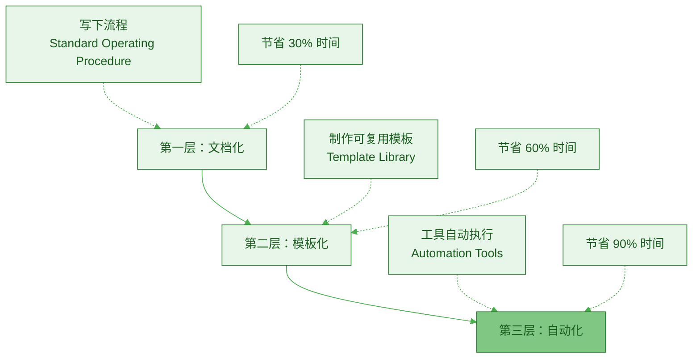
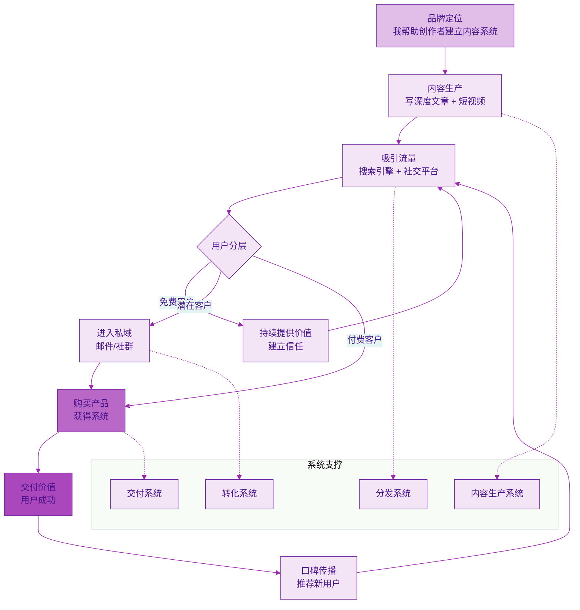

> [!quote] Dan Koe 的核心框架
> "品牌：你做什么（提高生活质量的事情）。
> 产品：你如何做到这一点（你用来为自己获得更好结果的系统、方法或流程）。
> 营销：你为什么这样做（向人们解释为什么他们应该关心）。"
> ——来自 [[3. MDFriday 实战记录/03.网站/Dan Koe/视频笔记/6|产品构建系统]]

## 一人公司的四大支柱

如果你问：**一人公司最重要的是什么？**

答案不是某一个单一要素，而是一个**相互依存的系统**：

> [!important] 四大支柱
> 
> 1. **品牌（Brand）**：你是谁？你的目标是什么？
> 2. **内容（Content）**：你如何展示价值？
> 3. **产品（Product）**：你提供什么解决方案？
> 4. **系统（System）**：你如何高效运作？

## 第一支柱：品牌（Brand）

### 什么是品牌？

> [!tip] 品牌的本质
> **品牌不是 Logo，不是颜色，不是设计。**
> 
> 品牌是：
> - 你代表什么？
> - 你帮助谁？
> - 你追求什么样的生活？
> - 你解决什么问题？

参考 [[3. MDFriday 实战记录/03.网站/Dan Koe/视频笔记/9|最赚钱的细分市场就是你]]：

> [!quote] 你就是品牌
> "最赚钱的细分市场就是**你自己**。你不应盲目选择'利润最高的市场'，而是应该围绕自己的兴趣、经验和价值观建立领域。"

### 品牌的三个层次

| 层次 | 内容 | 示例 |
|-----|------|------|
| **表层** | 视觉识别 | 名字、Logo、个人网站 |
| **中层** | 价值主张 | 帮助创作者建立内容系统 |
| **深层** | 人生哲学 | 追求自由、创造、贡献 |

> [!success] 品牌建设的关键
> **真实 > 完美**
> 
> 不要伪装成你不是的人。
> 你的品牌就是**你的人生故事 + 你的理想未来**。

### 品牌的演化

品牌不是一成不变的，而是随着你的成长而演化：

## 第二支柱：内容（Content）

### 内容的作用

参考 [[3. MDFriday 实战记录/03.网站/Dan Koe/视频笔记/14|一人商业的未来]]：

> [!quote] 内容是公立学校
> "将社交媒体视为**数字房地产和公立学校**，这是一个知识库，涵盖你人生中所有的想法、信念、观点和经验教训。"

### 内容的三种类型

| 类型 | 目的 | 形式 | 频率 |
|-----|------|------|------|
| **吸引型** | 获取关注 | 短视频、金句、热点 | 每天 |
| **教育型** | 建立信任 | 深度文章、教程 | 每周 |
| **转化型** | 促成销售 | 案例、见证、方案 | 每月 |

> [!tip] 内容策略
> 
> **80% 给予价值，20% 引导转化**
> 
> - 短内容（吸引） → 长内容（教育） → 产品页面（转化）
> - 免费内容展示"是什么"和"为什么"
> - 付费产品提供"怎么做"的系统

### 内容生产模型

参考 [[../07.长文高效复用/a.3000字到10条短内容|3000字到10条短内容]]，一次创作，多次复用。

## 第三支柱：产品（Product）

### 产品的本质

> [!important] 产品 = 系统化的解决方案
> 
> **不是卖时间，而是卖系统。**
> 
> - ❌ 一对一咨询（卖时间）
> - ✅ 标准化课程（卖系统）

参考 [[3. MDFriday 实战记录/03.网站/Dan Koe/视频笔记/11|自我变现]]：

> [!quote] 你就是利基
> "解决你自己的问题，然后出售解决方案，实现**自我提升和他人提升**的结合。"

### 产品阶梯

### 产品开发路径

| 阶段 | 产品形式 | 特点 | 目标 |
|-----|---------|------|------|
| **1. 验证** | 一对一服务 | 定制化、高价 | 验证需求、积累案例 |
| **2. 标准化** | 小组辅导 | 半标准化 | 提炼方法、增加收入 |
| **3. 产品化** | 在线课程 | 完全标准化 | 规模化、自动化 |
| **4. 生态化** | 多层次产品 | 满足不同需求 | 最大化价值 |

> [!check] 产品开发原则
> 
> 1. **从服务开始**：先做咨询/服务，积累经验
> 2. **提炼方法**：总结成可复制的系统
> 3. **打包产品**：变成课程/电子书/工具
> 4. **持续迭代**：根据反馈优化

## 第四支柱：系统（System）

### 为什么需要系统？

> [!danger] 没有系统的问题
> 
> - 每次都要重新开始
> - 无法规模化
> - 容易出错
> - 很难委托
> - 效率低下

### 系统的价值

### 一人公司的核心系统

| 系统类型 | 作用 | 工具示例 |
|---------|------|----------|
| **内容生产系统** | 高效创作、复用 | [[2. 一人公司实操手册/02.MDFriday 使用指南/\|MDFriday]] |
| **内容分发系统** | 一键发布到多平台 | RSS、自动化工具 |
| **客户管理系统** | 管理用户关系 | 邮件系统、CRM |
| **产品交付系统** | 自动化交付 | 会员系统、课程平台 |
| **财务系统** | 收支管理 | 记账软件 |

参考 [[../14.内容操作系统的构建/a.多设备同步写作|多设备同步写作]]和[[../14.内容操作系统的构建/b.发布自动化|发布自动化]]。

### 系统化的三个层次

## 四大支柱如何协同工作？

### 完整流程

### 实际案例

> [!example] 案例：一人公司创作者的完整模型
> 
> **品牌定位**：
> - 帮助程序员建立个人品牌
> - 从打工人到自由职业者
> 
> **内容策略**：
> - 每周 1 篇深度文章（3000字）
> - 拆分成 10 条短内容
> - 录制 1 个视频
> 
> **产品阶梯**：
> - 免费：博客文章、Newsletter
> - $49：《程序员个人品牌指南》电子书
> - $199：《30天建站课程》
> - $999：一对一咨询（2小时）
> 
> **系统支撑**：
> - 用 MDFriday 写作和发布
> - 自动化分发到各平台
> - 邮件系统自动跟进
> - 课程平台自动交付

## 如何构建你的四大支柱？

### 第一步：明确品牌定位

> [!check] 回答这些问题
> 
> 1. **你是谁？**
>    - 你的背景、技能、兴趣
>    - 你经历过什么？
> 
> 2. **你帮助谁？**
>    - 你的理想用户是谁？
>    - 他们有什么问题？
> 
> 3. **你提供什么价值？**
>    - 你能解决什么问题？
>    - 你能带来什么改变？
> 
> 4. **你追求什么？**
>    - 你的人生目标是什么？
>    - 你想要什么样的生活？

**公式**：我帮助 [目标用户] 通过 [你的方法] 实现 [期望结果]

**示例**：
- 我帮助**创作者**通过**建立内容系统**实现**持续产出和变现**
- 我帮助**程序员**通过**个人品牌**实现**自由职业**

### 第二步：建立内容系统

> [!check] 内容规划
> 
> 1. **确定 3-5 个核心主题**
>    - 围绕你的品牌定位
>    - 你最擅长什么？
> 
> 2. **建立内容主题库**
>    - 每个主题下 20-30 个话题
>    - 形成知识网络
> 
> 3. **设计创作流程**
>    - 每周写 1 篇深度文章
>    - 复用成 10+ 条短内容
>    - 建立自己的网站作为中心
> 
> 4. **搭建分发系统**
>    - 使用 [[2. 一人公司实操手册/02.MDFriday 使用指南/|MDFriday]]
>    - 一键发布到网站
>    - 自动同步到各平台

### 第三步：开发产品

> [!check] 产品开发路线
> 
> **月 1-2：验证阶段**
> - [ ] 提供 5 次免费咨询
> - [ ] 记录最常见的问题
> - [ ] 总结解决方案
> 
> **月 3-4：标准化**
> - [ ] 提炼出核心方法
> - [ ] 制作标准流程
> - [ ] 开始收费（$500-1000）
> 
> **月 5-6：产品化**
> - [ ] 将方法打包成课程
> - [ ] 录制教学视频
> - [ ] 制作配套资料
> 
> **月 7-12：规模化**
> - [ ] 建立产品阶梯
> - [ ] 优化转化路径
> - [ ] 实现自动化交付

### 第四步：系统化运营

> [!check] 系统搭建
> 
> 1. **文档化所有流程**
>    - 写作流程
>    - 发布流程
>    - 客户服务流程
>    - 产品交付流程
> 
> 2. **制作模板库**
>    - 文章大纲模板
>    - 邮件模板
>    - 销售页面模板
>    - 话术模板
> 
> 3. **工具自动化**
>    - 内容发布自动化
>    - 邮件跟进自动化
>    - 产品交付自动化
>    - 数据统计自动化

## 常见误区

### 误区 1：只关注某一个支柱

> [!warning] 典型问题
> 
> - **只做内容，没有产品** → 有流量无收入
> - **只做产品，没有内容** → 有产品无流量
> - **只做品牌，没有系统** → 很累但无法规模化

> [!success] 正确做法
> **四大支柱必须同时构建，相互支撑。**

### 误区 2：追求完美才开始

> [!warning] 拖延陷阱
> "等我准备好了再开始"
> "等我的系统完美了再推出"

> [!success] 正确做法
> **从最小可行版本（MVP）开始，边做边优化。**
> 
> - 品牌：先有一个基础定位，边做边明确
> - 内容：先写第一篇，再考虑完美
> - 产品：先做咨询，再做课程
> - 系统：先文档化，再自动化

### 误区 3：模仿别人的模型

> [!warning] 复制陷阱
> "看到某个大V很成功，我完全复制他的模式"

> [!success] 正确做法
> **学习框架，而不是复制表面。**
> 
> 参考 [[3. MDFriday 实战记录/03.网站/Dan Koe/视频笔记/9|最赚钱的细分市场就是你]]：
> 
> "你不应盲目选择'利润最高的市场'，而是应该围绕自己的兴趣、经验和价值观建立领域。"

## 总结

> [!quote] 一人公司的本质
> "一人公司不是做所有的事，而是建立一个让你只做最重要的事的系统。"

### 四大支柱的关系

| 支柱 | 核心问题 | 输出 |
|-----|---------|------|
| **品牌** | 你是谁？你代表什么？ | 定位、价值观 |
| **内容** | 你如何展示价值？ | 文章、视频、社交 |
| **产品** | 你提供什么解决方案？ | 课程、服务、工具 |
| **系统** | 你如何高效运作？ | 流程、工具、自动化 |

### 行动清单

> [!important] 本周就开始
> 
> **Day 1-2**：品牌定位
> - [ ] 写下你的品牌定位（用公式）
> - [ ] 明确你的目标用户
> 
> **Day 3-4**：内容规划
> - [ ] 列出 3-5 个核心主题
> - [ ] 规划第一个月的内容
> 
> **Day 5-6**：产品构思
> - [ ] 确定你的第一个产品形式
> - [ ] 设计产品阶梯
> 
> **Day 7**：系统搭建
> - [ ] 使用 MDFriday 建立网站
> - [ ] 写第一篇深度文章

### 下一步阅读

- [[b.杠杆与可复制性|杠杆与可复制性]]
- [[c.时间复利逻辑|时间复利逻辑]]
- [[../04.内容就是资产/a.短内容的局限|短内容的局限]]

---

**一人公司的成功，取决于你能否建立一个可持续、可规模化的四大支柱系统。**
