> [!quote] Dan Koe 的洞察
> "收入最高的人是**通才**，他们雇佣专家。专业化（只出售一项技能）容易被自动化取代。"
> ——来自 [[3. MDFriday 实战记录/03.网站/Dan Koe/视频笔记/25|一人商业模式完整指南]]

## 为什么有人越来越忙，有人越来越自由？

同样是一人公司，为什么会有如此大的差异？

### 两种模式对比

> [!example] 创作者 A（线性模式）
> 
> - 每天工作 8 小时
> - 月收入 2 万
> - 停止工作就停止收入
> - 感到疲惫，看不到未来

> [!example] 创作者 B（杠杆模式）
> 
> - 每天工作 4 小时
> - 月收入 10 万
> - 睡觉时也有收入
> - 持续增长，时间自由

**差别在哪里？**

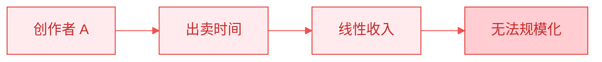

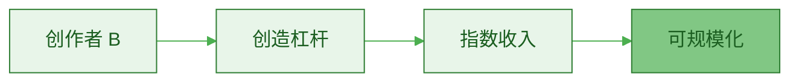

**核心差异：是否拥有杠杆。**

## 什么是杠杆？

### 杠杆的定义

> [!tip] 杠杆的本质
> **用更少的投入，获得更大的产出。**
> 
> - 一次努力，多次收益
> - 小投入，大回报
> - 时间投资，而非时间消耗

### 传统杠杆 vs 现代杠杆

| 类型 | 传统杠杆 | 现代杠杆 |
|-----|---------|---------|
| **资本** | 需要大量资金 | 需要一台电脑 |
| **人力** | 需要雇佣员工 | 需要工具和系统 |
| **时间** | 线性增长 | 指数增长 |
| **风险** | 高 | 低 |
| **门槛** | 高 | 低 |

> [!success] 一人公司的优势
> **在互联网时代，个人可以用极低的成本获得巨大的杠杆。**

## 四种杠杆类型

参考 Naval Ravikant 的杠杆理论和 Dan Koe 的实践经验：

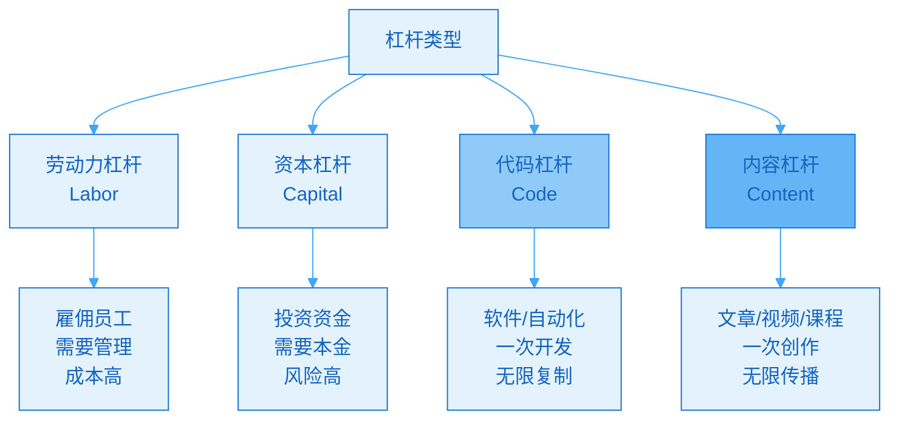

### 1. 劳动力杠杆（Labor Leverage）

**原理**：让别人帮你工作

| 优势 | 劣势 |
|-----|------|
| ✅ 可以快速扩展 | ❌ 需要管理能力 |
| ✅ 可以分工协作 | ❌ 人力成本高 |
| | ❌ 不适合一人公司 |

> [!warning] 对一人公司不适用
> 一人公司的目标是**少雇人或不雇人**，专注于其他杠杆。

### 2. 资本杠杆（Capital Leverage）

**原理**：用钱生钱

| 优势 | 劣势 |
|-----|------|
| ✅ 可以快速扩张 | ❌ 需要本金 |
| ✅ 被动收入 | ❌ 有风险 |
| | ❌ 初期不适合 |

> [!tip] 一人公司的策略
> 先用代码和内容杠杆赚钱，再考虑资本杠杆。

### 3. 代码杠杆（Code Leverage）

**原理**：让软件/自动化为你工作

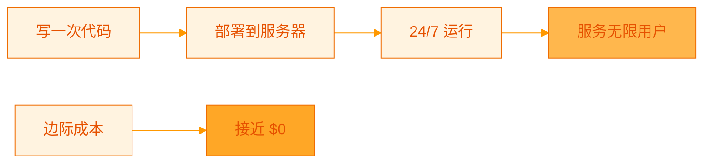

| 优势 | 劣势 |
|-----|------|
| ✅ 一次开发，无限复制 | ❌ 需要技术能力 |
| ✅ 边际成本趋近于零 | ❌ 初期投入大 |
| ✅ 可以24/7工作 | |
| ✅ 可以同时服务无限用户 | |

**示例**：
- SaaS 软件
- 自动化工具
- AI 机器人
- 网站/平台

> [!example] MDFriday 的代码杠杆
> 
> [[2. 一人公司实操手册/02.MDFriday 使用指南/|MDFriday]] 就是代码杠杆的典型应用：
> - 一次开发
> - 服务无限创作者
> - 自动同步、发布
> - 24/7 不间断工作

### 4. 内容杠杆（Content/Media Leverage）

**原理**：让内容为你工作

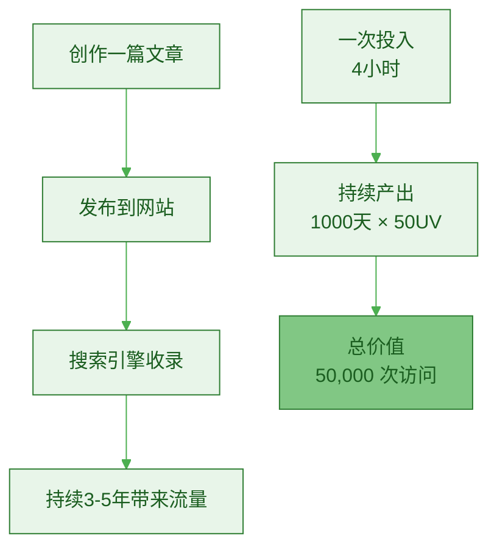

| 优势 | 劣势 |
|-----|------|
| ✅ 零边际成本 | ⚠️ 需要时间积累 |
| ✅ 不需要技术能力 | ⚠️ 需要持续创作 |
| ✅ 可以同时触达无限人 | |
| ✅ 睡觉时也在工作 | |
| ✅ 建立个人品牌 | |

**示例**：
- 博客文章
- YouTube 视频
- 播客
- 电子书
- 在线课程

> [!important] 一人公司的最佳杠杆
> **内容杠杆是一人公司最容易获得、最具性价比的杠杆。**
> 
> 参考 [[3. MDFriday 实战记录/03.网站/Dan Koe/视频笔记/19|写作：每天两小时赚取 80 万美元的技能]]

## 内容杠杆的力量

### 案例分析：一篇文章的杠杆效应

> [!example] 真实数据
> 
> **投入**：
> - 时间：4 小时写作 + 1 小时发布 = 5 小时
> - 成本：几乎为 0
> 
> **产出（3 年内）**：
> - 日均流量：50 UV
> - 总流量：50 × 365 × 3 = 54,750 次访问
> - 转化率：2%
> - 邮件订阅：1,095 人
> - 产品购买（假设转化率 5%）：54 人
> - 收入（假设客单价 $200）：$10,800
> 
> **杠杆倍数**：
> - 时间杠杆：1 次创作 → 1095 天工作
> - 收益杠杆：5 小时 → $10,800
> - 每小时价值：$2,160

### 内容杠杆的复利效应

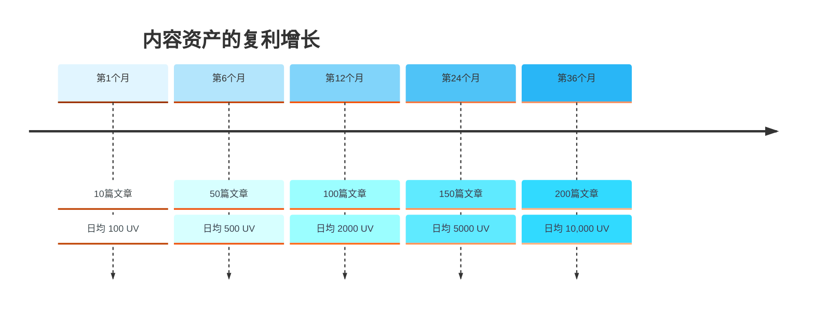

> [!success] 复利的威力
> **每篇文章不仅独立带来流量，还通过内部链接、SEO权重提升整个网站的价值。**

## 如何构建杠杆？

### 第一步：识别你的核心价值

> [!check] 自我诊断
> 
> **问自己**：
> 1. 我最擅长什么？
> 2. 我能解决什么问题？
> 3. 哪些知识/经验是我独有的？
> 4. 我能教会别人什么？

**公式**：杠杆 = 你的独特价值 × 可复制性

### 第二步：选择合适的杠杆类型

| 你的情况 | 推荐杠杆 |
|---------|---------|
| **有技术背景** | 代码 + 内容 |
| **无技术背景** | 内容为主 |
| **有资金** | 内容 + 资本 |
| **时间有限** | 先内容，后代码 |

> [!tip] 组合策略
> **最强杠杆 = 内容 + 代码**
> 
> - 用内容建立影响力
> - 用代码规模化服务
> 
> 例如：
> - 写文章教写作（内容）
> - 开发写作工具（代码）
> - 两者相互促进

### 第三步：设计可复制的系统

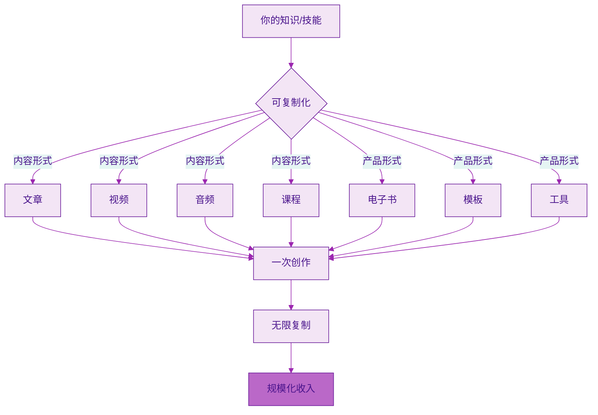

## 可复制性的三个层次

### 层次 1：一对一（无杠杆）

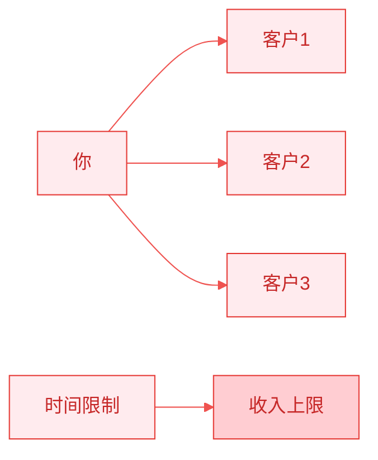

**特征**：
- ❌ 每个客户都要单独服务
- ❌ 时间 = 金钱
- ❌ 无法规模化
- ❌ 收入有上限

**例子**：一对一咨询、定制服务

### 层次 2：一对多（小杠杆）

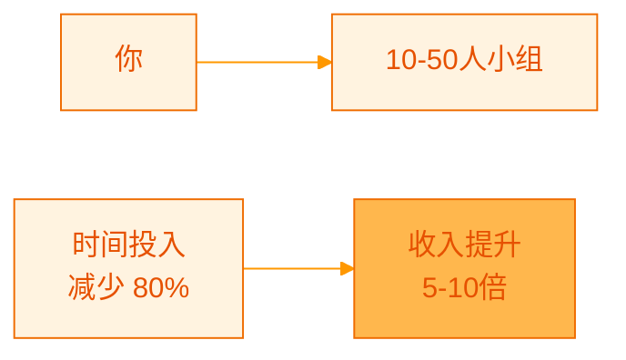

**特征**：
- ✅ 同时服务多人
- ✅ 收入增加
- ⚠️ 仍需要你的时间
- ⚠️ 规模有限

**例子**：小组辅导、Workshop

### 层次 3：一对无限（大杠杆）

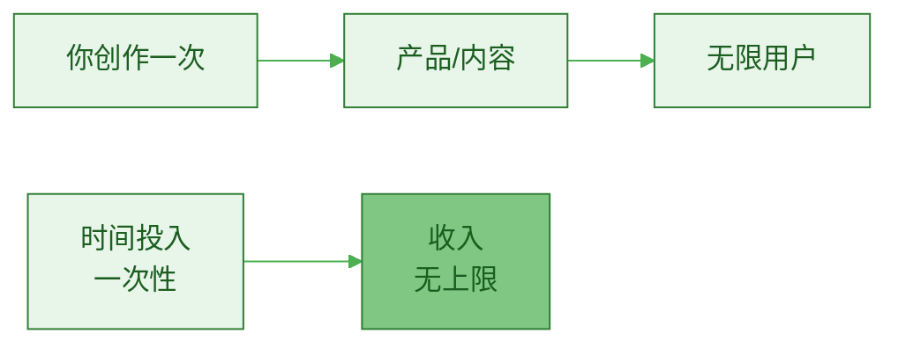

**特征**：
- ✅ 一次创作，无限复制
- ✅ 边际成本趋近于零
- ✅ 可以同时服务无限人
- ✅ 睡觉时也在赚钱

**例子**：
- 在线课程
- 电子书
- 会员内容
- SaaS 软件

> [!important] 目标
> **从层次 1 逐步过渡到层次 3。**

## 构建杠杆的实战路径

### 第一阶段：服务期（0-3个月）

> [!check] 目标：验证需求，积累经验
> 
> **做什么**：
> - 提供一对一服务/咨询
> - 收费：$500-1000
> - 服务：5-10 个客户
> 
> **收获什么**：
> - 发现最常见的问题
> - 提炼解决方案
> - 获得案例和反馈
> - 初步收入

### 第二阶段：标准化期（3-6个月）

> [!check] 目标：提炼方法，小规模复制
> 
> **做什么**：
> - 总结成标准流程/方法论
> - 制作 SOP（标准操作程序）
> - 开始小组辅导（5-10人）
> - 记录常见问题的答案
> 
> **收获什么**：
> - 可复用的内容
> - 更多案例
> - 收入增加 3-5 倍

### 第三阶段：产品化期（6-12个月）

> [!check] 目标：打造可规模化产品
> 
> **做什么**：
> - 将方法打包成在线课程
> - 录制视频教学
> - 编写电子书/手册
> - 建立会员内容库
> 
> **收获什么**：
> - 可无限复制的产品
> - 被动收入开始出现
> - 时间自由度提升

### 第四阶段：规模化期（12个月+）

> [!check] 目标：建立完整的杠杆系统
> 
> **做什么**：
> - 多层次产品矩阵
> - 自动化营销和交付
> - 持续优化和迭代
> - 建立代码杠杆（工具）
> 
> **收获什么**：
> - 指数级收入增长
> - 真正的时间自由
> - 可持续的商业模式

## 杠杆组合策略

### 内容 + 产品杠杆

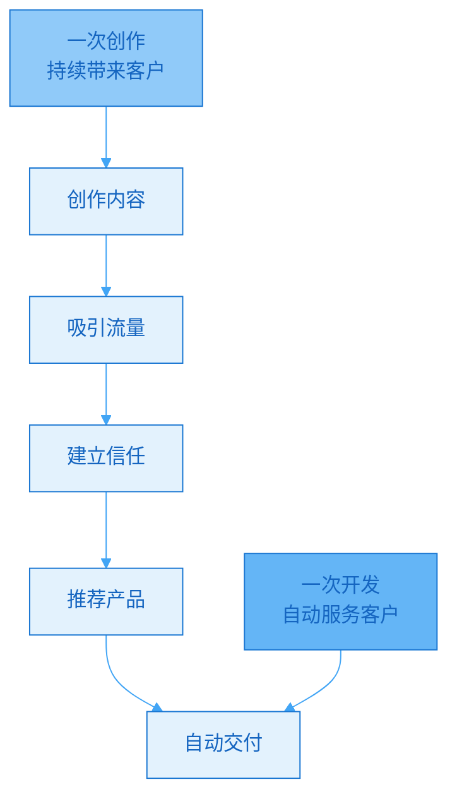

> [!example] 实战案例
> 
> **内容杠杆**：
> - 每周写 1 篇深度文章
> - 发布到个人网站
> - 3 年积累 150 篇
> - 日均 5000 UV
> 
> **产品杠杆**：
> - 在线课程：$199
> - 会员订阅：$99/月
> - 电子书：$49
> 
> **转化路径**：
> 文章 → 邮件列表 → 产品页面 → 自动交付
> 
> **结果**：
> - 月收入 10 万+
> - 工作时间每周 15 小时
> - 被动收入占 70%

### 内容 + 代码杠杆

> [!example] 更强组合
> 
> **内容杠杆**：
> - 教人如何做X
> - 建立影响力
> - 吸引目标用户
> 
> **代码杠杆**：
> - 开发工具帮助做X
> - 自动化服务
> - 规模化盈利
> 
> **协同效应**：
> - 内容带来用户
> - 工具留住用户
> - 用户反馈改进内容和工具
> - 形成正向循环

## 常见误区

### 误区 1：追求完美才发布

> [!warning] 拖延陷阱
> "等我的课程完美了再发布"
> "等我的工具完善了再推广"

> [!success] 正确做法
> **发布 MVP（最小可行产品），边做边优化。**
> 
> 参考 [[3. MDFriday 实战记录/01.实战日志/03-MVP 之后|MVP 之后]]：
> - 先推出基础版
> - 收集反馈
> - 快速迭代
> - 逐步完善

### 误区 2：什么都想做

> [!warning] 分散精力
> "我要做课程、电子书、咨询、软件..."

> [!success] 正确做法
> **聚焦一个杠杆，做到极致，再拓展。**
> 
> **第1年**：专注内容杠杆
> **第2年**：加入产品杠杆
> **第3年**：考虑代码杠杆

### 误区 3：忽视质量

> [!warning] 数量陷阱
> "我要每天发10条内容"
> "我要快速推出100个产品"

> [!success] 正确做法
> **质量 > 数量**
> 
> - 1 篇深度文章 > 10 条浅薄内容
> - 1 个精品课程 > 10 个粗制滥造的产品
> 
> **高质量内容才有长期杠杆效应。**

## 行动指南

### 第一周：评估现状

> [!check] 自我诊断
> 
> - [ ] 我现在有哪些杠杆？
> - [ ] 我的收入模式是线性还是指数？
> - [ ] 我的时间投入和产出比是多少？
> - [ ] 哪些工作可以一次完成，多次收益？

### 第一个月：建立第一个杠杆

> [!check] 行动清单
> 
> **选择一个方向**：
> - [ ] 如果有技术能力 → 开发工具
> - [ ] 如果善于表达 → 创作内容
> - [ ] 如果经验丰富 → 打包产品
> 
> **立即行动**：
> - [ ] 写第一篇深度文章
> - [ ] 或录制第一个教学视频
> - [ ] 或开发第一个小工具原型
> 
> **建立系统**：
> - [ ] 使用 [[2. 一人公司实操手册/02.MDFriday 使用指南/|MDFriday]] 搭建网站
> - [ ] 设计内容发布流程
> - [ ] 规划产品开发路线

### 前 6 个月：构建杠杆基础

| 月份 | 重点 | 具体行动 |
|-----|------|---------|
| **1-2月** | 内容积累 | 每周 1 篇深度文章，共 8 篇 |
| **3-4月** | 服务验证 | 提供咨询，积累案例 |
| **5-6月** | 产品化 | 开发第一个数字产品 |

### 第一年：实现杠杆突破

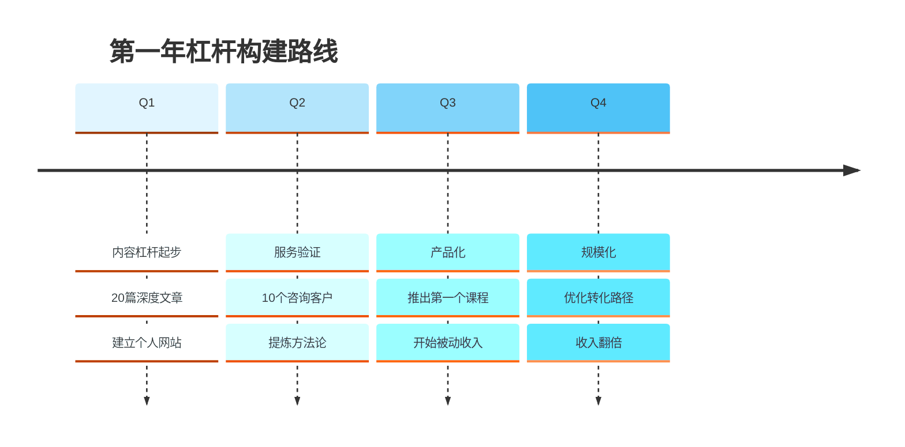

## 总结

> [!quote] 杠杆的本质
> "不要用时间换金钱，要用系统换金钱。
> 
> 不要只做一次性的工作，要创造可复用的资产。
> 
> 这就是杠杆的力量。"

### 杠杆对比

| | 无杠杆 | 有杠杆 |
|--|--------|--------|
| **收入模式** | 线性 | 指数 |
| **时间关系** | 时间 = 金钱 | 时间 ≠ 金钱 |
| **工作方式** | 重复劳动 | 一次创造，多次收益 |
| **收入上限** | 有限 | 无限 |
| **自由度** | 低 | 高 |
| **可持续性** | 停止就停止 | 持续产生 |

### 核心要点

> [!important] 记住这三点
> 
> 1. **内容杠杆是一人公司的最佳起点**
>    - 门槛低，成本低
>    - 效果持久，可复利
> 
> 2. **从服务到产品，逐步构建杠杆**
>    - 先验证，再规模化
>    - 先一对一，再一对多，最后一对无限
> 
> 3. **杠杆 = 价值 × 可复制性**
>    - 提升价值：深度、独特性
>    - 提升可复制性：系统化、产品化

### 下一步阅读

- [[c.时间复利逻辑|时间复利逻辑]]
- [[../04.内容就是资产/b.长文作为知识数据库|长文作为知识数据库]]
- [[../11.内容产品化路径/a.电子书|电子书]]

---

**停止出卖时间，开始构建杠杆。你的未来自由，取决于今天的选择。**
