> [!quote] 爱因斯坦说
> "复利是世界第八大奇迹。理解它的人赚取它，不理解它的人支付它。"

> [!quote] Dan Koe 的洞察
> "真正的'最快路径'是选择**最长的道路并坚持走完**，而不是频繁尝试不同的短线策略。"
> ——来自 [[3. MDFriday 实战记录/03.网站/Dan Koe/视频笔记/15|最赚钱的商业模式]]

## 两个创作者的故事

### 创作者 A：追逐风口

> [!example] 3 年的轨迹
> 
> **2023年**：
> - 做短视频，追热点
> - 每天 10 条，很累
> - 粉丝 5 万，但流量不稳定
> 
> **2024年**：
> - 听说 AI 赚钱，转做 AI 教程
> - 重新开始，粉丝归零
> - 又积累到 3 万粉丝
> 
> **2025年**：
> - 看到直播带货火，又转型
> - 再次从零开始
> - 累积 2 万粉丝
> 
> **2026年**：
> - 仍在寻找下一个风口
> - 感到疲惫和迷茫
> - 收入不稳定，无资产积累

### 创作者 B：长期主义

> [!example] 3 年的积累
> 
> **2023年**：
> - 选定方向：帮助创作者建立内容系统
> - 每周写 1 篇深度文章
> - 50 篇文章，网站日均 200 UV
> - 开始有咨询收入
> 
> **2024年**：
> - 持续深耕同一领域
> - 再写 50 篇文章（累计 100 篇）
> - 网站日均 2000 UV
> - 推出第一个课程，月收入 3 万
> 
> **2025年**：
> - 继续积累（累计 150 篇文章）
> - 网站日均 5000 UV
> - 多层次产品，月收入 10 万
> - 老文章持续带来流量和转化
> 
> **2026年**：
> - 内容资产持续增值
> - 被动收入占 70%
> - 时间自由，可以选择做什么

**差别在哪里？**

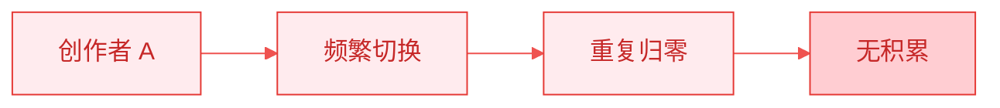


## 什么是时间复利？

### 复利的基本概念

**简单利息**：只对本金计息
**复利**：对本金和利息都计息

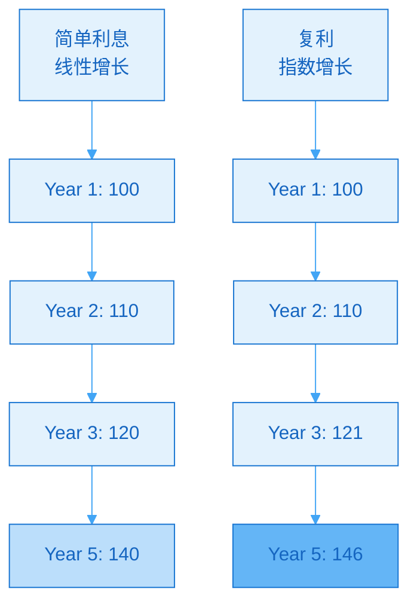

> [!tip] 时间复利的本质
> **今天的积累，成为明天的基础。**
> 
> 明天的增长，不仅来自明天的努力，更来自今天的积累。

### 一人公司的三种复利

| 复利类型 | 说明 | 示例 |
|---------|------|------|
| **内容复利** | 内容持续带来流量 | 一篇文章 3 年带来 5 万访问 |
| **信任复利** | 信任累积促进转化 | 读100篇文章的人更愿意付费 |
| **技能复利** | 技能积累提升效率 | 写第 100 篇比第 1 篇快 3 倍 |

## 内容复利

### 内容的长尾效应

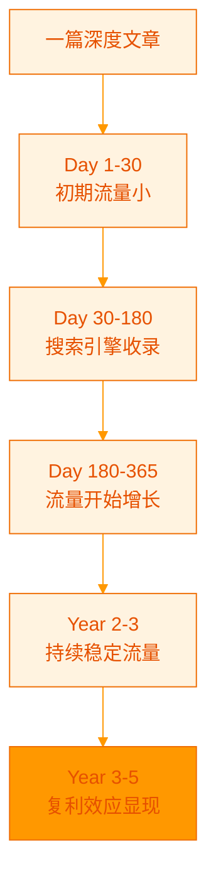

> [!example] 真实数据
> 
> **一篇优质文章的生命周期**：
> 
> | 时间 | 日均流量 | 累计流量 |
> |-----|---------|---------|
> | 第 1 个月 | 5 UV | 150 |
> | 第 6 个月 | 20 UV | 3,000 |
> | 第 12 个月 | 50 UV | 15,000 |
> | 第 24 个月 | 50 UV | 33,000 |
> | 第 36 个月 | 50 UV | 51,000 |
> 
> **投入**：4 小时
> **产出**：51,000 次访问
> **时间杠杆**：12,750 倍

### 内容之间的网络效应

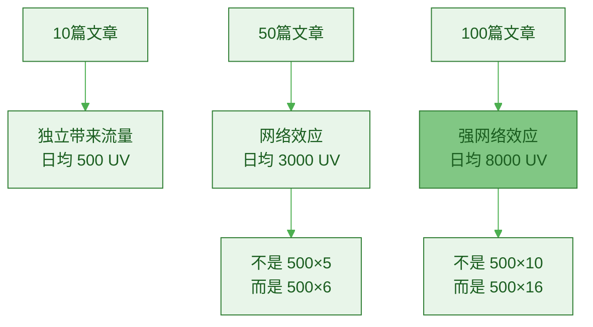

> [!success] 网络效应的威力
> **文章数量越多，单篇文章的价值越大。**
> 
> 原因：
> 1. **内部链接**：读者从一篇跳到另一篇
> 2. **SEO权重**：整站权重提升
> 3. **品牌效应**：内容越多越专业
> 4. **主题权威**：Google 认为你是该领域专家

### 内容复利的增长曲线

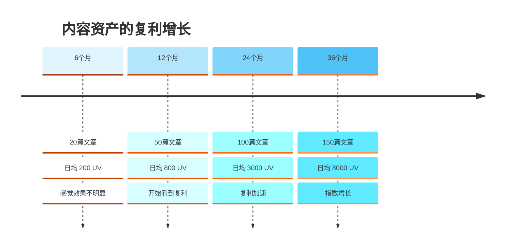

> [!important] 关键转折点
> **通常在 12-18 个月出现复利转折点。**
> 
> 这就是为什么大多数人放弃了——他们在复利爆发之前就停止了。

## 信任复利

### 信任的积累过程

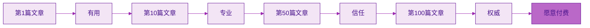

### 信任与转化率的关系

| 接触程度 | 信任等级 | 转化率 | 客单价接受度 |
|---------|---------|--------|------------|
| **首次接触** | 陌生 | 0.5% | $0-9 |
| **读过 1-3 篇** | 认识 | 1% | $9-49 |
| **读过 10+ 篇** | 信任 | 3-5% | $49-199 |
| **读过 50+ 篇** | 粉丝 | 10%+ | $199-999 |
| **长期读者** | 铁粉 | 20%+ | $999+ |

> [!example] 真实案例
> 
> **创作者 C 的数据**：
> 
> **2023年**（30篇文章）：
> - 邮件列表 500 人
> - 推出 $199 课程
> - 转化率 2%，销售 10 份
> - 收入 $1,990
> 
> **2025年**（100篇文章）：
> - 邮件列表 3000 人
> - 推出 $199 课程
> - 转化率 8%，销售 240 份
> - 收入 $47,760
> 
> **为什么转化率从 2% 提升到 8%？**
> - 用户读过更多文章
> - 信任度大幅提升
> - 愿意支付更高价格

### 信任复利的时间线

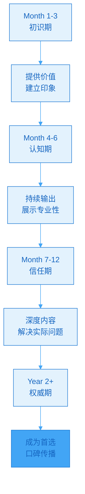

## 技能复利

### 技能的学习曲线

参考 [[3. MDFriday 实战记录/03.网站/Dan Koe/purpose-profit/05-deep-generalism|深度通才主义]]：

> [!quote] 持续进化
> "你的工作必须每年至少改变一次。你在进化。你的兴趣在进化。一旦解决了以前的问题，你就会发现新的问题。"


### 技能复利的表现

| 技能 | 初期 | 6个月后 | 1年后 | 2年后 |
|-----|------|---------|-------|-------|
| **写作速度** | 500字/小时 | 1000字/小时 | 1500字/小时 | 2000字/小时 |
| **内容质量** | 60分 | 75分 | 85分 | 90分 |
| **选题能力** | 2小时构思 | 30分钟构思 | 10分钟构思 | 5分钟构思 |
| **SEO优化** | 不了解 | 基础了解 | 熟练 | 精通 |

> [!success] 技能复利的威力
> **同样创作 1 篇文章**：
> - 初期：8 小时，质量 60 分
> - 2 年后：2 小时，质量 90 分
> 
> **效率提升 4 倍，质量提升 50%**

## 复利的三大要素

### 要素 1：时间（Time）

> [!important] 时间是复利的朋友
> 
> **最重要的不是速度，而是持续。**

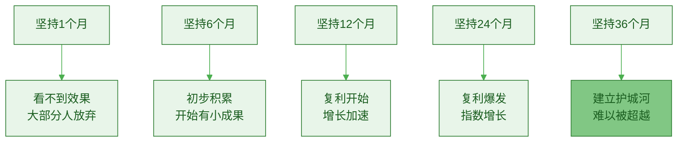

### 要素 2：利率（Rate）

> [!tip] 提高"利率"的方法
> 
> **内容的"利率" = 内容质量 × SEO优化 × 持久性**
> 
> 提升策略：
> 1. **提高质量**：深度 > 浅薄
> 2. **优化SEO**：关键词、内部链接
> 3. **选择永恒话题**：3年后仍有价值

| 内容类型 | 年化"利率" | 说明 |
|---------|-----------|------|
| **追热点** | -50% | 衰减快，价值归零 |
| **浅薄内容** | 5% | 价值低，增长慢 |
| **中等质量** | 15% | 稳定增长 |
| **高质量+SEO** | 30% | 快速复利 |
| **顶级内容** | 50%+ | 指数增长 |

> [!success] 高"利率"内容特征
> - 深度解决问题
> - 永恒的话题
> - 系统化的知识
> - SEO 优化良好
> - 可读性强

### 要素 3：本金（Principal）

> [!important] 本金 = 你的初始投入
> 
> **不是钱，而是时间和努力。**

**最小本金**：
- 每周 4-6 小时（写 1 篇文章）
- 持续 52 周
- 总投入：208-312 小时
- 产出：52 篇深度文章

**标准本金**：
- 每周 8-10 小时
- 持续 52 周
- 总投入：416-520 小时
- 产出：52 篇文章 + 系统建设

## 复利的数学模型

### 复利公式

```
最终价值 = 初始价值 × (1 + 增长率)^时间
```

### 实际案例计算

> [!example] 创作者的复利增长
> 
> **假设**：
> - 初始流量：100 UV/天
> - 月增长率：10%（每月增加10%）
> - 时间：36 个月
> 
> **计算**：
> - 12 个月后：100 × (1+0.1)^12 = 314 UV/天
> - 24 个月后：100 × (1+0.1)^24 = 985 UV/天
> - 36 个月后：100 × (1+0.1)^36 = 3,091 UV/天
> 
> **30 倍增长！**

### 不同增长率的对比

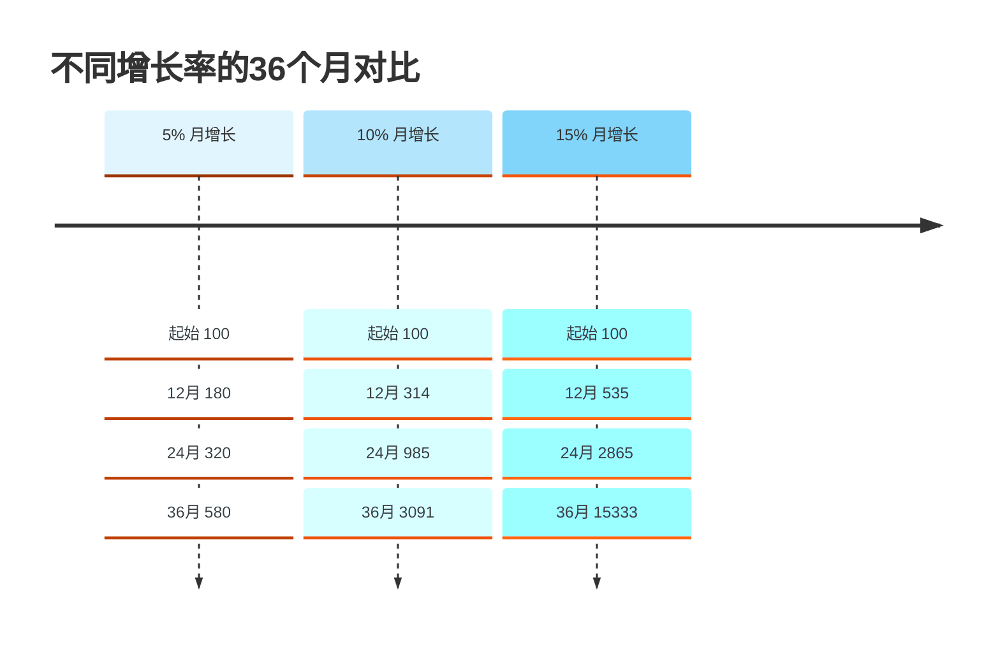

> [!warning] 小差异，大结果
> **5% 和 15% 看似差别不大，但 3 年后相差 26 倍！**
> 
> 这就是为什么**质量至关重要**。

## 如何启动复利飞轮？

### 第一步：选择正确的方向

> [!check] 自我诊断
> 
> **问自己**：
> 1. 我能坚持 3 年吗？
> 2. 这个方向 3 年后还有价值吗？
> 3. 我真的对这个感兴趣吗？
> 4. 这能帮助足够多的人吗？
> 
> **如果有 2 个以上是"否"，重新选择方向。**

参考 [[3. MDFriday 实战记录/03.网站/Dan Koe/视频笔记/9|最赚钱的细分市场就是你]]：

> [!quote] 选择你自己
> "最赚钱的细分市场就是**你自己**。围绕自己的兴趣、经验和价值观建立领域。"

### 第二步：建立每周仪式

> [!check] 每周必做清单
> 
> **内容创作**（4-6小时）：
> - [ ] 写 1 篇深度文章（2000-3000字）
> - [ ] 发布到个人网站
> - [ ] 同步到 2-3 个平台
> 
> **系统优化**（1-2小时）：
> - [ ] 优化 1 篇老文章（SEO、内链）
> - [ ] 回复读者评论
> - [ ] 收集反馈
> 
> **数据复盘**（30分钟）：
> - [ ] 查看流量数据
> - [ ] 分析最受欢迎的内容
> - [ ] 规划下周选题

### 第三步：突破心理障碍

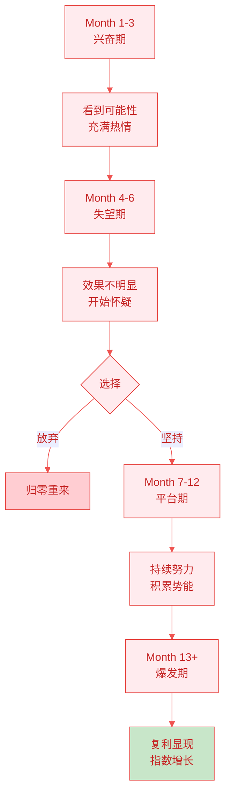

> [!danger] 最危险的时期
> **Month 4-6 是放弃率最高的阶段。**
> 
> 这时你投入了很多，但还看不到明显回报。
> 
> **记住：复利需要时间。**

### 第四步：设置里程碑

> [!check] 里程碑规划
> 
> **3 个月**：
> - [ ] 完成 12 篇文章
> - [ ] 网站日均 50 UV
> - [ ] 建立基础系统
> 
> **6 个月**：
> - [ ] 完成 24 篇文章
> - [ ] 网站日均 200 UV
> - [ ] 邮件列表 100 人
> 
> **12 个月**：
> - [ ] 完成 50 篇文章
> - [ ] 网站日均 800 UV
> - [ ] 邮件列表 500 人
> - [ ] 第一个产品推出
> 
> **24 个月**：
> - [ ] 完成 100 篇文章
> - [ ] 网站日均 3000 UV
> - [ ] 月收入 3 万+
> 
> **36 个月**：
> - [ ] 完成 150 篇文章
> - [ ] 网站日均 8000 UV
> - [ ] 月收入 10 万+
> - [ ] 被动收入占 70%

## 破坏复利的三大杀手

### 杀手 1：频繁切换方向

> [!danger] 最大的敌人
> 
> **今天做 A，明天做 B，后天做 C...**
> 
> 每次切换，之前的积累都归零。

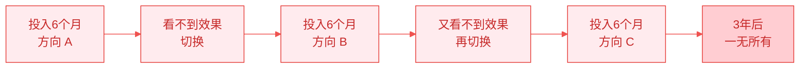

> [!success] 正确做法
> **选定一个方向，坚持至少 24 个月。**

### 杀手 2：三天打鱼两天晒网

> [!warning] 复利需要连续性
> 
> **偶尔努力 ≠ 持续努力**
> 
> 复利公式需要**连续的时间周期**。

| 模式 | 结果 |
|-----|------|
| **每周 1 篇，持续 52 周** | 52 篇，强复利 |
| **每月 4 篇，只做 6 个月** | 24 篇，弱复利 |
| **偶尔写一篇，断断续续** | 20 篇，无复利 |

### 杀手 3：只追求数量，忽视质量

> [!warning] 低质量内容的陷阱
> 
> **100 篇低质量内容 < 20 篇高质量内容**
> 
> 低质量内容：
> - 不被搜索引擎青睐
> - 读者不愿深入阅读
> - 无法建立信任
> - 没有复利效应

## 复利思维的应用

### 应用 1：内容规划

> [!tip] 长期主题 vs 短期热点
> 
> **80% 永恒内容 + 20% 时效内容**
> 
> - 永恒内容：持续带来流量（复利）
> - 时效内容：短期爆发流量（引流）

### 应用 2：技能学习

> [!tip] 复利技能 vs 一次性技能
> 
> **优先学习可复利的技能**：
> - ✅ 写作：越写越好
> - ✅ 演讲：越讲越好
> - ✅ 思考：越想越深
> - ✅ 系统化：越做越顺
> 
> **谨慎投入一次性技能**：
> - ⚠️ 特定工具的操作（工具会过时）
> - ⚠️ 纯粹的体力劳动（无积累）

### 应用 3：关系建立

> [!tip] 深度关系 vs 浅层关系
> 
> **与 100 人浅层交往 < 与 10 人深度连接**
> 
> 深度关系有复利：
> - 相互推荐
> - 共同成长
> - 资源互换
> - 长期合作

## 行动指南

### 本周行动

> [!check] 立即开始
> 
> **Day 1**：确定方向
> - [ ] 写下你的长期方向（3年目标）
> - [ ] 确认这是你愿意坚持的
> 
> **Day 2-6**：启动复利
> - [ ] 写第一篇深度文章
> - [ ] 建立个人网站（使用 [[2. 一人公司实操手册/02.MDFriday 使用指南/|MDFriday]]）
> - [ ] 发布并分发
> 
> **Day 7**：建立系统
> - [ ] 规划未来 12 周的内容主题
> - [ ] 设置每周创作提醒
> - [ ] 设计创作流程

### 前 3 个月

| 周 | 重点 | 行动 |
|----|------|------|
| **Week 1-4** | 启动 | 完成 4 篇文章，建立系统 |
| **Week 5-8** | 坚持 | 完成 4 篇文章，优化流程 |
| **Week 9-12** | 习惯 | 完成 4 篇文章，初见成效 |

**3 个月后检查**：
- 是否完成 12 篇文章？
- 是否建立了稳定的创作习惯？
- 是否看到初步数据？

### 第一年

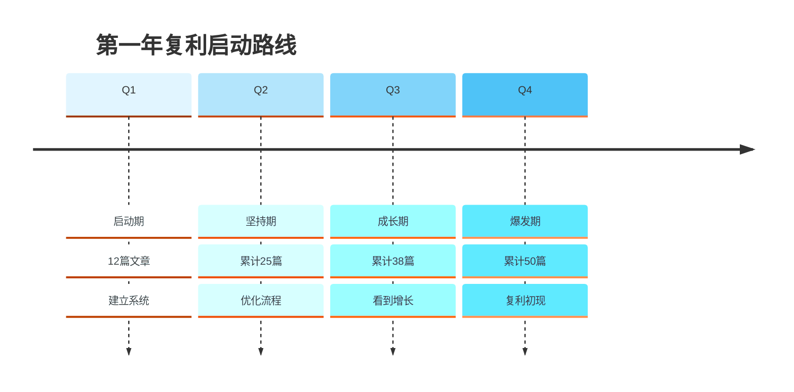

## 常见问题

### Q1：什么时候能看到复利效果？

> [!success] 经验数据
> 
> **一般时间线**：
> - 3 个月：几乎看不到
> - 6 个月：开始有感觉
> - 12 个月：明显加速
> - 24 个月：指数增长
> 
> **耐心是关键。**

### Q2：我错过了最佳时机，现在开始晚吗？

> [!quote] 最佳时间
> "种一棵树最好的时间是十年前，其次是现在。"
> 
> **开始永远不晚。**
> 
> 2026 年开始，2029 年收获。
> 如果不开始，2029 年你还在原地。

### Q3：如何保持长期动力？

> [!tip] 保持动力的方法
> 
> 1. **记录进步**：每月回顾数据
> 2. **庆祝小胜利**：达到里程碑就庆祝
> 3. **寻找同行者**：加入社群，互相鼓励
> 4. **关注过程**：享受创作本身
> 5. **可视化目标**：制作增长图表

## 总结

> [!quote] 复利的真谛
> "复利不是魔法，而是数学。
> 
> 不是运气，而是选择。
> 
> 不是天赋，而是坚持。"

### 核心要点

> [!important] 记住这五点
> 
> 1. **时间是复利的朋友**
>    - 最重要的不是速度，而是持续
> 
> 2. **质量决定复利速度**
>    - 高质量内容 = 高"利率"
> 
> 3. **前 12 个月最难熬**
>    - 看不到效果，但在积累势能
> 
> 4. **不要频繁切换方向**
>    - 每次切换，复利归零
> 
> 5. **复利需要系统支撑**
>    - 用 [[2. 一人公司实操手册/02.MDFriday 使用指南/|MDFriday]] 等工具提高效率

### 复利公式

```
一人公司成功 = (方向 × 质量 × 时间)^坚持
```

- **方向**：选对赛道
- **质量**：提高"利率"
- **时间**：至少 24 个月
- **坚持**：是指数，不是加法

### 下一步阅读

- [[../04.内容就是资产/a.短内容的局限|短内容的局限]]
- [[../04.内容就是资产/b.长文作为知识数据库|长文作为知识数据库]]
- [[../16.一人公司的复利曲线/a.内容复利|内容复利]]

---

**今天的积累，是明天的复利。现在就开始，3 年后的你会感谢今天的选择。**
