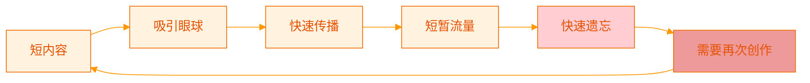
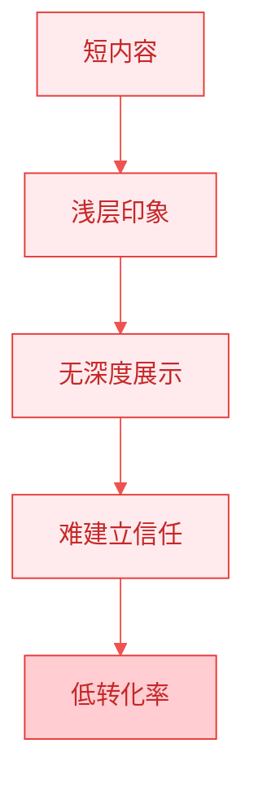
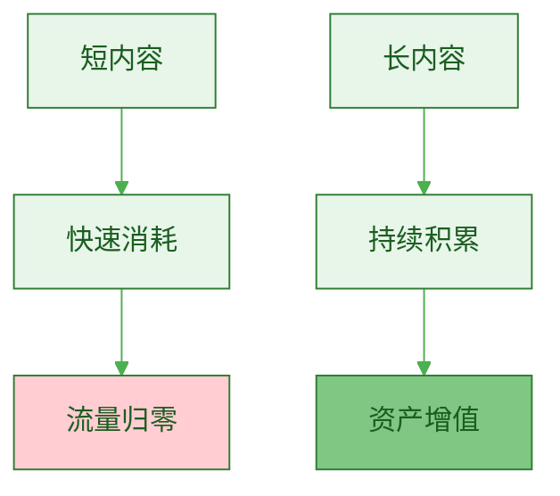
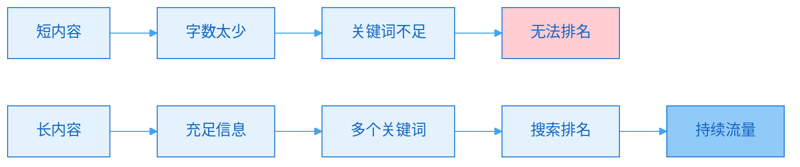
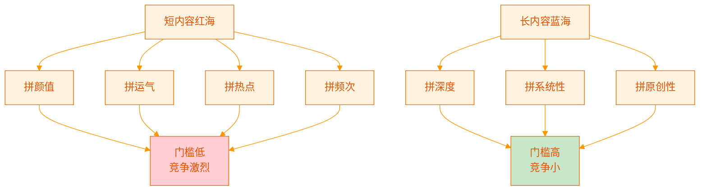
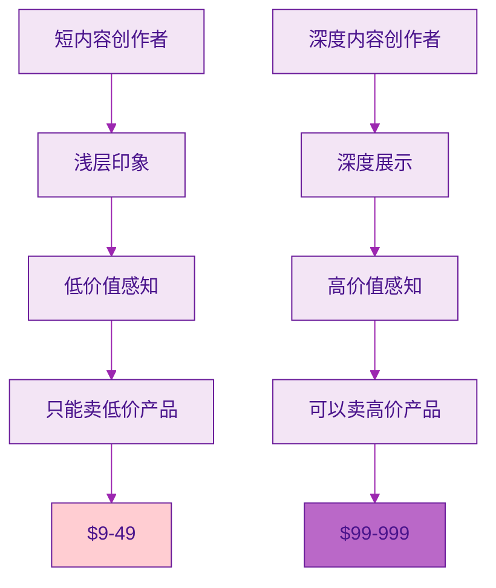
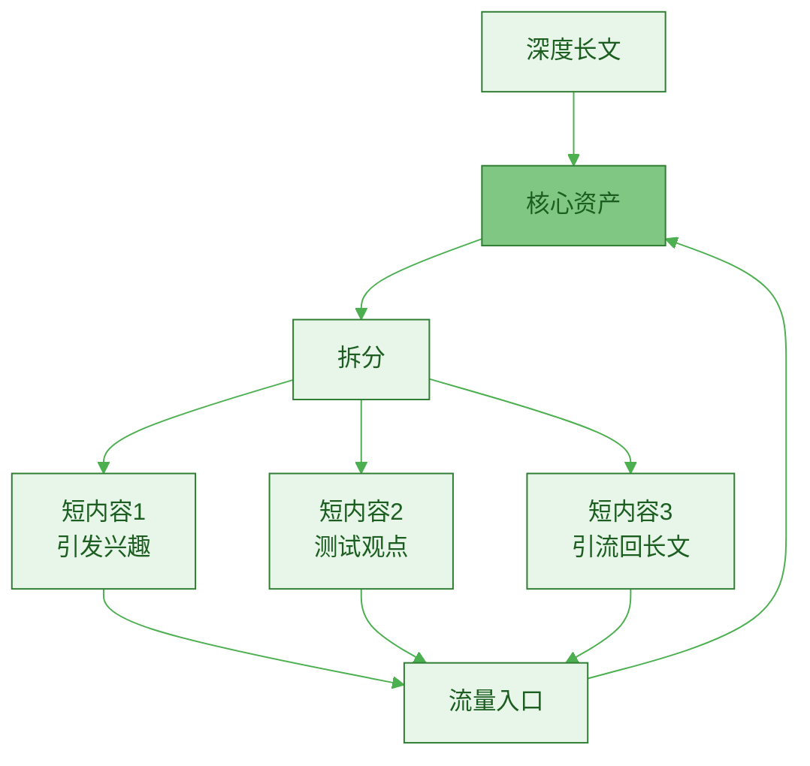
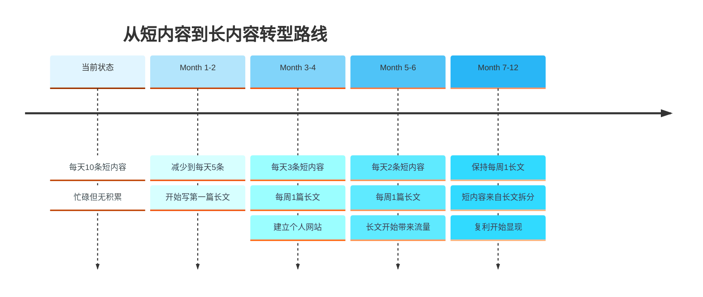

> [!quote] Dan Koe 的洞察
> "市场上充斥着关于如何速成、如何赚快钱的肤浅、廉价建议，这些忽略了商业大局。人们追求'一步一步'的实用建议，却从未探寻事物背后的**深度和根本原因**。"
> ——来自 [[3. MDFriday 实战记录/03.网站/Dan Koe/视频笔记/14|一人商业的未来]]

## 短内容时代的困境

打开任何社交平台，你会看到：
- 微博：140字
- 小红书：500字 + 图片
- 抖音：15-60秒视频
- Twitter：280字

**这是一个短内容统治的时代。**

但为什么很多创作者每天发 10 条内容，却：
- ❌ 无法建立深度影响力
- ❌ 难以实现高价值变现
- ❌ 感到疲惫但无资产积累
- ❌ 无法形成竞争壁垒

## 短内容的本质

### 什么是短内容？

> [!tip] 短内容的定义
> **以"吸引注意力"为首要目标，牺牲深度换取传播速度的内容形式。**

典型特征：
- 篇幅短（通常 < 500字 或 < 1分钟）
- 碎片化、即时性
- 追求爆款、追逐热点
- 浅层观点、快速消费

### 短内容的生命周期

| 平台 | 内容形式 | 黄金期 | 半衰期 | 长尾期 |
|-----|---------|--------|--------|--------|
| **微博** | 图文 | 2小时 | 6小时 | 24小时 |
| **小红书** | 图文笔记 | 12小时 | 48小时 | 7天 |
| **抖音** | 短视频 | 6小时 | 24小时 | 3天 |
| **知乎** | 短回答 | 24小时 | 7天 | 30天 |

> [!danger] 残酷的真相
> **大部分短内容在 24-48 小时内就失去价值。**
> 
> 你的努力像沙子一样，很快就被冲走了。

## 短内容的六大局限

### 局限 1：无法建立深度信任

> [!example] 对比
> 
> **读 100 条微博**：
> - 时间：30 分钟
> - 印象：这人挺有趣
> - 信任度：20 分
> - 愿意付费：不愿意
> 
> **读 3 篇深度文章**（每篇 3000字）：
> - 时间：30 分钟
> - 印象：这人很专业，解决了我的问题
> - 信任度：80 分
> - 愿意付费：愿意

**为什么？**

参考 [[3. MDFriday 实战记录/03.网站/Dan Koe/视频笔记/14|一人商业的未来]]：

> [!quote] 深度的价值
> "不要满足于肤浅的自助建议，而是要追求真理，从**根源上解决问题**。"

**深度内容能够**：
- 展示你的思考深度
- 证明你的专业能力
- 提供实际解决方案
- 建立权威性

**短内容只能**：
- 吸引注意力
- 制造新鲜感
- 博取点赞评论
- 难以深入

### 局限 2：无法传递复杂知识

> [!warning] 知识的复杂性
> **真正有价值的知识，往往是复杂的、系统的。**

| 知识类型 | 需要的篇幅 | 短内容能否传递 |
|---------|----------|--------------|
| **简单技巧** | 500字 | ✅ 可以 |
| **思维框架** | 2000字 | ⚠️ 勉强 |
| **系统方法论** | 5000字+ | ❌ 无法 |
| **深层原理** | 长系列 | ❌ 完全无法 |

> [!example] 真实案例
> 
> **如何用短内容教"一人公司"？**
> 
> **方式 1：10条微博**
> - "第1条：一人公司是什么"
> - "第2条：为什么要做一人公司"
> - "第3条：如何开始..."
> 
> **结果**：
> - 读者看到第3条就忘了第1条
> - 无法形成完整认知
> - 缺乏系统性
> - 难以实施
> 
> **方式 2：1篇深度文章（3000字）**
> - 系统阐述概念
> - 深入分析原理
> - 提供完整方法
> - 配合案例和图表
> 
> **结果**：
> - 读者获得完整认知
> - 理解底层逻辑
> - 可以立即行动
> - 愿意收藏和分享

### 局限 3：无法形成资产

参考 [[../02.平台不是你的资产/b.内容消耗型 vs 内容资产型|内容消耗型 vs 内容资产型]]：

> [!danger] 短内容的资产困境
> 
> **投入-产出分析**：
> 
> **1年写 1000 条短内容**：
> - 投入时间：500 小时
> - 1年后价值：接近零
> - 3年后价值：完全为零
> 
> **1年写 50 篇深度文章**：
> - 投入时间：250 小时
> - 1年后价值：持续增长
> - 3年后价值：数十倍回报

### 局限 4：难以SEO优化

**搜索引擎偏好**：

| 因素 | 短内容 | 长内容 |
|-----|--------|--------|
| **字数** | 500字 | 2000-5000字 |
| **关键词密度** | 低 | 适中 |
| **停留时间** | 30秒 | 3-5分钟 |
| **跳出率** | 高 | 低 |
| **排名机会** | ❌ 很难 | ✅ 容易 |

> [!success] SEO的真相
> **Google 的数据表明**：
> - 排名前 10 的文章，平均字数 2000+
> - 深度内容获得链接的概率是短内容的 3 倍
> - 长内容的分享率高 77%

### 局限 5：竞争过度激烈

> [!warning] 红海市场
> 
> **每天全球产生的短内容**：
> - 微博：1 亿+
> - 小红书：500 万+
> - 抖音：1000 万+
> - Twitter：5 亿+
> 
> **你的内容如何脱颖而出？**

**数据对比**：

| 维度 | 写微博 | 写深度文章 |
|-----|--------|-----------|
| **创作者数量** | 1 亿+ | 100 万 |
| **竞争比例** | 1:100,000 | 1:100 |
| **成功概率** | 0.001% | 1% |

### 局限 6：无法支撑高价产品

> [!important] 价值感知
> **内容深度 = 价值感知 = 定价能力**

> [!example] 真实对比
> 
> **创作者 A（只发短内容）**：
> - 粉丝 10 万
> - 推出 $199 课程
> - 转化率 0.5%
> - 销量 500 份
> - 收入 $99,500
> 
> **创作者 B（深度内容为主）**：
> - 粉丝 2 万
> - 推出 $499 课程
> - 转化率 5%
> - 销量 1000 份
> - 收入 $499,000
> 
> **B 的粉丝只有 A 的 1/5，但收入是 A 的 5 倍！**

**原因**：
1. 深度内容建立了信任
2. 展示了专业能力
3. 提供了实际价值
4. 吸引了精准用户

## 短内容的正确使用方式

> [!tip] 短内容不是没有价值
> **关键是知道什么时候用、怎么用。**

### 短内容的三个作用

| 作用 | 说明 | 示例 |
|-----|------|------|
| **1. 引流工具** | 吸引注意力，引导到深度内容 | "这个方法帮我月入10万，详见我的博客" |
| **2. 测试工具** | 快速测试想法是否受欢迎 | 发一条观点，看反馈再决定是否写长文 |
| **3. 社交工具** | 与读者互动，建立连接 | 回复评论，发布动态 |

### 正确的内容组合

> [!success] 80/20 原则
> 
> **80% 精力投入长内容（资产）**
> - 每周 1 篇深度文章（3000字）
> - 发布到自己网站
> - 这是核心资产
> 
> **20% 精力投入短内容（引流）**
> - 将长文拆分成 10 条短内容
> - 分发到各平台
> - 引导读者回到网站

参考 [[../07.长文高效复用/a.3000字到10条短内容|3000字到10条短内容]]

### 短内容的创作原则

> [!check] 如果要发短内容
> 
> **原则 1：必须指向长内容**
> - 每条短内容都是长文的"预告片"
> - 引导读者去看完整版
> 
> **原则 2：不要只发短内容**
> - 没有长内容支撑的短内容，无法建立信任
> 
> **原则 3：批量生产，而非单独创作**
> - 先写长文
> - 再拆分成短内容
> - 提高效率

## 从短内容到长内容的转型

### 为什么要转型？

> [!danger] 短内容陷阱
> 
> **如果你现在主要做短内容，3 年后你会发现**：
> - 依然要每天高强度创作
> - 停下来就没有收入
> - 无法提高客单价
> - 感到疲惫和焦虑
> - 没有积累任何资产

> [!success] 长内容未来
> 
> **如果你从现在开始写长内容，3 年后你会发现**：
> - 老内容持续带来流量
> - 可以减少创作频率
> - 客单价大幅提升
> - 时间越来越自由
> - 拥有价值资产

### 转型路线图

### 具体行动步骤

> [!check] 第一周：思维转变
> 
> - [ ] 承认短内容的局限性
> - [ ] 理解长内容的价值
> - [ ] 设定长期目标（3年后的自己）

> [!check] 第二周：基础建设
> 
> - [ ] 注册域名
> - [ ] 使用 [[2. 一人公司实操手册/02.MDFriday 使用指南/|MDFriday]] 搭建网站
> - [ ] 规划内容主题库

> [!check] 第三周：开始创作
> 
> - [ ] 写第一篇长文（2000+ 字）
> - [ ] 发布到网站
> - [ ] 拆分成 10 条短内容
> - [ ] 分发到平台，引流回网站

> [!check] 第一个月后
> 
> - [ ] 完成 4 篇长文
> - [ ] 建立创作习惯
> - [ ] 优化创作流程
> - [ ] 开始看到初步效果

## 常见问题

### Q1：我没时间写长文怎么办？

> [!tip] 时间管理
> 
> **误区**：长文需要更多时间
> 
> **真相**：长文更节省时间
> 
> **对比**：
> - 每天写 10 条短内容：2小时
> - 每周写 1 篇长文 + 拆分：6小时
> 
> **每周时间**：
> - 短内容：14 小时
> - 长内容：6 小时
> 
> **长内容节省 57% 时间！**

### Q2：长文会不会没人看？

> [!success] 数据说话
> 
> **担心**：现在人没耐心，不看长文
> 
> **事实**：
> - Google 首页平均文章长度：2000+ 字
> - Medium 最受欢迎文章：7-10分钟阅读
> - 知乎最高赞回答：通常 > 2000字
> 
> **真相**：
> - 浅薄的人不看长文
> - 但他们也不会付费
> - **愿意付费的人，会看长文**

### Q3：短内容涨粉快，为什么不做？

> [!warning] 粉丝质量 vs 数量
> 
> **短内容涨粉**：
> - 快，但粉丝质量低
> - 转化率 0.5-1%
> - 客单价低（$9-49）
> 
> **长内容涨粉**：
> - 慢，但粉丝质量高
> - 转化率 5-10%
> - 客单价高（$99-999）
> 
> **对比**：
> - 10万泛粉 × 0.5% × $19 = $9,500
> - 5000精准粉 × 5% × $199 = $49,750
> 
> **精准粉价值 = 泛粉的 25 倍！**

## 行动指南

### 立即行动

> [!important] 今天就开始
> 
> **不要等待完美时机，不要追求完美质量。**
> 
> **现在就**：
> 1. 选择一个你最熟悉的话题
> 2. 写 2000 字（不要担心质量）
> 3. 发布到任何地方（甚至先存在本地）
> 4. 完成第一篇长文
> 
> **第一篇永远是最难的，写完就成功了一半。**

### 本周计划

> [!check] Week 1 行动清单
> 
> **Day 1**：
> - [ ] 确定长文主题
> - [ ] 搭建个人网站
> 
> **Day 2-5**：
> - [ ] 写第一篇长文
> - [ ] 不追求完美，完成即可
> 
> **Day 6**：
> - [ ] 发布长文
> - [ ] 拆分成 10 条短内容
> 
> **Day 7**：
> - [ ] 分发短内容到各平台
> - [ ] 复盘和总结

## 总结

> [!quote] 核心认知
> "短内容是消耗品，长内容是资产。
> 
> 短内容换流量，长内容换信任。
> 
> 短内容做引流，长内容做沉淀。
> 
> 选择短内容，是选择忙碌。
> 选择长内容，是选择自由。"

### 短内容 vs 长内容

| | 短内容 | 长内容 |
|--|--------|--------|
| **目标** | 吸引注意力 | 建立信任 |
| **价值** | 快速消耗 | 持久资产 |
| **转化** | 低转化率 | 高转化率 |
| **定价** | 低客单价 | 高客单价 |
| **竞争** | 红海激烈 | 蓝海机会 |
| **未来** | 持续忙碌 | 逐步自由 |

### 核心建议

> [!important] 行动要点
> 
> 1. **承认短内容的局限**
>    - 不是短内容没有价值
>    - 而是不能只做短内容
> 
> 2. **建立长内容资产**
>    - 每周至少 1 篇深度文章
>    - 发布到自己的网站
>    - 这是你的数字资产
> 
> 3. **短长结合，各司其职**
>    - 长内容：建立信任，沉淀资产
>    - 短内容：引流工具，测试想法
> 
> 4. **长期主义，复利思维**
>    - 参考 [[../03.一人公司的底层模型/c.时间复利逻辑|时间复利逻辑]]
>    - 短期看不到效果，但长期指数增长

### 下一步阅读

- [[b.长文作为知识数据库|长文作为知识数据库]]
- [[c.深度思考的商业价值|深度思考的商业价值]]
- [[../06.长文创作/a.长文为何是飞轮中心|长文为何是飞轮中心]]

---

**停止消耗，开始积累。今天的长文，是明天的资产。**
