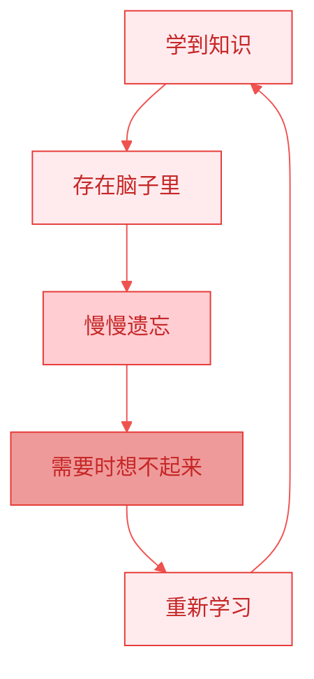
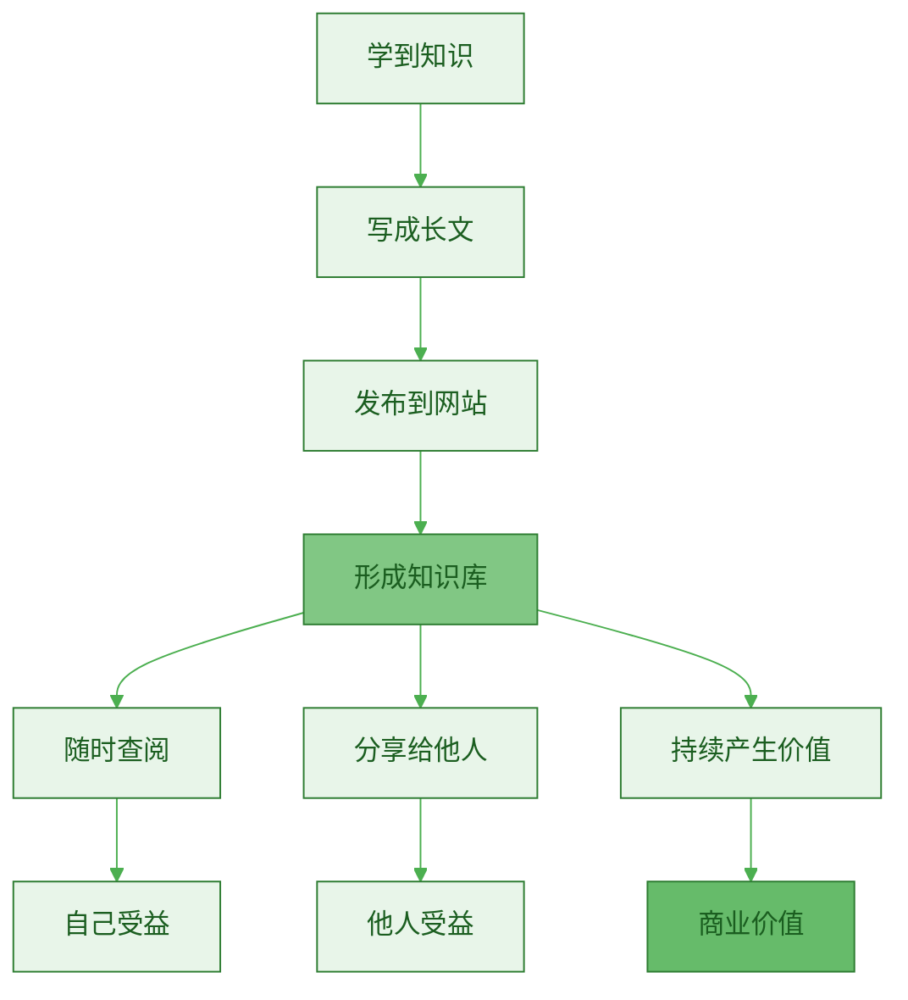
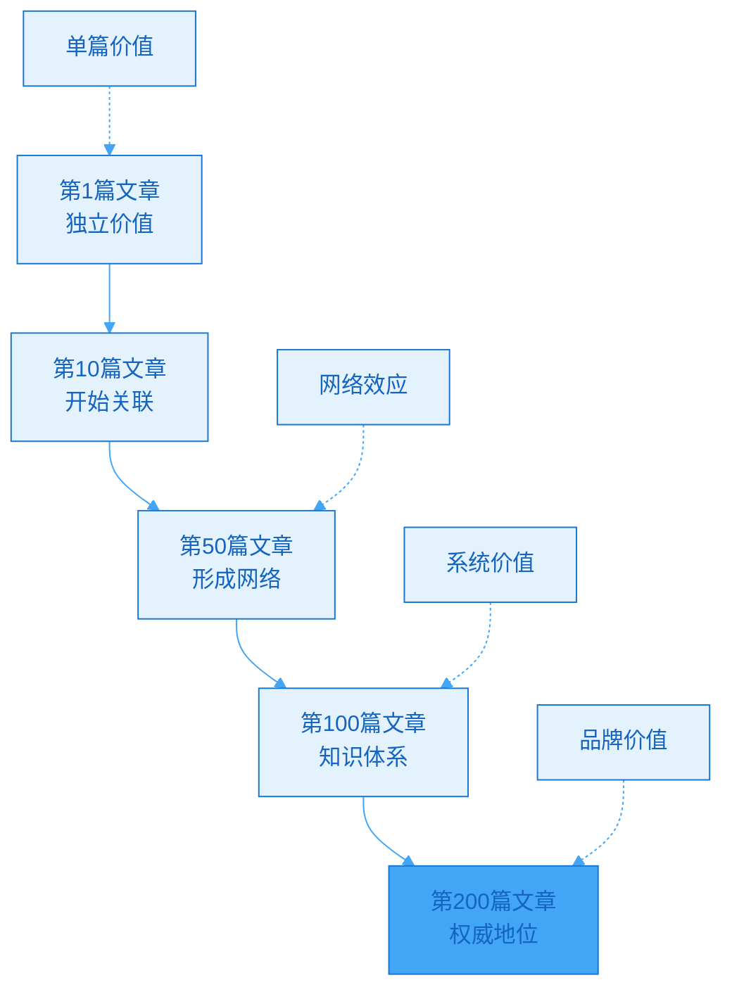
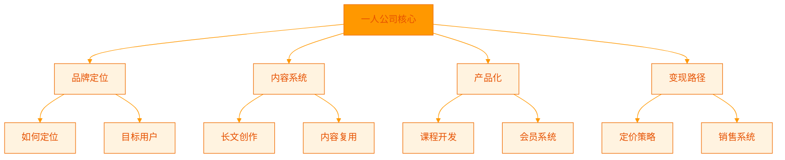
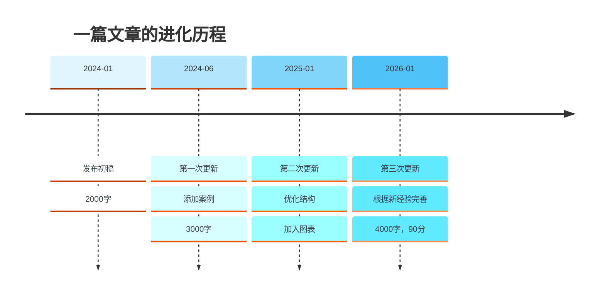
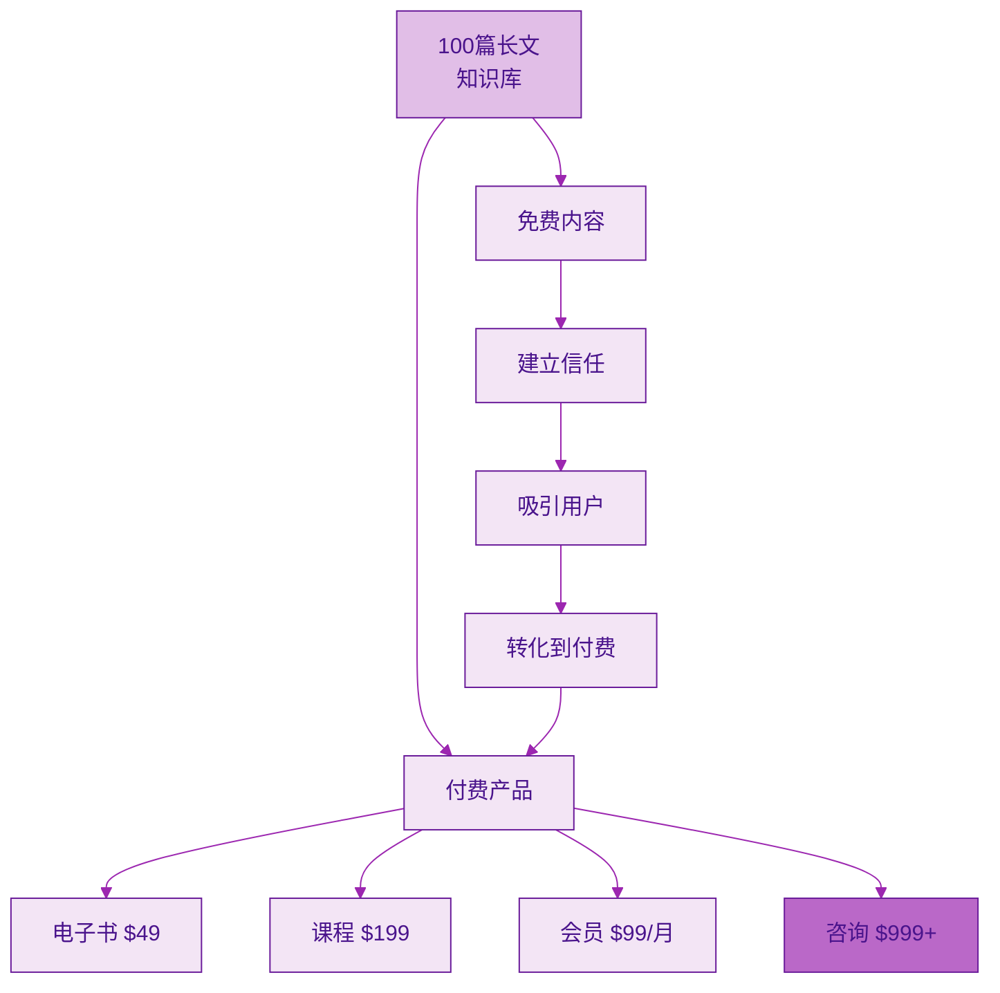
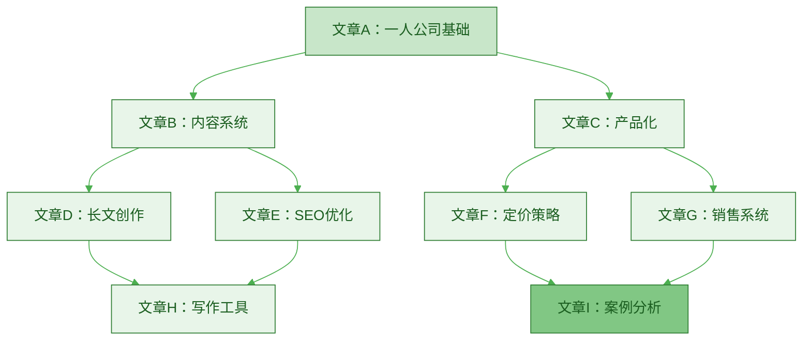
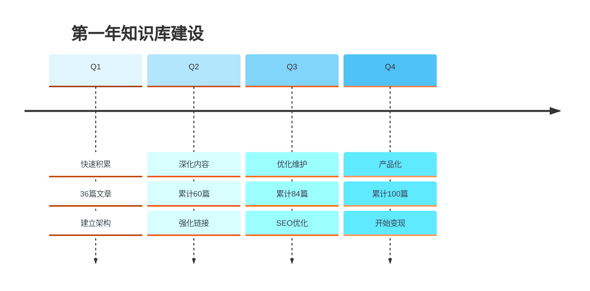

> [!quote] Dan Koe 的洞察
> "将社交媒体视为**数字房地产和公立学校**，这是一个知识库，涵盖你人生中所有的想法、信念、观点和经验教训。"
> ——来自 [[3. MDFriday 实战记录/03.网站/Dan Koe/视频笔记/14|一人商业的未来]]

## 什么是知识数据库？

### 传统的知识管理

大多数人的知识管理是这样的：



**问题**：
- ❌ 知识无法复用
- ❌ 无法分享给他人
- ❌ 无法产生价值
- ❌ 遗忘速度快

### 长文作为知识数据库



> [!success] 长文知识库的优势
> 
> - ✅ 外部化存储：不依赖记忆
> - ✅ 结构化组织：系统性呈现
> - ✅ 可搜索：快速找到需要的内容
> - ✅ 可分享：帮助他人，建立影响力
> - ✅ 可变现：知识转化为资产

## 长文知识库的五大价值

### 价值 1：第二大脑（Second Brain）

参考 Tiago Forte 的"第二大脑"理念：

> [!tip] 大脑的局限
> **人脑不擅长存储信息，而擅长思考和创造。**
> 
> - 工作记忆容量：7±2 个项目
> - 遗忘曲线：24小时后遗忘 70%
> - 信息过载：每天接收 34GB 数据

**长文作为第二大脑**：

| 维度 | 人脑 | 长文知识库 |
|-----|------|----------|
| **容量** | 有限 | 无限 |
| **遗忘** | 快速 | 永久 |
| **搜索** | 模糊 | 精确 |
| **分享** | 困难 | 容易 |
| **进化** | 缓慢 | 持续优化 |

> [!example] 实际应用
> 
> **场景 1：解决重复问题**
> - 客户问："如何开始做一人公司？"
> - 你的回答：指向你的文章《一人公司完整指南》
> - 好处：不用重复解释，客户得到完整信息
> 
> **场景 2：系统化学习**
> - 你学习了"内容营销"
> - 写成文章《内容营销的底层逻辑》
> - 好处：加深理解，未来可以快速回顾

### 价值 2：知识的复利效应



> [!success] 知识复利的威力
> 
> **第 1 篇文章**：
> - 价值：100
> - 独立存在
> 
> **第 50 篇文章**：
> - 单篇价值：100
> - 网络价值：50 × 100 × 1.5（网络效应）= 7,500
> 
> **第 100 篇文章**：
> - 单篇价值：100
> - 网络价值：100 × 100 × 2（系统效应）= 20,000
> 
> **知识网络的价值 >> 单篇文章价值之和**

### 价值 3：可搜索的知识图谱



> [!tip] 知识图谱的优势
> 
> **传统笔记**：
> - 文件夹分类，层级结构
> - 需要记住在哪个文件夹
> - 难以发现隐藏联系
> 
> **知识图谱**：
> - 网状连接，多维度关联
> - 通过搜索快速找到
> - 自动发现相关内容

> [!example] 实际场景
> 
> **用户搜索"如何变现"**：
> 
> 可能找到你的文章：
> 1. 《内容变现的三种结构》
> 2. 《产品定价策略》
> 3. 《从0到第一个客户》
> 4. 《建立销售系统》
> 
> 文章之间相互链接，形成完整的知识路径。

### 价值 4：持续进化的活文档

> [!important] 文档不是写完就结束
> **长文应该持续更新和优化。**

**进化过程**：

| 版本 | 内容 | 价值 |
|-----|------|------|
| **v1.0** | 初稿，2000字 | 60分 |
| **v2.0** | 补充案例，3000字 | 75分 |
| **v3.0** | 优化结构，加图表 | 85分 |
| **v4.0** | 根据反馈完善 | 90分 |
| **v5.0** | 3年后重新审视 | 95分 |



> [!success] 活文档的好处
> 
> 1. **SEO 友好**：Google 喜欢更新的内容
> 2. **用户友好**：读者总能看到最新版本
> 3. **自我成长**：反映你的进步
> 4. **持续价值**：老文章不会过时

### 价值 5：可变现的知识资产

参考 [[3. MDFriday 实战记录/03.网站/Dan Koe/视频笔记/6|产品构建系统]]：

> [!quote] 产品即信息
> "没有比信息业务更好的商业模式，因为人们的唯一目标是更高质量的生活，而信息是实现这一目标所需的工具。"

**知识变现路径**：



> [!example] 变现案例
> 
> **知识库：100 篇文章，涵盖"一人公司"**
> 
> **免费层（80%）**：
> - 80 篇基础文章
> - 建立信任和权威
> - 吸引 SEO 流量
> 
> **付费层（20%）**：
> - 电子书：精选 20 篇文章 + 补充内容 = $49
> - 课程：系统化教学 + 视频 = $199
> - 会员：持续更新 + 社群 = $99/月
> - 咨询：一对一指导 = $999/次
> 
> **转化逻辑**：
> - 用户读了 10+ 篇免费文章
> - 建立信任，认可你的专业性
> - 愿意为深度内容付费
> - 转化率可达 5-10%

## 如何构建长文知识库？

### 第一步：选择知识库平台

> [!check] 平台选择标准
> 
> **必备功能**：
> - ✅ 支持 Markdown
> - ✅ 方便搜索
> - ✅ 支持内部链接
> - ✅ 可以发布到网站
> - ✅ 数据属于你自己
> 
> **推荐方案**：
> - **Obsidian + [[2. 一人公司实操手册/02.MDFriday 使用指南/|MDFriday]]**
>   - 本地存储，数据安全
>   - 强大的知识图谱
>   - 一键发布到网站

### 第二步：设计知识架构

> [!tip] 架构设计原则
> **不要追求完美分类，要追求灵活连接。**

**示例：一人公司知识库架构**

```
一人公司知识库/
├── 01.认知篇/
│   ├── 为什么要做一人公司
│   ├── 一人公司的底层模型
│   └── 平台不是你的资产
├── 02.内容篇/
│   ├── 长文创作方法
│   ├── 内容复用系统
│   └── SEO 优化指南
├── 03.产品篇/
│   ├── 产品化路径
│   ├── 定价策略
│   └── 销售系统
├── 04.系统篇/
│   ├── 工具推荐
│   ├── 自动化流程
│   └── 效率优化
└── 05.案例篇/
    ├── 成功案例分析
    ├── 失败经验总结
    └── 数据复盘
```

> [!important] 架构不是固定的
> - 开始可以简单分类
> - 随着内容增加逐步调整
> - 重点是内部链接，而非文件夹

### 第三步：建立标准写作模板

> [!check] 标准模板要素
> 
> **每篇长文应包含**：
> 
> 1. **标题**：清晰、包含关键词
> 2. **摘要**：100-200字，概括核心观点
> 3. **正文**：2000-4000字，系统阐述
> 4. **小结**：3-5条核心要点
> 5. **相关链接**：指向其他相关文章
> 6. **行动清单**：读者可以立即执行的步骤
> 7. **标签**：便于分类和搜索

**模板示例**：

```markdown
---
title: 文章标题
tags: [标签1, 标签2, 标签3]
date: 2026-03-06
---

> [!quote] 引用
> 相关的名言或核心观点

## 核心问题

描述要解决的问题...

## 解决方案

### 子标题1
内容...

### 子标题2
内容...

## 实战案例

举例说明...

## 行动清单

> [!check] 立即行动
> - [ ] 行动1
> - [ ] 行动2

## 总结

核心要点...

## 相关阅读

- [[相关文章1]]
- [[相关文章2]]
```

### 第四步：建立内部链接网络

> [!important] 链接是知识库的灵魂
> **文章之间的连接比文章本身更重要。**

**链接策略**：



**链接类型**：

| 类型 | 说明 | 示例 |
|-----|------|------|
| **前置链接** | 需要先理解的概念 | "在理解[[长文创作]]之前，先了解[[内容资产]]" |
| **后续链接** | 深入阅读 | "关于这个话题的深入讨论，见[[深度文章]]" |
| **平行链接** | 相关主题 | "另一个角度的分析，参考[[相关文章]]" |
| **案例链接** | 实际应用 | "查看[[实战案例]]了解具体操作" |

> [!tip] 链接建议
> - 每篇文章至少链接到 3-5 篇其他文章
> - 新文章要链接到老文章（增加老文章价值）
> - 定期回顾老文章，添加到新文章的链接

### 第五步：持续维护和优化

> [!check] 维护清单
> 
> **每周**：
> - [ ] 写 1 篇新文章
> - [ ] 优化 1 篇老文章（添加链接、更新内容）
> - [ ] 回复读者评论和反馈
> 
> **每月**：
> - [ ] 查看流量数据，找出最受欢迎的文章
> - [ ] 深度优化 2-3 篇热门文章
> - [ ] 检查是否有失效链接
> - [ ] 更新过时信息
> 
> **每季度**：
> - [ ] 回顾整个知识库结构
> - [ ] 识别知识空缺，规划新文章
> - [ ] 合并或删除低价值内容
> - [ ] 制作知识图谱可视化

## 知识库的使用场景

### 场景 1：回答用户问题

> [!example] 高效服务用户
> 
> **Before（没有知识库）**：
> - 用户问："如何开始做一人公司？"
> - 你花 30 分钟回复
> - 第二个用户问同样问题
> - 又花 30 分钟回复
> - ...疲于应付
> 
> **After（有知识库）**：
> - 用户问："如何开始做一人公司？"
> - 你回复："这是完整指南：[链接]"
> - 用户得到更系统的答案
> - 你节省时间，用户更满意

### 场景 2：创作其他内容

> [!tip] 知识库是内容原材料库
> 
> **从知识库生成**：
> - 视频脚本：直接用文章作为脚本
> - 社交媒体：从文章提取金句
> - 演讲稿：组合多篇文章
> - 电子书：精选文章合集
> - 课程：系统化组织文章

### 场景 3：快速回顾和学习

> [!example] 自我成长
> 
> **场景**：
> - 1 年前你写了《内容营销指南》
> - 现在要做一个相关项目
> - 翻出这篇文章，快速回顾
> - 发现 1 年前的自己已经总结得很好
> - 节省重新学习的时间

### 场景 4：展示专业能力

> [!success] 建立权威
> 
> **潜在客户的心理**：
> - 访问你的网站
> - 看到 100+ 篇系统化的文章
> - 心想："这人很专业，有深度"
> - 浏览 10+ 篇文章
> - 决定："我要跟这个人学习"
> 
> **转化率提升**：
> - 无知识库：1%
> - 有知识库：5-10%

## 常见误区

### 误区 1：追求完美才发布

> [!warning] 完美主义陷阱
> "我要等到文章完美了再发布"
> "我要等知识库结构完美了再开始"

> [!success] 正确做法
> **Done is better than perfect.**
> 
> - 先发布 80 分的内容
> - 获得反馈
> - 持续优化到 90 分
> 
> 80 分的内容立即发布 > 100 分的内容永远不发布

### 误区 2：孤立的文章

> [!warning] 缺乏连接
> "写完一篇就不管了"
> "文章之间没有链接"

> [!success] 正确做法
> **每篇新文章都要**：
> - 链接到至少 3 篇老文章
> - 回到老文章，添加到新文章的链接
> - 形成知识网络

### 误区 3：只写不更新

> [!warning] 静态思维
> "文章发布了就结束了"
> "旧文章放着不管"

> [!success] 正确做法
> **知识库是活的**：
> - 每月优化 2-3 篇老文章
> - 根据新经验更新内容
> - 添加最新案例
> - 优化 SEO

## 行动指南

### 第一周：搭建基础

> [!check] 行动清单
> 
> **Day 1-2**：
> - [ ] 选择知识库工具（推荐 Obsidian）
> - [ ] 使用 [[2. 一人公司实操手册/02.MDFriday 使用指南/|MDFriday]] 建立网站
> - [ ] 设计初步架构（3-5 个主分类）
> 
> **Day 3-5**：
> - [ ] 写第一篇文章（作为模板）
> - [ ] 创建标准模板
> - [ ] 发布到网站
> 
> **Day 6-7**：
> - [ ] 写第二篇文章
> - [ ] 建立两篇文章之间的链接
> - [ ] 测试搜索功能

### 前 3 个月：快速积累

| 月份 | 目标 | 行动 |
|-----|------|------|
| **Month 1** | 基础建设 | 12 篇文章，建立架构 |
| **Month 2** | 扩充内容 | 12 篇文章，加强连接 |
| **Month 3** | 优化系统 | 12 篇文章，开始维护 |

**3 个月后**：
- 36 篇文章
- 初步知识网络
- 开始看到 SEO 流量

### 第一年：建立权威



## 总结

> [!quote] 核心认知
> "知识库不是文章的堆砌，而是知识的系统化呈现。
> 
> 每篇文章是节点，链接是边，共同形成知识图谱。
> 
> 这个图谱既是你的第二大脑，也是你的数字资产。"

### 长文知识库的价值

| 维度 | 价值 |
|-----|------|
| **个人** | 第二大脑，永久记忆 |
| **读者** | 系统化学习，快速成长 |
| **商业** | 可变现资产，持续收入 |
| **品牌** | 专业权威，竞争壁垒 |

### 核心要点

> [!important] 记住这五点
> 
> 1. **知识库 > 单篇文章**
>    - 系统性价值远大于单篇价值
> 
> 2. **链接是灵魂**
>    - 文章之间的连接创造额外价值
> 
> 3. **持续进化**
>    - 知识库是活的，需要不断更新
> 
> 4. **立即开始**
>    - 不要等完美，从第一篇开始
> 
> 5. **长期资产**
>    - 这是你的数字资产，会持续增值

### 下一步阅读

- [[c.深度思考的商业价值|深度思考的商业价值]]
- [[../06.长文创作/b.长期主题库构建|长期主题库构建]]
- [[../10.建立个人网站/a.为什么必需拥有自己的阵地|为什么必需拥有自己的阵地]]

---

**开始建立你的知识库，让知识成为永久增值的资产。**
