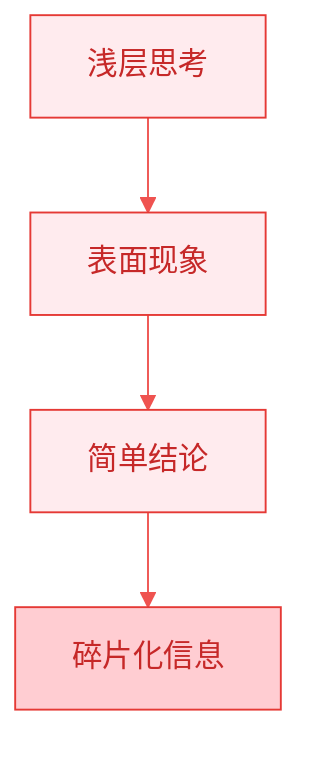
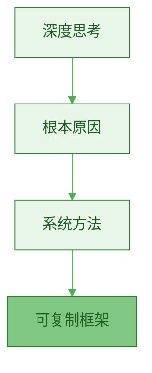
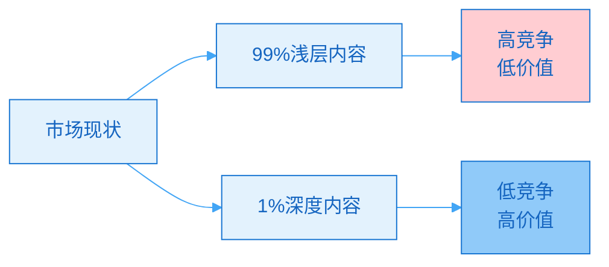
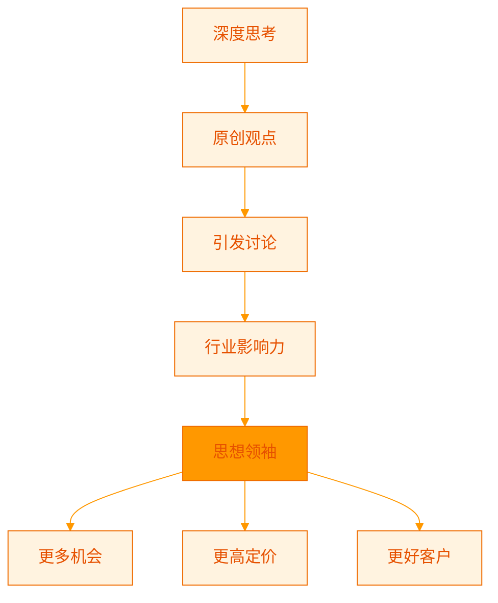
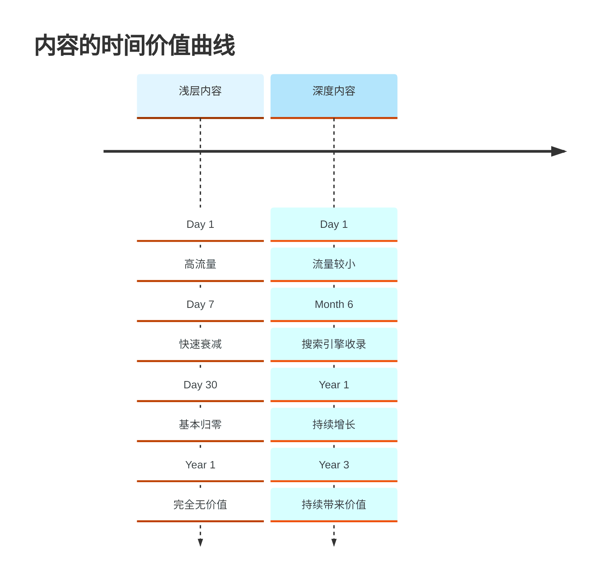
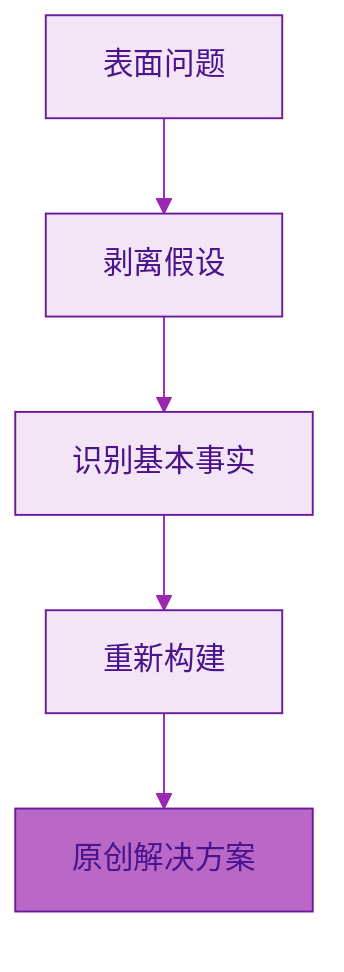
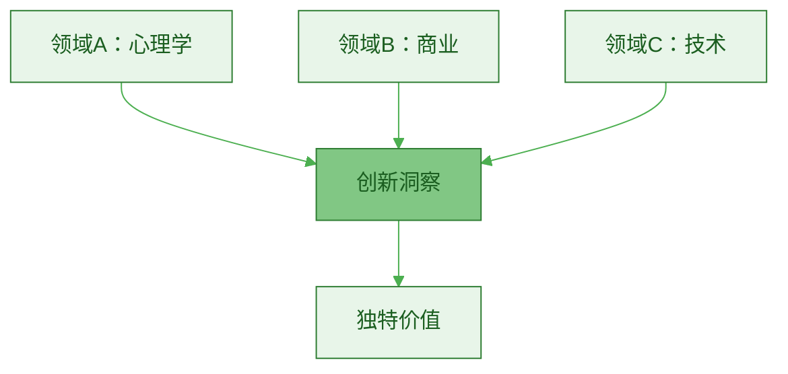
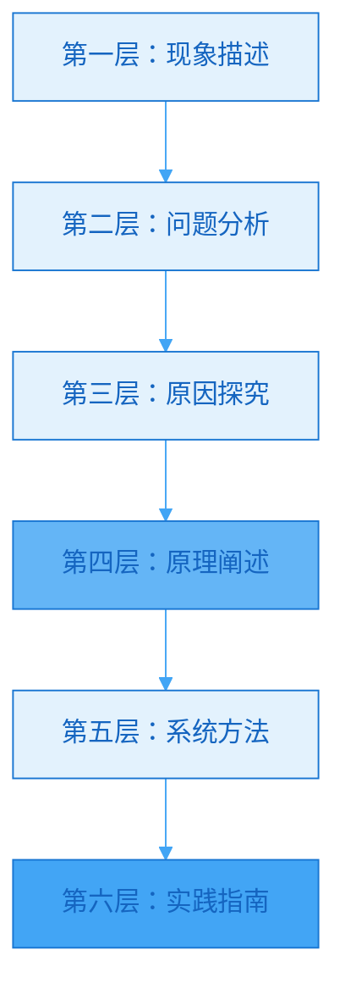

> [!quote] Dan Koe 的核心洞察
> "价值创造者是用**智慧而不是时间**来创造价值的人，他们的劳动可以规模化。他们通过教育受众来帮助人们在生活中取得成果。"
> ——来自 [[3. MDFriday 实战记录/03.网站/Dan Koe/视频笔记/22|价值创造者]]

## 什么是深度思考？

### 浅层 vs 深层

| 维度 | 浅层思考 | 深度思考 |
|-----|---------|---------|
| **问题** | 是什么（What） | 为什么（Why） |
| **方法** | 具体步骤 | 底层逻辑 |
| **时效** | 短期有效 | 长期有效 |
| **价值** | 低 | 高 |
| **可复制** | 难 | 易 |

> [!example] 对比示例
> 
> **浅层思考：如何增加粉丝？**
> - "发更多内容"
> - "追热点"
> - "互粉"
> 
> **深度思考：为什么有人愿意关注你？**
> - 持续提供价值
> - 解决实际问题
> - 建立信任关系
> - 形成独特定位
> 
> **结果**：
> - 浅层方法：短期有效，长期失效
> - 深度方法：理解本质，持续有效

## 深度思考的商业价值

### 价值 1：创造差异化

参考 [[3. MDFriday 实战记录/03.网站/Dan Koe/视频笔记/14|一人商业的未来]]：

> [!quote] 深度的稀缺性
> "市场上充斥着肤浅、廉价建议，人们追求'一步一步'的实用建议，却从未探寻事物背后的**深度和根本原因**。"

> [!success] 深度思考的蓝海
> 
> **红海（浅层内容）**：
> - 竞争者：数百万
> - 差异化：困难
> - 定价：低（$0-49）
> - 客户质量：低
> 
> **蓝海（深度内容）**：
> - 竞争者：数千
> - 差异化：天然
> - 定价：高（$99-999）
> - 客户质量：高

### 价值 2：支撑高价产品

> [!important] 价值感知 = 定价能力
> **深度内容展示你的专业性，支撑高价定位。**

| 内容深度 | 价值感知 | 可支撑价格 |
|---------|---------|----------|
| **浅层技巧** | 低 | $9-49 |
| **系统方法** | 中 | $49-199 |
| **底层原理** | 高 | $199-999 |
| **完整哲学** | 极高 | $999+ |

> [!example] 真实案例
> 
> **创作者 A（浅层内容）**：
> - "10个增加粉丝的技巧"
> - "5个写作模板"
> - "3步提高效率"
> 
> 产品定价：
> - 电子书 $19
> - 课程 $99
> - 客户认知："有点用，但不深"
> 
> **创作者 B（深度内容）**：
> - "为什么增长的本质是价值创造"
> - "写作的底层逻辑：思维-语言-系统"
> - "效率的终极答案：专注-杠杆-系统"
> 
> 产品定价：
> - 电子书 $49
> - 课程 $499
> - 咨询 $2000/小时
> - 客户认知："这人真专业，值得深入学习"

### 价值 3：建立思想领导力

> [!success] 思想领导力的价值
> 
> **成为思想领袖后**：
> - ✅ 客户主动找你（不需要销售）
> - ✅ 媒体采访邀约
> - ✅ 演讲邀请
> - ✅ 合作机会
> - ✅ 更高议价能力
> - ✅ 个人品牌溢价

### 价值 4：创造复利资产

参考 [[../03.一人公司的底层模型/c.时间复利逻辑|时间复利逻辑]]：

> [!important] 深度内容 = 长期资产
> 
> **浅层内容**：
> - 热点文章，3 天过时
> - "2026年10个XX技巧"
> - 1 年后价值归零
> 
> **深度内容**：
> - 永恒原理，10 年有效
> - "XX的底层逻辑"
> - 持续积累复利

### 价值 5：吸引高质量客户

> [!tip] 客户质量与内容深度成正比
> 
> **浅层内容吸引**：
> - 想要快速解决方案的人
> - 价格敏感
> - 付费意愿低
> - 容易流失
> 
> **深度内容吸引**：
> - 想要理解本质的人
> - 价值导向
> - 付费意愿高
> - 长期客户

> [!example] 客户对比
> 
> **客户 A（看浅层内容）**：
> - "有没有快速涨粉的方法？"
> - "能不能直接给我模板？"
> - "太贵了，有没有便宜的？"
> 
> **客户 B（看深度内容）**：
> - "我想理解增长的底层逻辑"
> - "我想学习系统化方法"
> - "贵不贵不重要，能解决问题就好"
> 
> **你想要哪种客户？**

## 如何培养深度思考能力？

### 方法 1：问"为什么"5 次

**丰田的"5 Why"分析法**：

> [!example] 实践案例
> 
> **问题：为什么我的内容没人看？**
> 
> - **Why 1**：因为流量少
>   - Why：为什么流量少？
> 
> - **Why 2**：因为没有 SEO
>   - Why：为什么没做 SEO？
> 
> - **Why 3**：因为不知道如何做 SEO
>   - Why：为什么不学？
> 
> - **Why 4**：因为觉得 SEO 很复杂
>   - Why：为什么觉得复杂？
> 
> - **Why 5**：因为缺乏系统化学习
>   - **根本原因**：没有建立学习系统
> 
> **解决方案**：不是研究具体 SEO 技巧，而是建立系统化学习能力。

### 方法 2：第一性原理思考

参考 Elon Musk 的思维方式：

> [!tip] 第一性原理
> **回到事物的本质，从基本假设重新推导。**

> [!example] 实践案例
> 
> **问题：如何做一人公司？**
> 
> **常规思考**（类比）：
> - "学习成功者的方法"
> - "复制别人的模式"
> 
> **第一性原理**（本质）：
> 1. **基本事实**：
>    - 商业 = 价值交换
>    - 一人 = 资源有限
>    - 公司 = 可持续系统
> 
> 2. **重新构建**：
>    - 如何创造高价值？→ 深度专业
>    - 如何杠杆化？→ 内容+代码
>    - 如何可持续？→ 系统化
> 
> 3. **原创方案**：
>    - 专注一个领域，深度积累
>    - 建立内容和产品杠杆
>    - 系统化流程，减少重复劳动
> 
> **结果**：不是复制别人，而是创造适合自己的模式。

### 方法 3：跨领域连接

参考 [[3. MDFriday 实战记录/03.网站/Dan Koe/purpose-profit/05-深度通才主义|深度通才主义]]：

> [!quote] 通才的优势
> "成为你天生注定要成为的**通才**——想法的编排者、思想的管理者。"

> [!example] 跨领域思考
> 
> **主题：如何提高转化率？**
> 
> **单领域思考（营销）**：
> - 优化落地页
> - A/B 测试
> - 改进文案
> 
> **跨领域思考**：
> - **心理学**：决策的认知偏差
> - **行为经济学**：损失厌恶、锚定效应
> - **用户体验**：减少摩擦
> - **神经科学**：注意力机制
> 
> **综合洞察**：
> - 转化的本质是**降低决策成本**
> - 方法：建立信任 + 减少摩擦 + 提供确定性
> - 这个洞察适用于所有场景，不只是营销

### 方法 4：写作倒逼思考

> [!important] 写作是最好的思考工具
> **写不清楚 = 想不清楚**

参考 [[3. MDFriday 实战记录/03.网站/Dan Koe/视频笔记/10|元技能：写作]]：

> [!quote] 写作的价值
> "写作是一种元技能，它能帮助您**固化理解、塑造思想成形，并创造值得付费的东西**。"

**写作强迫你**：
1. 梳理逻辑
2. 填补知识空白
3. 发现认知盲区
4. 提炼核心观点

> [!tip] 深度写作流程
> 
> 1. **初稿**：自由书写，倾倒想法
> 2. **结构化**：整理逻辑，建立框架
> 3. **深化**：追问为什么，补充论据
> 4. **精简**：删除冗余，提炼核心
> 5. **升华**：提升到原理层面

### 方法 5：建立思考模型库

> [!check] 常用思考模型
> 
> **系统思维**：
> - 输入-过程-输出
> - 反馈循环
> - 杠杆点
> 
> **决策框架**：
> - 成本-收益分析
> - 机会成本
> - 长期 vs 短期
> 
> **问题解决**：
> - 5 Why
> - 第一性原理
> - SWOT 分析
> 
> **商业思维**：
> - 价值创造
> - 商业模式画布
> - 用户旅程

> [!tip] 如何使用模型
> **遇到问题时，套用不同模型分析，获得多角度洞察。**

## 深度内容的创作方法

### 结构：从表层到深层

> [!example] 文章结构示例
> 
> **主题：为什么很多人做内容但不赚钱？**
> 
> **第一层：现象**
> - 很多创作者每天发内容，但收入很少
> 
> **第二层：表面问题**
> - 粉丝少、转化率低、产品不对
> 
> **第三层：深层原因**
> - 只做内容，不做系统
> - 追求流量，忽视信任
> - 功能导向，缺乏价值
> 
> **第四层：底层原理**
> - 商业本质 = 价值交换
> - 信任是转化的前提
> - 系统创造可复制性
> 
> **第五层：系统方法**
> - 品牌-内容-产品-系统
> - 内容建立信任
> - 产品交付价值
> - 系统提高效率
> 
> **第六层：实践指南**
> - 步骤1：定位你的价值主张
> - 步骤2：写深度内容建立信任
> - 步骤3：开发可规模化产品
> - 步骤4：建立自动化系统

### 深度内容的特征

| 特征 | 浅层内容 | 深度内容 |
|-----|---------|---------|
| **篇幅** | < 1000字 | 2000-5000字 |
| **逻辑** | 零散 | 系统化 |
| **论证** | 观点 | 观点+论据+案例 |
| **层次** | 1-2层 | 4-6层 |
| **结构** | 线性 | 立体 |
| **视角** | 单一 | 多维度 |
| **时效** | 短期 | 长期 |

### 深度内容的写作清单

> [!check] 写作前检查
> 
> **思考深度**：
> - [ ] 我探讨了"为什么"吗？
> - [ ] 我挖掘到根本原因了吗？
> - [ ] 我提供了底层原理吗？
> - [ ] 我建立了系统框架吗？
> 
> **论证充分**：
> - [ ] 每个观点都有论据支撑吗？
> - [ ] 我提供了实际案例吗？
> - [ ] 我用数据或事实验证了吗？
> - [ ] 逻辑链条完整吗？
> 
> **实用价值**：
> - [ ] 读者看完能理解本质吗？
> - [ ] 我提供了可执行的方法吗？
> - [ ] 这些方法有普适性吗？
> - [ ] 读者能立即应用吗？
> 
> **独特视角**：
> - [ ] 我有原创洞察吗？
> - [ ] 我的角度与众不同吗？
> - [ ] 我连接了跨领域知识吗？
> - [ ] 我提供了新的思考框架吗？

## 常见误区

### 误区 1：深度 = 复杂

> [!warning] 复杂化陷阱
> "用复杂的词汇和理论显得专业"
> "写得越晦涩越深度"

> [!success] 正确理解
> **真正的深度是：用简单的语言解释复杂的原理。**
> 
> - 爱因斯坦："如果你不能简单地解释它，说明你理解得还不够好。"
> - 深度 ≠ 复杂
> - 深度 = 本质 + 清晰

### 误区 2：深度 = 长篇大论

> [!warning] 冗长陷阱
> "文章越长越有深度"
> "堆砌信息显得专业"

> [!success] 正确做法
> **深度在于洞察，不在于字数。**
> 
> - 2000字的深度文章 > 5000字的堆砌
> - 关键是每一段都有价值
> - 删除所有冗余

### 误区 3：只讲原理，不给方法

> [!warning] 理论化陷阱
> "只讲'为什么'，不讲'怎么做'"
> "太理论，不实用"

> [!success] 平衡之道
> **深度内容 = 原理 + 方法 + 案例**
> 
> 结构：
> - 30% 原理（为什么）
> - 40% 方法（怎么做）
> - 30% 案例（实际应用）

## 行动指南

### 立即开始

> [!check] 本周行动
> 
> **Day 1**：选择一个你常写的浅层主题
> 
> **Day 2-3**：深度思考
> - [ ] 问 5 个"为什么"
> - [ ] 找到根本原因
> - [ ] 建立系统框架
> 
> **Day 4-6**：深度写作
> - [ ] 写 3000 字深度文章
> - [ ] 包含原理+方法+案例
> - [ ] 建立 4-6 个层次
> 
> **Day 7**：发布和对比
> - [ ] 发布深度版本
> - [ ] 对比浅层版本
> - [ ] 观察反馈差异

### 培养习惯

> [!tip] 每天 30 分钟深度思考
> 
> **早上**（15分钟）：
> - 选择一个问题
> - 问"为什么"5次
> - 记录思考过程
> 
> **晚上**（15分钟）：
> - 回顾今天的洞察
> - 连接已有知识
> - 规划明天的思考

### 持续精进

| 月份 | 重点 | 目标 |
|-----|------|------|
| **Month 1** | 思考深度 | 每篇文章至少 3 个"为什么" |
| **Month 2** | 系统化 | 建立思考框架库 |
| **Month 3** | 跨领域 | 每篇融合 2+ 领域知识 |
| **Month 4-6** | 原创性 | 每篇至少 1 个原创洞察 |

## 总结

> [!quote] 核心认知
> "在信息泛滥的时代，稀缺的不是信息，而是洞察。
> 
> 浅层内容满足好奇，深度内容改变认知。
> 
> 好奇心的价值有限，认知改变的价值无限。"

### 深度思考的商业价值

| 维度 | 价值 |
|-----|------|
| **差异化** | 蓝海竞争，天然壁垒 |
| **定价** | 支撑高价，溢价能力 |
| **影响力** | 思想领导，行业地位 |
| **复利** | 长期资产，持续增值 |
| **客户** | 高质量，长期关系 |

### 核心要点

> [!important] 记住这五点
> 
> 1. **深度 = 价值**
>    - 越深入本质，价值越高
> 
> 2. **深度 ≠ 复杂**
>    - 用简单语言解释复杂原理
> 
> 3. **培养需要时间**
>    - 每天练习，持续精进
> 
> 4. **写作促进思考**
>    - 写不清楚 = 想不清楚
> 
> 5. **深度是稀缺资源**
>    - 这是你的竞争优势

### 下一步阅读

- [[../05.信息获取系统/a.输入渠道设计|输入渠道设计]]
- [[../06.长文创作/b.长期主题库构建|长期主题库构建]]
- [[../15.从创作者到经营者/a.创作者思维vs经营者思维|创作者思维vs经营者思维]]

---

**深度思考是一人公司的核心竞争力。开始练习，持续精进。**
