> [!quote] Dan Koe 的洞察
> "最优秀的创作者是**研究者**。他们消费信息是为了**学习和应用**，而不是为了娱乐。"
> ——来自 [[3. MDFriday 实战记录/03.网站/Dan Koe/视频笔记/22|价值创造者]]

## 为什么需要输入系统？

### 创作的困境

很多创作者面临的问题：
- 不知道写什么
- 感觉没有新想法
- 灵感枯竭
- 内容同质化

**根本原因：输入不足或无序。**

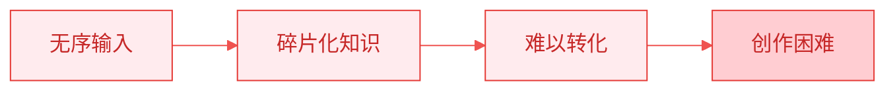

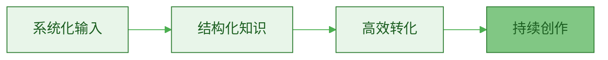

### 输入与输出的关系

> [!important] 创作的本质
> **创作 = 输入 × 加工 × 输出**

| 阶段 | 作用 | 重要性 |
|-----|------|--------|
| **输入** | 获取原材料 | 基础 |
| **加工** | 思考和提炼 | 核心 |
| **输出** | 创作和发布 | 结果 |

> [!danger] 常见误区
> **误区 1**：只关注输出，忽视输入
> - 结果：很快就写不出东西
> 
> **误区 2**：只输入不输出
> - 结果：知识无法转化，学了等于没学
> 
> **正确做法**：输入和输出形成正向循环

## 输入渠道的三个层次

### 第一层：表层信息（Information）

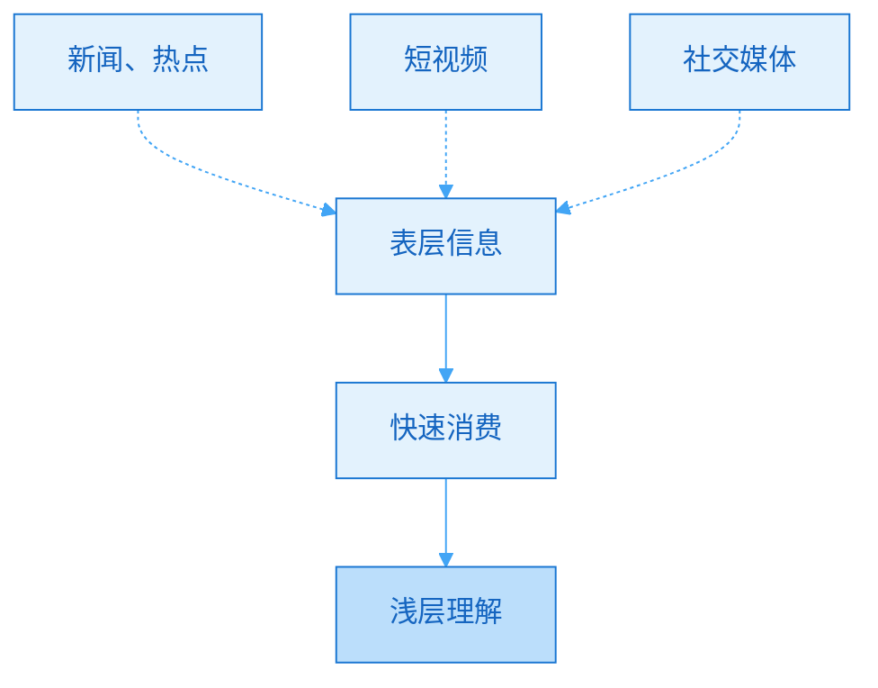

**特征**：
- 快速更新
- 碎片化
- 易遗忘
- 同质化

**价值**：
- ✅ 了解趋势
- ✅ 激发灵感
- ❌ 难以形成系统
- ❌ 很难差异化

**使用建议**：
- 时间占比：20%
- 用途：了解趋势、寻找话题
- 不要过度沉迷

### 第二层：深度知识（Knowledge）

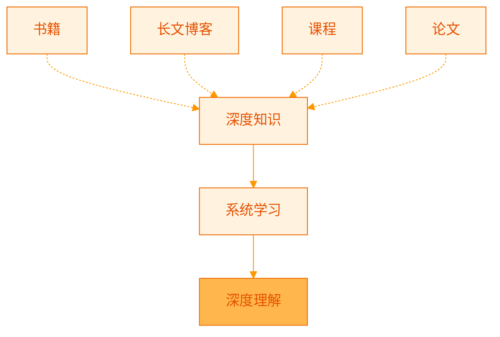

**特征**：
- 系统化
- 深入原理
- 需要时间
- 高质量

**价值**：
- ✅ 建立框架
- ✅ 理解本质
- ✅ 形成体系
- ✅ 差异化基础

**使用建议**：
- 时间占比：60%
- 用途：建立知识体系
- 核心输入来源

### 第三层：实践经验（Experience）

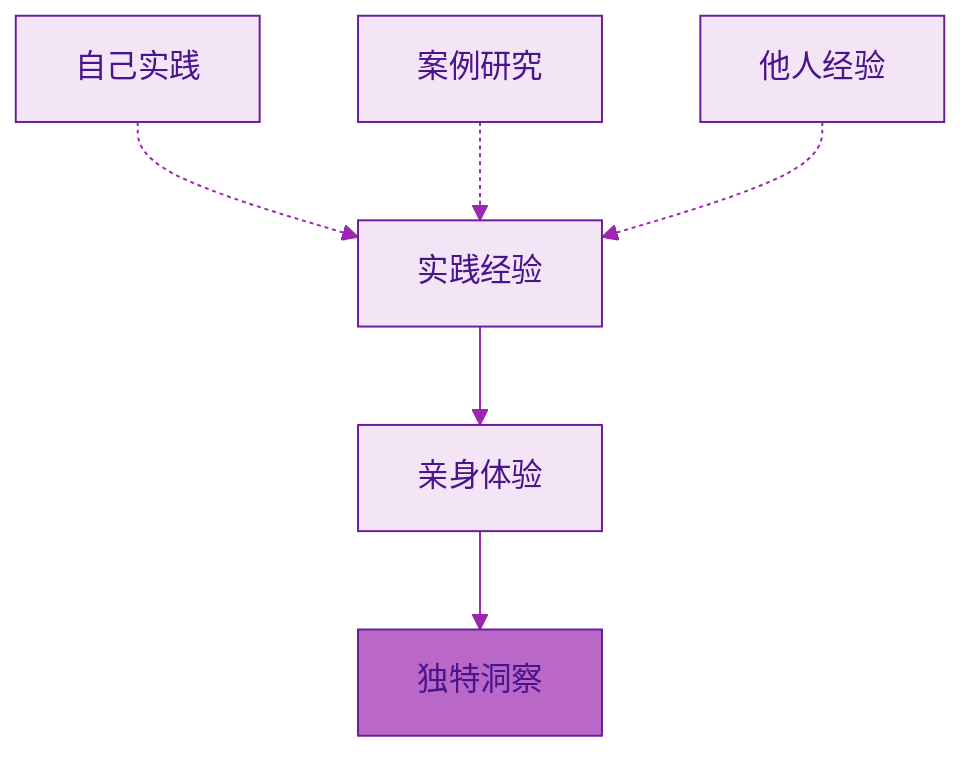

**特征**：
- 第一手
- 独特性
- 真实性
- 不可复制

**价值**：
- ✅ 最强差异化
- ✅ 最高可信度
- ✅ 最佳案例
- ✅ 原创洞察

**使用建议**：
- 时间占比：20%
- 用途：形成独特观点
- 最珍贵的输入

> [!success] 理想配比
> **20% 表层信息 + 60% 深度知识 + 20% 实践经验**

## 高质量输入渠道设计

### 渠道 1：书籍（Books）

> [!tip] 书籍的独特价值
> **系统性 + 深度 + 经过时间验证**

**选书策略**：

| 类型 | 占比 | 目的 | 示例 |
|-----|------|------|------|
| **经典书籍** | 40% | 建立基础框架 | 《思考，快与慢》《影响力》 |
| **专业书籍** | 40% | 深化专业知识 | 你领域的权威著作 |
| **跨界书籍** | 20% | 拓展视野 | 其他领域的经典 |

**阅读方法**：

> [!check] 三遍读书法
> 
> **第一遍：快速浏览**
> - 看目录和结构
> - 找出核心观点
> - 确定重点章节
> - 时间：1-2 小时
> 
> **第二遍：重点精读**
> - 深读重点章节
> - 做笔记和标注
> - 思考和质疑
> - 时间：3-5 小时
> 
> **第三遍：输出转化**
> - 写读书笔记
> - 提炼可用观点
> - 连接已有知识
> - 时间：2-3 小时

**每月目标**：
- 精读 2-3 本书
- 泛读 5-10 本书
- 形成 5-10 篇笔记

### 渠道 2：深度博客/长文（Long-form Content）

> [!tip] 长文的优势
> **最新思想 + 实战经验 + 快速获取**

**寻找优质博客**：

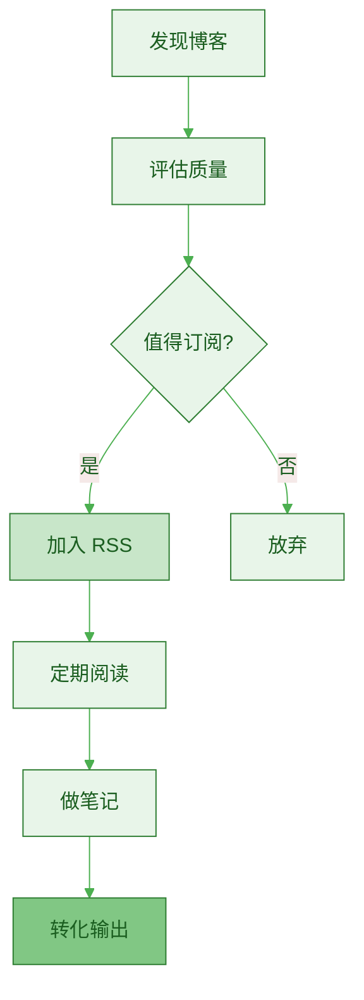

**评估标准**：

| 标准 | 说明 |
|-----|------|
| **深度** | 是否深入探讨原理？ |
| **原创** | 是否有独特洞察？ |
| **实战** | 是否有实际案例？ |
| **更新** | 是否持续更新？ |
| **价值** | 对我是否有用？ |

**推荐工具**：
- RSS 阅读器：Feedly, Inoreader
- 稍后阅读：Pocket, Instapaper
- 笔记工具：Obsidian, Notion

**每周目标**：
- 精读 5-10 篇深度文章
- 做 3-5 篇笔记
- 转化 1-2 个观点到自己的内容

### 渠道 3：优质课程（Online Courses）

> [!tip] 课程的价值
> **系统化 + 实操 + 快速入门**

**选课原则**：

> [!check] 选课清单
> 
> - [ ] 这个技能对我有长期价值吗？
> - [ ] 讲师是否有实战经验？
> - [ ] 课程是否系统化？
> - [ ] 是否有实操项目？
> - [ ] 性价比如何？

**学习策略**：

| 阶段 | 行动 | 时间 |
|-----|------|------|
| **学习前** | 明确目标，制定计划 | 30分钟 |
| **学习中** | 做笔记，完成练习 | 课程时长 |
| **学习后** | 输出总结，实际应用 | 2-3小时 |

**避免陷阱**：
- ❌ 收藏癖：买了不学
- ❌ 完美主义：学完才行动
- ❌ 贪多：同时学 10 个课程

> [!success] 正确做法
> **一次只学一个课程，边学边实践，学完立即输出。**

### 渠道 4：行业专家（Experts & Mentors）

> [!tip] 向专家学习
> **最快捷径 + 避免弯路 + 获得反馈**

**获取专家知识的方式**：

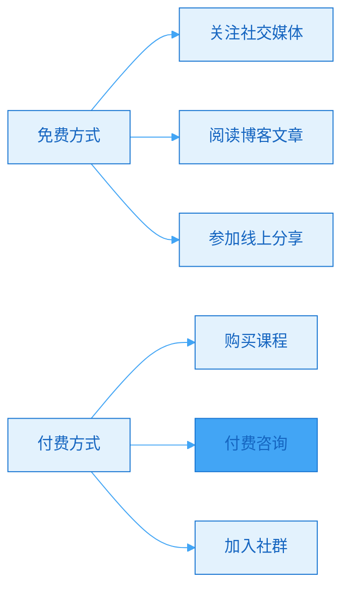

**选择专家的标准**：

| 标准 | 问题 |
|-----|------|
| **实战** | 他自己做成功了吗？ |
| **最新** | 他的经验是最近的吗？ |
| **教学** | 他善于教学吗？ |
| **价值观** | 我认同他的理念吗？ |

**最大化学习效果**：

> [!check] 行动清单
> 
> **学习前**：
> - [ ] 准备具体问题
> - [ ] 研究他的背景
> - [ ] 明确学习目标
> 
> **学习中**：
> - [ ] 记录关键洞察
> - [ ] 提问和互动
> - [ ] 收集案例
> 
> **学习后**：
> - [ ] 整理笔记
> - [ ] 立即实践
> - [ ] 输出总结

### 渠道 5：实践项目（Projects）

参考 [[3. MDFriday 实战记录/03.网站/Dan Koe/purpose-profit/07-progress-and-knowledge|进步与知识]]：

> [!quote] 实践的价值
> "通过构建和应用所学知识来填补知识空白。将技能应用于个人品牌建设是最好的永久、无需许可的学徒训练。"

**项目式学习**：

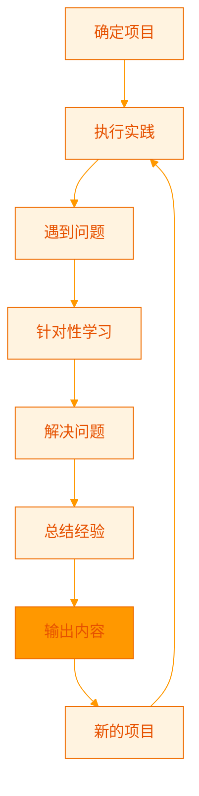

**项目选择**：

| 类型 | 示例 | 学习价值 |
|-----|------|---------|
| **产品类** | 开发一个工具 | 技术 + 产品思维 |
| **内容类** | 写 50 篇文章 | 写作 + 领域知识 |
| **营销类** | 从 0 到 1000 粉 | 营销 + 增长 |
| **服务类** | 服务 10 个客户 | 咨询 + 沟通 |

> [!success] 项目的复利
> **项目产出 = 实践经验 + 案例素材 + 输出内容**
> 
> 一个项目可以输出：
> - 5-10 篇文章（记录过程）
> - 1 个案例研究
> - 1 套方法论
> - 多个可复用的模板/工具

## 输入系统的搭建

### 第一步：建立信息流（Information Flow）

> [!check] 搭建流程
> 
> **1. 确定渠道**
> - [ ] 选择 5-10 个优质博客
> - [ ] 选择 3-5 本核心书籍
> - [ ] 关注 10-20 个专家
> - [ ] 规划 1-2 个实践项目
> 
> **2. 设置工具**
> - [ ] RSS 阅读器（订阅博客）
> - [ ] 稍后阅读（保存文章）
> - [ ] 笔记系统（Obsidian）
> - [ ] 日历提醒（定期学习）
> 
> **3. 建立习惯**
> - [ ] 每天固定时间阅读
> - [ ] 每周固定时间深度学习
> - [ ] 每月复盘和调整

### 第二步：信息过滤（Filtering）

> [!important] 过滤原则
> **不是所有信息都值得你的时间。**

**三层过滤机制**：

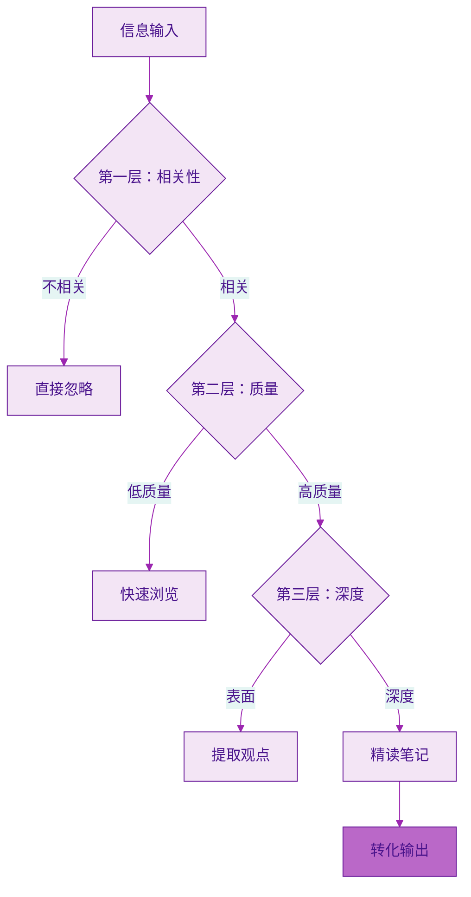

**过滤标准**：

| 层次 | 问题 | 行动 |
|-----|------|------|
| **相关性** | 与我的目标相关吗？ | 不相关直接跳过 |
| **质量** | 有独特价值吗？ | 低质量快速浏览 |
| **深度** | 值得深入学习吗？ | 高价值精读笔记 |

### 第三步：笔记系统（Note-taking）

参考 [[../04.内容就是资产/b.长文作为知识数据库|长文作为知识数据库]]：

> [!tip] 笔记不是为了记录，而是为了思考和创作

**笔记方法**：

**1. 卡片笔记法（Zettelkasten）**

```
每个笔记：
- 一个核心观点
- 用自己的话总结
- 链接到相关笔记
- 标注来源

示例：
---
title: 复利的本质
date: 2026-03-06
source: [[书籍名]]
---

复利不是线性增长，而是指数增长。
关键在于持续和时间。

相关笔记：
- [[时间复利逻辑]]
- [[内容资产积累]]
```

**2. 康奈尔笔记法**

| 区域 | 用途 |
|-----|------|
| **关键词** | 核心概念 |
| **笔记** | 详细内容 |
| **总结** | 一句话概括 |

**3. 思维导图**

- 适合梳理系统性知识
- 可视化知识结构
- 发现知识空缺

### 第四步：定期复习（Review）

> [!important] 艾宾浩斯遗忘曲线
> **不复习，7 天后遗忘 70%**

**复习计划**：

| 时间 | 行动 | 目的 |
|-----|------|------|
| **当天** | 快速回顾笔记 | 巩固记忆 |
| **3天后** | 尝试回忆 | 检验理解 |
| **1周后** | 输出内容 | 深化应用 |
| **1月后** | 系统复盘 | 整合知识 |

## 每周输入时间分配

> [!check] 标准配置（每周 10 小时）
> 
> **书籍阅读**（3小时）：
> - 周一-周五，每天 30 分钟
> - 周末集中 1 小时
> 
> **深度文章**（2小时）：
> - 每天 15-20 分钟
> 
> **课程学习**（2小时）：
> - 周末集中学习
> 
> **实践项目**（2小时）：
> - 边做边学
> 
> **笔记整理**（1小时）：
> - 周日复盘总结

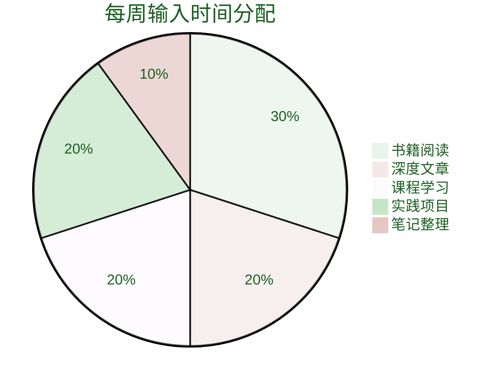

## 输入到输出的转化

### 转化流程

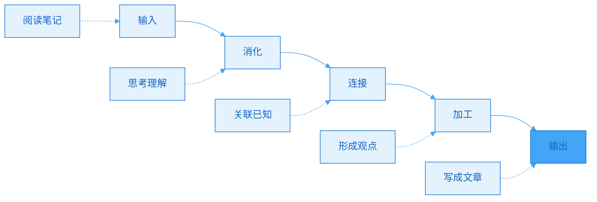

### 转化率提升

> [!tip] 提高转化率的方法
> 
> **1. 带着问题学习**
> - 我想解决什么问题？
> - 我想了解什么？
> - 我能用在哪里？
> 
> **2. 立即应用**
> - 学到新概念，马上举例
> - 学到新方法，立即实践
> - 学到新观点，写成文章
> 
> **3. 输出倒逼输入**
> - 先定下周要写的主题
> - 针对性寻找素材
> - 学习效率提升 3 倍

### 输入输出比例

| 阶段 | 输入 | 输出 | 目标 |
|-----|------|------|------|
| **初期（0-6月）** | 70% | 30% | 积累基础 |
| **成长期（6-18月）** | 50% | 50% | 平衡发展 |
| **成熟期（18月+）** | 30% | 70% | 深度创作 |

> [!success] 理想状态
> **输入和输出形成正向循环**：
> - 输出促进输入（发现知识空白）
> - 输入支撑输出（提供素材）
> - 互相强化，螺旋上升

## 常见问题

### Q1：信息太多，看不过来怎么办？

> [!tip] 质量 > 数量
> 
> **不要贪多**：
> - 精选 5-10 个优质渠道
> - 深度阅读，而非浅层浏览
> - 关注经典，而非追逐热点
> 
> **记住：读 1 本好书 > 读 10 本普通书**

### Q2：如何判断信息质量？

> [!check] 快速判断标准
> 
> - [ ] 有独特洞察吗？（不是常识）
> - [ ] 有深度分析吗？（不是表面）
> - [ ] 有实际案例吗？（不是空谈）
> - [ ] 逻辑严密吗？（不是胡扯）
> - [ ] 对我有用吗？（不是无关）
> 
> **3 个"否"以上，果断放弃。**

### Q3：没时间怎么办？

> [!success] 时间管理
> 
> **碎片时间**：
> - 通勤：听播客/有声书
> - 排队：看短文章
> - 睡前：阅读 15 分钟
> 
> **整块时间**：
> - 周末：深度学习
> - 早晨：精读书籍
> 
> **每天 1 小时 = 每年 365 小时 = 50 本书**

## 行动指南

### 本周行动

> [!check] 立即开始
> 
> **Day 1-2：设计渠道**
> - [ ] 列出当前信息来源
> - [ ] 评估质量，删除低质量渠道
> - [ ] 添加 5 个优质渠道
> 
> **Day 3-5：搭建系统**
> - [ ] 设置 RSS 阅读器
> - [ ] 建立 Obsidian 笔记系统
> - [ ] 制定每日阅读计划
> 
> **Day 6-7：开始执行**
> - [ ] 阅读 2-3 篇深度文章
> - [ ] 做笔记
> - [ ] 尝试输出 1 篇内容

### 第一个月

| 周 | 重点 | 目标 |
|----|------|------|
| **Week 1** | 建立渠道 | 完成系统搭建 |
| **Week 2** | 养成习惯 | 每天阅读 30 分钟 |
| **Week 3** | 提高质量 | 深度笔记 5 篇 |
| **Week 4** | 输出转化 | 输出 2 篇文章 |

## 总结

> [!quote] 核心认知
> "输入决定输出的质量。
> 
> 系统化输入是持续创作的基础。
> 
> 不是输入越多越好，而是输入越精越好。"

### 核心要点

> [!important] 记住这五点
> 
> 1. **输入是创作的基础**
>    - 没有输入就没有输出
> 
> 2. **质量 > 数量**
>    - 精选渠道，深度学习
> 
> 3. **系统 > 随机**
>    - 建立稳定的输入系统
> 
> 4. **输出倒逼输入**
>    - 带着目的去学习
> 
> 5. **实践是最好的输入**
>    - 做项目，积累经验

### 下一步阅读

- [[b.信息过滤机制|信息过滤机制]]
- [[c.资产潜力判断标准|资产潜力判断标准]]
- [[../06.长文创作/a.长文为何是飞轮中心|长文为何是飞轮中心]]

---

**建立系统化输入，为持续创作打下坚实基础。**
