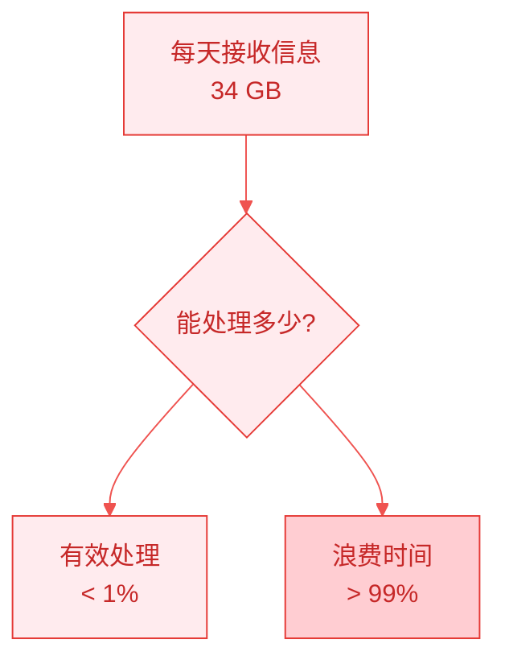
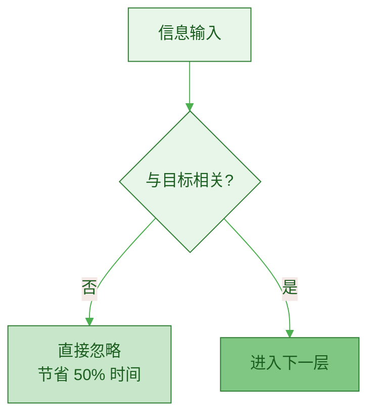
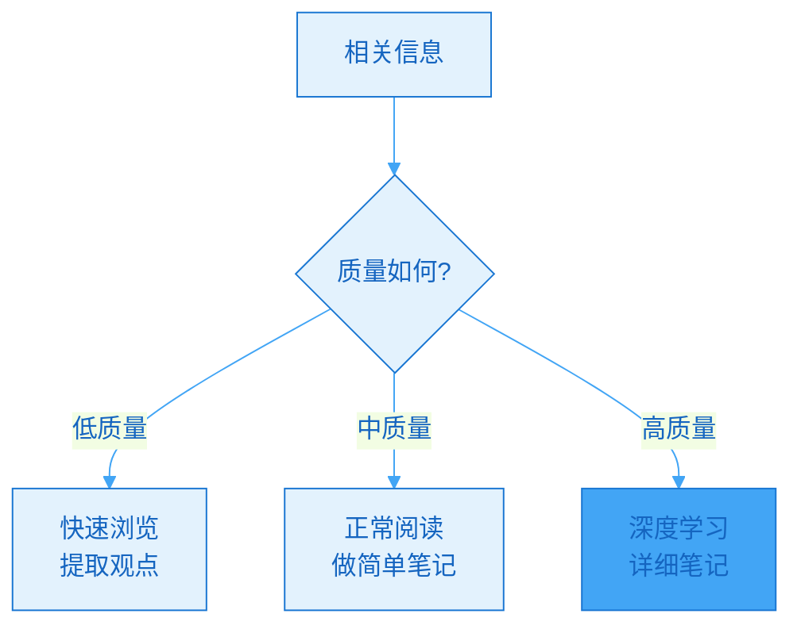
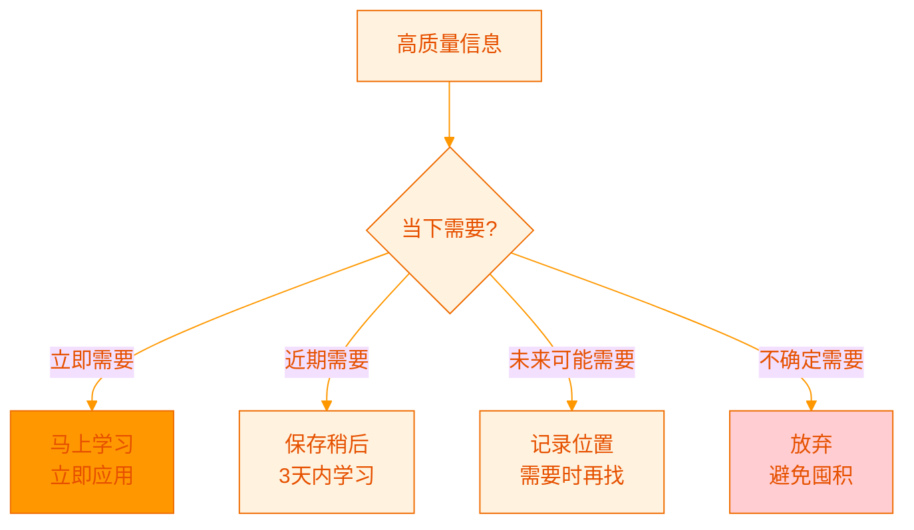
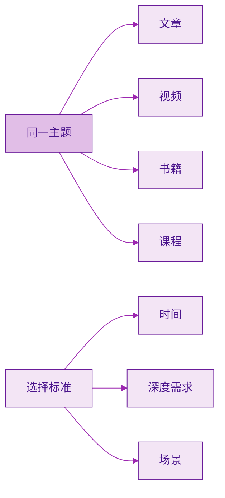
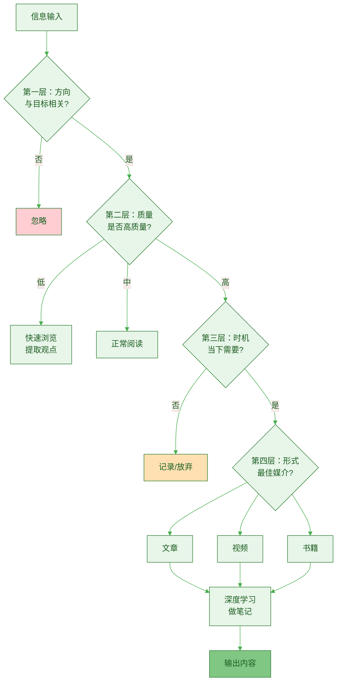

> [!quote] 信息时代的挑战
> "我们生活在信息时代，虽然机遇无数，但信息也铺天盖地而来，导致心智倾向于混乱（熵）。"
> ——来自 [[3. MDFriday 实战记录/03.网站/Dan Koe/视频笔记/6|产品构建系统]]

## 信息过载的真相

### 数据触目惊心

**每天产生的信息量**：
- 全球：2.5 万亿字节
- 个人接收：约 34 GB
- 可处理：< 1%



> [!danger] 信息过载的代价
> 
> **时间成本**：
> - 平均每天 6 小时在信息消费上
> - 其中 5 小时是低价值信息
> - 每年浪费 1825 小时
> 
> **认知成本**：
> - 注意力碎片化
> - 无法深度思考
> - 决策疲劳
> - 焦虑和压力

### 问题的根源

> [!warning] 三大陷阱
> 
> **1. 无目的消费**
> - 随便刷刷
> - 看看有什么新鲜事
> - 结果：浪费时间，收获甚微
> 
> **2. FOMO（错过恐惧）**
> - 害怕错过重要信息
> - 订阅太多渠道
> - 结果：信息过载，反而错过真正重要的
> 
> **3. 收集癖**
> - 什么都想保存
> - "以后可能用得上"
> - 结果：收藏夹爆满，从不回看

## 信息过滤的四层模型

### 第一层：方向过滤（Direction Filter）

> [!important] 最重要的过滤
> **只关注与你目标相关的信息。**



**判断标准**：

> [!check] 三个问题
> 
> 1. **这条信息与我的目标相关吗？**
>    - 我的目标：建立一人公司
>    - 相关：内容创作、产品化、营销
>    - 不相关：娱乐八卦、无关领域
> 
> 2. **这条信息能帮我解决当前问题吗？**
>    - 当前问题：提高写作质量
>    - 相关：写作技巧、内容框架
>    - 不相关：视频剪辑（虽然也是创作）
> 
> 3. **这条信息能让我更接近目标吗？**
>    - 直接相关：是
>    - 间接相关：看情况
>    - 无关：否

**实践案例**：

| 信息 | 相关性判断 | 行动 |
|-----|----------|------|
| "一人公司盈利模式" | ✅ 直接相关 | 精读 |
| "写作的底层逻辑" | ✅ 直接相关 | 精读 |
| "AI 工具推荐" | ⚠️ 间接相关 | 快速浏览 |
| "明星八卦" | ❌ 完全无关 | 直接忽略 |

> [!success] 方向过滤的威力
> **过滤掉 50-60% 的无关信息，节省大量时间。**

### 第二层：质量过滤（Quality Filter）

> [!tip] 识别高质量信息
> **不是所有相关信息都值得你的时间。**



**质量评估标准**：

| 维度 | 低质量 | 高质量 |
|-----|--------|--------|
| **深度** | 表面、常识 | 深入本质、原理 |
| **原创** | 重复别人观点 | 独特洞察 |
| **论证** | 空谈、无依据 | 逻辑严密、有案例 |
| **实用** | 理论、不可操作 | 可执行的方法 |
| **来源** | 不知名作者 | 权威专家、实践者 |

**快速判断技巧**：

> [!check] 10 秒质量检查
> 
> **看标题**：
> - ❌ "3 招快速涨粉"（标题党）
> - ✅ "内容增长的底层逻辑"（有深度）
> 
> **看开头**：
> - ❌ "大家好，今天分享..."（废话）
> - ✅ 直接切入核心问题（高效）
> 
> **看结构**：
> - ❌ 流水账、无结构
> - ✅ 清晰的框架和逻辑
> 
> **看作者**：
> - ❌ 无实战经验
> - ✅ 有成功案例

> [!success] 质量过滤的效果
> **过滤掉 30-40% 的低质量信息，聚焦精华。**

### 第三层：时机过滤（Timing Filter）

> [!tip] 正确的信息在错误的时间 = 噪音
> **即使是好信息，也要在对的时候学。**



**时机判断**：

| 紧急程度 | 说明 | 行动 |
|---------|------|------|
| **立即需要** | 解决当前问题 | 马上学习 |
| **3天内需要** | 即将开始的项目 | 保存，计划学习 |
| **1月内需要** | 短期规划 | 记录位置，设提醒 |
| **未来可能** | 不确定 | 不保存，需要时搜索 |
| **不需要** | 与计划无关 | 直接放弃 |

> [!warning] 避免囤积
> 
> **囤积症候群**：
> - "这个以后可能用得上"
> - "先收藏着，有空再看"
> - 结果：收藏夹上千条，从不回看
> 
> **正确做法**：
> - 当下不需要 = 不保存
> - 需要时再搜索
> - 信任互联网的记忆

### 第四层：形式过滤（Format Filter）

> [!tip] 同样的信息，选择最高效的形式
> **根据场景选择最合适的媒介。**



**形式对比**：

| 形式 | 优势 | 劣势 | 适合场景 |
|-----|------|------|---------|
| **文章** | 快速、可搜索 | 深度有限 | 快速了解概念 |
| **视频** | 直观、易理解 | 速度慢、难回顾 | 演示操作 |
| **书籍** | 系统、深度 | 时间长 | 建立完整认知 |
| **课程** | 结构化、实操 | 成本高 | 系统学习技能 |
| **播客** | 碎片时间 | 信息密度低 | 通勤时间 |

**选择策略**：

> [!check] 场景匹配
> 
> **深度学习时刻**（专注时间）：
> - ✅ 书籍、深度文章
> - ✅ 在线课程
> - ❌ 短视频、碎片内容
> 
> **碎片时间**（通勤、排队）：
> - ✅ 播客、有声书
> - ✅ 短文章
> - ❌ 需要深度思考的内容
> 
> **操作学习**（学技能）：
> - ✅ 视频教程
> - ✅ 实操课程
> - ⚠️ 纯文字（效率低）

## 实战过滤流程

### 完整流程图



### 实际案例演示

> [!example] 案例 1：刷到一篇"AI 工具推荐"
> 
> **第一层：方向过滤**
> - 问：与我的目标相关吗？
> - 我的目标：建立内容创作系统
> - 判断：✅ 相关（工具可能提高效率）
> - 行动：继续评估
> 
> **第二层：质量过滤**
> - 看标题："10 个最新 AI 工具"
> - 看开头：直接列举工具，无深度分析
> - 判断：⚠️ 中等质量（有参考价值但不深入）
> - 行动：快速浏览，记录 2-3 个可能有用的
> 
> **第三层：时机过滤**
> - 问：当下需要吗？
> - 现状：现有工具够用
> - 判断：❌ 不是立即需要
> - 行动：放弃，需要时再搜索
> 
> **结果**：花费 2 分钟，收获有限但不浪费时间

> [!example] 案例 2：发现一篇"内容创作的底层逻辑"
> 
> **第一层：方向过滤**
> - 判断：✅ 直接相关（核心主题）
> 
> **第二层：质量过滤**
> - 作者：业内知名创作者
> - 内容：3000 字深度文章，有框架有案例
> - 判断：✅ 高质量
> 
> **第三层：时机过滤**
> - 判断：✅ 立即需要（正在优化创作系统）
> 
> **第四层：形式过滤**
> - 形式：深度文章
> - 场景：有 30 分钟专注时间
> - 判断：✅ 完美匹配
> 
> **结果**：精读 30 分钟，做笔记 15 分钟，转化为 1 篇文章

## 信息过滤的工具和技巧

### 工具 1：RSS 阅读器的过滤规则

> [!tip] 自动化过滤
> **用工具代替人工筛选。**

**Feedly/Inoreader 过滤设置**：

```
优先级规则：
- 高优先级：特定作者、特定关键词
- 中优先级：订阅源默认
- 低优先级：广告、推广

自动标记：
- 包含"深度"、"原理"、"系统" → 高优先级
- 包含"快速"、"技巧"、"10个" → 低优先级

自动归档：
- 7 天未读 → 自动归档（说明不重要）
```

### 工具 2：浏览器插件

| 插件 | 功能 | 效果 |
|-----|------|------|
| **LeechBlock** | 屏蔽分散注意力的网站 | 避免无目的浏览 |
| **StayFocusd** | 限制每日访问时间 | 控制社交媒体时间 |
| **Pocket** | 稍后阅读 | 避免即时阅读压力 |
| **Reader Mode** | 去除干扰 | 专注内容本身 |

### 工具 3：笔记系统的标签体系

> [!check] Obsidian 标签策略
> 
> **优先级标签**：
> - #high-priority：高价值，需精读
> - #medium-priority：中等价值
> - #low-priority：快速浏览
> 
> **主题标签**：
> - #content-creation
> - #product
> - #marketing
> 
> **状态标签**：
> - #to-read
> - #reading
> - #completed
> - #to-revisit

### 技巧：批处理而非即时处理

> [!important] 批处理的威力
> **集中处理信息，避免打断。**

```mermaid
%%{init: {'theme':'base', 'themeVariables': { 'cScale0':'#e1f5ff', 'cScale1':'#b3e5fc', 'cScale2':'#81d4fa', 'cScale3':'#4fc3f7', 'cScale4':'#29b6f6'}}}%%
timeline
    title 一天的信息处理时间块
    08:00-09:00 : 深度阅读时间
                : 精读 2-3 篇文章
    12:00-12:30 : 快速浏览
                : RSS 新内容
    17:00-17:30 : 信息整理
                : 做笔记、归档
    其他时间 : 专注创作
             : 关闭所有信息源
```

**对比**：

| 模式 | 即时处理 | 批处理 |
|-----|---------|--------|
| **打断** | 频繁 | 少 |
| **效率** | 低（切换成本高） | 高 |
| **专注** | 难以专注 | 容易专注 |
| **质量** | 浅层阅读 | 深度阅读 |

## 建立个人过滤清单

### 快速决策清单

> [!check] 60 秒决策流程
> 
> **遇到新信息时，依次问自己**：
> 
> 1. **与目标相关吗？**（10秒）
>    - 否 → 忽略
>    - 是 → 继续
> 
> 2. **质量如何？**（20秒）
>    - 看标题、作者、开头
>    - 低 → 快速浏览
>    - 高 → 继续
> 
> 3. **当下需要吗？**（10秒）
>    - 否 → 放弃/记录
>    - 是 → 继续
> 
> 4. **最佳形式？**（10秒）
>    - 选择合适的媒介
> 
> 5. **何时处理？**（10秒）
>    - 立即 or 稍后
> 
> **总计 60 秒，做出明智决策。**

### 个性化标准

每个人的标准不同，建立你自己的：

> [!tip] 制定个人标准
> 
> **我的目标是**：___________
> 
> **必读主题**：
> - [ ] 主题 1
> - [ ] 主题 2
> - [ ] 主题 3
> 
> **必关注作者**：
> - [ ] 作者 1
> - [ ] 作者 2
> 
> **自动忽略**：
> - [ ] 娱乐八卦
> - [ ] 负面新闻
> - [ ] 标题党内容

## 常见问题

### Q1：会不会错过重要信息？

> [!success] FOMO 的解药
> 
> **真相**：
> - 真正重要的信息会反复出现
> - 你不需要知道所有事情
> - 专注比广博更重要
> 
> **策略**：
> - 定期（每季度）回顾主要趋势
> - 加入优质社群，重要信息会被讨论
> - 信任你的过滤系统

### Q2：过滤掉的信息怎么办？

> [!tip] 不要有负罪感
> 
> **记住**：
> - 放弃 ≠ 浪费
> - 节省时间 = 创造价值
> - 过滤的信息远比阅读的多
> 
> **数据**：
> - 顶级创作者：阅读量 < 1%
> - 普通人：试图阅读 > 10%
> - 结果：顶级创作者产出更多

### Q3：如何培养过滤习惯？

> [!check] 21 天养成计划
> 
> **Week 1：建立意识**
> - 每次阅读前，问："这与我目标相关吗？"
> - 记录过滤掉的信息数量
> 
> **Week 2：加强标准**
> - 使用完整的四层过滤
> - 计时，控制在 60 秒内决策
> 
> **Week 3：自动化**
> - 设置工具过滤规则
> - 过滤变成潜意识习惯

## 行动指南

### 本周行动

> [!check] 立即实施
> 
> **Day 1：建立标准**
> - [ ] 明确你的 3 个核心目标
> - [ ] 列出 5 个必读主题
> - [ ] 列出 10 个自动忽略主题
> 
> **Day 2-3：设置工具**
> - [ ] 配置 RSS 阅读器过滤规则
> - [ ] 安装浏览器插件
> - [ ] 设置批处理时间
> 
> **Day 4-7：刻意练习**
> - [ ] 每次遇到新信息，走完四层过滤
> - [ ] 记录决策时间（目标 < 60秒）
> - [ ] 统计过滤效果

### 效果评估

**1 周后对比**：

| 指标 | 之前 | 之后 | 改善 |
|-----|------|------|------|
| 日阅读时间 | 3小时 | 1小时 | -67% |
| 高质量内容占比 | 20% | 80% | +300% |
| 笔记产出 | 1篇/周 | 5篇/周 | +400% |
| 内容输出 | 1篇/周 | 2篇/周 | +100% |

## 总结

> [!quote] 核心认知
> "信息不是越多越好，而是越精越好。
> 
> 过滤不是损失，而是聚焦。
> 
> 少即是多。"

### 四层过滤模型

| 层次 | 问题 | 过滤率 | 累计保留 |
|-----|------|--------|---------|
| **方向** | 相关吗？ | 50% | 50% |
| **质量** | 高质量吗？ | 30% | 35% |
| **时机** | 需要吗？ | 20% | 28% |
| **形式** | 合适吗？ | 5% | 27% |

**最终结果：100 条信息 → 27 条值得深入学习**

### 核心要点

> [!important] 记住这五点
> 
> 1. **过滤 > 收集**
>    - 好的信息系统在于过滤，不在于收集
> 
> 2. **方向第一**
>    - 与目标无关的，直接忽略
> 
> 3. **质量优先**
>    - 1 篇高质量 > 10 篇低质量
> 
> 4. **批处理**
>    - 集中时间处理，避免打断
> 
> 5. **无负罪感**
>    - 放弃大部分信息是正确的

### 下一步阅读

- [[c.资产潜力判断标准|资产潜力判断标准]]
- [[../06.长文创作/a.长文为何是飞轮中心|长文为何是飞轮中心]]
- [[../04.内容就是资产/c.深度思考的商业价值|深度思考的商业价值]]

---

**建立强大的过滤系统，让信息为你服务，而不是淹没你。**
