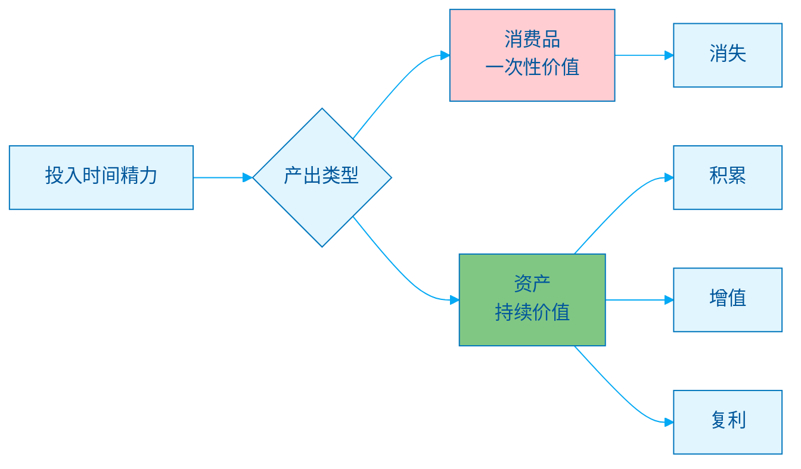
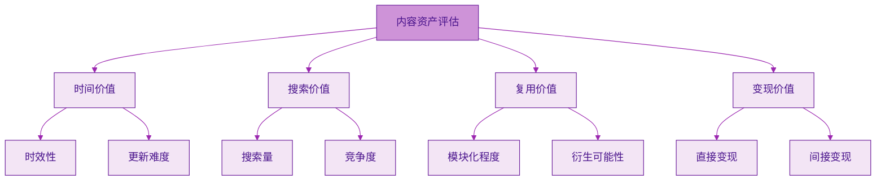
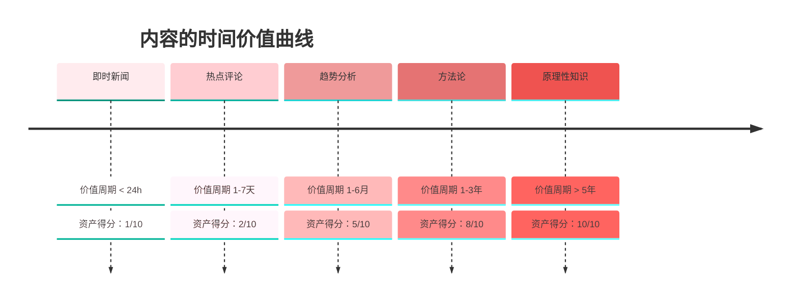
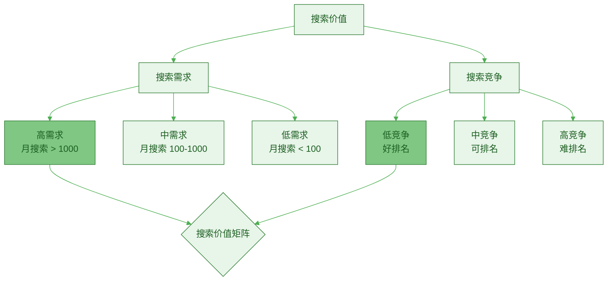
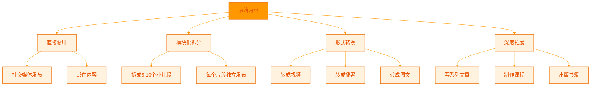
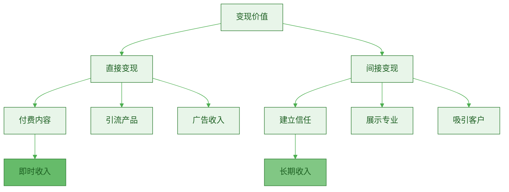
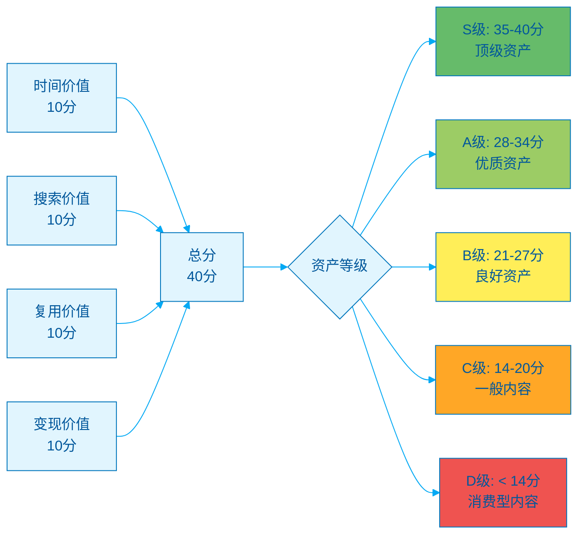
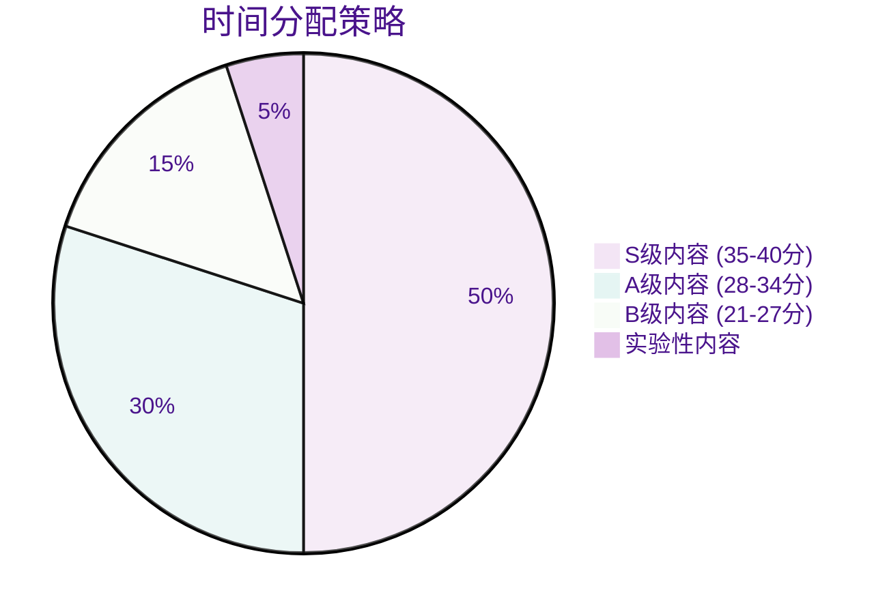

> [!quote] 资产思维
> "你需要建立可以积累、增长、持续为你带来回报的资产。"
> ——来自 [[3. MDFriday 实战记录/03.网站/Dan Koe/视频笔记/29|被动收入的真相]]

## 什么是"资产"？

### 资产 vs 消费品

> [!important] 核心区别
> 
> **消费品**：
> - 消费后消失
> - 无法重复使用
> - 不产生回报
> 
> **资产**：
> - 持续存在
> - 可重复使用
> - 产生持续回报



### 内容资产的特征

> [!check] 真正的内容资产
> 
> 具备以下特征：
> 
> 1. **长期价值**
>    - 1 年后仍然有效
>    - 3 年后仍有参考价值
> 
> 2. **可发现性**
>    - 能被搜索引擎找到
>    - 能被推荐算法推荐
> 
> 3. **可复用性**
>    - 可以重新编辑
>    - 可以组合成新内容
> 
> 4. **可衍生性**
>    - 可以拓展成系列
>    - 可以改编成不同形式

## 资产潜力评估模型

### 四维评估框架



### 维度 1：时间价值（Time Value）

> [!tip] 评估标准
> **这个内容能保持价值多久？**



**评分标准**：

| 得分 | 价值周期 | 类型 | 示例 |
|-----|---------|------|------|
| **1-2 分** | < 1 周 | 即时内容 | "今天某某发生了什么" |
| **3-4 分** | 1-3 月 | 热点内容 | "2026年AI工具推荐" |
| **5-6 分** | 3-12 月 | 趋势内容 | "2026年内容营销趋势" |
| **7-8 分** | 1-3 年 | 方法论 | "内容创作的系统方法" |
| **9-10 分** | > 3 年 | 原理性 | "说服的心理学原理" |

> [!example] 案例对比
> 
> **低分内容**（2分）：
> - "ChatGPT 4.5 今天发布了"
> - 时效性强，几天后就过时
> 
> **高分内容**（9分）：
> - "如何建立个人知识系统"
> - 原理性内容，长期有效

**判断技巧**：

> [!check] 三个问题
> 
> 1. **去掉时间，内容还有效吗？**
>    - 如："2026年"去掉后仍然有效 → 高分
> 
> 2. **需要频繁更新吗？**
>    - 需要每月更新 → 低分
>    - 可保持 1-2 年 → 高分
> 
> 3. **涉及原理还是表象？**
>    - 原理性（Why/How）→ 高分
>    - 表象性（What）→ 低分

### 维度 2：搜索价值（Search Value）

> [!tip] 评估标准
> **这个内容能被多少人通过搜索找到？**



**搜索价值矩阵**：

|  | 低竞争 | 中竞争 | 高竞争 |
|---|--------|--------|--------|
| **高需求** | ⭐⭐⭐⭐⭐<br/>最佳机会 | ⭐⭐⭐⭐<br/>值得尝试 | ⭐⭐⭐<br/>需要实力 |
| **中需求** | ⭐⭐⭐⭐<br/>不错机会 | ⭐⭐⭐<br/>一般 | ⭐⭐<br/>不建议 |
| **低需求** | ⭐⭐⭐<br/>小众 | ⭐⭐<br/>价值低 | ⭐<br/>放弃 |

**判断工具和方法**：

> [!check] 搜索需求判断
> 
> **工具**：
> - Google Keyword Planner
> - Ahrefs / SEMrush
> - 百度指数
> - Google Trends
> 
> **步骤**：
> 1. 列出主要关键词
> 2. 查询月搜索量
> 3. 分析搜索趋势（上升/下降）
> 4. 查看相关搜索

> [!check] 搜索竞争判断
> 
> **简单方法**：
> 1. Google 搜索关键词
> 2. 看首页结果质量
> 3. 评估竞争程度：
>    - 首页全是大网站 → 高竞争
>    - 首页有中小网站 → 中竞争
>    - 首页结果质量一般 → 低竞争

**评分标准**：

| 得分 | 月搜索量 | 竞争度 | 排名难度 |
|-----|---------|--------|---------|
| **9-10 分** | > 1000 | 低 | 容易 |
| **7-8 分** | 500-1000 | 低-中 | 中等 |
| **5-6 分** | 100-500 | 中 | 中等 |
| **3-4 分** | 50-100 | 高 | 困难 |
| **1-2 分** | < 50 | 高 | 极难 |

> [!example] 案例
> 
> **高分内容**（9分）：
> - "如何写好一篇文章"
> - 月搜索：5000+
> - 竞争：中等（可以通过深度取胜）
> 
> **低分内容**（3分）：
> - "AI 提示词大全"
> - 月搜索：10000+
> - 竞争：极高（大平台占据首页）

### 维度 3：复用价值（Reuse Value）

> [!tip] 评估标准
> **这个内容能被重复使用、组合、衍生多少次？**



**复用维度**：

| 复用方式 | 价值 | 难度 | 示例 |
|---------|------|------|------|
| **直接复用** | ⭐⭐ | 低 | 发到不同平台 |
| **拆分复用** | ⭐⭐⭐ | 低 | 拆成短内容 |
| **形式转换** | ⭐⭐⭐⭐ | 中 | 长文 → 视频 |
| **组合复用** | ⭐⭐⭐⭐ | 中 | 多篇文章 → 电子书 |
| **深度拓展** | ⭐⭐⭐⭐⭐ | 高 | 文章 → 课程 |

**评分标准**：

| 得分 | 复用可能性 | 特征 |
|-----|-----------|------|
| **9-10 分** | 极高 | 模块化、可拆可合、可多形式转换 |
| **7-8 分** | 高 | 可拆分、可转换 2-3 种形式 |
| **5-6 分** | 中 | 可简单拆分或转换 |
| **3-4 分** | 低 | 难以拆分，形式单一 |
| **1-2 分** | 极低 | 无法复用 |

> [!example] 高复用价值内容
> 
> **案例："一人公司的底层模型"（9分）**
> 
> **直接复用**：
> - 发布到博客、公众号、知乎
> 
> **拆分复用**：
> - 拆成 10 条短内容（品牌、内容、产品、系统）
> - 每条可独立发布
> 
> **形式转换**：
> - 录成视频（15 分钟）
> - 做成 PPT（演讲用）
> - 制作信息图（可视化）
> 
> **组合复用**：
> - 与其他文章组合成"一人公司指南"
> 
> **深度拓展**：
> - 每个模块展开成独立课程
> - 最终形成完整课程体系

> [!tip] 提高复用价值的技巧
> 
> **模块化写作**：
> - 每个章节可独立理解
> - 清晰的小标题
> - 可拆分的段落
> 
> **留白设计**：
> - 预留拓展空间
> - 设计系列潜力
> 
> **格式友好**：
> - 文字 + 图表
> - 可视化元素
> - 便于转换形式

### 维度 4：变现价值（Monetization Value)

> [!tip] 评估标准
> **这个内容能带来多少商业价值？**



**变现路径**：

| 路径 | 方式 | 收入类型 | 难度 |
|-----|------|---------|------|
| **直接变现** | 付费文章/课程 | 即时 | 高 |
| **引流变现** | 免费内容 → 付费产品 | 中期 | 中 |
| **信任变现** | 持续输出 → 高价服务 | 长期 | 低 |
| **流量变现** | 广告、联盟 | 持续 | 低 |

**评分标准**：

| 得分 | 变现潜力 | 特征 |
|-----|---------|------|
| **9-10 分** | 极高 | 可直接付费 + 引流高价产品 |
| **7-8 分** | 高 | 强引流能力 |
| **5-6 分** | 中 | 可建立信任 |
| **3-4 分** | 低 | 只能获得流量 |
| **1-2 分** | 极低 | 难以变现 |

> [!example] 变现价值对比
> 
> **高分内容**（9分）：
> - "如何从0到1建立一人公司"
> - **直接变现**：可做付费课程（¥199-999）
> - **间接变现**：引流咨询服务（¥5000+）
> - **长期价值**：建立权威，吸引客户
> 
> **低分内容**（2分）：
> - "今天的随笔日记"
> - 难以直接变现
> - 引流能力弱
> - 主要是个人表达

**判断技巧**：

> [!check] 四个问题
> 
> 1. **有人会为这个内容付费吗？**
>    - 是 → 至少 7 分
>    - 否 → 继续评估
> 
> 2. **能引导读者购买相关产品吗？**
>    - 强引导 → 8 分
>    - 中引导 → 6 分
>    - 弱引导 → 4 分
> 
> 3. **能建立专业信任吗？**
>    - 强专业性 → +2 分
>    - 一般 → +1 分
> 
> 4. **能带来精准流量吗？**
>    - 精准（付费意向高）→ +1 分
>    - 泛流量 → +0 分

## 综合评估模型

### 资产潜力总分计算



### 资产等级标准

| 等级 | 总分 | 策略 | 时间分配 |
|-----|------|------|---------|
| **S 级** | 35-40 | 全力投入，持续优化 | 50% |
| **A 级** | 28-34 | 重点投入 | 30% |
| **B 级** | 21-27 | 适度投入 | 15% |
| **C 级** | 14-20 | 少量投入 | 5% |
| **D 级** | < 14 | 不建议投入 | 0% |

### 评估案例

> [!example] 案例 1："如何建立个人知识管理系统"
> 
> **时间价值：9 分**
> - 原理性内容，3 年以上价值
> 
> **搜索价值：8 分**
> - 月搜索 1000+
> - 竞争中等，可通过深度取胜
> 
> **复用价值：9 分**
> - 可拆分成 10+ 篇独立内容
> - 可转换成视频、课程
> - 可拓展成整个系列
> 
> **变现价值：9 分**
> - 可直接做成付费课程
> - 引流咨询服务
> - 建立专业权威
> 
> **总分：35 分**
> **等级：S 级**
> **策略：全力投入，打造成核心资产**

> [!example] 案例 2："2026 年 AI 工具推荐"
> 
> **时间价值：3 分**
> - 时效性强，3-6 个月过时
> 
> **搜索价值：6 分**
> - 月搜索 2000+（需求高）
> - 竞争极高（难排名）
> 
> **复用价值：4 分**
> - 难以拆分
> - 需要频繁更新
> 
> **变现价值：5 分**
> - 可引流工具类产品
> - 变现能力一般
> 
> **总分：18 分**
> **等级：C 级**
> **策略：快速产出，不做深度投入**

> [!example] 案例 3："我的创业日记"
> 
> **时间价值：5 分**
> - 有一定持续价值（经验分享）
> 
> **搜索价值：2 分**
> - 搜索量极低
> - 个人化内容
> 
> **复用价值：3 分**
> - 难以复用
> - 形式单一
> 
> **变现价值：4 分**
> - 可建立人设
> - 变现间接
> 
> **总分：14 分**
> **等级：C 级**
> **策略：如果享受写作，可写；否则不建议**

## 实战应用

### 内容规划矩阵

> [!tip] 80/20 原则应用
> **80% 时间投入高资产内容，20% 尝试新形式。**



### 月度内容规划示例

| 周 | 内容类型 | 预计得分 | 时间投入 |
|----|---------|---------|---------|
| **W1** | "一人公司底层模型"（深度） | S 级 | 8h |
| **W2** | "长文创作系统"（深度） | S 级 | 8h |
| **W3** | "工具推荐"（中度） | B 级 | 3h |
| **W4** | "个人心得"（轻度） | C 级 | 2h |

**效果对比**：

| 指标 | 优化前 | 优化后 | 改善 |
|-----|--------|--------|------|
| 高资产内容占比 | 20% | 80% | +300% |
| 长期流量 | 100/月 | 500/月 | +400% |
| 内容变现 | ¥500/月 | ¥3000/月 | +500% |

### 评估清单

> [!check] 发布前评估
> 
> **每次创作前，先评估资产潜力**：
> 
> **时间价值（/10）**：
> - [ ] 能保持价值 1 年以上？
> - [ ] 内容涉及原理而非表象？
> - [ ] 不需要频繁更新？
> 
> **搜索价值（/10）**：
> - [ ] 有明确的搜索需求？
> - [ ] 竞争度可接受？
> - [ ] 能排名到前 3 页？
> 
> **复用价值（/10）**：
> - [ ] 可拆分成 5+ 个片段？
> - [ ] 可转换成其他形式？
> - [ ] 可组合或拓展？
> 
> **变现价值（/10）**：
> - [ ] 能直接或间接变现？
> - [ ] 能展示专业能力？
> - [ ] 能吸引精准客户？
> 
> **总分：___/40**
> **等级：___**
> 
> **决策**：
> - ≥ 28 分：全力投入
> - 21-27 分：适度投入
> - < 21 分：重新评估或放弃

## 常见陷阱

### 陷阱 1：追逐热点

> [!danger] 问题
> 
> **现象**：
> - 总是写最新的热点
> - 追逐算法推荐
> - 内容时效性强
> 
> **后果**：
> - 过几天就过时
> - 无法形成资产积累
> - 陷入"内容仓鼠轮"

> [!success] 解决方案
> 
> **策略调整**：
> - 80% 时间写"常青内容"
> - 20% 时间可尝试热点
> - 热点结合原理，提升价值

### 陷阱 2：只看流量不看资产

> [!danger] 问题
> 
> **现象**：
> - 追求单篇阅读量
> - 忽视长期价值
> - 内容难以复用
> 
> **后果**：
> - 流量来得快去得快
> - 停止发布，流量归零
> - 无法建立护城河

> [!success] 解决方案
> 
> **思维转变**：
> - 关注"累积阅读量"
> - 追求"搜索流量"
> - 建立"内容资产库"

### 陷阱 3：低估复用价值

> [!danger] 问题
> 
> **现象**：
> - 写完就发布，不再优化
> - 每次都从零开始
> - 内容难以组合
> 
> **后果**：
> - 浪费创作价值
> - 效率低下
> - 无法形成体系

> [!success] 解决方案
> 
> **复用策略**：
> - 模块化写作
> - 定期优化旧内容
> - 组合成新产品

## 工具和模板

### 评估工具

> [!tip] Excel 评估表
> 
> ```
> 内容标题 | 时间 | 搜索 | 复用 | 变现 | 总分 | 等级
> ---------|------|------|------|------|------|------
> 示例1    |  9   |  8   |  9   |  9   |  35  |  S
> 示例2    |  3   |  6   |  4   |  5   |  18  |  C
> ```

### 快速判断法

> [!check] 30 秒快速评估
> 
> **遇到内容idea时**：
> 
> 1. **能用 3 年吗？**（时间）
>    - 是 → 8-10 分
>    - 否 → 1-5 分
> 
> 2. **有人搜索吗？**（搜索）
>    - 大量搜索 → 8-10 分
>    - 中等搜索 → 5-7 分
>    - 几乎没有 → 1-4 分
> 
> 3. **能拆成 10 篇吗？**（复用）
>    - 能 → 8-10 分
>    - 能拆 3-5 篇 → 5-7 分
>    - 不能 → 1-4 分
> 
> 4. **能卖 ¥99 吗？**（变现）
>    - 能直接卖 → 9-10 分
>    - 能引流付费产品 → 7-8 分
>    - 变现困难 → 1-5 分
> 
> **总分 ≥ 28？→ 投入创作**
> **总分 < 28？→ 重新思考**

## 行动指南

### 本周行动

> [!check] 立即实施
> 
> **Day 1：评估现有内容**
> - [ ] 列出过去 3 个月的所有内容
> - [ ] 用四维模型评分
> - [ ] 识别 S 级和 A 级内容
> 
> **Day 2：优化高价值内容**
> - [ ] 选择 3 篇 S/A 级内容
> - [ ] 深度优化（增加深度、改善 SEO）
> - [ ] 规划复用方案
> 
> **Day 3-4：规划新内容**
> - [ ] 列出 10 个内容 idea
> - [ ] 评估资产潜力
> - [ ] 选择 3 个 S 级主题
> - [ ] 制定创作计划
> 
> **Day 5-7：创作 S 级内容**
> - [ ] 专注创作 1 篇 S 级文章
> - [ ] 确保四个维度得分都高
> - [ ] 设计复用方案

### 长期策略

> [!important] 资产积累路径
> 
> **第 1 个月**：
> - 创作 4 篇 S 级内容
> - 建立评估习惯
> 
> **第 3 个月**：
> - 积累 12 篇 S 级内容
> - 开始形成体系
> 
> **第 6 个月**：
> - 积累 20+ 篇 S 级内容
> - 组合成产品（电子书/课程）
> 
> **第 12 个月**：
> - 拥有 40+ 篇核心资产
> - 形成完整的知识体系
> - 资产产生持续收入

## 总结

> [!quote] 核心理念
> "不是所有内容都值得创作。
> 
> 选择高资产潜力的主题，深度投入，长期复利。
> 
> 质量 > 数量，资产 > 流量。"

### 四维评估核心

| 维度 | 问题 | 目标分数 |
|-----|------|---------|
| **时间价值** | 能用多久？ | ≥ 7 |
| **搜索价值** | 有人找吗？ | ≥ 7 |
| **复用价值** | 能用几次？ | ≥ 7 |
| **变现价值** | 能赚钱吗？ | ≥ 7 |

**S 级内容 = 四个维度都 ≥ 7 分**

### 关键要点

> [!important] 记住这五点
> 
> 1. **资产思维**
>    - 创作 = 投资，要有回报
> 
> 2. **长期价值**
>    - 追求 3 年以上的价值
> 
> 3. **可复用性**
>    - 设计模块化内容
> 
> 4. **搜索优先**
>    - SEO 是长期流量的关键
> 
> 5. **80/20 法则**
>    - 80% 时间投入 S/A 级内容

### 下一步阅读

- [[../06.长文创作/a.长文为何是飞轮中心|长文为何是飞轮中心]]
- [[../04.内容就是资产/b.长文作为知识数据库|长文作为知识数据库]]
- [[../03.一人公司的底层模型/c.时间复利逻辑|时间复利逻辑]]

---

**每一篇内容都是一次投资。选择高资产潜力的主题，让时间为你创造复利。**
