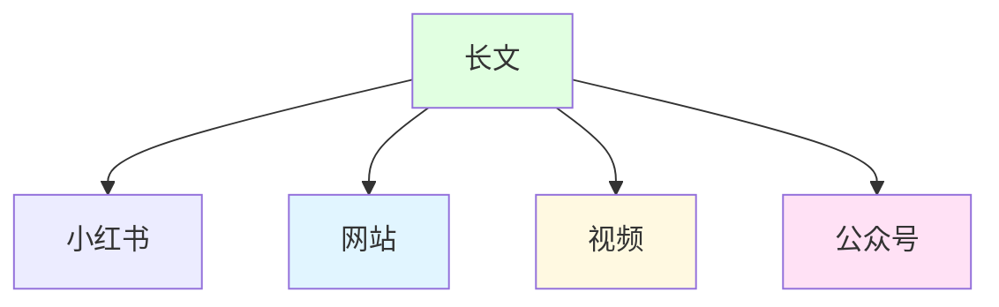

# 长文为何是飞轮中心

欢迎一起来见证这个过程，在这里，你可以看到：
- 一篇高质量长文如何成为核心资产
- 如何通过结构化复用，把它拆解为小红书图片集、官网文章、视频内容与公众号推送
- 如何只用 Markdown 写作，就完成内容生产、分发、展示与讲解的完整闭环

你将看到的不只是方法，而是完整过程：

- 内容飞轮如何运转
- 系统如何逐步自动化
- 本周结构如何优化
- 用户反馈如何影响产品迭代
- 流量与转化如何被持续复盘

这里记录的不是“成功故事”，  
而是一家一人公司真实运行的细节——  
包括思考、实验、失败、修正与进化。

[MDFriday](https://mdfriday.com)是我的产品，也是我的一人公司创作助手。帮我专注长文创作，通过知识复用，帮我把长文生成图片、PPT，发布到公众号、网站，沉淀数字资产，让四小时工作成为可能。 