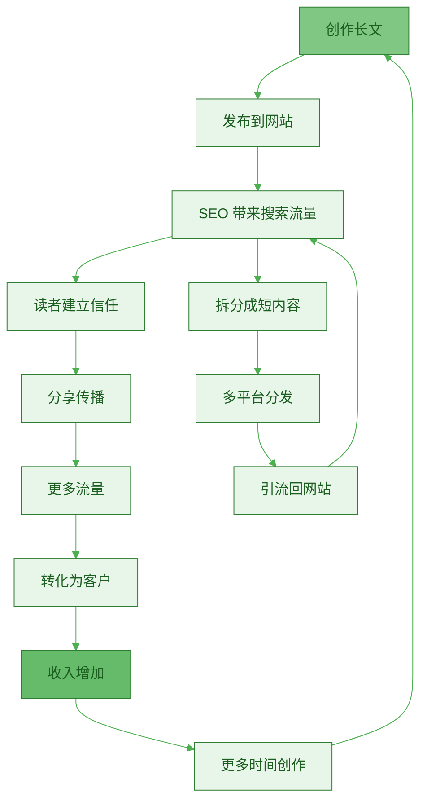
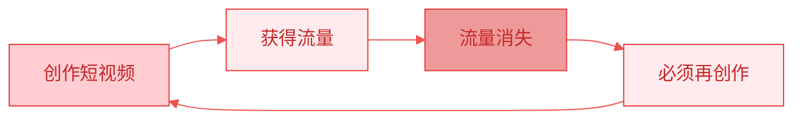
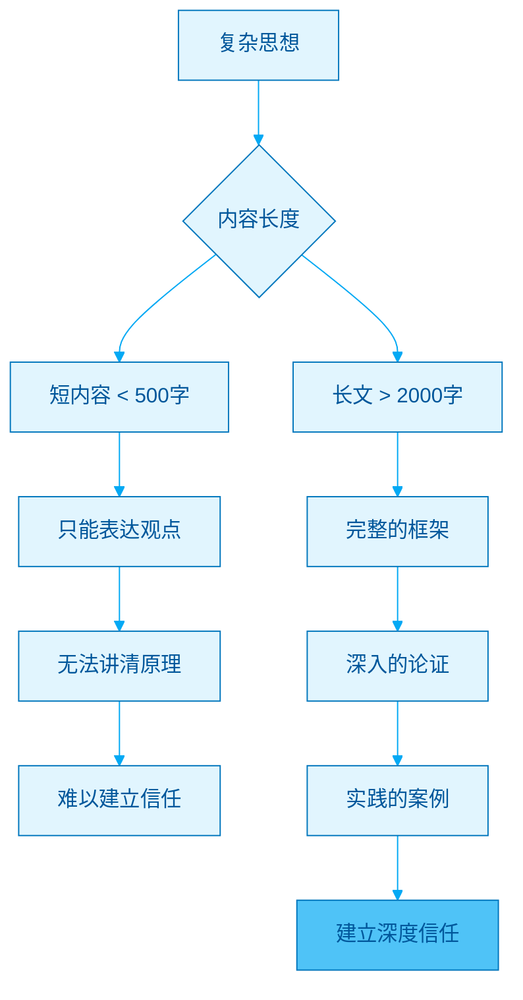
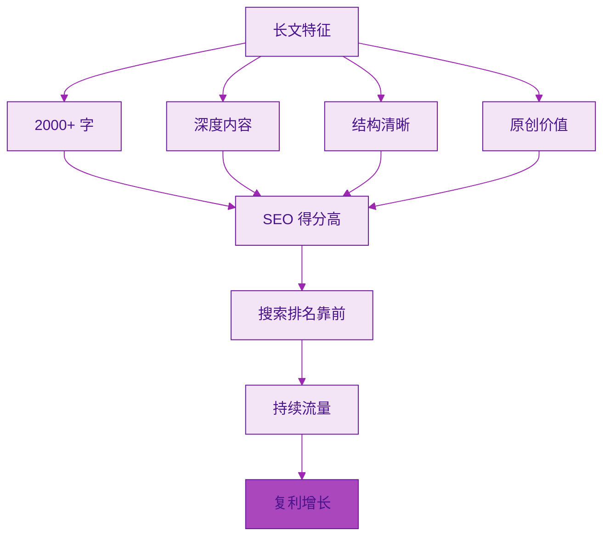
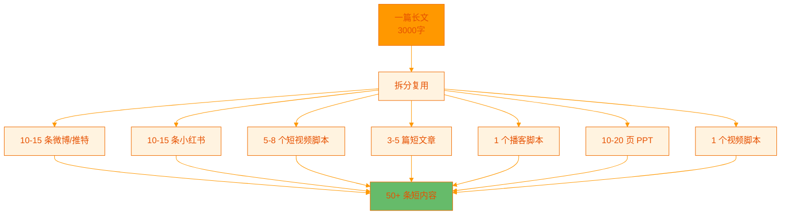
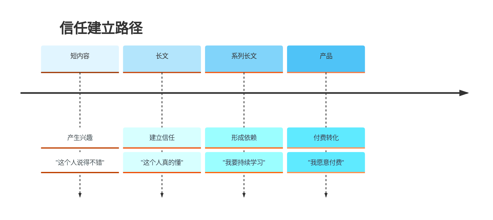
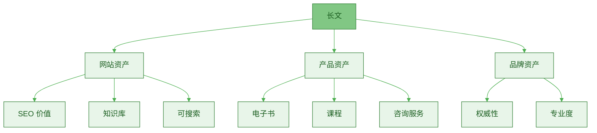
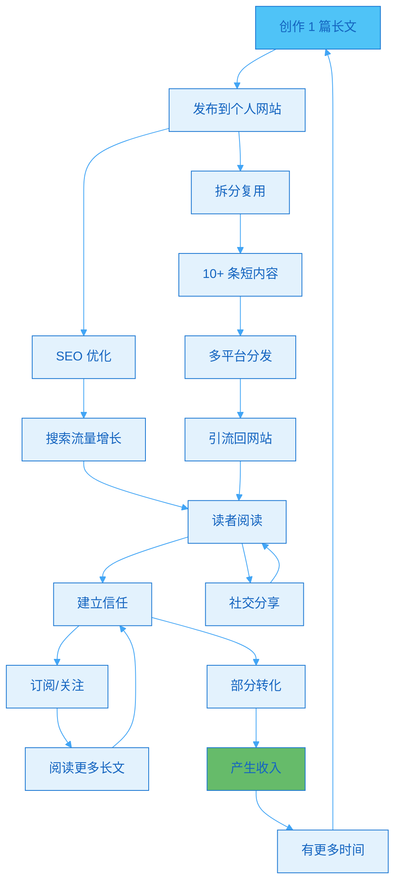
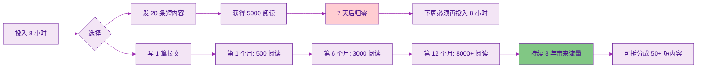
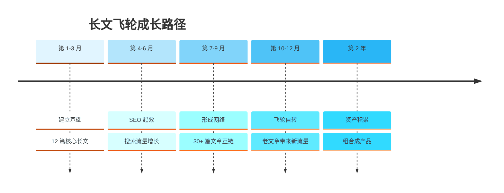

> [!quote] 核心认知
> "长文是唯一能够完整传达思想、建立信任、SEO 友好、可无限复用的内容形式。
> 
> 它是整个内容系统的中心，其他所有形式都从这里衍生。"
> ——来自 [[3. MDFriday 实战记录/03.网站/Dan Koe/视频笔记/8|内容生态系统]]

## 为什么是"飞轮"？

### 飞轮效应解释

> [!important] 飞轮的特征
> 
> 1. **启动困难**：需要持续推动
> 2. **逐渐加速**：动能逐渐积累
> 3. **自我驱动**：达到临界点后自行运转
> 4. **持续增速**：越转越快



**对比其他内容形式**：

| 特征 | 短视频 | 短文章 | 长文 |
|-----|-------|--------|------|
| **启动难度** | 低 | 低 | 高 |
| **初期效果** | 快 | 中 | 慢 |
| **长期效果** | 衰减 | 衰减 | 增长 |
| **飞轮效应** | ❌ 无 | ⚠️ 弱 | ✅ 强 |

> [!success] 长文的飞轮特性
> 
> **前 3 个月**：
> - 阅读量不高
> - 需要持续推动
> - 感觉效果不明显
> 
> **3-6 个月**：
> - SEO 开始起作用
> - 搜索流量增加
> - 老文章带来新读者
> 
> **6-12 个月**：
> - 文章相互链接
> - 形成知识网络
> - 飞轮开始自转
> 
> **12 个月后**：
> - 自然流量为主
> - 被动引流
> - 持续产生价值

### 飞轮 vs 仓鼠轮

> [!danger] 仓鼠轮的陷阱
> 
> **短内容的困境**：
> - 需要持续生产
> - 停止发布，流量归零
> - 无法积累
> - 越跑越累



**数据对比**：

| 指标 | 短内容（仓鼠轮） | 长文（飞轮） |
|-----|--------------|-----------|
| **第 1 个月阅读** | 1000 | 100 |
| **第 6 个月阅读** | 50（衰减） | 500（增长） |
| **第 12 个月阅读** | 10（接近 0） | 1500（持续增长） |
| **累计阅读** | 1200 | 8000+ |
| **停止创作后** | 流量归零 | 持续产生流量 |

## 长文作为中心的五大原因

### 原因 1：完整的思想表达

> [!tip] 只有长文能完整传达复杂思想
> **短内容只能传达观点，长文传达系统。**



**内容深度对比**：

| 内容类型 | 字数 | 能传达的内容 | 效果 |
|---------|------|------------|------|
| **微博/推特** | 100-200 | 一个观点 | 引发共鸣，但无深度 |
| **短文章** | 500-1000 | 一个概念 + 简单解释 | 初步理解，但不完整 |
| **长文** | 2000-5000 | 完整的框架 + 论证 + 案例 | 深度理解 + 信任 |
| **超长文** | 5000+ | 系统性知识体系 | 权威感 + 强信任 |

> [!example] 案例对比
> 
> **短内容**：
> "长文很重要，你应该写长文。"
> - 结果：读者知道了，但不会做
> 
> **长文**：
> - 为什么长文重要？（原理）
> - 长文的具体好处？（证据）
> - 如何写好长文？（方法）
> - 常见问题如何解决？（实操）
> - 结果：读者理解了，并且有能力开始做

### 原因 2：SEO 友好，长期流量

> [!important] 搜索引擎偏爱长文
> **长文 = 更好的 SEO = 长期免费流量**



**SEO 优势**：

| SEO 因素 | 短内容 | 长文 |
|---------|--------|------|
| **内容深度** | ⭐⭐ | ⭐⭐⭐⭐⭐ |
| **关键词覆盖** | 少（5-10个） | 多（30-100个） |
| **停留时间** | 短（30秒） | 长（5-10分钟） |
| **内链机会** | 少 | 多 |
| **外链吸引** | 难 | 易 |
| **搜索排名** | 低 | 高 |

**数据证明**：

> [!check] 研究数据
> 
> **Backlinko 研究（2023）**：
> - 平均排名第 1 的文章：1890 字
> - 长文章（3000+字）比短文章（500字）获得 3.7 倍流量
> - 长文章的反向链接是短文章的 4 倍
> 
> **HubSpot 数据**：
> - 2000-2500 字的文章获得最多分享
> - 长文章的转化率比短文章高 30%

> [!success] 长期流量效应
> 
> **一篇优质长文的生命周期**：
> 
> ```
> 发布第 1 个月：100 阅读（主要来自推广）
> 发布第 3 个月：300 阅读（SEO 开始起效）
> 发布第 6 个月：800 阅读（搜索流量主导）
> 发布第 12 个月：1500 阅读（持续增长）
> 第 2 年：每月 1000-2000 阅读
> 第 3 年：每月 800-1500 阅读（仍然有效）
> 
> 累计 3 年：超过 40,000 阅读
> ```
> 
> **短内容的生命周期**：
> ```
> 发布第 1 天：1000 阅读（算法推荐）
> 发布第 3 天：50 阅读（衰减）
> 发布第 7 天：10 阅读
> 发布第 30 天：基本归零
> 
> 累计 3 年：约 1200 阅读
> ```

### 原因 3：可复用性最强

> [!tip] 长文是"内容原料库"
> **1 篇长文 = 50+ 条短内容**



**复用路径**：

| 原始内容 | 衍生形式 | 数量 | 价值延续 |
|---------|---------|------|---------|
| **长文** | 短文 | 3-5 篇 | 100% |
| **长文** | 社交媒体 | 10-15 条 | 80% |
| **长文** | 短视频脚本 | 5-8 个 | 70% |
| **长文** | 播客内容 | 1-2 期 | 90% |
| **长文** | 课程章节 | 1-3 节 | 100% |
| **长文** | 电子书章节 | 1 章 | 100% |

> [!example] 实际案例
> 
> **一篇"如何建立个人知识系统"（3500字）**
> 
> **拆分成短内容**：
> 1. 为什么需要知识系统？（300字）
> 2. 信息输入的三个层次（250字）
> 3. 笔记工具选择指南（300字）
> 4. 卡片笔记法实操（400字）
> 5. 知识复盘的 3 个时机（280字）
> ... 共 12 条独立内容
> 
> **转换成其他形式**：
> - 15 分钟视频脚本
> - 5 个 1 分钟短视频（每个讲一个点）
> - 20 页 PPT（可用于演讲）
> - 1 期 30 分钟播客
> 
> **组合成产品**：
> - 与其他文章组合成"知识管理完全指南"（电子书）
> - 拓展成"知识管理训练营"（课程）

**反向对比**：

> [!danger] 短内容的复用困境
> 
> - 一条 200 字的微博，无法延伸
> - 难以转换成长文（缺乏深度）
> - 难以组合成产品
> - 必须从零开始创作下一条

### 原因 4：建立信任和权威

> [!important] 信任需要深度
> **人们因为短内容关注你,因为长文信任你，因为信任付费。**



**信任建立的要素**：

| 要素 | 短内容能提供吗？ | 长文能提供吗？ |
|-----|--------------|-------------|
| **深度思考** | ❌ 空间不足 | ✅ 充分展示 |
| **完整论证** | ❌ 无法展开 | ✅ 系统论证 |
| **实战案例** | ❌ 讲不清楚 | ✅ 详细分析 |
| **独特洞察** | ⚠️ 可以表达但难以证明 | ✅ 可以充分证明 |
| **专业能力** | ⚠️ 感觉有料 | ✅ 确认专业 |

> [!quote] Dan Koe 的观点
> "建立受众需要短内容，但建立信任需要长文。
> 
> 如果你想卖高价产品或服务，长文是必须的。"
> ——来自 [[3. MDFriday 实战记录/03.网站/Dan Koe/视频笔记/15|如何快速增长]]

**信任 = 转化率**：

| 内容类型 | 读者印象 | 付费意愿 | 可接受价格 |
|---------|---------|---------|-----------|
| **短内容** | "有点意思" | 低 | ¥9.9-49 |
| **短文章** | "有些道理" | 中 | ¥49-199 |
| **系统长文** | "真的专业" | 高 | ¥199-999 |
| **深度系列** | "权威专家" | 很高 | ¥999-9999 |

> [!success] 实际数据
> 
> **对比测试**：
> - 只看短内容的用户转化率：0.5-1%
> - 看过 1 篇长文的用户转化率：2-3%
> - 看过 3+ 篇长文的用户转化率：5-10%
> - 看过 10+ 篇长文的用户转化率：15-25%

### 原因 5：内容资产的核心

> [!important] 长文是可积累的资产
> **短内容是消费品，长文是资产。**



**资产特征对比**：

| 特征 | 短内容 | 长文 |
|-----|--------|------|
| **价值周期** | 7 天 | 3+ 年 |
| **可积累性** | ❌ | ✅ |
| **可组合性** | ❌ | ✅ |
| **可产品化** | ❌ | ✅ |
| **SEO 价值** | 低 | 高 |
| **护城河** | 无 | 有 |

> [!example] 资产积累效应
> 
> **1 年后对比**：
> 
> **路径 A：只发短内容**
> - 发布 300+ 条短内容
> - 停止发布后流量归零
> - 无法产品化
> - 资产价值：接近 0
> 
> **路径 B：专注长文**
> - 发布 40 篇长文
> - 每篇持续带来流量
> - 组合成 2-3 个产品
> - 资产价值：¥50,000-100,000+

## 长文飞轮的实战机制

### 完整的飞轮模型



### 三个加速因子

> [!tip] 让飞轮转得更快
> 
> **1. 文章间的相互链接**
> - 每篇文章链接到 3-5 篇相关文章
> - 读者从一篇进入，阅读多篇
> - SEO 权重相互传递
> 
> **2. 话题的系列化**
> - 不是孤立的文章
> - 形成主题系列
> - 读者追着看
> 
> **3. 持续的优化更新**
> - 定期更新老文章
> - 添加新案例、新数据
> - 保持长期价值

### 启动飞轮的最小单元

> [!check] 最小可行飞轮（MVF）
> 
> **第 1 个月**：
> - [ ] 发布 4 篇长文（每周 1 篇）
> - [ ] 每篇 2000-3000 字
> - [ ] 覆盖 1 个核心主题的 4 个方面
> 
> **第 2 个月**：
> - [ ] 再发布 4 篇长文
> - [ ] 开始拆分复用（每篇长文 → 5 条短内容）
> - [ ] 开始相互链接
> 
> **第 3 个月**：
> - [ ] 再发布 4 篇长文
> - [ ] SEO 开始起效
> - [ ] 观察到搜索流量
> 
> **结果**：
> - 12 篇长文形成知识网络
> - 60+ 条短内容多平台分发
> - 飞轮开始转动

## 常见误区

### 误区 1："长文没人看"

> [!danger] 错误认知
> 
> **误解**：
> "现在是短视频时代，没人看长文了。"
> 
> **真相**：
> - 浅层信息：短视频够用
> - 深度学习：必须长文
> - 付费人群：更爱长文

**数据证明**：

| 平台 | 长文表现 |
|-----|---------|
| **Medium** | 7分钟阅读时间的文章分享量最高 |
| **知乎** | 长回答（2000+字）获赞数是短回答的 5 倍 |
| **个人博客** | 长文的平均停留时间 > 8 分钟 |

> [!success] 正确认知
> 
> **短内容和长文的分工**：
> - 短内容：引发兴趣，获得关注
> - 长文：建立信任，产生转化
> 
> **它们不是竞争关系，而是协同关系。**

### 误区 2："长文太耗时间"

> [!danger] 错误认知
> 
> **误解**：
> "写一篇长文要 8 小时，不如发 20 条短内容。"
> 
> **真相**：
> - 1 篇长文 = 50+ 条短内容的素材
> - 长文的时间投入有复利效应
> - 短内容的时间投入是线性消耗

**时间投入对比**：



**投资回报率（ROI）**：

| 类型 | 时间投入 | 首月效果 | 累计 12 月效果 | ROI |
|-----|---------|---------|--------------|-----|
| **短内容** | 8小时/周 × 52周 = 416小时 | 高 | 中 | 1x |
| **长文** | 8小时/篇 × 40篇 = 320小时 | 低 | 高 | 5-10x |

### 误区 3："必须文笔好才能写长文"

> [!danger] 错误认知
> 
> **误解**：
> "我文笔不好，写不了长文。"
> 
> **真相**：
> - 长文的核心是结构，不是文笔
> - 清晰 > 华丽
> - 有用 > 好看

> [!success] 正确认知
> 
> **好长文的标准**：
> 1. **结构清晰**：读者能快速理解框架
> 2. **逻辑连贯**：观点有说服力
> 3. **实用性强**：能解决实际问题
> 4. **可读性好**：分段、标题、列表
> 
> **不需要**：
> - ❌ 华丽的辞藻
> - ❌ 复杂的句式
> - ❌ 文学性的表达

## 行动指南

### 本周行动：启动你的长文飞轮

> [!check] Week 1 启动清单
> 
> **Day 1-2：选择主题**
> - [ ] 确定 1 个核心方向
> - [ ] 列出 10 个可写的主题
> - [ ] 选择 4 个作为第一个系列
> 
> **Day 3-4：学习结构**
> - [ ] 阅读 3 篇优质长文
> - [ ] 分析它们的结构
> - [ ] 制作你的长文模板
> 
> **Day 5-7：写第一篇**
> - [ ] 选择最熟悉的主题
> - [ ] 完成 2000 字长文
> - [ ] 发布到你的网站

### 第一个月计划

> [!important] 30 天长文挑战
> 
> **Week 1**：
> - 1 篇长文（2000-3000字）
> - 主题：入门级问题
> 
> **Week 2**：
> - 1 篇长文
> - 主题：进阶方法
> - 链接到 Week 1 的文章
> 
> **Week 3**：
> - 1 篇长文
> - 主题：实战案例
> - 开始拆分前两篇文章成短内容
> 
> **Week 4**：
> - 1 篇长文
> - 主题：常见问题
> - 4 篇文章相互链接，形成系列
> 
> **结果**：
> - 4 篇长文形成知识网络
> - 20+ 条短内容可分发
> - 飞轮启动

### 长期策略



## 总结

> [!quote] 核心要点
> "长文不是内容形式的一种选择，而是内容系统的必然中心。
> 
> 短内容获得关注，长文建立信任，系列长文创造收入。
> 
> 飞轮效应是长期主义者的最大优势。"

### 长文作为飞轮中心的五大原因

| 原因 | 核心价值 |
|-----|---------|
| **1. 完整表达** | 传达系统思想，不只是观点 |
| **2. SEO 友好** | 长期免费流量，复利增长 |
| **3. 可复用强** | 1 生 50，时间投入有杠杆 |
| **4. 建立信任** | 深度 = 信任 = 转化 |
| **5. 核心资产** | 可积累、可组合、可变现 |

### 关键认知

> [!important] 记住这三点
> 
> 1. **飞轮需要时间**
>    - 前 3 个月看不到明显效果是正常的
>    - 坚持 6-12 个月，飞轮自转
> 
> 2. **长文 + 短内容**
>    - 不是二选一，而是协同
>    - 长文是中心，短内容是分发
> 
> 3. **质量 > 数量**
>    - 1 篇优质长文 > 100 条低质短内容
>    - 专注深度，不追求高产

### 下一步阅读

- [[b.长文创作的底层框架|长文创作的底层框架]]
- [[c.从 0 到 1 写出第一篇长文|从 0 到 1 写出第一篇长文]]
- [[../04.内容就是资产/b.长文作为知识数据库|长文作为知识数据库]]

---

**启动你的长文飞轮，让时间为你工作。**
