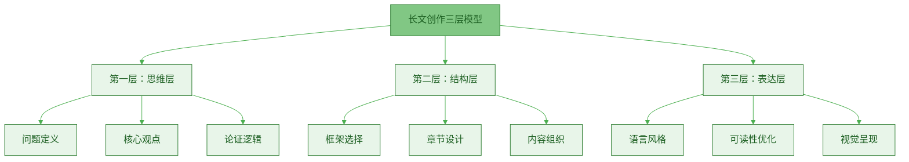
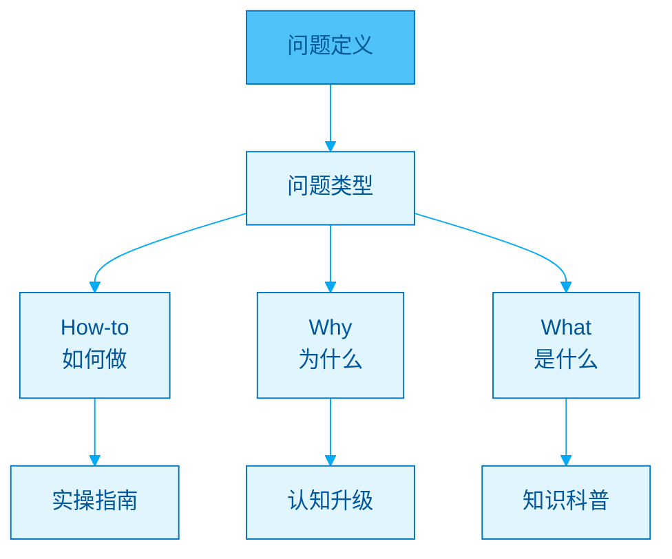
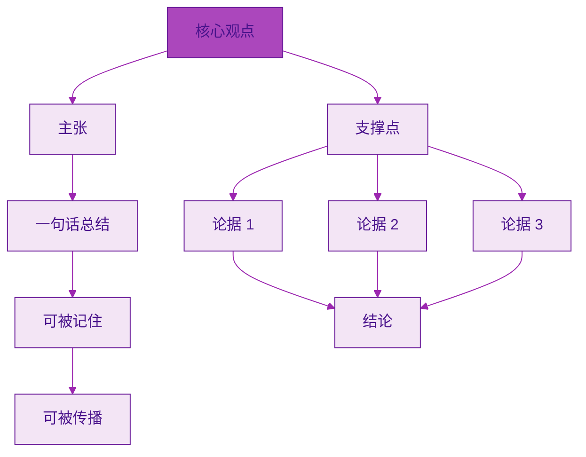
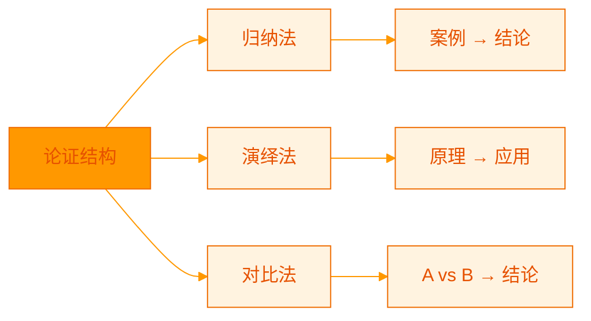
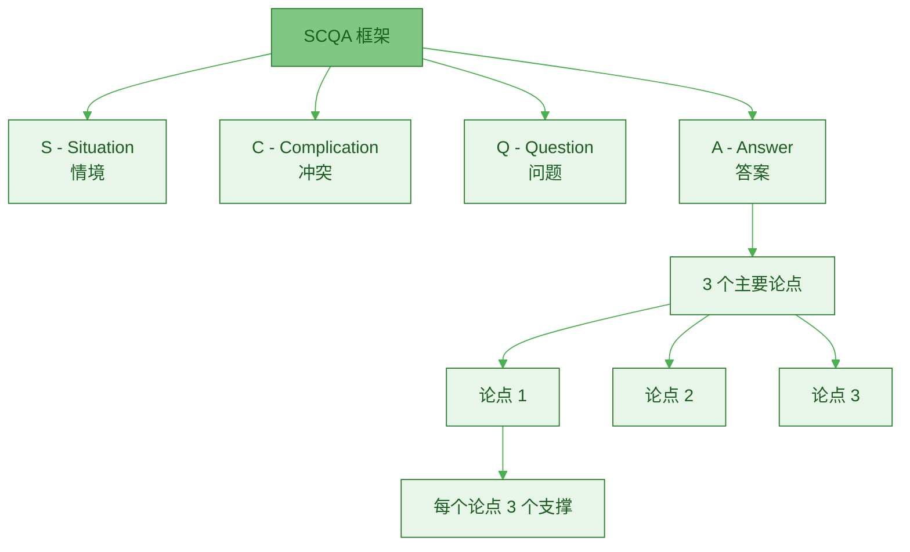
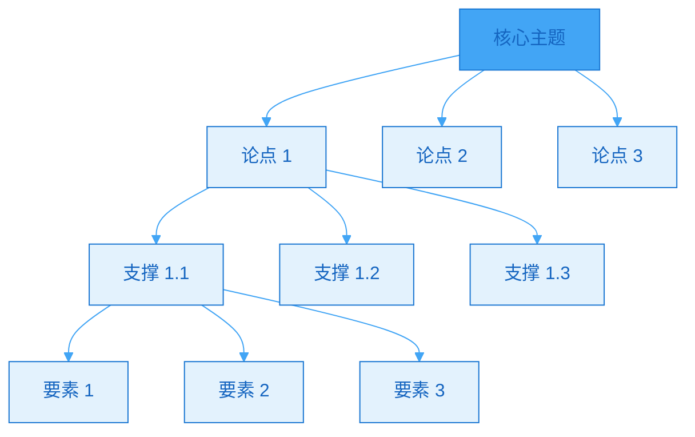
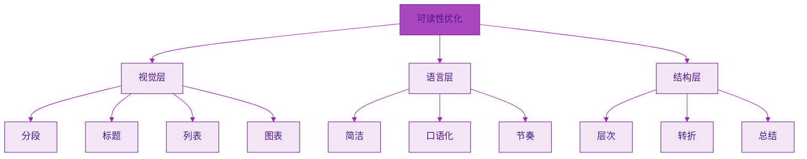
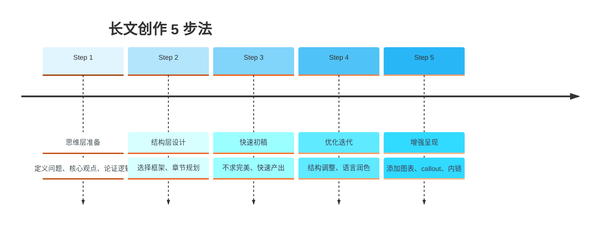

> [!quote] 写作的本质
> "好的长文不是靠文笔,而是靠结构。
> 
> 结构让思想清晰,让读者理解,让内容可复用。"
> ——来自 [[3. MDFriday 实战记录/03.网站/Dan Koe/视频笔记/12|写作的底层逻辑]]

## 长文创作的三层模型

### 整体架构



**三层的关系**：

| 层次 | 核心问题 | 重要性 | 难度 |
|-----|---------|--------|------|
| **思维层** | 说什么？ | ⭐⭐⭐⭐⭐ | 高 |
| **结构层** | 怎么组织？ | ⭐⭐⭐⭐ | 中 |
| **表达层** | 怎么表达？ | ⭐⭐⭐ | 低 |

> [!important] 关键认知
> 
> **大多数人的误区**：
> - 过度关注表达层（文笔、用词）
> - 忽视思维层（观点、逻辑）
> - 结果：文字华丽但没价值
> 
> **正确的顺序**：
> 1. 先想清楚（思维层）
> 2. 再组织好（结构层）
> 3. 最后写出来（表达层）

## 第一层：思维层

### 1. 问题定义

> [!tip] 好文章从好问题开始
> **你的文章解决什么问题？**



**问题类型与价值**：

| 问题类型 | 示例 | 难度 | 价值 | 适合阶段 |
|---------|------|------|------|---------|
| **What（是什么）** | "一人公司是什么？" | 低 | ⭐⭐ | 入门 |
| **Why（为什么）** | "为什么要做一人公司？" | 中 | ⭐⭐⭐⭐ | 认知 |
| **How（如何做）** | "如何启动一人公司？" | 高 | ⭐⭐⭐⭐⭐ | 实操 |
| **综合型** | "一人公司完全指南" | 很高 | ⭐⭐⭐⭐⭐ | 系统 |

> [!check] 问题定义清单
> 
> **一个好问题应该**：
> - [ ] 足够具体（不是"如何成功"，而是"如何写好第一篇长文"）
> - [ ] 有明确的受众（为谁解决问题？）
> - [ ] 可以被解决（有具体方法）
> - [ ] 有搜索需求（人们会搜索这个问题）

> [!example] 问题定义对比
> 
> **❌ 模糊的问题**：
> - "如何变得更好？"
> - "怎样成功？"
> - "内容创作心得"
> 
> **✅ 清晰的问题**：
> - "如何在 30 天内写出第一篇 3000 字长文？"
> - "为什么长文比短视频更适合建立一人公司？"
> - "一人公司的 4 个核心模块及实施步骤"

### 2. 核心观点

> [!important] 一篇文章，一个核心观点
> **不要试图在一篇文章里说所有事情。**



**核心观点公式**：

```
核心观点 = 主张 + 理由

示例：
"长文是内容飞轮的中心"（主张）
"因为它能建立信任、SEO友好、可复用"（理由）
```

> [!check] 核心观点测试
> 
> **你的核心观点是否**：
> - [ ] 可以用一句话说清楚？
> - [ ] 具有争议性或独特性？
> - [ ] 可以被论证？
> - [ ] 读者看完会记住？

> [!example] 好的核心观点
> 
> **优质案例**：
> - "长文是飞轮中心，短内容是分发工具"
> - "一人公司的本质是杠杆，不是勤奋"
> - "信息过滤比信息获取更重要"
> 
> **特点**：
> - 清晰明确
> - 可能颠覆认知
> - 有论证空间

### 3. 论证逻辑

> [!tip] 三种经典论证结构
> **选择最适合你观点的结构。**



**三种论证方法**：

| 方法 | 结构 | 适用场景 | 示例 |
|-----|------|---------|------|
| **归纳法** | 案例 → 案例 → 结论 | 实践经验总结 | "我尝试了 A、B、C 三种方法，发现..." |
| **演绎法** | 原理 → 推导 → 应用 | 理论阐述 | "根据复利原理，可以推导出..." |
| **对比法** | A vs B → 优劣 → 选择 | 方案选择 | "短内容 vs 长文，各有优劣..." |

> [!example] 论证结构示例
> 
> **归纳法**（案例推导）：
> ```
> 1. 我第一个月写短内容，流量很高但转化为 0
> 2. 第二个月写长文，流量不高但有 3 个付费客户
> 3. 第三个月持续写长文，客户增长到 10 个
> 4. 结论：长文虽然启动慢，但转化率高
> ```
> 
> **演绎法**（原理推导）：
> ```
> 1. 信任需要深度（原理）
> 2. 深度需要空间（推导）
> 3. 长文提供了足够空间（应用）
> 4. 因此长文能建立信任（结论）
> ```
> 
> **对比法**（比较分析）：
> ```
> 1. 短内容的特点：快速、流量高、难积累
> 2. 长文的特点：慢启动、SEO 好、可复用
> 3. 对比分析：各有优劣
> 4. 结论：结合使用，长文为中心
> ```

## 第二层：结构层

### 经典长文框架

> [!important] 万能公式
> **SCQA 框架 + 3-3-3 结构**



### SCQA 开头框架

> [!tip] 黄金开头公式
> **吸引注意 → 引发共鸣 → 提出问题 → 给出答案**

**详细解析**：

| 步骤 | 作用 | 字数 | 示例 |
|-----|------|------|------|
| **S（情境）** | 建立背景 | 100-200 | "越来越多人开始做自媒体..." |
| **C（冲突）** | 引发痛点 | 150-250 | "但 90% 的人陷入'内容仓鼠轮'..." |
| **Q（问题）** | 明确问题 | 50-100 | "如何摆脱这个困境？" |
| **A（答案）** | 给出方案 | 100-150 | "答案是建立长文飞轮..." |

> [!example] SCQA 实际应用
> 
> **S（情境）**：
> "2026 年，自媒体创作者已经超过 1 亿人。平台算法更加成熟，流量获取越来越难。"
> 
> **C（冲突）**：
> "但大多数创作者每天花 8 小时产出内容，获得的流量却只能维持 24 小时。停止更新，流量立刻归零。这就是'内容仓鼠轮'——越跑越累，越跑越快，却永远无法停下。"
> 
> **Q（问题）**：
> "有没有一种方式，能够让内容持续产生价值，形成复利效应，最终实现'躺平收益'？"
> 
> **A（答案）**：
> "有。答案就是建立以长文为中心的内容飞轮。本文将详细解析为什么长文是飞轮中心，以及如何构建这套系统。"

### 3-3-3 主体结构

> [!tip] 黄金比例
> **3 个主要论点，每个论点 3 个支撑，每个支撑 3 个要素。**



**为什么是 3？**

> [!check] 3 的魔力
> 
> **认知科学证明**：
> - 人类短期记忆：7±2 个信息单元
> - 最佳记忆：3 个要点
> - 3 既不会太少（单薄），也不会太多（混乱）
> 
> **经典案例**：
> - 乔布斯演讲：永远 3 点
> - TED 演讲：通常 3 部分
> - 畅销书：3 个核心概念

> [!example] 3-3-3 实际应用
> 
> **主题：为什么长文是飞轮中心**
> 
> **3 个主要论点**：
> 1. 长文能建立深度信任
> 2. 长文有 SEO 长期价值
> 3. 长文可复用性最强
> 
> **论点 1 的 3 个支撑**：
> 1.1 完整表达思想体系
> 1.2 展示专业能力
> 1.3 提供实用价值
> 
> **支撑 1.1 的 3 个要素**：
> - 空间足够展开
> - 逻辑可以严密
> - 案例可以详细

### 五种常用结构模板

| 模板 | 适用场景 | 结构 |
|-----|---------|------|
| **问题-方案型** | 实操指南 | 问题 → 原因 → 方案 → 步骤 |
| **对比分析型** | 选择类 | A 方式 → B 方式 → 对比 → 推荐 |
| **时间线型** | 成长故事 | 过去 → 转折 → 现在 → 未来 |
| **金字塔型** | 系统阐述 | 总论 → 分论 1/2/3 → 总结 |
| **案例研究型** | 深度分析 | 背景 → 过程 → 结果 → 启示 |

> [!example] 五种模板应用示例
> 
> **1. 问题-方案型**："如何在 30 天内启动一人公司"
> ```
> - 问题：大多数人不知道从哪开始
> - 原因：缺乏系统方法
> - 方案：4 步启动法
> - 步骤：详细操作指南
> ```
> 
> **2. 对比分析型**："平台流量 vs 私域资产"
> ```
> - 平台流量的特点与问题
> - 私域资产的特点与优势
> - 数据对比与分析
> - 推荐策略：结合使用
> ```
> 
> **3. 时间线型**："我的一人公司 12 个月复盘"
> ```
> - 第 1-3 月：启动期的困惑
> - 第 4-6 月：转折点的发现
> - 第 7-9 月：增长期的爆发
> - 第 10-12 月：稳定期的思考
> ```

## 第三层：表达层

### 可读性优化

> [!important] 可读性 > 文采
> **让读者舒服地读完，比华丽的文字更重要。**



### 视觉优化技巧

**1. 段落控制**

> [!check] 段落黄金规则
> 
> **手机阅读时代的标准**：
> - 每段 2-4 行（约 80-150 字）
> - 手机屏幕最多显示 3-4 段
> - 避免"文字墙"

**对比效果**：

| 段落方式 | 体验 | 完读率 |
|---------|------|--------|
| **长段落**（200+ 字） | 压抑、难读 | 30% |
| **中段落**（80-150 字） | 舒适、流畅 | 70% |
| **短段落**（< 50 字） | 碎片、跳跃 | 50% |

**2. 标题层级**

```
# 一级标题（文章标题）
## 二级标题（主要章节）
### 三级标题（子章节）
#### 四级标题（细节点）

建议：
- 最多使用 3 层标题
- 标题简洁有力（≤ 12 字）
- 标题能独立理解
```

**3. 列表和表格**

> [!tip] 何时使用列表？
> 
> **列表适用于**：
> - 并列关系的内容
> - 步骤性的内容
> - 要点总结
> 
> **表格适用于**：
> - 对比分析
> - 数据展示
> - 多维度信息

### 语言优化技巧

**1. 简洁原则**

> [!check] 删除冗余
> 
> **❌ 啰嗦版**：
> "在当今这个信息爆炸的时代背景下，我们每个人每天都会面临着大量的信息输入..."
> 
> **✅ 简洁版**：
> "每天，我们面对海量信息..."
> 
> **改进方法**：
> - 删除"在...的背景下"
> - 删除"每个人"（废话）
> - 删除"都会"（弱化语气）

**2. 口语化表达**

| 书面语 | 口语化 | 效果 |
|-------|--------|------|
| "进行阅读" | "读" | 简洁 |
| "实施操作" | "做" | 直接 |
| "获取知识" | "学到" | 自然 |
| "提升能力" | "变强" | 有力 |

**3. 节奏控制**

> [!tip] 长短句结合
> 
> **单调节奏**（全是长句）：
> "长文创作是一人公司内容系统的核心,因为它能够完整地表达复杂的思想体系,并且具有良好的 SEO 效果,同时还可以被拆分复用成大量的短内容。"
> 
> **变化节奏**（长短结合）：
> "长文是核心。为什么？三个原因：完整表达思想,SEO 效果好,可拆分复用。每一点都至关重要。"

### Obsidian 增强技巧

**1. Callout 的使用**

```markdown
> [!quote] 引用
> 用于引用权威观点

> [!important] 重要
> 强调关键信息

> [!tip] 提示
> 实用建议

> [!check] 检查清单
> 行动步骤

> [!example] 案例
> 具体例子

> [!danger] 警告
> 常见错误
```

**使用时机**：

| Callout 类型 | 使用频率 | 使用场景 |
|-------------|---------|---------|
| `[!quote]` | 每篇 2-3 次 | 文章开头、引用权威 |
| `[!important]` | 每篇 3-5 次 | 核心要点 |
| `[!tip]` | 每篇 5-8 次 | 实用建议 |
| `[!check]` | 每篇 2-4 次 | 行动清单 |
| `[!example]` | 每篇 3-5 次 | 具体案例 |
| `[!danger]` | 每篇 1-2 次 | 常见误区 |

**2. Mermaid 图表**

> [!tip] 何时使用图表？
> 
> **流程类**：使用 flowchart
> - 步骤性内容
> - 决策树
> 
> **关系类**：使用 graph
> - 概念关系
> - 系统架构
> 
> **时间类**：使用 timeline
> - 成长历程
> - 发展阶段
> 
> **数据类**：使用 pie
> - 比例展示
> - 时间分配

**3. Wikilinks 内链**

> [!check] 内链策略
> 
> **每篇文章应该**：
> - 链接到 3-5 篇相关文章
> - 在合适的上下文中插入
> - 不打断阅读流程
> 
> **内链位置**：
> - 概念首次出现时
> - 详细解释的引用
> - 文章末尾的"相关阅读"

## 完整创作流程

### 5 步创作法



### Step 1：思维层准备（30分钟）

> [!check] 准备清单
> 
> **问题定义**：
> - [ ] 这篇文章解决什么问题？
> - [ ] 目标读者是谁？
> - [ ] 他们的痛点是什么？
> 
> **核心观点**：
> - [ ] 用一句话总结核心观点
> - [ ] 这个观点独特吗？
> - [ ] 能被论证吗？
> 
> **论证逻辑**：
> - [ ] 选择论证方法（归纳/演绎/对比）
> - [ ] 列出 3 个主要论点
> - [ ] 每个论点的支撑是什么？

### Step 2：结构层设计（20分钟）

> [!tip] 大纲模板
> 
> ```markdown
> # [文章标题]
> 
> ## 开头（SCQA）
> - S：情境
> - C：冲突
> - Q：问题
> - A：答案预告
> 
> ## 主体（3 个论点）
> ### 论点 1：[标题]
> - 支撑 1.1
> - 支撑 1.2
> - 支撑 1.3
> 
> ### 论点 2：[标题]
> - 支撑 2.1
> - 支撑 2.2
> - 支撑 2.3
> 
> ### 论点 3：[标题]
> - 支撑 3.1
> - 支撑 3.2
> - 支撑 3.3
> 
> ## 结尾
> - 总结要点
> - 行动指南
> - 相关阅读
> ```

### Step 3：快速初稿（90-120分钟）

> [!important] 快速初稿的原则
> 
> **DO**：
> - ✅ 跟着大纲快速写
> - ✅ 不追求完美
> - ✅ 保持写作流畅
> - ✅ 用口语化表达
> 
> **DON'T**：
> - ❌ 边写边改
> - ❌ 纠结用词
> - ❌ 中途停下思考
> - ❌ 追求文采

**时间分配**：

| 部分 | 字数 | 时间 | 占比 |
|-----|------|------|------|
| **开头** | 400-500 | 15-20 分钟 | 15% |
| **主体** | 1800-2000 | 60-80 分钟 | 70% |
| **结尾** | 300-400 | 15-20 分钟 | 15% |

### Step 4：优化迭代（60分钟）

> [!check] 优化清单
> 
> **第一遍：结构优化**（20分钟）
> - [ ] 逻辑是否连贯？
> - [ ] 论证是否充分？
> - [ ] 是否有冗余部分？
> 
> **第二遍：语言优化**（20分钟）
> - [ ] 删除冗余词句
> - [ ] 长短句结合
> - [ ] 口语化表达
> 
> **第三遍：细节优化**（20分钟）
> - [ ] 错别字检查
> - [ ] 标点符号
> - [ ] 格式统一

### Step 5：增强呈现（30分钟）

> [!tip] 视觉增强
> 
> **添加元素**：
> - [ ] 2-3 个 mermaid 图表
> - [ ] 5-8 个 callout 块
> - [ ] 3-5 个内链
> - [ ] 2-4 个表格
> 
> **检查清单**：
> - [ ] 段落长度适中
> - [ ] 标题层级清晰
> - [ ] 列表使用合理
> - [ ] 视觉不单调

## 常见问题

### Q1：写不出 3000 字怎么办？

> [!success] 解决方法
> 
> **原因分析**：
> - 不是写不出，是想不清楚
> - 思维层准备不足
> 
> **解决方案**：
> 1. 花更多时间在思维层
> 2. 每个论点详细展开
> 3. 添加更多案例和对比
> 4. 使用"3-3-3"结构自然扩展

**字数来源分解**：

| 部分 | 内容 | 字数 |
|-----|------|------|
| **开头** | SCQA | 400-500 |
| **论点 1** | 主张 + 3 个支撑 + 案例 | 600-800 |
| **论点 2** | 主张 + 3 个支撑 + 案例 | 600-800 |
| **论点 3** | 主张 + 3 个支撑 + 案例 | 600-800 |
| **结尾** | 总结 + 行动指南 | 300-400 |
| **总计** | | **2500-3300** |

### Q2：如何保持持续产出？

> [!tip] 建立创作系统
> 
> **主题库管理**：
> - 维护 50+ 个主题 idea
> - 按优先级排序
> - 每周选 1 个创作
> 
> **时间块策略**：
> - 固定时间创作（如每周六上午）
> - 完整的 3 小时时间块
> - 不被打扰
> 
> **流程标准化**：
> - 使用固定的框架
> - 复用成功的结构
> - 减少决策疲劳

### Q3：如何提高写作速度？

> [!check] 速度提升方法
> 
> **1. 充分准备**：
> - 大纲越详细，写作越快
> - 思考在前，写作在后
> 
> **2. 避免完美主义**：
> - 初稿追求完成，不追求完美
> - 优化留到第二天
> 
> **3. 刻意练习**：
> - 记录每次写作时间
> - 设定提速目标
> - 持续改进

**速度提升曲线**：

| 文章数 | 初稿速度 | 总耗时 |
|-------|---------|--------|
| **第 1-5 篇** | 500 字/小时 | 5-6 小时 |
| **第 6-15 篇** | 800 字/小时 | 3-4 小时 |
| **第 16-30 篇** | 1200 字/小时 | 2-3 小时 |
| **第 30+ 篇** | 1500 字/小时 | 2 小时内 |

## 行动指南

### 本周任务

> [!check] Week 1 实战
> 
> **Day 1-2：准备**
> - [ ] 选择 1 个主题
> - [ ] 完成思维层准备
> - [ ] 设计结构大纲
> 
> **Day 3：快速初稿**
> - [ ] 安排 3 小时不被打扰的时间
> - [ ] 根据大纲快速写作
> - [ ] 完成 2000-2500 字初稿
> 
> **Day 4：优化**
> - [ ] 结构优化
> - [ ] 语言优化
> - [ ] 细节优化
> 
> **Day 5：增强**
> - [ ] 添加图表和 callout
> - [ ] 添加内链
> - [ ] 最终检查
> 
> **Day 6-7：发布与复盘**
> - [ ] 发布到网站
> - [ ] 复盘创作过程
> - [ ] 记录改进点

## 总结

> [!quote] 核心要点
> "好的长文不是写出来的，是设计出来的。
> 
> 先想清楚（思维层），再组织好（结构层），最后写出来（表达层）。
> 
> 框架大于文笔，结构决定质量。"

### 三层模型总结

| 层次 | 核心 | 占比 | 关键点 |
|-----|------|------|--------|
| **思维层** | 想清楚 | 40% | 问题、观点、逻辑 |
| **结构层** | 组织好 | 40% | 框架、章节、层次 |
| **表达层** | 写出来 | 20% | 语言、视觉、优化 |

### 关键要点

> [!important] 记住这五点
> 
> 1. **框架优先**
>    - 先有结构，再有内容
> 
> 2. **3-3-3 结构**
>    - 3 个论点，每个 3 个支撑
> 
> 3. **快速初稿**
>    - 不求完美，先求完成
> 
> 4. **口语化表达**
>    - 简洁 > 华丽
> 
> 5. **视觉增强**
>    - 图表、callout、列表

### 下一步阅读

- [[c.从 0 到 1 写出第一篇长文|从 0 到 1 写出第一篇长文]]
- [[../07.长文高效复用/a.一篇长文的 10 种复用形式|一篇长文的 10 种复用形式]]
- [[../05.信息获取系统/a.输入渠道设计|输入渠道设计]]

---

**掌握底层框架，让长文创作变得简单高效。**
