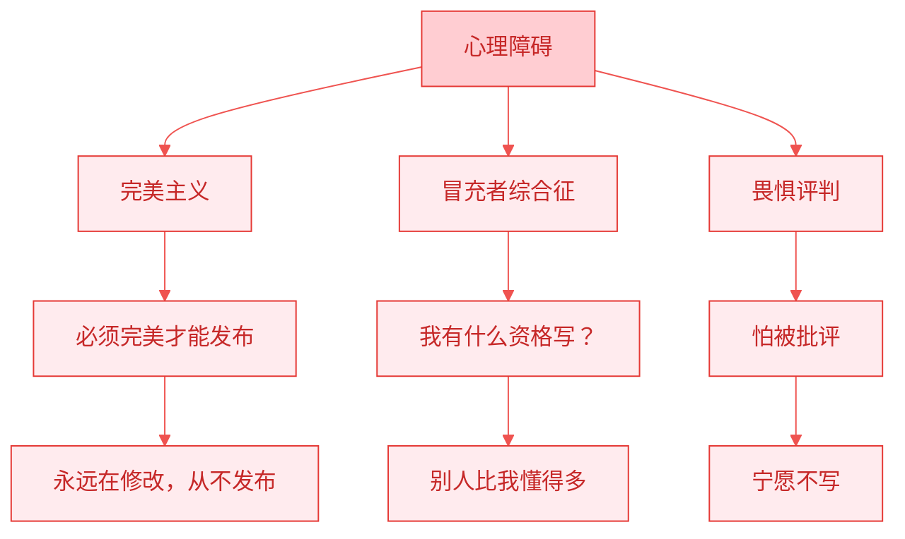
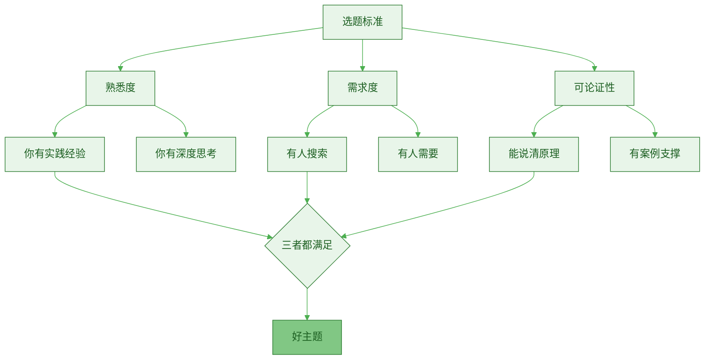
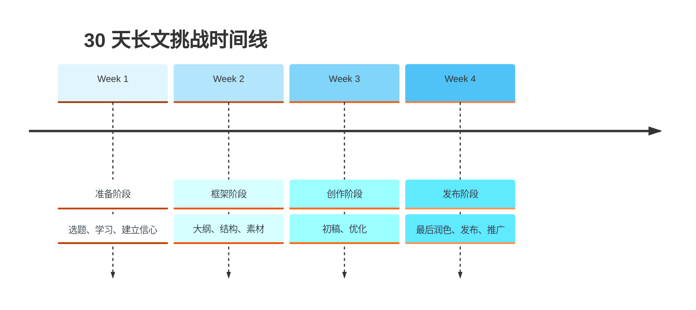
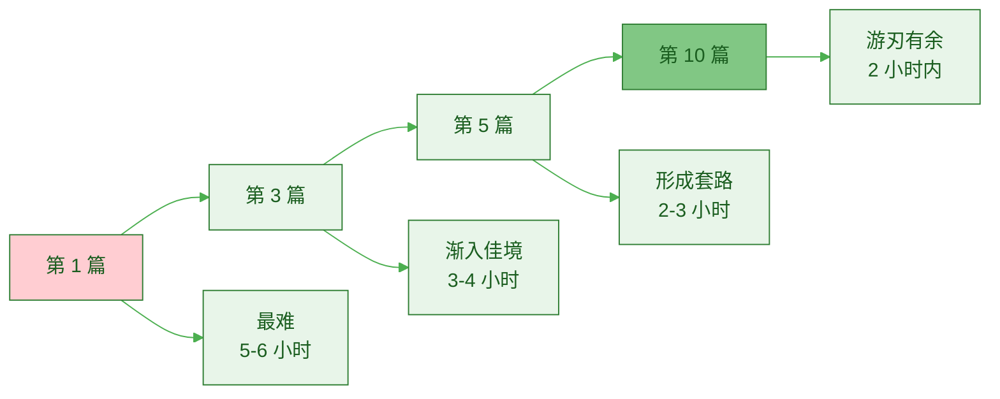

> [!quote] 开始最重要
> "完成的垃圾好过完美的空白。
> 
> 写出第一篇，比研究写作技巧重要 100 倍。"
> ——来自 [[3. MDFriday 实战记录/03.网站/Dan Koe/视频笔记/12|写作的底层逻辑]]

## 为什么第一篇最难？

### 新手的三大心理障碍



> [!danger] 三个致命误区
> 
> **误区 1：完美主义**
> - 症状：反复修改，永不发布
> - 结果：0 产出
> - 解药：先完成，再完美
> 
> **误区 2：冒充者综合征**
> - 症状："我不够专业"
> - 结果：不敢开始
> - 解药：你比 99% 的人懂得多
> 
> **误区 3：畏惧评判**
> - 症状：担心被批评
> - 结果：不敢发布
> - 解药：没人关心你的第一篇文章

### 突破障碍的认知

> [!success] 正确认知
> 
> **关于完美**：
> - 第一篇文章可以很差
> - 重要的是迈出第一步
> - 后面可以不断改进
> 
> **关于资格**：
> - 你不需要是专家
> - 你只需要比读者领先一步
> - 分享你的学习过程就够了
> 
> **关于评判**：
> - 第一篇文章几乎没人看
> - 批评是成长的机会
> - 大多数人连写都不敢写

## 选择你的第一个主题

### 三个选题标准

> [!important] 好主题的特征
> **熟悉 + 有需求 + 可论证**



### 熟悉度测试

> [!check] 你是否熟悉这个主题？
> 
> **自测问题**：
> - [ ] 我在这个领域有 1 年以上经验？
> - [ ] 我犯过错误并找到解决方法？
> - [ ] 我能不查资料讲 10 分钟？
> - [ ] 我有独特的见解或方法？
> 
> **满足 3 个以上 → 熟悉度足够**

> [!example] 熟悉度案例
> 
> **✅ 足够熟悉**：
> - "如何用 Obsidian 管理知识"（你用了 6 个月）
> - "程序员如何开始自媒体"（你的亲身经历）
> - "如何在业余时间开发产品"（你正在做）
> 
> **❌ 不够熟悉**：
> - "AI 的未来趋势"（你只是看过几篇文章）
> - "如何成为百万富翁"（你还没有做到）
> - "量子计算入门"（你完全不懂）

### 需求度测试

> [!tip] 判断方法
> **有人搜索 = 有需求**

**快速验证工具**：

| 工具 | 用途 | 如何使用 |
|-----|------|---------|
| **Google 搜索** | 查看搜索建议 | 输入关键词，看自动补全 |
| **知乎** | 查看问题热度 | 搜索相关问题，看关注数 |
| **微信搜索** | 查看文章数量 | 搜索关键词，看结果数 |
| **Google Trends** | 查看搜索趋势 | 查看关键词热度变化 |

> [!example] 需求验证案例
> 
> **主题："如何写好长文"**
> 
> **验证过程**：
> 1. Google 搜索："如何写"
>    - 自动补全：如何写好文章、如何写作...
>    - ✅ 有搜索需求
> 
> 2. 知乎搜索："长文写作"
>    - 相关问题：1000+ 个
>    - 热门问题关注：5000-20000
>    - ✅ 需求旺盛
> 
> 3. 微信搜索："长文创作"
>    - 相关文章：10000+ 篇
>    - ✅ 热门主题
> 
> **结论**：需求度足够，值得写

### 可论证性测试

> [!check] 能否充分论证？
> 
> **自测问题**：
> - [ ] 我能列出 3 个主要论点？
> - [ ] 每个论点有 3 个支撑？
> - [ ] 我有具体案例？
> - [ ] 我能写出 2000+ 字？
> 
> **满足 3 个以上 → 可论证性足够**

### 主题库建设

> [!tip] 建立你的主题库
> **不要每次都从零开始想主题。**

**主题库模板**：

```markdown
# 主题库

## 高优先级（熟悉 + 需求高 + 易论证）
- [ ] 主题 1：如何...
- [ ] 主题 2：为什么...
- [ ] 主题 3：...的完全指南

## 中优先级（部分满足）
- [ ] 主题 4：...
- [ ] 主题 5：...

## 低优先级（需要进一步研究）
- [ ] 主题 6：...
- [ ] 主题 7：...
```

**如何填充主题库**：

> [!check] 主题来源
> 
> **1. 你的经验**：
> - 你解决过的问题
> - 你犯过的错误
> - 你的独特方法
> 
> **2. 别人的问题**：
> - 朋友常问你的问题
> - 社群里的高频问题
> - 评论区的疑问
> 
> **3. 搜索需求**：
> - Google 搜索建议
> - 知乎热门问题
> - 行业论坛讨论

## 30 天长文挑战

### 挑战概述

> [!important] 目标
> **30 天内，完成并发布你的第一篇 2000+ 字长文。**



### Week 1：准备阶段（建立信心）

**目标**：克服心理障碍，选定主题

> [!check] Day 1-2：消除心理障碍
> 
> **任务**：
> - [ ] 阅读 3 篇别人的第一篇文章
> - [ ] 分析它们的不完美之处
> - [ ] 意识到：第一篇可以不完美
> 
> **心理建设**：
> - 完成 > 完美
> - 你比想象中更有资格
> - 没人会记得你的第一篇

> [!check] Day 3-4：选择主题
> 
> **任务**：
> - [ ] 列出 10 个可能的主题
> - [ ] 用三个标准筛选（熟悉、需求、可论证）
> - [ ] 选定 1 个主题
> 
> **选题技巧**：
> - 选最熟悉的（降低难度）
> - 选有需求的（保证价值）
> - 选能论证的（保证完成）

> [!check] Day 5-7：学习借鉴
> 
> **任务**：
> - [ ] 找 3-5 篇同主题的优秀文章
> - [ ] 分析它们的结构
> - [ ] 提取可借鉴的框架
> 
> **学习重点**：
> - 看结构，不看内容
> - 看逻辑，不看文笔
> - 看框架，不看细节

### Week 2：框架阶段（搭建骨架）

**目标**：完成详细大纲

> [!check] Day 8-10：思维层准备
> 
> **任务**：
> - [ ] 定义问题：这篇文章解决什么问题？
> - [ ] 核心观点：用一句话总结
> - [ ] 论证逻辑：选择方法（归纳/演绎/对比）
> 
> **输出**：
> ```markdown
> ## 思维层准备
> 
> **问题定义**：[具体问题]
> 
> **核心观点**：[一句话总结]
> 
> **论证逻辑**：[选择的方法]
> ```

> [!check] Day 11-12：结构层设计
> 
> **任务**：
> - [ ] 设计 SCQA 开头
> - [ ] 列出 3 个主要论点
> - [ ] 每个论点列出 3 个支撑
> 
> **输出**：
> ```markdown
> ## 大纲
> 
> ### 开头（SCQA）
> - S：[情境]
> - C：[冲突]
> - Q：[问题]
> - A：[答案]
> 
> ### 论点 1：[标题]
> - 支撑 1.1：[...]
> - 支撑 1.2：[...]
> - 支撑 1.3：[...]
> 
> ### 论点 2：[标题]
> ...
> 
> ### 论点 3：[标题]
> ...
> 
> ### 结尾
> - 总结
> - 行动指南
> ```

> [!check] Day 13-14：素材收集
> 
> **任务**：
> - [ ] 收集支撑每个论点的案例
> - [ ] 收集相关数据
> - [ ] 整理自己的经验
> 
> **素材类型**：
> - 个人经验（最有说服力）
> - 他人案例（增加可信度）
> - 数据研究（提供证据）

### Week 3：创作阶段（快速产出）

**目标**：完成初稿并优化

> [!check] Day 15-17：快速初稿
> 
> **Day 15**：
> - [ ] 找 3 小时不被打扰的时间
> - [ ] 写开头 + 论点 1
> - [ ] 目标：800-1000 字
> 
> **Day 16**：
> - [ ] 写论点 2 + 论点 3
> - [ ] 目标：1200-1500 字
> 
> **Day 17**：
> - [ ] 写结尾
> - [ ] 通读全文，填补空白
> - [ ] 目标：达到 2000-2500 字
> 
> **写作原则**：
> - 不追求完美
> - 不边写边改
> - 保持流畅
> - 写完再说

> [!check] Day 18-19：结构优化
> 
> **任务**：
> - [ ] 检查逻辑连贯性
> - [ ] 调整章节顺序
> - [ ] 删除冗余部分
> - [ ] 补充薄弱环节
> 
> **检查清单**：
> - 开头是否吸引人？
> - 论点之间是否连贯？
> - 论证是否充分？
> - 结尾是否有力？

> [!check] Day 20-21：语言优化
> 
> **任务**：
> - [ ] 删除冗余词句
> - [ ] 长短句结合
> - [ ] 口语化表达
> - [ ] 段落长度调整
> 
> **优化技巧**：
> - 每段 2-4 行
> - 删除"的地得"
> - 用主动语态
> - 简洁有力

### Week 4：发布阶段（呈现优化）

**目标**：完成最后润色并发布

> [!check] Day 22-24：视觉增强
> 
> **任务**：
> - [ ] 添加 2-3 个 mermaid 图表
> - [ ] 添加 5-8 个 callout 块
> - [ ] 添加 2-4 个表格
> - [ ] 优化标题层级
> 
> **视觉检查**：
> - 是否有"文字墙"？
> - 是否有足够的留白？
> - 是否视觉丰富？

> [!check] Day 25-26：内链和SEO
> 
> **任务**：
> - [ ] 添加 3-5 个相关内链（如果有的话）
> - [ ] 优化标题（包含关键词）
> - [ ] 写好文章摘要
> - [ ] 添加相关标签
> 
> **SEO 检查**：
> - 标题包含关键词
> - 文章长度 > 2000 字
> - 结构清晰（H2、H3）
> - 可读性好

> [!check] Day 27-28：最后检查
> 
> **任务**：
> - [ ] 通读 3 遍
> - [ ] 检查错别字
> - [ ] 检查格式
> - [ ] 请朋友阅读并反馈
> 
> **最后清单**：
> - 标题吸引人
> - 开头引人入胜
> - 结构清晰
> - 可读性好
> - 没有低级错误

> [!check] Day 29-30：发布与推广
> 
> **Day 29**：
> - [ ] 发布到个人网站
> - [ ] 发布到其他平台（知乎、公众号）
> - [ ] 社交媒体宣传
> 
> **Day 30**：
> - [ ] 复盘创作过程
> - [ ] 记录改进点
> - [ ] 规划第二篇
> 
> **庆祝**：
> - 🎉 你完成了第一篇长文！
> - 这是最难的一步
> - 后面会越来越容易

## 实战案例：我的第一篇长文

### 背景

> [!example] 真实案例
> 
> **主题**："如何用 MDFriday 建立个人知识系统"
> 
> **为什么选这个主题？**
> - ✅ 熟悉：我用了 3 个月
> - ✅ 需求：很多人问我怎么用
> - ✅ 可论证：我有完整的方法

### 创作过程

**Week 1：准备**

```markdown
## 思维层准备

问题：如何用 MDFriday 建立个人知识系统？

核心观点：MDFriday 不是笔记工具，而是思维工具

论证逻辑：对比法（MDFriday vs 传统笔记工具）

3 个论点：
1. MDFriday 的核心是双向链接，不是文件夹
2. MDFriday 的价值是知识网络，不是笔记存储
3. MDFriday 的目标是产出内容，不是收集信息
```

**Week 2：框架**

```markdown
## 大纲

### 开头
- S：大多数人用笔记工具只是存储信息
- C：存储不等于管理，收集不等于产出
- Q：如何真正建立知识系统？
- A：用 MDFriday 的方法

### 论点 1：双向链接的威力
- 支撑 1.1：文件夹的局限
- 支撑 1.2：双链的优势
- 支撑 1.3：我的实践案例

### 论点 2：知识网络的构建
- 支撑 2.1：什么是知识网络
- 支撑 2.2：如何建立连接
- 支撑 2.3：网络的复利效应

### 论点 3：从输入到输出
- 支撑 3.1：输入系统设计
- 支撑 3.2：加工流程
- 支撑 3.3：输出实践

### 结尾
- 总结三个核心认知
- 30 天实践计划
```

**Week 3：创作**

- Day 15-17：完成 2800 字初稿
- Day 18-19：结构优化，删减 300 字
- Day 20-21：语言优化，最终 2600 字

**Week 4：发布**

- Day 22-24：添加 4 个图表，8 个 callout
- Day 25-26：添加内链，优化 SEO
- Day 27-28：3 轮检查
- Day 29：发布
- Day 30：复盘

### 结果

> [!success] 成果
> 
> **数据**（3 个月后）：
> - 阅读量：2500+
> - 收藏：180+
> - 评论：45+
> - 带来客户：8 人
> 
> **收获**：
> - 建立了信心
> - 找到了方法
> - 后续文章越来越顺
> 
> **最大感悟**：
> "第一篇真的不需要完美，只需要完成。"

## 常见卡点及突破

### 卡点 1：不知道写什么

> [!danger] 症状
> - 盯着空白页不知道写啥
> - 想到的主题都觉得被写过了
> - 担心没有独特性

> [!success] 解决方案
> 
> **认知转变**：
> - 没有完全独特的主题
> - 你的独特性在于你的经验和视角
> - 同样的主题，你的表达就是独特的
> 
> **实用方法**：
> 1. 回答一个你被问过 3 次以上的问题
> 2. 写你最近解决的一个问题
> 3. 写你犯过的一个错误和如何改正

### 卡点 2：写到一半写不下去

> [!danger] 症状
> - 写了 500 字就卡住了
> - 不知道接下来写什么
> - 感觉没东西可写

> [!success] 解决方案
> 
> **原因诊断**：
> - 大纲不够详细
> - 论点不够充分
> - 案例不够丰富
> 
> **应对方法**：
> 1. 回到大纲，补充细节
> 2. 每个论点加一个案例
> 3. 加入个人经验和思考
> 4. 如果实在卡住，跳过这部分，先写后面的

### 卡点 3：写完觉得很烂不敢发

> [!danger] 症状
> - 反复修改，永不满意
> - 总觉得不够好
> - 担心被批评

> [!success] 解决方案
> 
> **认知转变**：
> - 第一篇本来就不会完美
> - 发布是学习的一部分
> - 没有反馈就没有进步
> 
> **强制发布法**：
> 1. 设定截止日期
> 2. 达到 2000 字就发布
> 3. 告诉朋友发布时间，形成压力
> 4. 记住："Done is better than perfect"

### 卡点 4：写了很久还是写不出 2000 字

> [!danger] 症状
> - 写了 2 小时才 800 字
> - 感觉没东西可写
> - 不知道怎么扩展

> [!success] 解决方案
> 
> **扩展技巧**：
> 
> **1. 加案例**
> - 每个论点加 1-2 个案例
> - 详细描述案例（而不是一笔带过）
> 
> **2. 加对比**
> - 对比不同方法
> - 对比优劣
> - 对比前后变化
> 
> **3. 加解释**
> - 为什么这样？
> - 如何做到的？
> - 有什么好处？
> 
> **4. 加FAQ**
> - 常见问题
> - 常见误区
> - 实施障碍
> 
> **5. 加行动指南**
> - 具体步骤
> - 检查清单
> - 工具推荐

## 发布后的优化

### 持续迭代

> [!important] 文章是活的
> **发布不是终点，而是起点。**

**优化节奏**：

| 时间 | 优化内容 | 理由 |
|-----|---------|------|
| **1 周后** | 修正错别字、明显问题 | 新鲜反馈 |
| **1 个月后** | 补充新案例、更新数据 | 有了新实践 |
| **3 个月后** | 优化 SEO、添加内链 | 有了更多文章 |
| **6 个月后** | 大幅更新、扩展内容 | 认知升级 |

### 数据观察

> [!check] 关注这些指标
> 
> **流量数据**：
> - 阅读量变化
> - 搜索关键词
> - 流量来源
> 
> **用户行为**：
> - 停留时间
> - 跳出率
> - 完读率
> 
> **转化数据**：
> - 订阅转化
> - 产品转化
> - 咨询转化

### 复盘总结

> [!tip] 写一篇创作复盘
> 
> **复盘维度**：
> - 选题：这个主题好吗？
> - 结构：哪里可以改进？
> - 表达：哪里不够清晰？
> - 效果：数据如何？
> - 收获：学到了什么？
> 
> **下一篇改进**：
> - 保持：哪些做得好？
> - 改进：哪些需要优化？
> - 尝试：哪些新方法？

## 从第一篇到第十篇

### 成长曲线



### 10 篇里程碑

> [!important] 写满 10 篇，你会：
> 
> **能力提升**：
> - 写作速度提升 200-300%
> - 结构思维形成
> - 表达能力显著提高
> 
> **资产积累**：
> - 10 篇长文形成知识网络
> - SEO 开始起效
> - 开始产生持续流量
> 
> **心态转变**：
> - 从畏惧到自信
> - 从完美主义到完成主义
> - 从业余到专业

### 持续成长路径

| 阶段 | 篇数 | 能力 | 时间 | 重点 |
|-----|------|------|------|------|
| **破冰期** | 1-3 | 克服心理障碍 | 5-6h/篇 | 完成 |
| **成长期** | 4-10 | 形成套路 | 3-4h/篇 | 速度 |
| **提升期** | 11-30 | 建立体系 | 2-3h/篇 | 质量 |
| **成熟期** | 30+ | 游刃有余 | 2h/篇 | 影响力 |

## 行动指南

### 立即开始

> [!check] 今天就开始
> 
> **接下来 30 分钟**：
> - [ ] 打开笔记工具
> - [ ] 列出 10 个可能的主题
> - [ ] 选择 1 个最熟悉的
> 
> **今天结束前**：
> - [ ] 完成思维层准备
> - [ ] 写出核心观点
> - [ ] 列出 3 个论点
> 
> **本周结束前**：
> - [ ] 完成详细大纲
> - [ ] 收集素材
> - [ ] 安排创作时间

### 30 天挑战清单

> [!check] 打印出来，每天打勾
> 
> **Week 1：准备**
> - [ ] Day 1-2：建立信心
> - [ ] Day 3-4：选择主题
> - [ ] Day 5-7：学习借鉴
> 
> **Week 2：框架**
> - [ ] Day 8-10：思维层
> - [ ] Day 11-12：结构层
> - [ ] Day 13-14：收集素材
> 
> **Week 3：创作**
> - [ ] Day 15-17：快速初稿
> - [ ] Day 18-19：结构优化
> - [ ] Day 20-21：语言优化
> 
> **Week 4：发布**
> - [ ] Day 22-24：视觉增强
> - [ ] Day 25-26：内链 SEO
> - [ ] Day 27-28：最后检查
> - [ ] Day 29-30：发布推广

### 找个伙伴

> [!tip] 结伴成长
> 
> **为什么需要伙伴？**
> - 相互监督
> - 相互反馈
> - 相互鼓励
> 
> **如何找伙伴？**
> - 同样想写长文的朋友
> - 线上写作社群
> - 社交媒体发起挑战

## 总结

> [!quote] 核心信念
> "万事开头难，但开头后就不难了。
> 
> 第一篇长文是最难的，但也是最重要的。
> 
> 写出第一篇，你就已经超越了 90% 的人。"

### 关键要点

> [!important] 记住这五点
> 
> 1. **完成 > 完美**
>    - 第一篇可以不完美
>    - 重要的是迈出第一步
> 
> 2. **选对主题**
>    - 熟悉 + 需求 + 可论证
>    - 降低难度
> 
> 3. **详细大纲**
>    - 大纲越详细，写作越顺
>    - 思考在前，写作在后
> 
> 4. **快速初稿**
>    - 不边写边改
>    - 先完成，再优化
> 
> 5. **强制发布**
>    - 设定截止日期
>    - 达标就发布

### 给你的鼓励

> [!success] 你可以的
> 
> **给还没开始的你**：
> - 不要想太多，开始就对了
> - 第一篇不需要完美
> - 你比想象中更有资格
> 
> **给写到一半的你**：
> - 坚持下去，快到终点了
> - 卡住是正常的，跳过继续写
> - 写完比写好更重要
> 
> **给准备发布的你**：
> - 勇敢发布，没人会嘲笑你
> - 第一篇几乎没人看，别担心
> - 发布是成长的开始

### 下一步阅读

- [[../07.长文高效复用/a.一篇长文的 10 种复用形式|一篇长文的 10 种复用形式]]
- [[b.长文创作的底层框架|长文创作的底层框架]]
- [[a.长文为何是飞轮中心|长文为何是飞轮中心]]

---

**现在就开始，写出你的第一篇长文。30 天后，你会感谢今天的自己。**
